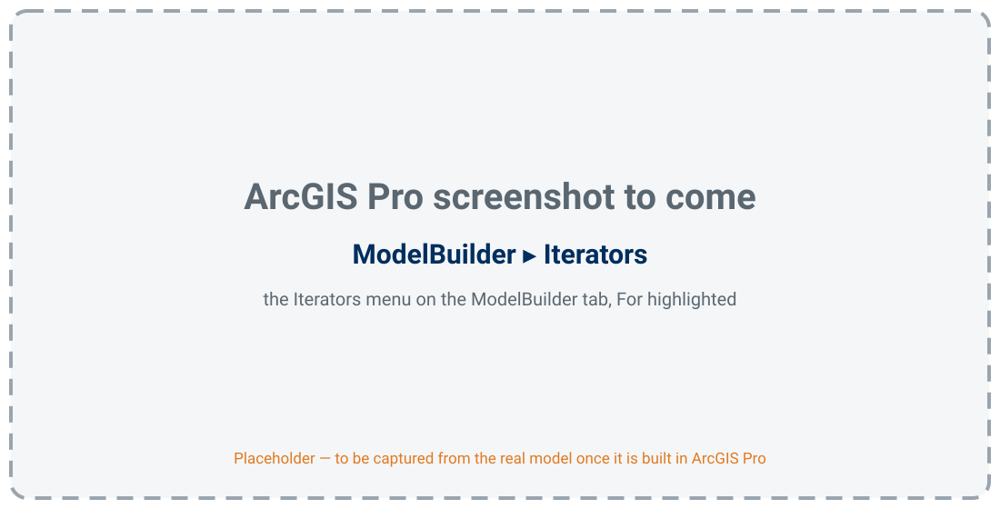
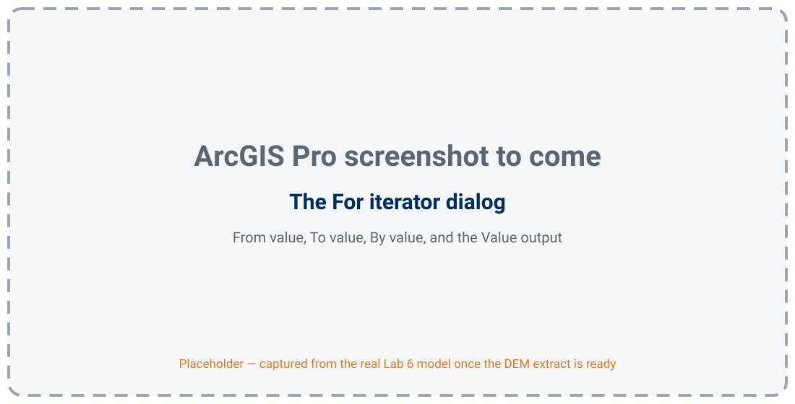
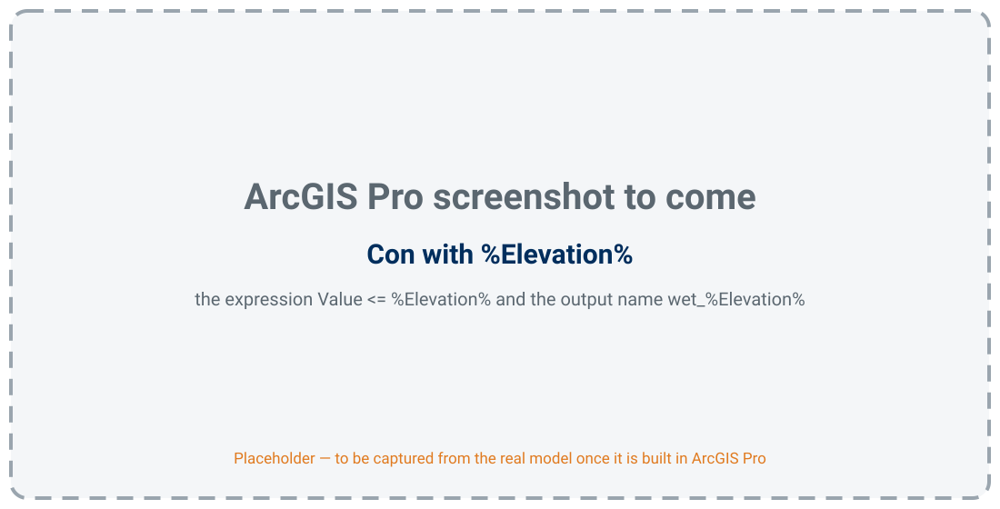
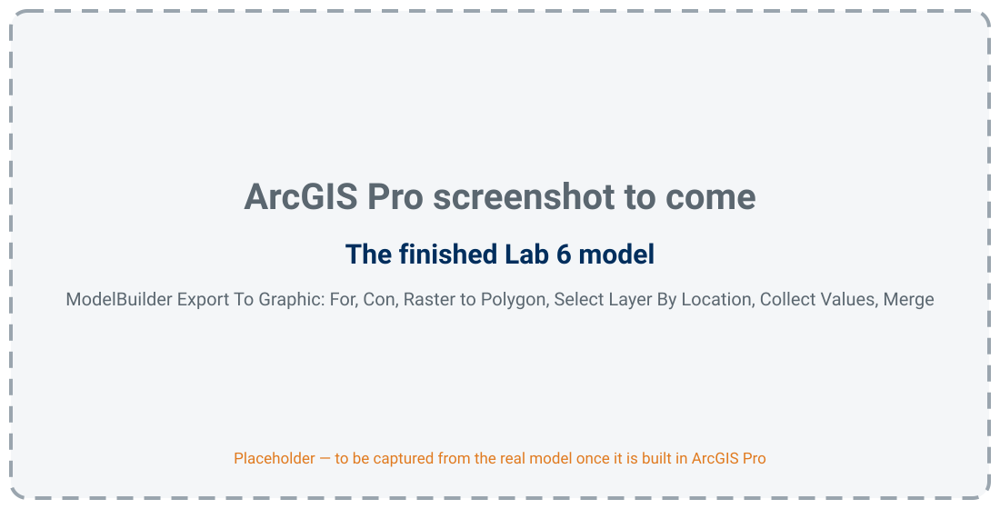
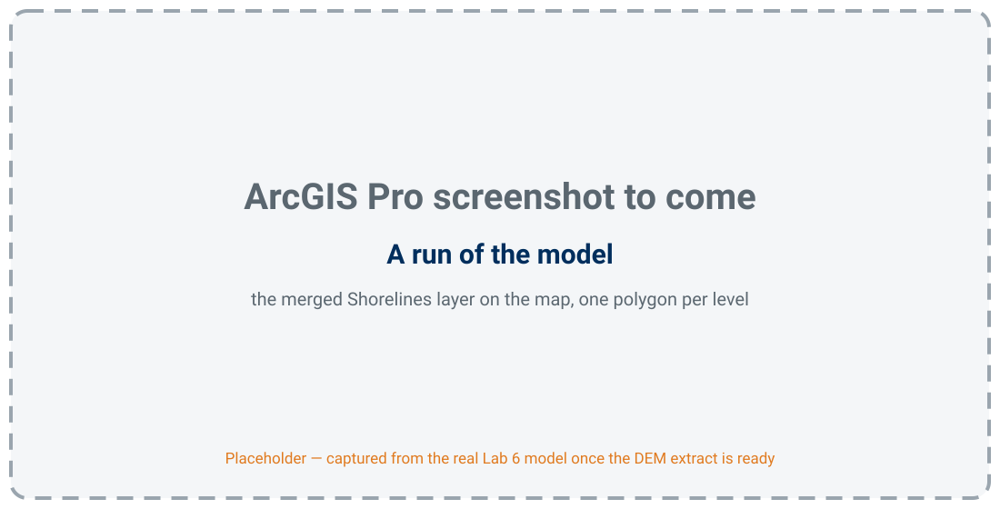

<!-- _class: lead -->
<!-- _paginate: skip -->

# Lake Depth Explorer

## Part B — Looping in ModelBuilder, and Lab 6

CE 414 Engineering Applications of GIS
Civil & Construction Engineering
Brigham Young University
Dr. Dan Ames

<!-- Thursday of Week 7. Tuesday gave the lake, its bathymetry, the datum, and the elevation-area-volume table. Today: a ModelBuilder model that runs once per water level instead of once, and Lab 6, which uses it on the Great Salt Lake. Slides marked "ArcGIS Pro screenshot to come" are placeholders: they are captured from the real Lab 6 model once the DEM extract is built. Until then, demo live. -->

<!-- stamp:begin -->
<!-- _footer: 'CE 414 · Week 7 — Lake Depth ExplorerLast Updated: 2026-10-01© 2026 Daniel P. Ames · <a href="https://creativecommons.org/licenses/by/4.0/">CC BY 4.0</a>' -->
<!-- stamp:end -->

---

# Today's Goals

By the end of class you should be able to:

- Say what an **iterator** does that running a tool twice does not
- Use **%Value%** to put the iterator's value into an expression and an output name
- Gather a loop's outputs with **Collect Values** and **Merge**
- Say what **Lab 6** asks for, and how you will know your answer is right

---

<!-- _class: lead -->

# Part 1 — One Model, Many Runs

---

# The Problem With Running a Model Once

- One water level → one Raster Calculator → one shoreline
- Twenty levels → **twenty runs**, twenty names to type, twenty chances to mistype one
- What you want: say the **list of levels once**, and let the model do the rest

<!-- The map is the answer we are after: shorelines at several levels in one layer. Ask how long it took them to run the Lab 5 model four times for Step 14, and what went wrong. -->

---

# An Iterator Runs the Whole Model Once per Value

<!-- Walk the loop: the For iterator produces one value per run (4,190, 4,192, ... 4,210); every tool after it runs once with that value; the outputs are collected and merged at the end. The iterator is the only new idea in Lab 6 — Raster Calculator, Con(), and Raster to Polygon are all from earlier labs. -->
<!-- VERIFY: the sketch's tool names and where Collect Values sits against the real model when it is built. -->

---

# Where the Iterators Live

- **ModelBuilder** tab ▸ **Iterators** — **For** counts from a start to an end by a step

<!-- TODO(capture): the Iterators menu on the ModelBuilder tab in ArcGIS Pro 3.7, For highlighted. -->
<!-- VERIFY: the menu's name and location on the ModelBuilder tab in ArcGIS Pro 3.7, and the list of iterators shown, before writing them on the slide. -->
<!-- Point out that only one iterator is allowed per model, and that iterators exist only in ModelBuilder — they are why ModelBuilder is more than a diagram of tools. VERIFY that one-iterator rule in 3.7. -->

---

# The For Iterator

- **From** 4,190 · **To** 4,210 · **By** 2 → eleven runs; its output, **Value**, is this run's level

<!-- TODO(capture): the For iterator's dialog filled in for the Lab 6 default range. -->
<!-- VERIFY: the parameter labels in ArcGIS Pro 3.7, and whether To is inclusive (it determines whether 4,210 runs). -->

---

# %Value% — the Value Goes Inside the Expression

- `Con("Lake_Surface" <= %Value%, 1)` — 1 below the water, NoData above
- Output name **Lake_%Value%** — a different name every run, or each run overwrites the last

<!-- The same inline-variable idea as Lab 4 and Lab 5 (%Threshold%), now fed by the iterator. The Lab 5 lesson about Con with no third argument carries over: NoData outside the water, not 0, or Raster to Polygon draws the land as lake too. -->
<!-- TODO(capture): the Raster Calculator dialog in the Lab 6 model with this expression and output name. -->
<!-- VERIFY: the surface's layer name in the extract, and that %Value% substitutes in both the expression and the output name. -->

---

# Collect Values, Then Merge

- **Collect Values** gathers one output from every run; **Merge** makes them one feature class

<!-- TODO(capture): the finished Lab 6 model, ModelBuilder Export To Graphic, laid out in rows as Lab 5's Figure C. -->
<!-- VERIFY: Collect Values' location (ModelBuilder ▸ Utilities in recent versions) and how it connects to Merge in ArcGIS Pro 3.7. -->

---

# What One Run Gives You

- **Shorelines** — one polygon per level, each with its level and its area

<!-- TODO(capture): the merged Shorelines layer from the real model, symbolized by level. Until then, show the Tuesday maps (lb-shorelines-nested.jpg) — they are the same kind of output, from the same USGS DEM. -->

---

<!-- _class: lead -->

# Part 2 — Lab 6, Lake Depth Explorer

---

# Lab 6 at a Glance

- **The question:** at a given water level, where is the Great Salt Lake's shoreline, and how big is the lake?
- **The data:** a resampled extract of the USGS lake-bottom DEM, in **feet NGVD29**
- **The model:** For › Raster Calculator › Raster to Polygon › Collect Values › Merge
- **The check:** your areas against the **USGS table** from Tuesday

[Lab 6 — Lake Depth Explorer](https://byu-hydroinformatics.github.io/ce414-gis-applications/assignments/lab-06/)

<!-- The lab page is still being rebuilt for the Great Salt Lake; the data package and check values arrive with the DEM extract. -->
<!-- TODO(instructor): confirm the default range and step (plan: 4,190 to 4,210 ft by 2 ft) once the run time on a lab machine is known. -->

---

# How You Will Know You Are Right

- The USGS computed the area at every 0.01 ft from the same DEM — your area at each level should **match it**

<!-- The elevation-area-volume table is an answer key students did not make: same DEM, independent calculation. At 4,190 ft it gives 937.6 sq mi; at 4,200 ft, 1,602.4 sq mi; at 4,210 ft, 2,211.5 sq mi. A coarse extract will differ slightly; the lab will state the tolerance once it is measured. A big miss usually means a datum mix-up (3.48 ft is worth up to a few hundred sq mi in the 4,195–4,205 ft band) or Con() with a third argument. -->
<!-- TODO(instructor): set the tolerance from the verification run on the extract. -->

---

# Choosing the Range and the Step

- A **2 ft step** can step right over the level where a bay disconnects — the step is a choice, and Lab 6 makes you test it

<!-- The range-and-step test is the sensitivity step of Lab 6, the same pattern as Lab 5's threshold test. The chart is from the USGS table: area changes slowly per foot in the 4,170s–4,190s and fast in the 4,195–4,205 band, so a step that is fine at one end of the range hides detail at the other. -->

---

<!-- _class: activity -->

# In Class Activity — Three Levels

- Build the loop on the **Lab 6 surface**: For › Raster Calculator › Raster to Polygon
- Run it for **three levels** of your choice
- Map them nested, and screen-capture the map for Learning Suite

<!-- TODO(instructor): this activity replaces the old Week 7 "Where is my watershed?" item; create the matching Learning Suite activity. It needs the Lab 6 data package, so it waits on the DEM extract. -->

---

# Before Next Class

- **Lab 6 — Lake Depth Explorer** — see the lab page for the due date — [Lab 6](https://byu-hydroinformatics.github.io/ce414-gis-applications/assignments/lab-06/)
- Next week: **interpolation** — turning scattered points into a surface, which is how every bathymetry grid is made
- Questions? Office hours: [calendly.com/dan-ames/office-hours](https://calendly.com/dan-ames/office-hours)

<!-- Week 7 decks drafted October 1, 2026, from the plan in tools/week07-lake-bathymetry-plan.md. Figures: tools/week07_figures.py (USGS gage, USGS EAV table, hydromap shorelines, HydroShare cross-section, ArcGIS Pro maps) and tools/week07_diagrams_svg.py (drawn diagrams and the screenshot placeholders, lb-todo-*.svg). Every lb-todo-*.svg is a placeholder for a real ArcGIS Pro capture from the Lab 6 model. -->

---

<!-- _class: activity -->

# One Last Thing — Lake Depth Explorer

Five questions on iterators, %Value%, and checking a loop's answer. **Scan the code**, or open the link below.

- Not graded, nothing recorded — it is a check that today landed
- Every answer explains itself; read the explanation before you move on
- The output-name question is the one that silently wipes out a run

byu-hydroinformatics.github.io/ce414-gis-applications/quizzes/iterators/

<!-- Four minutes, in pairs, then a show of hands on the output-name item. If the room has no signal, put the URL on the board. -->
