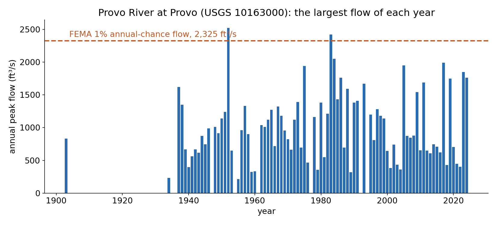
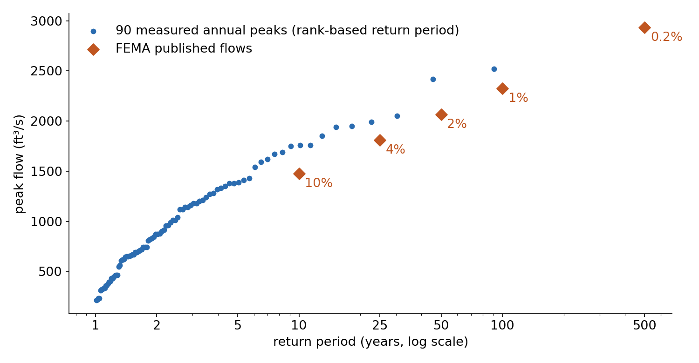

<!-- _class: lead -->
<!-- _paginate: skip -->

# Flood Mapping

## Part A — From a Flow to a Flooded Map: Bathtub and Inundation Models

CE 414 Engineering Applications of GIS
Civil & Construction Engineering
Brigham Young University
Dr. Dan Ames

<!-- Tuesday of Week 8, the third of the water weeks: Lab 5 found where the water goes, Lab 6 measured how much a lake holds, and this week asks how high a river rises and what it covers. Today is the hydrology and the simplest flood model; Thursday is HAND and Lab 7. Midterm 1 is open in the Testing Center all week. The title image is three of FEMA's own cross-sections of the Provo River in Provo, with the 1% water surface over the lidar ground. -->

<!-- stamp:begin -->
<!-- _footer: 'CE 414 · Week 8 — Flood Mapping, Part ALast Updated: 2026-10-09© 2026 Daniel P. Ames · <a href="https://creativecommons.org/licenses/by/4.0/">CC BY 4.0</a>' -->
<!-- stamp:end -->

---

# Today's Goals

By the end of class you should be able to:

- Say what a **100-year flood** is, and what it is not
- Turn a **flow** into a **water level** with a rating curve, and a water level into a **depth**
- Draw a **bathtub** flood map, and say when it is the right model
- Say what FEMA does instead, and why a river needs it

---

<!-- _class: lead -->

# Part 1 — How Big Is the Flood?

---

# One Number a Year

- A stream gage records flow every few minutes; the **annual peak** is the largest of each year
- **Provo River at Provo** (USGS 10163000): **90** annual peaks, 1903 to 2024
- The record: **2,520 ft³/s** in 1952
- Every peak is flagged **regulated**: dams upstream shape every flood

<!-- Real NWIS peak series (code 6 on every peak: discharge affected by regulation or diversion). The gaps are years with no record. Point at 1983 and 1952: two years above FEMA's 1% flow, which is the next slide's puzzle. Data: the Lab 7 package, peaks_10163000.csv; figure from tools/week08_flood_figures.py. -->

---

# A 100-Year Flood Is a Probability

- **1% chance every year**, not "once a century" — FEMA says **1% annual chance**
- Over a 30-year mortgage: 1 − 0.99³⁰ ≈ **26%** chance of at least one
- FEMA's flows for this reach: **1,475 · 1,810 · 2,065 · 2,325 ft³/s** for 10%, 4%, 2%, 1%

<!-- Blue: the 90 annual peaks ranked and plotted at (n+1)/rank, the simplest empirical return period. Orange: FEMA's published flows for the Provo River "3 miles above tie-in to Utah Lake", Utah County Flood Insurance Study, Table 9 (49049CV001B); the 0.2% flow is 2,935. Ask the room why two measured years sit above FEMA's 1% flow. Answers worth hearing: short records, regulation, a fitted distribution versus the raw ranks. A simple Log-Pearson III fit to this gage's own peaks since 1993 gives about 3,111 ft³/s for the 1% flow (tools/lab07, labeled a teaching approximation, not Bulletin 17C), 34% above FEMA's; two defensible "100-year floods" can differ that much. -->

---

<!-- _class: lead -->

# Part 2 — From a Flow to a Water Level

---

# The Rating Curve

- The gage measures **gage height**; the **rating** converts it to flow
- Provo's current rating: **3.42 to 8.00 ft**, **6.8 to 2,150 ft³/s**
- Read it backwards for a flood: **flow → gage height**
- FEMA's **1% flow is off the top** of the rating: that level is an **extrapolation**

<!-- The USGS current rating for 10163000 (459 rows; the Lab 7 package, rating_10163000.csv). The dotted lines are FEMA's 10%, 4%, 2% and 1% flows; only the 1% falls in the gray band beyond the last measured row. A rating is built from field measurements, and floods are the hardest flows to measure, so the top of every rating is its least certain part. -->

---

# Gage Height Is Not Depth

- **Gage height** is read from the staff's own zero, the **gage datum**
- Water elevation = **datum + gage height**
- **Depth** = gage height − the **zero-flow offset** (3.20 ft at Provo)
- Lab 7 floods the land by **depth**, so the datum cancels out

<!-- Numbers from the USGS site record and the rating file: gage datum 4,493.22 ft NAVD 88; the rating's offset is 3.20 ft (the gage height at which flow would be zero). Lab 7 uses depth above the river, h = gage height − 3.20 ft, converted to meters, which is why Thursday's HAND model never needs the datum. Diagram drawn for this deck (not to scale). -->

---

<!-- _class: lead -->

# Part 3 — Two Ways to Draw the Flood

---

# The Bathtub Model

- Pick **one water elevation**; every cell **below** it is wet
- Right for **lakes and coasts**: Lab 6's Lake Powell shorelines were bathtubs
- One **Con** on the DEM: `Con("DEM" <= 1372.04, 1)`

<!-- 1,372.04 m NAVD 88 is the 1% water elevation at the gage in the Lab 7 stage table (FEMA's 2,325 ft³/s, gage height 8.21 ft, extrapolated above the rating; tools/lab07/package_checks.json). A lake's surface really is flat, so the bathtub is the right model there; that is exactly what Lab 6 did at Lake Powell. -->

---

# A River Is Not a Bathtub

- A river's surface **slopes downhill** with the water
- One flat elevation **drowns the low ground** near Utah Lake and **never reaches** the river upstream
- At the 1% level: **15.1 km²** wet, nearly all of it **Utah Lake lowland**; it reaches only the river **below the gage**

<!-- Left panel: every cell of the Lab 7 filled DEM at or below 1,372.04 m, 15.1 km² (tools/week08_flood_figures.py). The Lab 7 page measures the same thing along the river: a bathtub at this level covers only the lowest 4.8 km of the river, below the gage. Right panel: HAND at the same 1% depth, 1.57 km², following the river to the canyon mouth; that is Thursday. -->

---

# What FEMA Does Instead

- **1-D hydraulics** (HEC-RAS): cross-sections, roughness, bridges, and a **sloping water surface**
- FEMA's study of this reach: **42 sections** inside the Lab 7 area
- Median 1% depth above the streambed: **1.8 m**
- Accurate, and **expensive**: one study per reach, redone every few years

<!-- FEMA NFHL cross-section lines for Utah County (effective June 23, 2026; WSEL_REG and STRMBED_EL attributes, converted from feet NAVD 88), sampled against the Lab 7 5 m lidar DEM. Depths range 1.5 to 2.1 m. Section T shows the lidar channel bottom sitting above FEMA's streambed: lidar cannot see through water, and that comes back Thursday. -->

---

# Thursday: A Cheaper Way

- What if every cell knew its **height above the river it drains to**?
- Then one depth floods the **whole river** at once
- That is **HAND**, and it is Lab 7

<!-- The HAND raster for the Lab 7 reach (the package chain; 697,608 cells, 0 to 198 m; about 11% of them within 2 m of the river). White means the cell does not drain to the mapped river inside the study area. Let them puzzle over the left panel versus the right one: same terrain, two different "heights". -->

---

# Before Next Class

- **Midterm 1** — in the Testing Center, open through **Thursday 9:00 pm**
- **Lab 7 — Flood Mapping with HAND** — due **Saturday 11:59 pm** — [Lab 7](https://byu-hydroinformatics.github.io/ce414-gis-applications/assignments/lab-07/)
- Look up a stream gage near your home on the USGS map: what is its largest flow on record?
- Office hours: [calendly.com/dan-ames/office-hours](https://calendly.com/dan-ames/office-hours)

<!-- Deck written October 9, 2026, for the restructured Week 8 (tools/build_schedule.py). Figures: tools/week08_flood_figures.py (peaks, frequency, rating, FEMA sections, HAND map) and two drawn diagrams (fl-gage-datum.svg, fl-hand-schematic.svg). -->

---

<!-- _class: activity -->

# One Last Thing — How Big, How High?

Five questions on return periods, rating curves, depth and bathtubs. **Scan the code**, or open the link below.

- Not graded, nothing recorded — it is a check that today landed
- Every answer explains itself; read the explanation before you move on
- The mortgage question is the one most people miss

byu-hydroinformatics.github.io/ce414-gis-applications/quizzes/floods/

<!-- Four minutes, in pairs. If the room has no signal, put the URL on the board. -->
