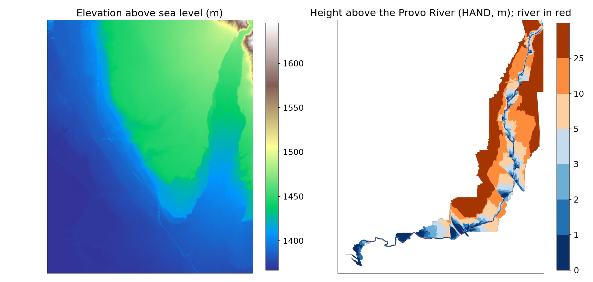
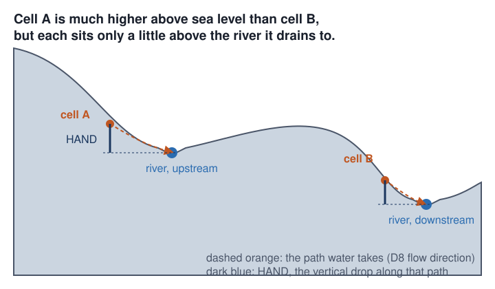
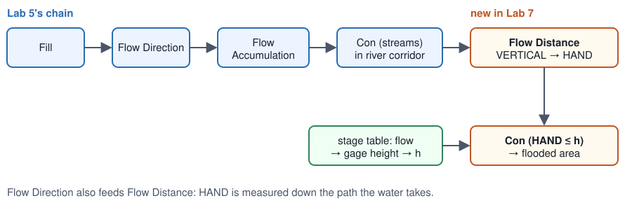
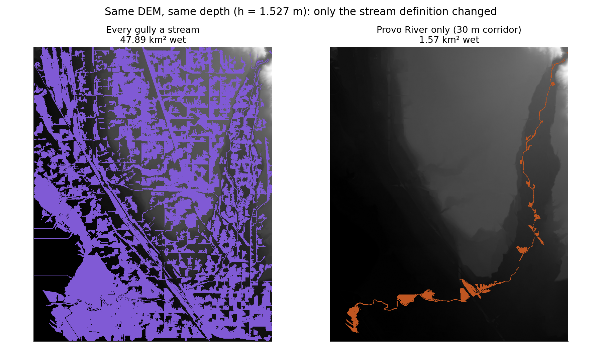
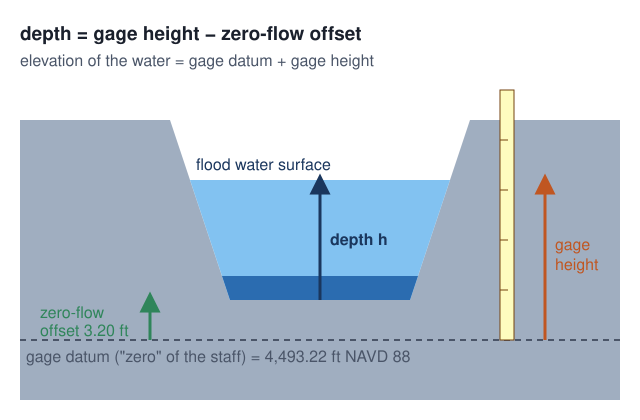
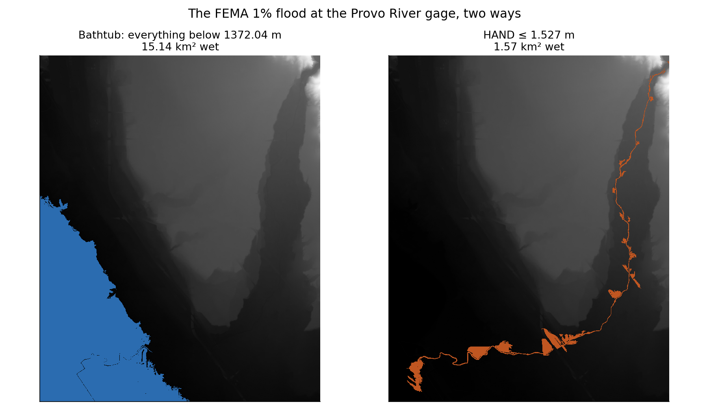
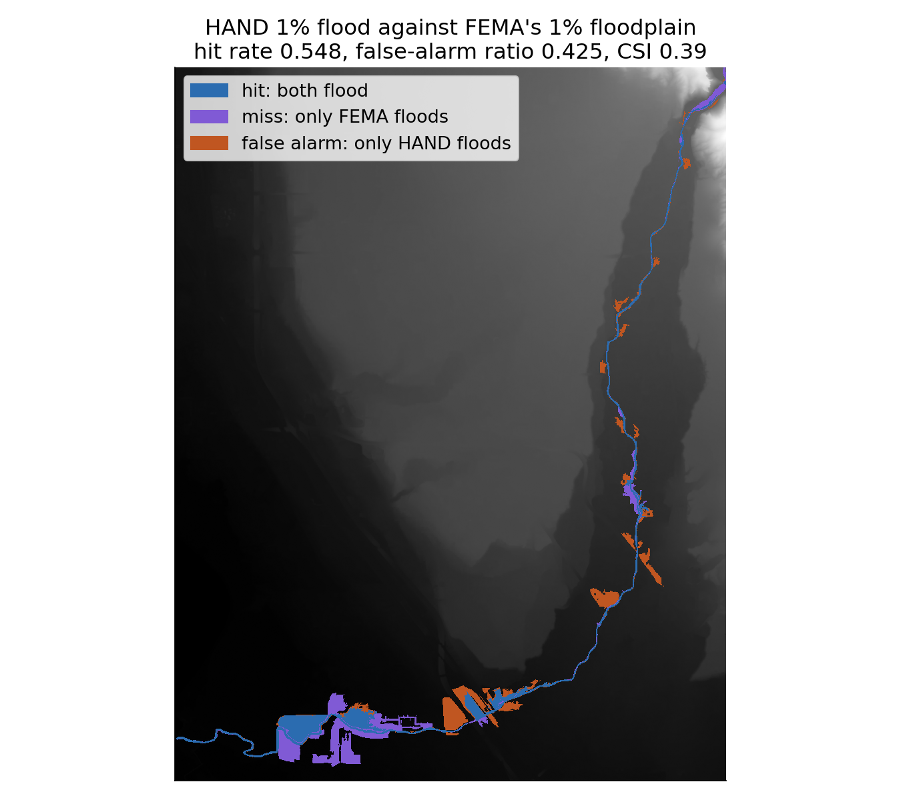
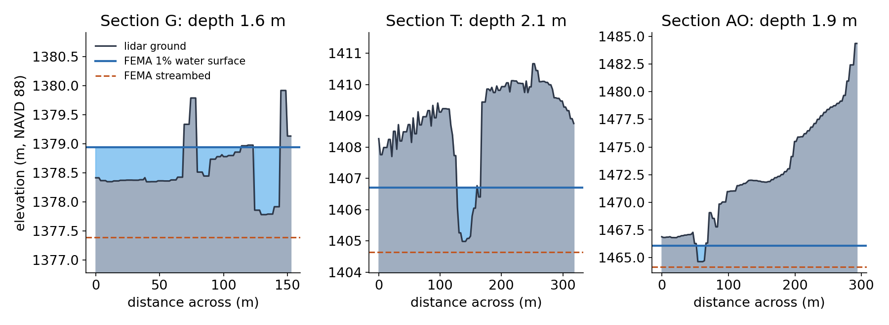
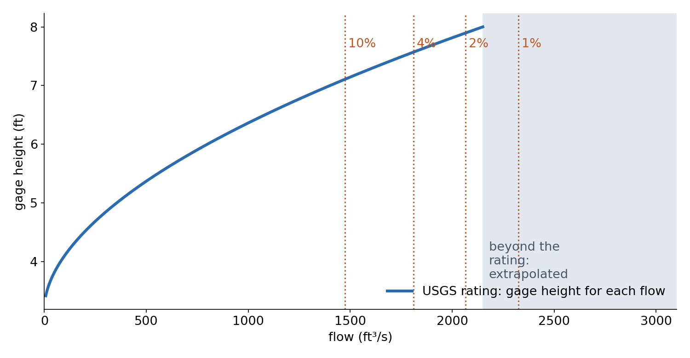

<!-- _class: lead -->
<!-- _paginate: skip -->

# Flood Mapping

## Part B — HAND, and Lab 7 on the Provo River

CE 414 Engineering Applications of GIS
Civil & Construction Engineering
Brigham Young University
Dr. Dan Ames

<!-- Thursday of Week 8. Tuesday ended on the bathtub's failure on a river and FEMA's expensive fix. Today: a terrain-only model that floods a whole river with one number, built from Lab 5's own chain plus one tool, and Lab 7, which does it on the Provo River and checks the answer against FEMA's new map. -->

<!-- stamp:begin -->
<!-- _footer: 'CE 414 · Week 8 — Flood Mapping, Part BLast Updated: 2026-10-09© 2026 Daniel P. Ames · <a href="https://creativecommons.org/licenses/by/4.0/">CC BY 4.0</a>' -->
<!-- stamp:end -->

---

# Today's Goals

By the end of class you should be able to:

- Say what **HAND** measures, and why it beats elevation for floods
- Build it from a DEM: **Lab 5's chain + Flow Distance**
- Turn a flood depth into a **flood map** with one threshold
- Score a flood map against another: **hit rate, false alarms, CSI**
- Say what **Lab 7** asks for, and how you will know you are right

---

<!-- _class: lead -->

# Part 1 — Height Above What?

---

# Elevation Is Measured From the Wrong Place

- A flood cares how high you are **above the river**, not above **sea level**
- **HAND**: Height Above Nearest Drainage — the drop from a cell to the stream cell it **drains to**
- Every river cell has **HAND = 0**

<!-- The two cells make the point: A is far higher above sea level than B, yet both sit just above their own river. On a bathtub map B floods first; on a HAND map they flood together at the same depth. Diagram drawn for this deck, not to scale. -->

---

# HAND on the Provo River

- Left: elevation, **1,367 to 1,646 m**: a ramp toward the mountains
- Right: **HAND**, 0 to 198 m: the floodplain shows up as a **ribbon** along the river
- About **11%** of the cells are within **2 m** of the river

<!-- The Lab 7 package's HAND raster (697,608 cells). White cells do not drain to the mapped Provo River inside the study area, so they have no HAND; that is correct, not a bug, and students will see it. Elevation range from the filled DEM. Numbers: tools/week08_flood_numbers.json. -->

---

# How It Is Computed

- **Fill → Flow Direction → Flow Accumulation → streams**: Lab 5, unchanged
- **Flow Distance**, distance type **Vertical**: HAND, down the path the water takes

<!-- Flow Distance (Spatial Analyst) with Vertical distance and D8 is HAND; checked in ArcGIS Pro 3.7.1's arcpy for the Lab 7 study (tools/lab07/PLAN.md). Two traps the study measured: running on the unfilled DEM leaves thousands of negative HAND cells, and defining "stream" as every cell above an accumulation threshold, with no river corridor, makes every gully a river (next slide). -->

---

# The Stream Is the Big Choice

- HAND is measured to **whatever you call a stream**
- Every gully a stream → the 1% flood covers **47.9 km²**
- Only the **Provo River** (a 30 m corridor) → **1.57 km²**
- Same terrain, same depth: the **definition** did that

<!-- Both panels at the Lab 7 1% depth, h = 1.527 m, on the package's filled DEM: left, HAND measured to every cell above the 2,000-cell accumulation threshold; right, only stream cells within 30 m of the mapped Provo River (the lab's model). In a city the threshold also makes streams of gutters and ditches. Lab 7's Step 7 varies the threshold for this reason. Figure and areas: tools/week08_flood_figures.py; 1.57 km² is the lab page's check value (1.5673). -->

---

<!-- _class: lead -->

# Part 2 — From a Depth to a Flood

---

# One Threshold Floods the River

- From Tuesday: flow → **gage height** → **depth h** above the river
- Flooded = **every cell with HAND ≤ h**: `Con("HAND" <= h, 1)`
- A different h for each **return period**: one **iterator**, as in Lab 6

<!-- The stage table in Lab 7 does the flow-to-h step for FEMA's 10%, 4%, 2% and 1% flows; students verify one row by hand from the rating. Raster to Polygon then gives an area and a polygon to intersect with buildings. -->

---

# Bathtub and HAND, Same Depth

- **Bathtub**: drowns the lowland by the lake, never climbs the river
- **HAND**: follows the river to the top of the study area
- At the 1% level: bathtub **15.1 km²**, HAND **1.57 km²**

<!-- Same figure as Tuesday, now read from the right: HAND's water surface follows the river up to the mouth of Provo Canyon, where the bathtub never reaches. -->

---

# How Good Is It?

- **Hit rate**: of FEMA's floodplain, how much did we flood?
- **False-alarm ratio**: of our flood, how much is FEMA dry?
- **CSI** = hits ÷ (hits + misses + false alarms)
- Lab 7 at the 1% flow: hit rate **0.548**, false alarms **0.425**, CSI **0.39**

<!-- Official values: the Lab 7 page's Step 6 check (tools/lab07/package_checks.json, polygon overlay inside Comparison_Area). The map's colors come from a raster tally of the same comparison. The feasibility study found CSI 0.39 to 0.40 for any h from 1.0 to 1.75 m: the agreement is limited by the terrain method, not by the hydrology. -->

---

# Where HAND Breaks

- **Levees and confined channels**: HAND floods ground the river cannot reach
- **Split flow**: water leaving one river for another path is invisible to D8
- **Lidar can't see under water**: the channel bottom sits about **0.5 m** above FEMA's streambed
- No bridges, no roughness, no flow: **terrain only**

<!-- The study found HAND flooding beside the confined upper reach and missing FEMA's overflow zone that leaves the river southward below the gage; the lidar channel sits about 0.47 m above FEMA's bed (Section T on the figure shows it). HAND's strength is scale: NOAA's Office of Water Prediction maps floods for the National Water Model with HAND: https://github.com/NOAA-OWP/inundation-mapping (checked October 9, 2026). -->

---

<!-- _class: lead -->

# Part 3 — Lab 7, Flood Mapping with HAND

---

# Lab 7 at a Glance

- **The reach**: the Provo River through Provo, a **5 m lidar** DEM, prepared for you
- **The model**: Lab 5's chain + **Flow Distance** → HAND → one **iterator** over the stage table
- **The answer**: flooded area and **buildings** for each FEMA flow
- **The check**: your 1% flood against **FEMA's** floodplain

[Lab 7 — Flood Mapping with HAND](https://byu-hydroinformatics.github.io/ce414-gis-applications/assignments/lab-07/)

<!-- One-week lab during Midterm 1 week, so the data come prepared: DEM, river line, buildings, FEMA floodplain and the stage table are in the package. Two models: one builds HAND, one loops Iterate Field Values over the stage table (an iterator reruns every tool in its model). Check values on the page: river 3,191 cells, HAND 697,608 cells; floods from 1.29 km² and 319 buildings (10-yr) to 1.57 km² and 413 buildings (100-yr). -->

---

# Your Own Flow

> **Your flow = 900 + 12 × (last two digits of your BYU ID) ft³/s**

- BYU ID `123456789` → **89** → 900 + 12 × 89 = **1,968 ft³/s**
- The **nine-digit number on your BYU ID card**, not your NetID
- Every personal flow is **inside the rating**: no extrapolation

<!-- Range 900 to 2,088 ft³/s, all below the rating's top row of 2,150 ft³/s. The grader looks up each student's h, area and building count (ce414-private/grading-oracles/lab07_personal_lookup.csv). -->

---

# Before Next Class

- **Midterm 1** closes **tonight, 9:00 pm** (late fee from 2:00 pm)
- **Lab 7 — Flood Mapping with HAND** — due **Saturday 11:59 pm**
- Next week: **interpolation**, and Lab 8
- Office hours: [calendly.com/dan-ames/office-hours](https://calendly.com/dan-ames/office-hours)

<!-- Deck written October 9, 2026. Figures: tools/week08_flood_figures.py and three drawn diagrams; numbers from the Lab 7 package (tools/lab07/package_checks.json). -->

---

<!-- _class: activity -->

# One Last Thing — Height Above What?

Five questions on HAND, stream definitions, thresholds and scoring a flood map. **Scan the code**, or open the link below.

- Not graded, nothing recorded — it is a check that today landed
- Every answer explains itself; read the explanation before you move on
- The stream-definition question is the one Lab 7 tests

byu-hydroinformatics.github.io/ce414-gis-applications/quizzes/hand/

<!-- Four minutes, in pairs. If the room has no signal, put the URL on the board. -->
