<!-- _class: lead -->
<!-- _paginate: skip -->

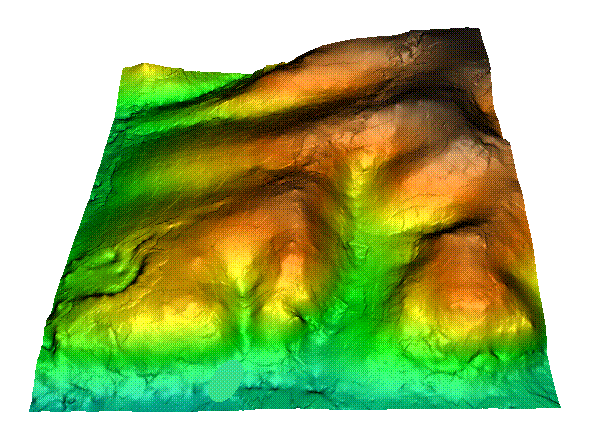

# Sampling and Interpolation

CE 414 Engineering Applications of GIS
Dr. Dan Ames
Civil & Construction Engineering
Brigham Young University

<!-- Let's learn about sampling and interpolation. This is a two-session topic: the first session runs from sampling design through splines, the second session is kriging. The surface on the right is the end product of everything we do today — a continuous surface built from a scatter of measured points. -->

---

# Today's Goals

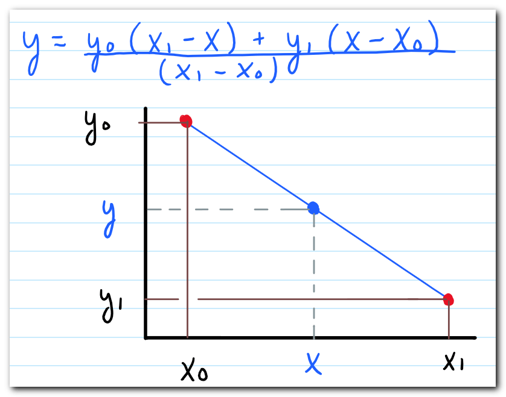

By the end of these sessions you should be able to:

- Explain why we **sample** instead of measuring everywhere
- Compare four **sampling designs** and say when each is appropriate
- Describe how **Thiessen polygons**, **fixed-radius averaging**, **IDW**, **trend surfaces**, **splines**, and **kriging** each turn points into a surface
- Read a **variogram** and name its parts
- Say why two methods can give different answers from the same data

<!-- Everything on the right-hand figure is the whole idea in miniature: an unknown value y at position x, estimated as a weighted blend of two known values. Every method in this deck is a more elaborate version of that one picture. That figure comes back several times on purpose. -->

---

<!-- _class: activity -->

# Activity: Estimate the Temperature in Provo

- Consider three cities in Utah: **Moab**, **American Fork**, and **Cedar City**
- Look up the current air temperature for those three cities on weather.com or an equivalent site
- Given those three temperatures, **estimate the current temperature in Provo**
- Write down your number *and* the rule you used to get it

<!-- Give them three or four minutes. Collect several answers and, more importantly, several rules: nearest city, plain average, distance-weighted average, adjust for elevation. Those four answers are Thiessen, a global mean, IDW, and a trend surface. Name them now, then spend the rest of the session making each one precise. -->

<!-- TODO(graphic): a simple Utah location map showing Moab, American Fork, Cedar City, and Provo. No suitable image exists in the source deck. -->

---

# Interpolation

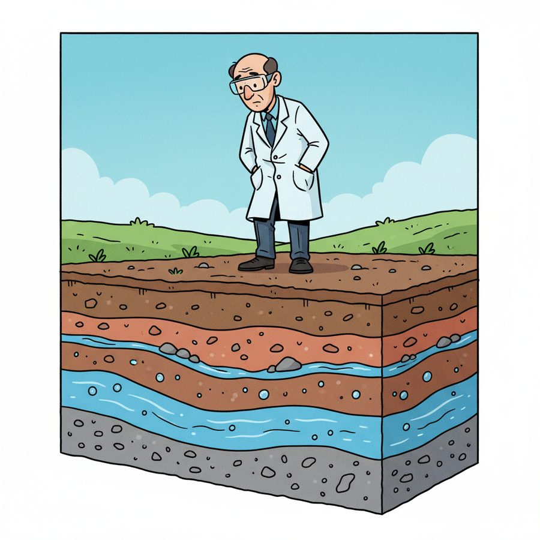

**Interpolation** is a procedure to predict values of an attribute at unsampled points within the region that was sampled.

**Why?** You cannot measure every location:

- Time
- Money
- Physically or legally impossible

**Examples:**

- Temperature
- Acid rain deposition
- Soil characteristics
- Mining: gold deposits

Also used when **changing cell size**, when data are **missing or unsuitable**, or for a **past date** (for example, temperature).

<!-- Note the phrase "within the region sampled." Predicting outside that region is extrapolation, and every method here degrades badly when you ask it to extrapolate. Fixed the source's "Can not" to "cannot." -->

---

# Two Halves of the Same Problem

**Spatial sampling**

- Gather observations that represent the spatial distribution of a variable of interest

**Interpolation**

- Use those sample points to predict values of that variable at all other unsampled locations

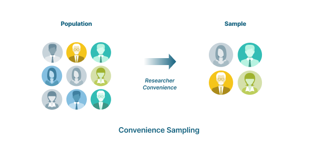

<!-- The two halves are inseparable. A brilliant interpolator cannot rescue a bad sample, and a beautiful sample is useless until you interpolate it. Spend the first part of class on the left half, the rest on the right half. -->

---

<!-- _class: lead -->

# Scenario: Distribution of a Mineral Deposit

## Gold nuggets under a landscape

<!-- The next four slides all use the same made-up scenario: gold is distributed through the subsurface, you cannot dig everywhere, so you choose where to dig. Keep the scenario fixed and change only the sampling design so the comparison is fair. -->

---

# The Scenario

The landscape on the left is the real, fully known surface. In practice you never see it — you only get the handful of points you choose to sample.

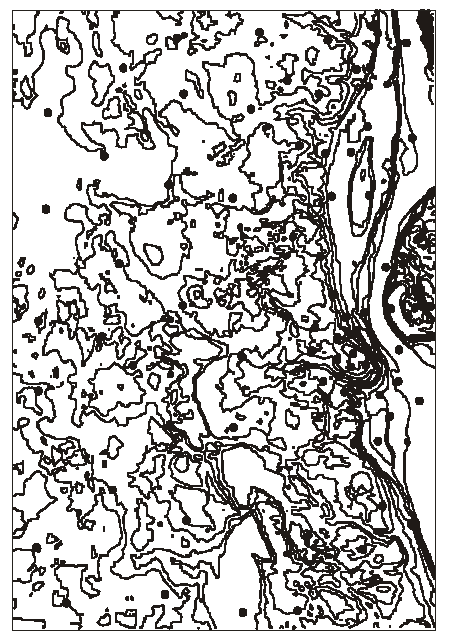

**Gold nuggets…**

<!-- Left: the true surface, drawn as contours. Right: the cartoon reason we care. The whole point of the next four slides is that you must commit to a sampling design before you know what the surface looks like. -->

---

# Systematic Sampling Pattern

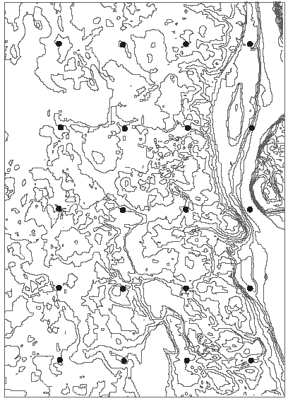

- Samples spaced uniformly at fixed X, Y intervals
- Parallel lines

**Advantages**

- Easy to understand and to plan

**Disadvantages**

- All areas receive the same attention
- Difficult to stay on the lines in the field
- May be **biased** if the landscape has a matching pattern

<!-- Systematic is the default people reach for. The bias failure mode is worth naming: if the terrain has ridges at roughly your sample spacing, a grid can land on ridge tops every time and you will never see the valleys. -->

---

# Random Sampling

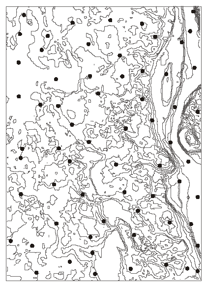

- Select random points

**Advantages**

- Less biased — unlikely to match a pattern in the landscape

**Disadvantages**

- Does nothing to distribute samples toward areas of high variation
- Difficult to explain; the locations of points may themselves be a problem

<!-- "The location of points may be a problem" is a field-work concern: random points land in rivers, on private land, and halfway up cliffs. Ask the class what they would do with a point they cannot reach — moving it quietly destroys the randomness that justified the design. -->

---

# Cluster Sampling

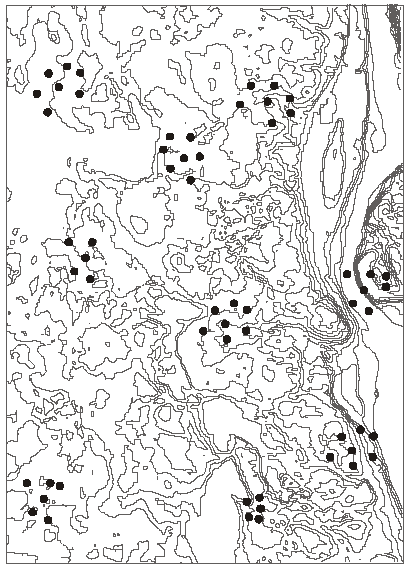

- Cluster centers are established, either randomly or systematically
- Samples are arranged around each center

**Advantages**

- Reduced travel time
- Less costly

**Disadvantages**

- Less representative sampling

<!-- Cluster sampling is the design that budgets produce. It buys many observations cheaply, but the observations are not independent: points inside one cluster tell you nearly the same thing. -->

---

# Adaptive Sampling

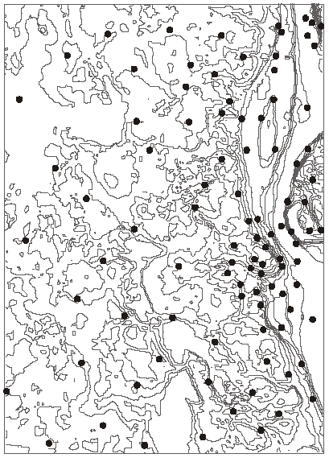

- Higher sampling density where the feature of interest is more variable
- Requires some method of estimating feature variation

**Advantages**

- Often efficient: large homogeneous areas need few samples, reserving effort for areas of higher spatial variation

**Disadvantages**

- Without a way to identify where the feature varies most, you need several visits; sample density cannot be changed on the spot

<!-- Adaptive is the best design and the hardest to execute, because it needs prior knowledge of the thing you are going out to measure. In practice it means a coarse first pass followed by targeted infill. Fixed the source's "can not" to "cannot." -->

<!-- TODO(instructor): decide how much of sampling design belongs in CE 414 versus the statistics prerequisite, and whether to add a slide on sample size and spacing. -->

---

<!-- _class: lead -->

# From Samples to a Surface

## Gather observations that represent the spatial distribution of a variable — then predict that variable everywhere else

<!-- This repeats the framing from earlier in the session, which is exactly what the source deck did: it restated the sampling/interpolation definition slide as the transition out of sampling designs and into interpolation methods. Everything from here on is the second half. -->

---

# Interpolation: Many Methods

- There are **many different methods**
- All of them use the **location** and the **value** at sampling locations to estimate the variable of interest at unmeasured locations
- Methods differ in **weighting** and in the **number of observations** used
- Each method produces **different results**, even with the same data
- There is **no best method** for every application
- Accuracy is often judged by **withheld sample points** — the difference between the measured and the interpolated values

<!-- The last bullet is the honest one and it is where the rest of a career in this material lives: hold points back, interpolate without them, and compare. Everything else on this slide is bookkeeping. -->

<!-- TODO(instructor): decide whether to teach train/test validation explicitly this week — holding out a subset, computing RMSE and bias, and talking about uncertainty in the interpolated surface — or to leave it to the lab. If it stays, it probably needs its own slide rather than one bullet. -->

---

# Interpolation: Rasters and Contours

Usually used for **point-to-raster** data. Some methods instead produce **contour lines** — vector lines of uniform value.

**Raster surface**

- Values are measured at a set of sample points
- Raster layer boundaries and cell dimensions are established
- The interpolation method estimates the value for the center of each unmeasured grid cell

**Contour lines: an iterative process**

- Estimate points of a given value (say 10 °C) and connect them into a line, then estimate the next value (say 20 °C) — lines of different values may not cross

<!-- Point out that the raster path and the contour path are two renderings of the same estimated surface, not two different analyses. In practice you interpolate to a raster and derive contours from it. -->

---

# Example Base

**Elevation contours** — the true surface

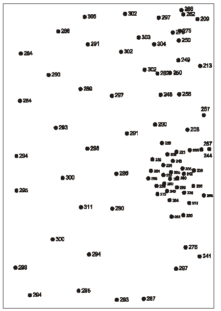

**Sampled locations and values**

<!-- This pair is the reference for the next twenty slides. Left is the truth, which in a real project you never have. Right is everything the interpolator gets to see. Every method that follows is judged by how close it comes to the left panel using only the right panel. -->

---

# Thiessen Polygons

- Assigns an interpolated value equal to the value found at the **nearest sample location**
- The conceptually simplest method
- Only **one point** is used — the nearest one
- Often called **nearest sample** or **nearest neighbor**

<!-- Thiessen is the zero-weighting case: the nearest point gets a weight of one and everything else gets zero. Worth saying out loud, because it makes the later methods feel like refinements rather than unrelated tricks. -->

---

# Building a Thiessen Polygon

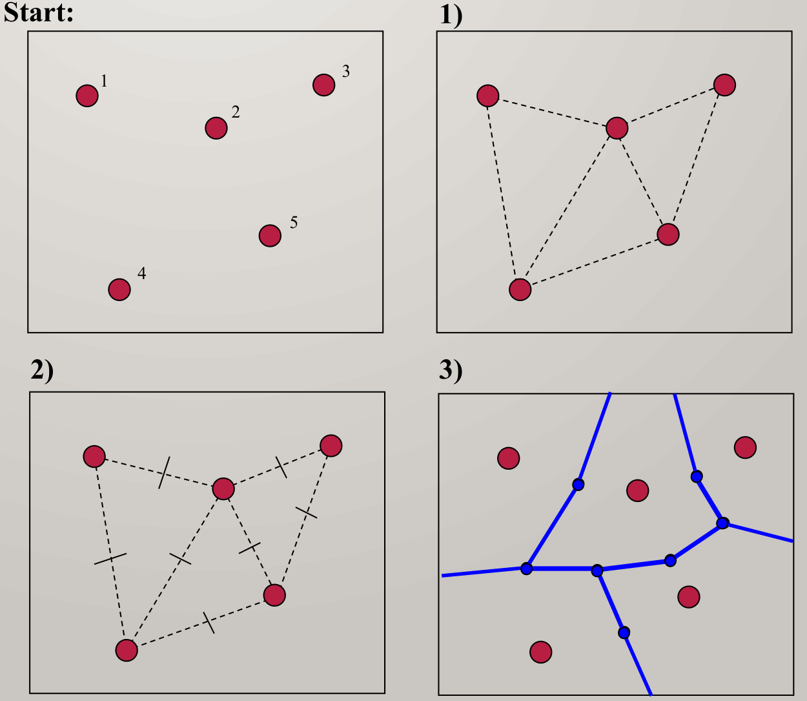

1. Draw lines connecting the points to their nearest neighbors
2. Find the **perpendicular bisector** of each line
3. Connect the bisectors and assign the resulting polygon the value of the center point

<!-- Walk the four panels in order. The key geometric fact: every location inside a polygon is closer to that polygon's sample point than to any other. In ArcGIS Pro this is a single tool; students should still be able to draw it by hand on an exam. -->

---

# Sample Points Become Polygons

**Sampled locations and values**

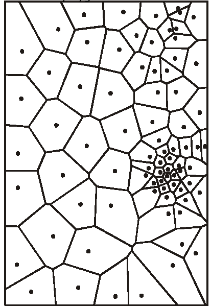

**Thiessen polygons**

<!-- Same points, now partitioned. Note the dense cluster on the right of the map: where samples crowd together the polygons become tiny slivers, and where samples are sparse a single polygon can cover a large area with one measured value. -->

---

# Thiessen Surface

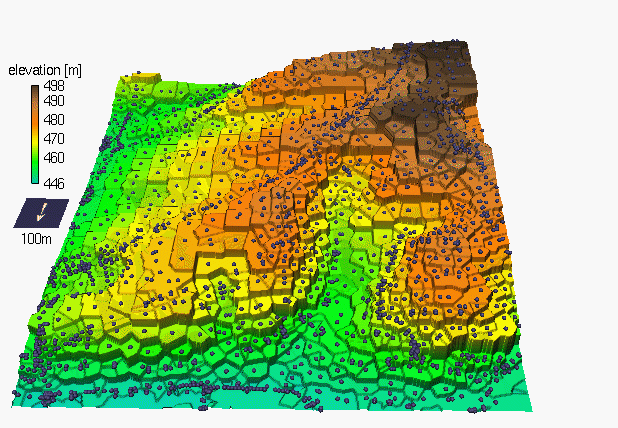

<!-- The 3D view makes the defining property obvious: the surface is flat inside each polygon and jumps discontinuously at every boundary. That is fine for a categorical variable such as soil type, and wrong for elevation or temperature. The source slide title misspelled this as "Theissen" — corrected to "Thiessen." -->

---

# Thiessen: Trade-offs

**Advantages**

- Ease of application
- Appropriate for **discrete** (categorical) variables

**Disadvantages**

- Accuracy depends largely on **sampling density**
- Boundaries are often odd-shaped at transitions
- **Continuous** variables are often not well represented

<!-- Tie the disadvantages back to the 3D view they just saw. The odd-shaped boundaries and the step discontinuities are the same fact seen twice. -->

---

# Fixed-Radius Local Averaging

- More complex than nearest sample
- Cell values are estimated from the **average of nearby samples**
- Which samples are used depends on the **search radius** — any sample inside the circle is used in the average, anything outside is ignored
- Specify the output raster grid; a circle is centered over each raster cell
- The radius is typically several cell widths, so neighboring cells come out similar, and some circles contain no points

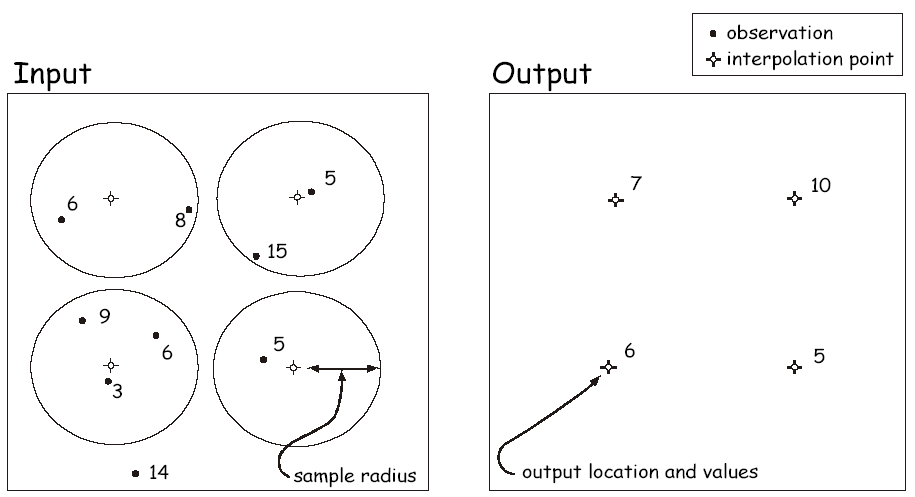

**Search radius matters** — too large and the data are smoothed away.

<!-- Combined the source's text slide with the figure that followed it. The failure mode to demonstrate: shrink the radius until empty circles appear as holes in the output, grow it until the surface flattens into the global mean. Fixed the source's "many contain no points" to "may contain no points." -->

---

# Fixed Radius: How It Works

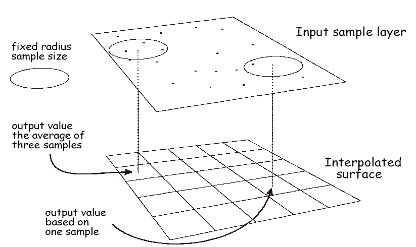

<!-- Read the diagram top to bottom. The input sample layer floats above the output raster; each output cell takes the average of whatever samples fall inside its circle. Point at the cell that got three samples and the cell that got one, and ask which value they trust more. Nothing in the method distinguishes them — the output carries no record of how many points went into each cell. -->

---

# Fixed Radius: The Result

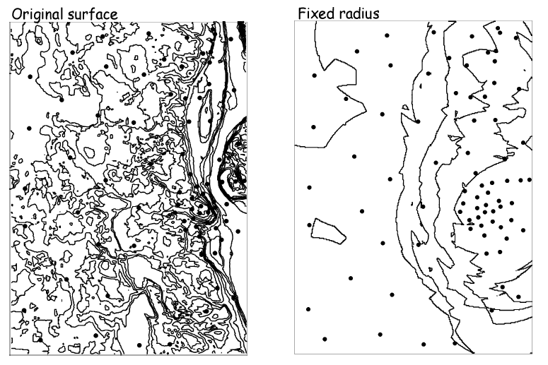

<!-- Original surface on the left, fixed-radius result on the right. The interpolated surface is visibly blockier and the fine drainage detail on the left is gone. It also does not pass through the measured values — this is a non-exact method, which comes back at the end of the session. -->

---

# Inverse Distance Weighted (IDW)

- Estimates the value at an unknown point using the **distances to** and **values of** nearby known points
- IDW reduces the contribution of a known point as that point gets farther away
- The weight of each sample point is in **inverse proportion to the distance**
- The farther away a point is, the less weight it carries in defining the unsampled location

<!-- IDW is the first method that uses more than one point and treats them unequally. Corrected the source's "nearby know points" to "known points." -->

---

# IDW: The Equation

- $Z_i$ is the value of a known point
- $d_{ij}$ is the distance to that known point
- $Z_j$ is the unknown point
- $n$ is a user-selected exponent, often 1, 2, or 3

Any number of points may be used, up to all points in the sample; typically 3 or more.

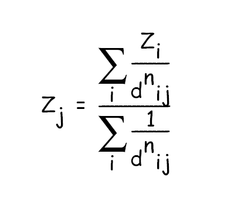

<!-- Read the equation as a weighted average whose weights are 1/d^n, normalized by their own sum so they add to one. That normalization is the denominator. If n = 0 every weight is equal and IDW collapses to a plain local mean. -->

---

# IDW: A Worked Example

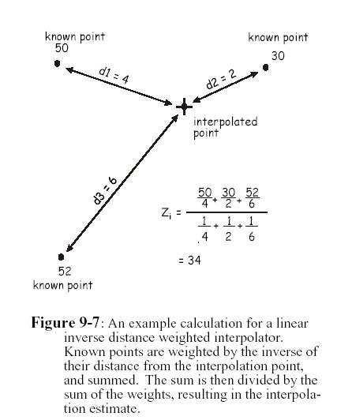

<!-- Walk the arithmetic on the figure: three known points at distances 4, 2 and 6 with values 50, 30 and 52, weights of 1/4, 1/2 and 1/6, and an estimate of 34. This is a linear IDW, exponent one. Have the class redo it with the exponent squared and watch the answer move toward the nearest point. -->

---

# What Changes the IDW Surface

Two factors dominate the interpolated surface:

- The size of the exponent **n** affects the shape of the surface — a larger *n* means the closer points are more influential
- A **larger number of sample points** results in a smoother surface

<!-- These are the only two knobs students will turn in the lab, so make them concrete. As n grows without bound, IDW converges on the Thiessen result: the nearest point takes all the weight. -->

---

# IDW: Linear, 6 Nearest Points

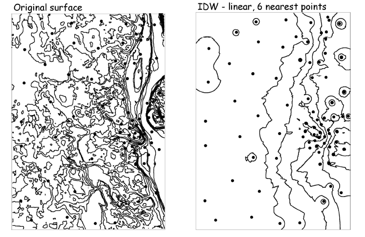

<!-- Original surface on the left, IDW with exponent one and the six nearest points on the right. Point out the small closed contour rings around isolated sample points — the "bull's-eyes" that are the signature artifact of IDW. -->

---

# IDW: Squared, 6 vs 12 Nearest Points

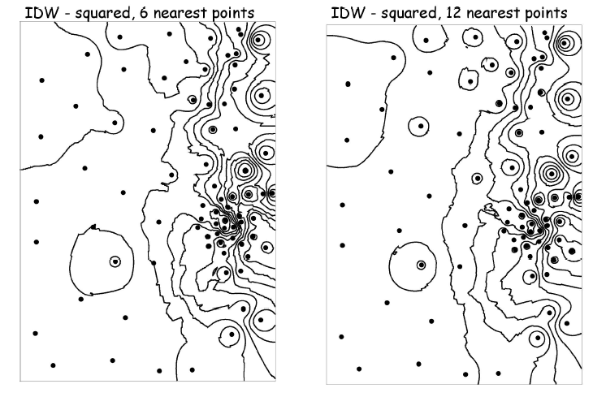

<!-- Both panels use exponent two; the left uses six neighbors, the right uses twelve. More neighbors smooths the surface without removing the bull's-eyes, because the exponent, not the neighbor count, is what concentrates weight on the nearest point. -->

---

# IDW Surface

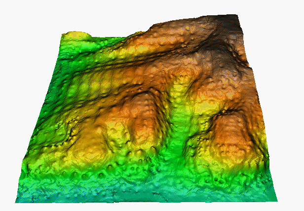

<!-- Compare this against the Thiessen surface from earlier. IDW is continuous — no cliffs at polygon edges — but it is not smooth: the surface has a kink at every sample point, and each sample sits at a local peak or pit. -->

---

# Trend Surface Interpolation

Fits a statistical model — a **trend surface** — through the measured points, typically a polynomial.

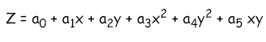

- Where **Z** is the value at any point *x*
- Where the **a** terms are coefficients estimated in a regression model

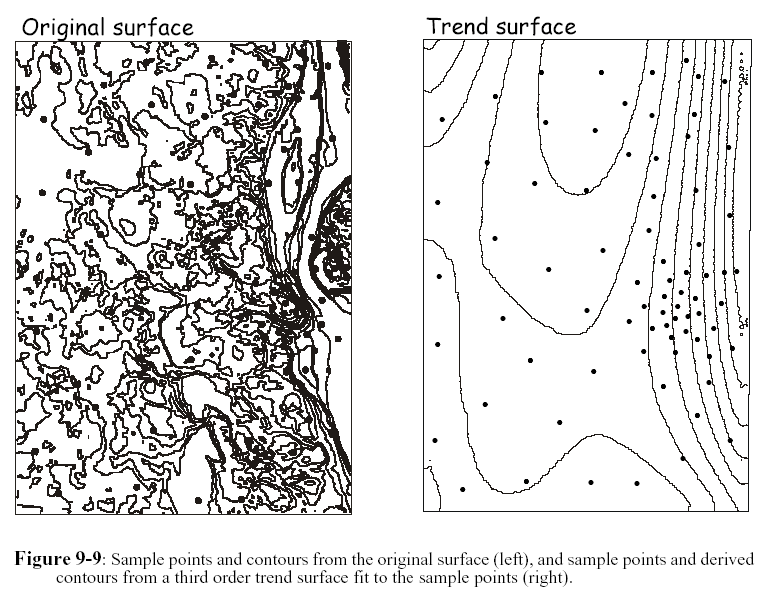

<!-- Trend surface is regression, not local interpolation: every sample point influences every part of the surface. That is why the result on the right looks nothing like the original — it captures the regional slope and discards local detail on purpose. -->

---

# Splines

- The name comes from a drafting tool — a flexible ruler used to draw smooth curves through several points
- **Spline functions** are used to interpolate along a smooth curve, much like that flexible ruler
- They force a smooth line to pass through a desired set of points
- Constructed from a set of joined polynomial functions

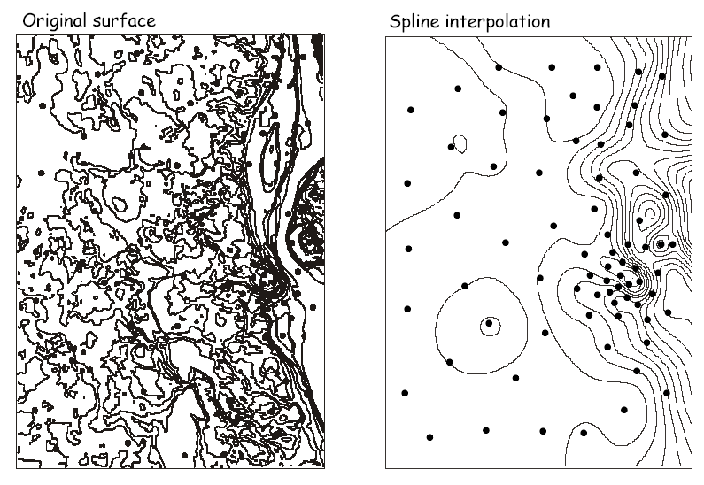

<!-- Combined the source's text slide with the figure that followed it. Splines give the smoothest-looking result of anything in this deck, which is not the same as the most accurate: the surface can overshoot well past the range of the measured values between widely spaced points. Corrected "are use to interpolate" to "are used to interpolate." -->

---

<!-- _class: lead -->

# Kriging

## Session two: interpolation that estimates its own weights

<!-- The source deck labeled this "Day 2: Kriging." Everything before this point weights points by a rule you choose; kriging derives the weights from the data itself. -->

---

# Kriging

A statistically based estimator of spatial variables. It separates the data into three components:

- **Spatial trend** — an increase or decrease in a variable that depends on direction; for example, temperature may decrease toward the northwest
- **Autocorrelation** — the tendency for points near each other to have similar values
- **Random** — statistically defined by a probability function

Kriging creates a mathematical model, which is then used to estimate values across the surface.

<!-- Corrected the source's run-together "dependson" to "depends on." The three-component split is what makes kriging different in kind from IDW: it models the structure of the data before it interpolates. -->

<!-- TODO(graphic): a three-panel figure separating a surface into trend, autocorrelated, and random components. Nothing in the source deck illustrates this slide. -->

---

# Kriging: Lag Distance

- $Z_i$ is a variable at a sample point
- $h_i$ is the distance between sample points
- Every possible pair $Z_i, Z_j$ defines a distance $h_{ij}$ and differs by the amount $Z_i - Z_j$

The distance $h_{ij}$ is known as the **lag distance** between points *i* and *j*. There is a subset of points in any sample set that are a given lag distance apart.

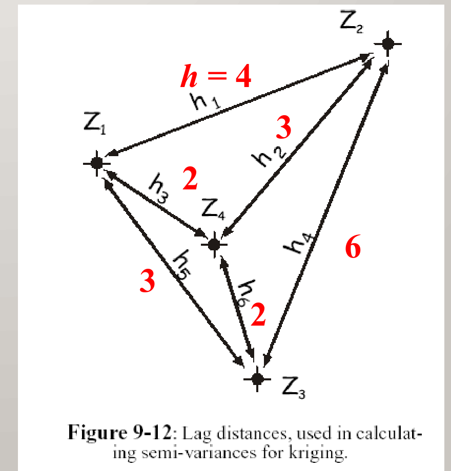

<!-- Corrected the source's "is know as" to "is known as." The red numbers on the figure are the lag distances for each pair. With four points there are six pairs; with a hundred points there are 4,950, which is why the next step is to bin them. -->

---

# Kriging: Spatial Autocorrelation

- Higher autocorrelation means points near each other are alike
- That provides substantial information about nearby locations

*h* here is the width of one cell.

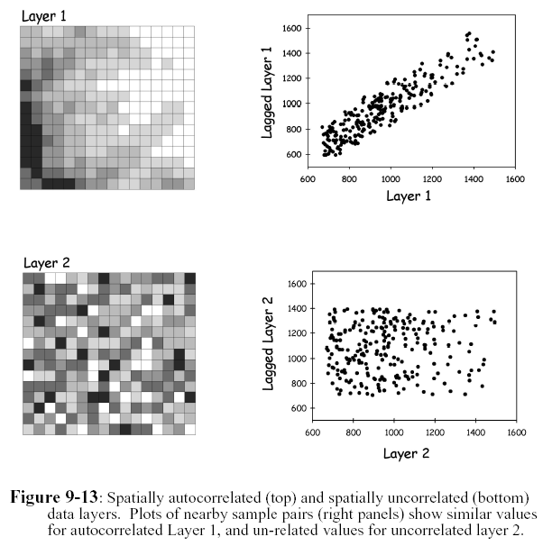

<!-- Top row: a spatially autocorrelated layer, and its scatter of nearby pairs falls on a line. Bottom row: an uncorrelated layer, and the same scatter is a cloud. That contrast is the entire justification for interpolating at all — if the bottom panel were your data, no method in this deck would beat the global mean. Fixed the source's "Higher autocorrelations indicates" to "Higher autocorrelation means." -->

---

# Kriging: Semi-variance

- $Z_i$ is the measured variable at one point
- $Z_j$ is another at distance *h* away
- *n* is the number of pairs that are approximately *h* distance apart

Semi-variance may be calculated for any *h*.

When nearby points are similar, $Z_i - Z_j$ is small, so the semi-variance is small. High spatial autocorrelation means points near each other have similar Z values.

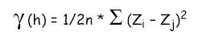

<!-- Semi-variance is a dissimilarity measure: it goes up as points get less alike. The "semi" is the factor of one half in front of the sum. -->

---

# The Variogram

When calculating the semi-variance for a particular *h*, a **tolerance** is used, since few *h* values will be exactly identical.

Plot the semi-variance across a range of lag distances and you get a **variogram**.

Semi-variance is usually small at small lag distances and increases to a constant value as the lag distance *h* increases.

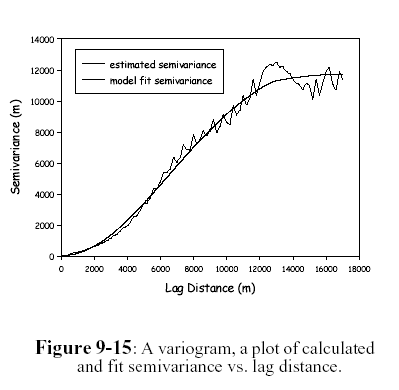

<!-- Merged the source's tolerance slide with the variogram slide that immediately followed it. The jagged line is the semi-variance actually calculated from the data; the smooth line is the model fitted to it. Only the smooth line is used to interpolate. -->

---

# Nugget, Sill, and Range

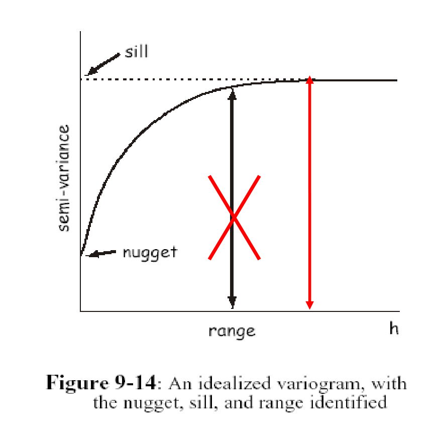

- A **nugget** is the initial semi-variance when the autocorrelation typically is highest
- The **sill** is the point where the variogram levels off; background noise; where there is little autocorrelation
- The **range** is the lag distance at which the sill is reached

<!-- These three numbers are the parameters you set when you fit a variogram model in ArcGIS Pro, so students should be able to point at each one on the plot. -->

<!-- VERIFY: "A nugget is the initial semi-variance when the autocorrelation typically is highest" — the nugget is conventionally described as the non-zero intercept at h = 0, attributed to measurement error and micro-scale variation; the source's phrasing about autocorrelation being highest is loose. -->

<!-- VERIFY: "The sill is the point where the variogram levels off; background noise; where there is little autocorrelation" — "the point" conflates the semi-variance value at the plateau with the lag distance at which it is reached, which is the range. -->

<!-- VERIFY: "The range is the lag distance at which the sill is reached" — usually stated as the distance beyond which pairs are no longer correlated; for models that approach the sill asymptotically (exponential, Gaussian) the practical range is defined at 95% of the sill. -->

<!-- VERIFY: the red X and red arrow drawn on Figure 9-14 are hand annotations carried over from the source slide. Their intent is unclear — they appear to cross out one measurement of the sill height and substitute another. Confirm what they mean or remove them. -->

<!-- TODO(instructor): the nugget / sill / range wording on this slide came straight from the source deck and has not been rewritten. Settle the three definitions above, then reword the bullets to match; do not let students take notes from the current text until then. -->

---

# From Variogram to Surface

- A set of sample points is used to estimate the shape of the variogram
- A **variogram model** is made — a line is fit through the set of semi-variance points
- The variogram model is then used to interpolate the entire surface

**Kriging is similar to IDW**, but kriging uses the **minimum variance method** to calculate the weights, rather than applying an arbitrary or less precise weighting scheme.

<!-- Combined two consecutive text-only slides from the source. The comparison in the second half is the sentence worth remembering: IDW's weights come from a rule you picked, kriging's weights come from the data's own spatial structure. -->

<!-- TODO(graphic): a two-panel figure showing a cloud of semi-variance points on the left and the fitted model on the right. The source deck illustrates neither of these two slides. -->

---

# Kriged Result

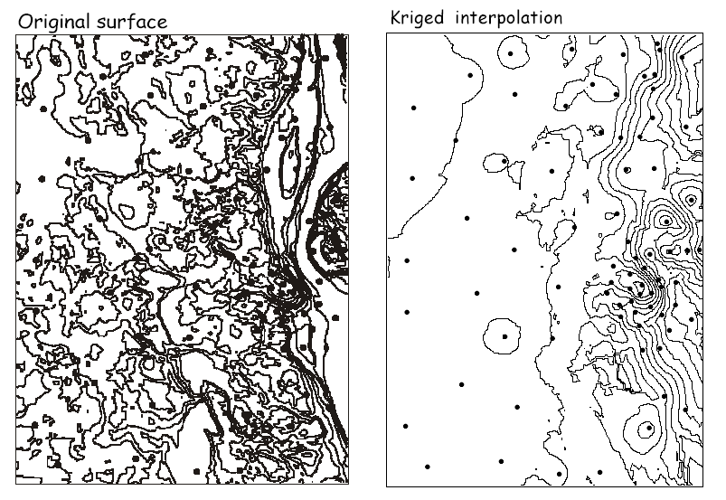

<!-- Original surface on the left, kriged interpolation on the right. Compare it against the IDW panels from earlier: the bull's-eyes are gone, because the weights now reflect how quickly the variable actually decorrelates with distance instead of a fixed 1/d^n rule. -->

---

# Kriging Surface

<!-- The 3D view of the same result. Set this beside the Thiessen and IDW surfaces from earlier in the deck: stepped, kinked, and smooth. Same points, three surfaces. -->

---

# Exact and Non-exact Methods

Is there a difference at the sample locations?

**Exact**

- Thiessen polygons
- IDW

**Non-exact**

- Fixed-radius — averages several points near the sample location
- Trend surface — the surface typically does not pass through the measured points
- Spline
- Kriging

<!-- This is the practical test: interpolate, then sample the output raster at your input point locations. If the values come back unchanged, the method is exact. -->

<!-- VERIFY: the source deck lists spline and kriging as non-exact. Splines as normally implemented are exact interpolators — they are defined to pass through the data points — and ordinary kriging is exact when the variogram model has no nugget. Confirm which convention this deck intends before students are quizzed on it. -->

<!-- TODO(graphic): a small inset showing a profile through two sample points under an exact and a non-exact method. Nothing in the source deck illustrates this slide. -->

---

<!-- _class: quiz -->

# Class Vote: Which Sampling Design Works Best Here?

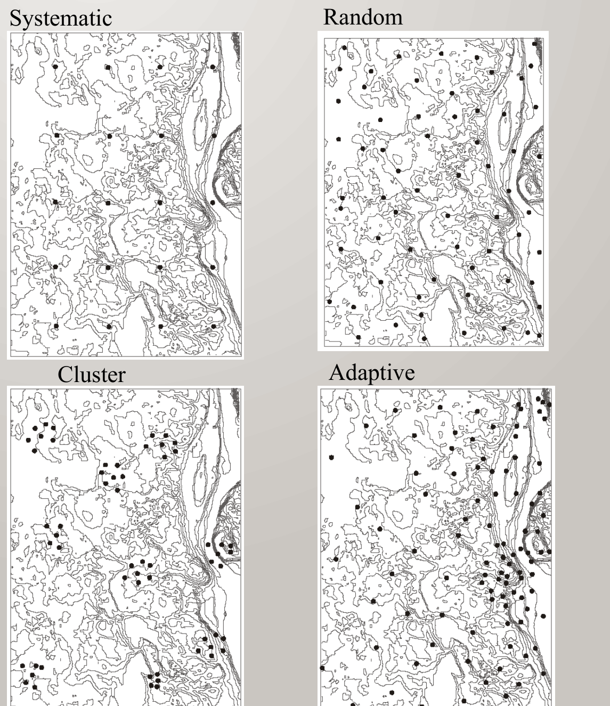

**Original surface:**

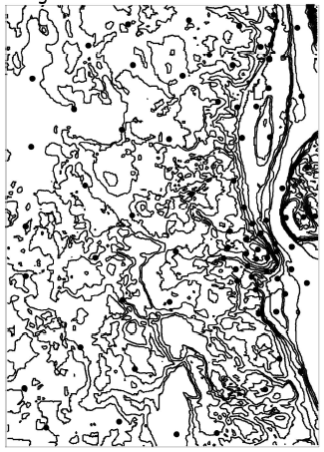

<!-- Vote on all four before discussing any of them. The interesting argument is between adaptive and random: adaptive puts points where the surface changes fastest, which is where interpolation errors are largest, but it needs prior knowledge that a real project usually does not have. There is no answer key here on purpose. -->

---

<!-- _class: quiz -->

# Class Vote: Which Interpolation Method Works Best Here?

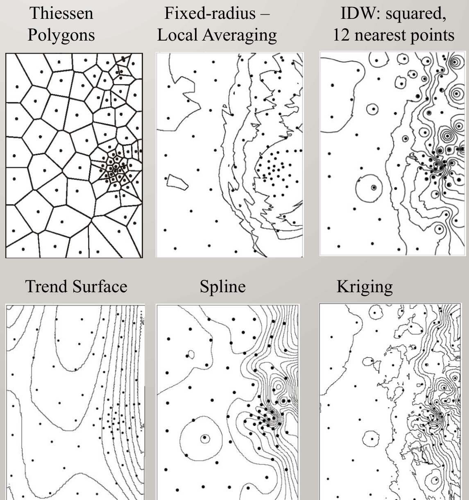

**Original surface:**

<!-- Same points, six methods, one truth to compare against. Push the class past "which is prettiest" to "which one reproduces the drainage pattern on the left." Then note that in a real project you cannot run this comparison, because you never have the left panel — which is why withholding sample points matters. -->

---

# Before Next Class

**Reading** — the interpolation chapter in the course text

**Quiz** — open-book, on Learning Suite

**Labs**

- [Lab 6 — Avalanche Hazard](https://byu-hydroinformatics.github.io/ce414-gis-applications/assignments/lab-06/) is due this week
- [Lab 8 — Practicing with Interpolation](https://byu-hydroinformatics.github.io/ce414-gis-applications/assignments/lab-08/) comes next and applies these methods in ArcGIS Pro

**Office hours**

[calendly.com/dan-ames/office-hours](https://calendly.com/dan-ames/office-hours)

<!-- Point them at Lab 8 specifically: it is where the exponent and neighbor-count knobs from the IDW slides get turned by hand. -->

<!-- TODO(instructor): reading chapter — the figures in this deck are numbered 9-7 through 9-15, which suggests the interpolation chapter of the course text, but the assigned chapter number is not stated in the source deck. -->

<!-- VERIFY: schedule reconstructed — the source deck has no "before next class" slide. Lab 6 is listed as due in Week 8 and Lab 8 follows; confirm against the semester schedule before publishing. -->

<!-- TODO(instructor): consider adding a slide mapping each method in this deck to its ArcGIS Pro tool (Create Thiessen Polygons, IDW, Kriging, Spline, Trend, Natural Neighbor) once the tool names and toolbox locations have been checked in Pro. The source deck names no software at all. -->

<!-- TODO(instructor): the plan notes a Big Southern Butte example. Decide where it belongs in the sequence — the note is that it should be taught only after the methods above are established — and whether it replaces or supplements the class-vote slides. -->

<!-- Conversion notes (2026-09-03): source "CE 414 Week 8 - Interpolation.pptx", 48 slides, 4:3, converted to 46 Marp slides. No hidden slides in the source. No slides dropped outright; five pairs of source slides were merged because the second was a figure or a continuation of the first: 19+20 (fixed-radius text and figure), 30+31 (trend-surface text/equation and result figure), 32+33 (splines text and figure), 39+40 (tolerance and variogram), and 42+43 (variogram model and the IDW comparison). Source slide 10 is an exact repeat of source slide 4; it is kept, as the source intended, but rendered as a section-divider rather than a duplicate content slide. Source slide 17's title "Theissen" corrected to "Thiessen" — that was the only occurrence of the misspelling; slides 14, 18, 46 and 48 already spelled it correctly. Other objective fixes: "Can not"/"can not" to "cannot" (slides 3, 9); "Some circles many contain no points" to "may contain" (19); "nearby know points" to "known points" (23); "are use to interpolate" to "are used to" (32); "dependson" to "depends on" (35); "is know as the lag distance" to "is known as" (36); "Higher autocorrelations indicates points near each other are alike" to "Higher autocorrelation means..." (37). No ArcGIS 9 / ArcMap / ArcCatalog / ArcToolbox wording appears anywhere in the source deck, so no software-version substitutions were needed; the deck names no GIS software at all, which is itself flagged as a TODO(instructor) above. No screenshots of any GIS user interface exist in this deck, so there are no stale ArcMap-era captures to re-shoot — every figure is a textbook diagram, a scanned figure, a rendered surface, or a hand-drawn equation. The recurring handwritten linear-interpolation figure is kept once on each slide where the source used it (source slides 4, 11, 12, 14, 18, 23, 26) plus the goals and closing slides; it is a deliberate motif, not a duplicate. Five slides that were built from PowerPoint shapes were captured as 200 dpi renders and cropped: the Thiessen construction panels (15), the annotated lag-distance figure (36), the annotated idealized variogram (41), and the two class-vote comparison grids (47, 48). Kriging terminology on the nugget/sill/range slide and the exact/non-exact list is carried over verbatim and flagged with VERIFY comments rather than rewritten. Four slides carry TODO(graphic) markers where no source image exists (the Provo activity, the kriging-components slide, the variogram-to-surface slide, and the exact/non-exact slide); per this pass's instructions no AI images were generated. -->
