<!-- _class: lead -->
<!-- _paginate: skip -->

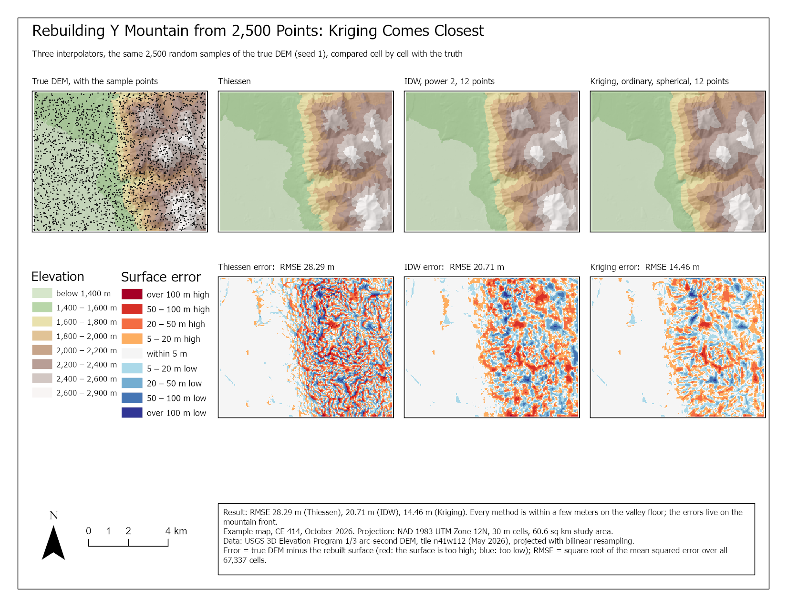

# Interpolation Explorer

## Part 3 — How Wrong Is the Surface? And Lab 9

CE 414 Engineering Applications of GIS
Civil & Construction Engineering
Brigham Young University
Dr. Dan Ames

<!-- Tuesday of Week 9. The two interpolation sessions before the midterm built the surfaces: Thiessen, IDW, splines, kriging. Today is the question those sessions ended on: how would you know which one to trust? First with the truth in hand, then without it. Then Lab 9, which does exactly this on Y Mountain. The title image is the Lab 9 example baseline sheet: the true DEM and three rebuilds from the same 2,500 points, with their error maps underneath. -->

<!-- stamp:begin -->
<!-- _footer: 'CE 414 · Week 9 — Interpolation ExplorerLast Updated: 2026-10-08© 2026 Daniel P. Ames · <a href="https://creativecommons.org/licenses/by/4.0/">CC BY 4.0</a>' -->
<!-- stamp:end -->

---

# Today's Goals

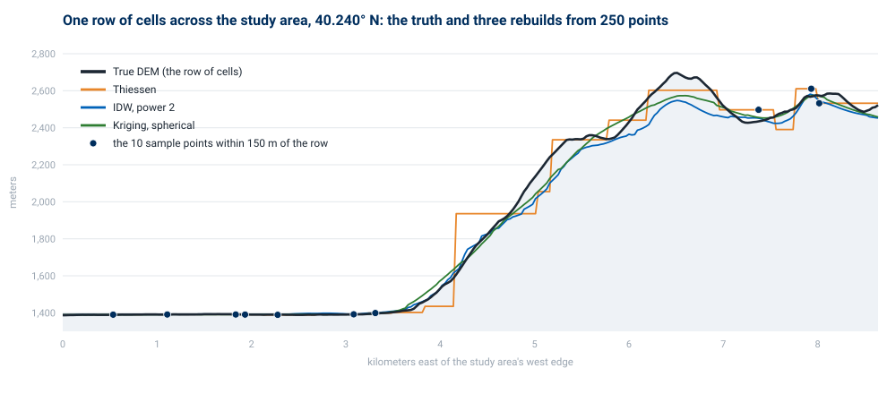

By the end of class you should be able to:

- Compute an **error raster** and say what its **sign** means
- Reduce a surface's error to one number, the **RMSE**, and say what it hides
- Judge a surface **without** the truth, from **checkpoints** held back
- Test whether a ranking of methods **survives** a change of points or parameters
- Say what **Lab 9** asks for, and how you will know you are right

<!-- The profile on the right is one row of cells across the Lab 9 study area: the truth and the three rebuilds from 250 points. Thiessen steps, IDW sags, kriging smooths the peak off. Every idea today is a way of putting a number on the gaps between those lines. -->

---

<!-- _class: lead -->

# Part 1 — When You Have the Truth

---

# Error = Truth − Surface

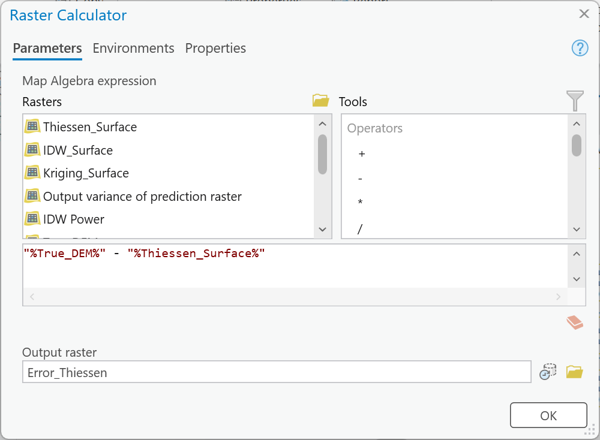

- Subtract, cell by cell, in **Raster Calculator**
- **Positive:** the surface came out too **low** there
- **Negative:** the surface came out too **high**
- Same units as the DEM — **meters**
- Map it on a **diverging** scale centered on zero, one scale for every method

<!-- The capture is the Lab 9 Step 6 Raster Calculator, inside ModelBuilder: "%True_DEM%" - "%Thiessen_Surface%". The order matters only for the sign, but say it out loud and keep it fixed: if one student subtracts the other way, every color on their map flips and their "too high" ridges become "too low". Lab 9 uses truth minus surface throughout. -->

---

# Where the Error Lives

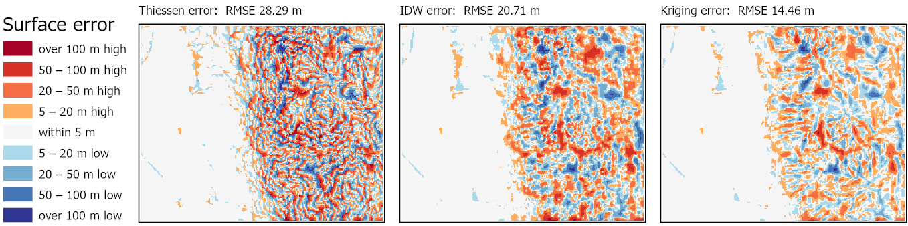

- The valley floor is **within 5 m** for every method; the error is on the **mountain front**
- Thiessen's error is **finest-grained**: every polygon edge is a step

<!-- The three error maps from the Lab 9 example baseline (2,500 points, default parameters). Red is where the surface is too high, blue too low. Ask the room before saying it: why is the valley floor nearly white? Because it is flat: any method that returns a nearby sample's value is close when the ground does not change. The error is a map of where the ground changes faster than the samples are spaced. Lab 9 asks each student to find their best method's single worst cell and explain the ground there. -->

---

# One Number: RMSE

$$
\text{RMSE} = \sqrt{\frac{1}{n}\sum_{i=1}^{n}\left(z_i - \hat{z}_i\right)^2}
$$

- **Square** each error, so highs and lows both count
- Take the **mean** over every cell
- Take the **square root**, so the answer is back in **meters**

<!-- z is the truth, z-hat the surface, n the number of cells. Squaring does two things: it stops positive and negative errors canceling, and it weights big errors heavily, so a surface with a few 100 m misses scores worse than one with many 5 m misses. The capture is Lab 9's second Raster Calculator, Square. Common slip: the root of the mean, not the mean of the roots, and not the root of the sum. -->

---

# RMSE in ArcGIS Pro

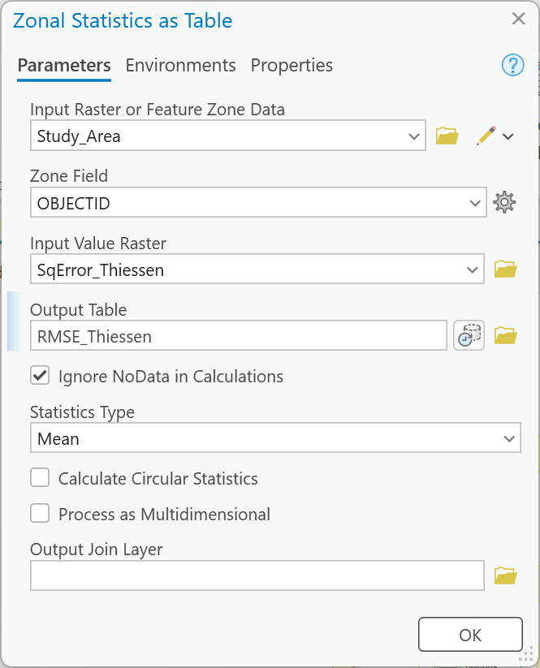

1. **Square** the error raster
2. **Zonal Statistics as Table** over the study area — statistic **Mean**
3. **Calculate Field** — `math.sqrt(!MEAN!)`

- **COUNT** is the number of cells averaged: check it

<!-- The table is Lab 9 Step 7's output for one method: COUNT 67,337 cells and AREA 60,603,300 square meters, both on the lab page as check values. If COUNT comes out smaller, the surfaces did not cover the whole study area (the Extent environment is the usual cause), and the RMSE is quietly computed on fewer cells. Zonal Statistics as Table opens with the statistic set to All; Mean is the one the RMSE needs. -->

---

# What RMSE Hides

- **Where** the error is — a map shows it, a number cannot
- **Which way** — a surface can be biased high everywhere and still score well
- **The worst cell** — one 150 m miss barely moves an average over 67,337 cells
- **The truth's own error** — the "true" DEM is a measurement too

<!-- So report the RMSE, but never alone. The mean error (no squaring) shows bias: near zero means highs and lows balance. The minimum and maximum of the error raster show the worst misses. And the true DEM has its own error, from the lidar and from the 30 m resampling, which never shows up in the RMSE because it is the thing we compare against. The Lab 9 metadata step is there for that reason. -->

---

<!-- _class: lead -->

# Part 2 — When You Do Not

---

# Hold Points Back

- In real work there is **no true DEM** — only the points you measured
- So set some aside: **checkpoints**, never used to interpolate
- Read each surface at the checkpoints, and compute the RMSE there

<!-- This is the slide from the last interpolation session, on purpose: the six-methods test on Little Cottonwood Canyon held back 60 points. In Lab 9 the Checkpoints feature class is 200 such points, drawn separately from the sample points. Extract Multi Values to Points reads the truth and all three surfaces at each checkpoint in one tool. -->

---

# Is 200 Checkpoints Enough?

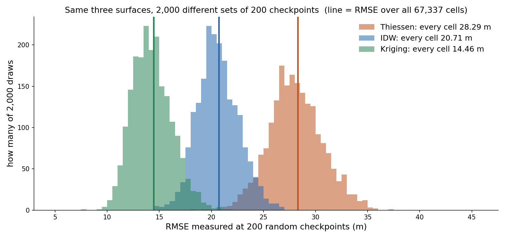

- Each number **wanders by about ±3 m** — but the **ranking** came out the same in **every** draw

<!-- The Lab 9 baseline surfaces (2,500 points, defaults), read at 2,000 different random sets of 200 cells, not the lab's own Checkpoints. 90 % of the draws fall within: Thiessen 24.0 to 32.6 m, IDW 17.6 to 24.0, kriging 11.5 to 17.6, around the all-cell values 28.29, 20.71 and 14.46. Yet in all 2,000 draws kriging beat IDW and IDW beat Thiessen, because the same checkpoints judge all three surfaces: a set of points that happens to land on hard ground makes every method look worse together. Lesson: 200 checkpoints are good for choosing a method and loose for quoting its accuracy to a client. Lab 9's third question asks exactly this of each student's own checkpoints. Numbers: tools/week09_interpolation_numbers.json, from tools/week09_interpolation_figures.py. -->

---

<!-- _class: lead -->

# Part 3 — Does the Answer Survive?

---

# Three Knobs

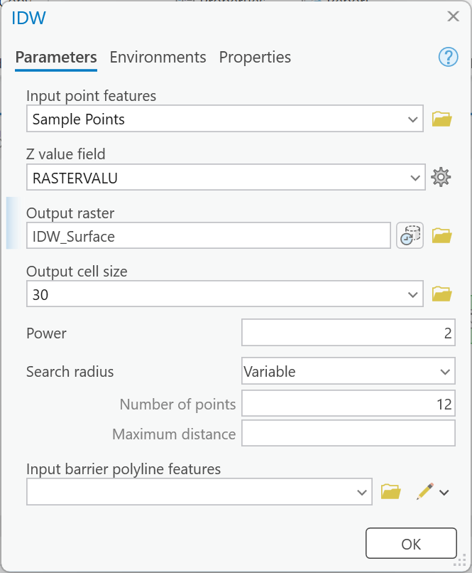

- **How many points:** 250, 2,500, 10,000
- **IDW's power:** 1 smooths, 3 sharpens toward the nearest point
- **Kriging's semivariogram model:** spherical, exponential, Gaussian
- Change **one** thing, rerun, and ask: **does the winner change?**

<!-- The capture is the IDW tool inside the Lab 9 model, with Power exposed as a model parameter. Do not give the class the sensitivity numbers: Lab 9 Step 8 is where they find them. Ask for predictions instead, and write them on the board: if 2,500 points gives these RMSEs, what will 10,000 give? Ten times fewer? Half? Does every method gain the same amount? Come back to the board when the labs are in. -->

---

<!-- _class: quiz -->

# Predict It

At **2,500** points: Thiessen **28.29 m**, IDW **20.71 m**, kriging **14.46 m**

- Go to **10,000** points. Which method **gains the most**, and which the least?
- Raise IDW's power from 2 to **3**. Better, worse, or about the same?
- Where on the error map will the error that remains be?

<!-- Votes only; no answers today. These are the Lab 9 Step 8 questions in advance, so each student goes in with a prediction to test, which is the habit the lab is built around. The three baseline RMSEs are on the lab page as check values, so it is fine to show them. -->

---

<!-- _class: lead -->

# Part 4 — Lab 9, Interpolation Explorer

---

# Lab 9 at a Glance

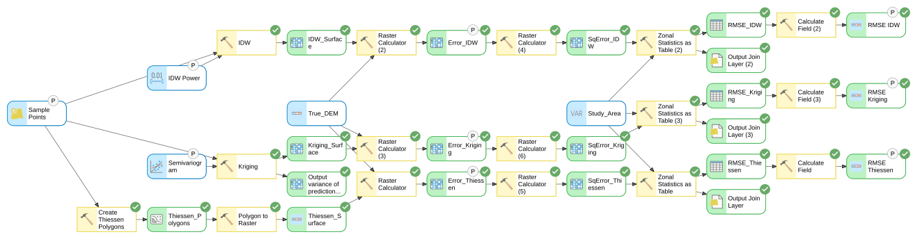

- **The ground:** Y Mountain and the valley west of it, a **30 m** 3DEP DEM in UTM — `True_DEM`
- **The points:** three sets, **250**, **2,500**, **10,000**, already sampled
- **The model:** one sample set → Thiessen, IDW, kriging → error → **RMSE**
- **Then:** five runs from the tool dialog, and **200 checkpoints**

[Lab 9 — Interpolation Explorer](https://byu-hydroinformatics.github.io/ce414-gis-applications/assignments/lab-09/)

<!-- The figure is the finished Lab 9 model, exported from ModelBuilder. Sample Points, IDW Power and the Semivariogram are its input parameters; the three error rasters and three RMSE tables are its outputs. Two things to warn about: set the Extent environment to True_DEM in Step 0, or IDW and kriging cover less ground at 250 points; and finish Map 1 and the checkpoints before the first run from the tool dialog, because a dialog run deletes everything that is not a parameter, including the surfaces. -->

---

# Step 1 — What Does the Service Send?

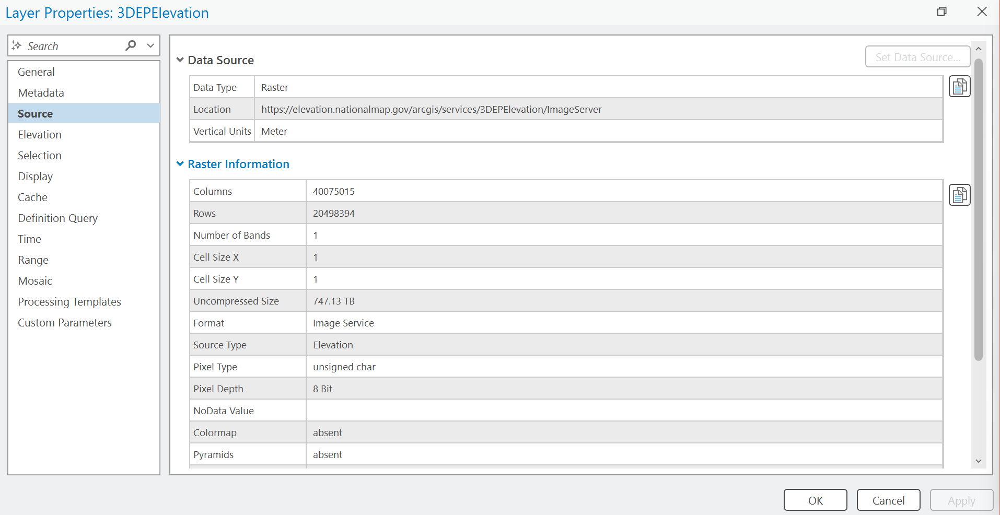

- Add the USGS 3DEP **elevation image service** with **Add Data From Path**
- Read its cell size, pixel type and coordinate system
- Click Y Mountain's summit. The answer is **not** an elevation

**Thursday:** web services, and why that happens

<!-- Lab 9 Step 1, captured in ArcGIS Pro 3.7.1. The service arrives as a hillshade: 1 m cells, 8-bit unsigned pixels, Web Mercator, and the pop-up at the summit reads 154, where the DEM reads about 2,897 m. That is the service's default raster function at work. Do not explain it today; Thursday's web services lecture is built around the question "what comes back?", and this is the class's own example of it. -->

---

# Your Own IDW Power

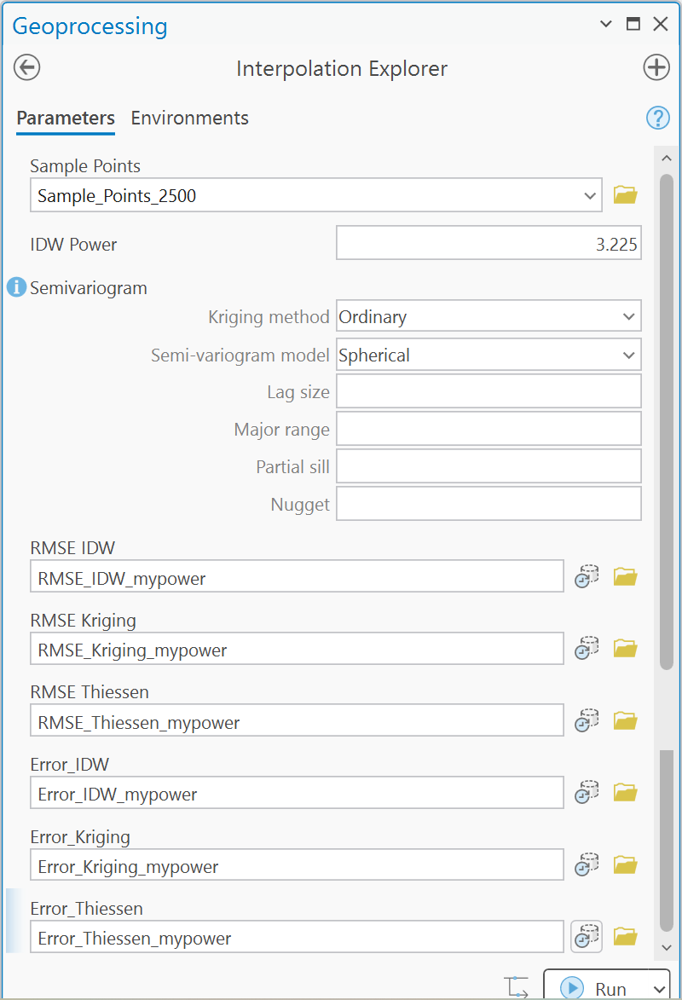

> **Power = 1 + (last two digits of your BYU ID) ÷ 40**

- BYU ID `123456789` → **89** → 1 + 89 ÷ 40 = **3.225**
- The **nine-digit number on your BYU ID card** — not your NetID
- Run 5 uses it; the grader checks your RMSE against your digits

<!-- The capture is the model as a tool, set up for run 5 with the example ID ending in 89. Everyone's other runs use the same hosted points and will match a classmate's to the centimeter; run 5 will not. The lab page gives the example's answer (IDW RMSE 20.29 m at power 3.225) so students can check their setup before they use their own digits. Every power falls between 1 and 3.475. -->

---

# How You Will Know You Are Right

- `True_DEM`: **67,337** cells, **1,368.5 to 2,896.5 m**
- Every RMSE table: **COUNT 67,337**
- 2,500 points, defaults: **28.29 / 20.71 / 14.46 m**
- Run 5 at the example power **3.225**: IDW **20.29 m**

<!-- All four are TIP boxes on the lab page. A COUNT below 67,337 means a surface does not cover the study area; an RMSE that matches to the meter but not the centimeter usually means a different neighbor count or a missed environment setting. -->

---

# Make It Yours

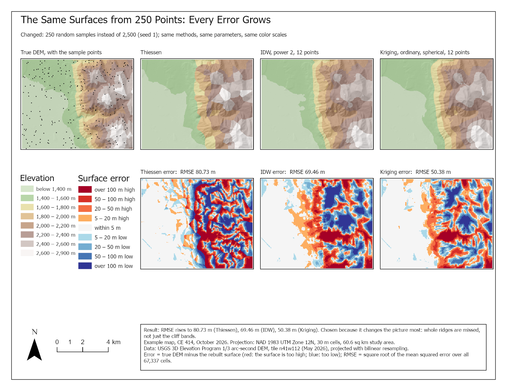

- The **numbers** will match your classmates'; the **choices** should not
- Your own **layout**, **color ramps**, **model labels**, and **words**
- Upload your **toolbox** (`Lab09.atbx`) — the grader runs it at your power
- **Peer review** before you submit, and name your reviewer

<!-- The figure is the lab page's example scenario sheet. It is one way to do Map 2, not a template to copy: submissions whose layouts, model labels or symbology match another student's too closely are flagged for follow-up. Say it plainly once, here. -->

---

# Before Next Class

- **Lab 8 — Big Southern Butte** — due **Saturday 11:59 pm** — [Lab 8](https://byu-hydroinformatics.github.io/ce414-gis-applications/assignments/lab-08/)
- **Quiz 8** — open book, Chapter 14, due **Saturday 11:59 pm**
- **Lab 9 — Interpolation Explorer** — due **Saturday of next week** — start with Steps 0 and 1
- **Thursday:** OGC web services — what a web service actually sends you
- Office hours: [calendly.com/dan-ames/office-hours](https://calendly.com/dan-ames/office-hours)

<!-- Week 9 due items from the DUE table in tools/build_schedule.py: Lab 8, Quiz 8 and Chapter 14 this Saturday; Lab 9 is due the Saturday of Week 10. Deck written October 8, 2026. Figures: tools/week09_interpolation_figures.py (error-row crop and the checkpoint test); the ArcGIS Pro captures are from the Lab 9 GUI build (docs/assignments/lab-09/images), copied into this folder. -->

---

<!-- _class: activity -->

# One Last Thing — How Wrong Is the Surface?

Five questions on error rasters, RMSE, checkpoints and sensitivity. **Scan the code**, or open the link below.

- Not graded, nothing recorded — it is a check that today landed
- Every answer explains itself; read the explanation before you move on
- The sign question is the one that flips a whole map in Lab 9

byu-hydroinformatics.github.io/ce414-gis-applications/quizzes/rmse/

<!-- Four minutes, in pairs, then a show of hands on the checkpoint item: most of the room expects 200 points to be too few to rank the methods. If the room has no signal, put the URL on the board; the items read aloud just as well. -->
