<!-- TODO(instructor): plan says retire this 2011 conference deck and build a 12–18 slide modern lesson
     (WMS/WFS vs OGC API Features/Tiles/Maps/Records, ArcGIS REST, JSON/OpenAPI, STAC, COG, and a live
     service-inspection activity). Everything below is a faithful conversion of the 2011 original, not a
     rewrite: version numbers, status lists, and URLs are as they stood in January 2011 and were
     deliberately NOT updated. Read the conversion notes at the foot of this file before teaching it. -->

<!-- _class: lead -->
<!-- _paginate: skip -->

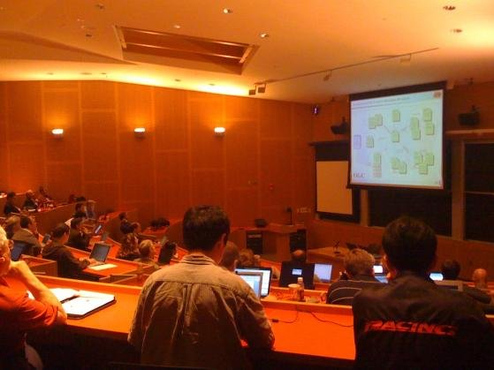

# Overview of OGC Web Services

CE 414 Engineering Applications of GIS
Dr. Dan Ames

Adapted from *Overview of OGC Web Services*,
Open Geospatial Consortium, January 2011

<!-- The source is a conference presentation given by Luis Bermudez, then OGC Director of Interoperability Certification, in Washington DC on January 18, 2011. The presenter contact block and the event date/location were dropped from the slide face during conversion. Everything technical in this deck is the 2011 standards baseline; say so out loud at the start of class. -->

---

# Today's Goals

- By the end of class you should be able to:
  - Say what the **Open Geospatial Consortium** is, and what an "open standard" buys you
  - Name the core **OGC web services** and what each one returns: **WMS**, **WMTS**, **WFS**, **WCS**, **WPS**, **CSW**
  - Read a **GetCapabilities** document and explain the publish / find / bind pattern
  - Tell the difference between a **map** (a picture), a **feature** (data), and a **coverage** (a space-varying phenomenon)
  - Recognize **GML**, **KML**, **SLD**, and **NetCDF** as encodings rather than services

<!-- TODO(graphic): text-only slide — needs a figure. Image generation was off for this conversion pass. -->

<!-- Frame the hour: the OGC standards baseline is a small vocabulary plus one repeated request pattern. If students learn GetCapabilities and the map/feature/coverage split, the rest of the alphabet soup follows. -->

---

# OGC Mission

To serve as a **global forum** for the collaboration of developers and users of spatial data products and services, and to **advance the development of international standards for geospatial interoperability**.

<!-- Copyright © 2011, Open Geospatial Consortium. -->

---

# OGC at a Glance

- A non-profit, international voluntary consensus standards organization that is leading the development of standards for geospatial and location based services
- Founded in 1994
- 438 members and growing
- 35 implementation standards
- Hundreds of product implementations in the market
- Broad user community implementation worldwide
- Alliances and collaborative activities with ISO and many other SDOs

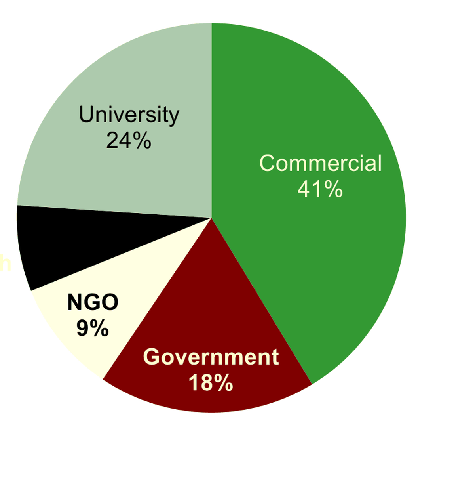
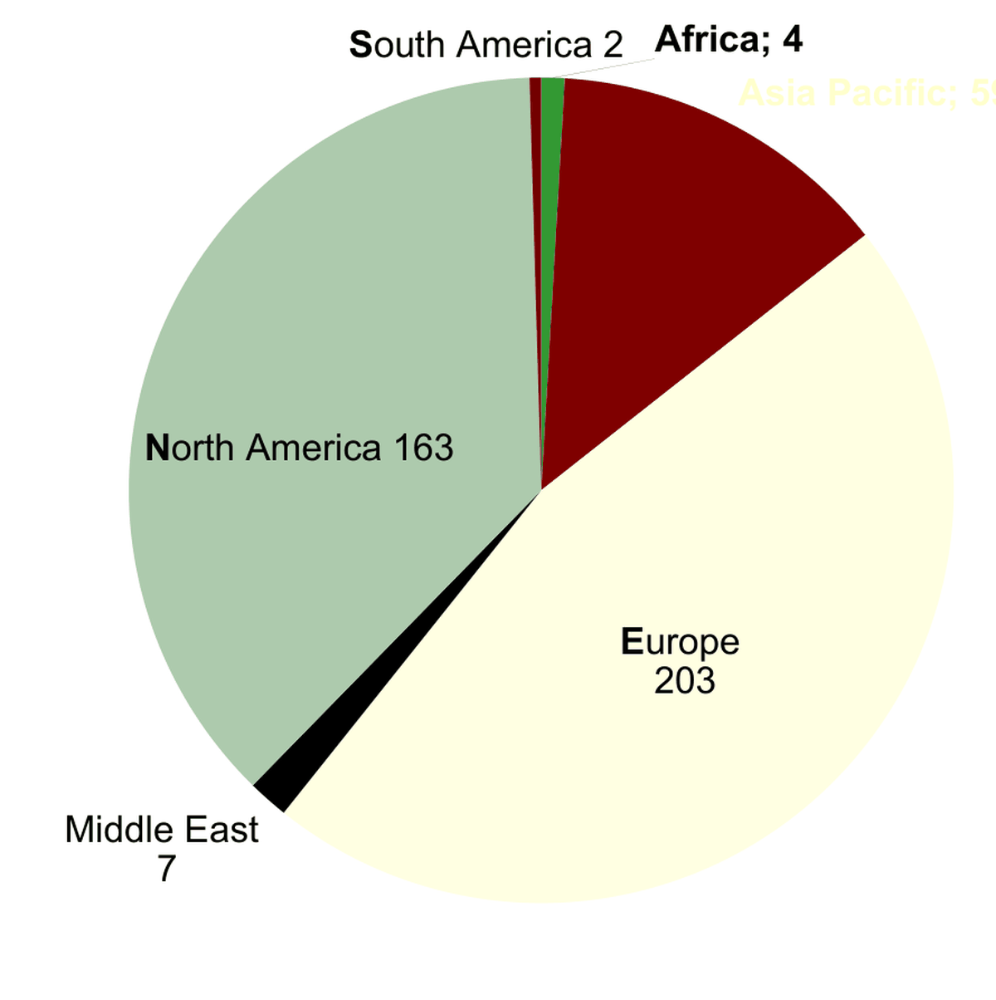

Members by sector and by region, January 2011

<!-- TODO(graphic): missing linked Excel object — both pie charts are PowerPoint charts linked to an external
     workbook named "Book1" that did not travel with the file. The charts render from cached values only, so
     the numbers here cannot be edited or refreshed; the images above are page renders of the cached charts. -->

<!-- TODO(instructor): source slide 3 says "35 implementation standards" while source slide 12 says "33 total
     as of January 2011". The inconsistency is in the original; it was not resolved. -->

<!-- Source slides 3 and 4 carried identical text and differed only in the chart, so they were merged here.
     Members by sector: Commercial 41%, University 24%, Government 18%, NGO 9%. By region: Europe 203,
     North America 163, Asia Pacific 59, Middle East 7, Africa 4, South America 2 — 438 total. All 2011 figures. -->

---

# Standards development is not easy

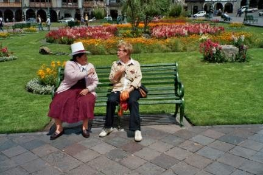

- → Requires understanding of differences
- → Requires cooperation on a global basis
- → Requires consensus by many organizations
- → Requires give and take
- → Requires certified, repeatable process

<!-- The point of the photograph is conversation across difference. Consensus standards are slow because agreement is the product. -->

---

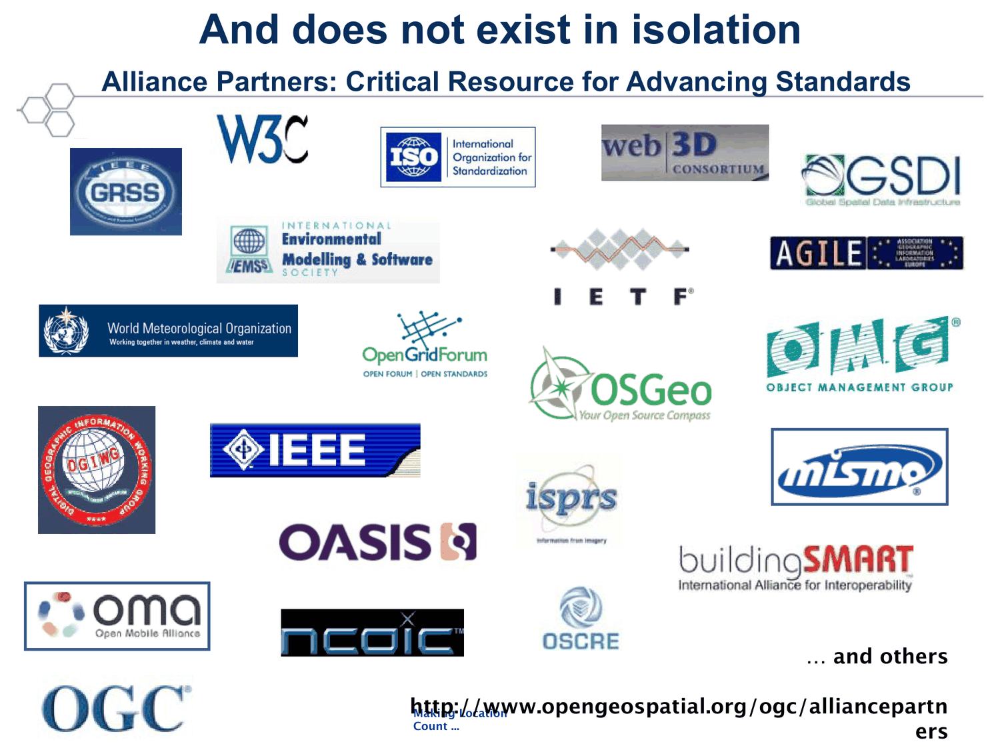

<!-- Source slide 6: "Making location count... and does not exist in isolation. Alliance Partners: Critical
     Resource for Advancing Standards." The logo wall shows OGC's alliance partners — W3C, ISO, IETF, OASIS,
     OSGeo, IEEE, WMO, OMG, ISPRS, Open Grid Forum, Open Mobile Alliance, buildingSMART, GSDI, AGILE, web3D,
     NCOIC, OSCRE and others. Full list at http://www.opengeospatial.org/ogc/alliancepartners (2011 URL). -->

---

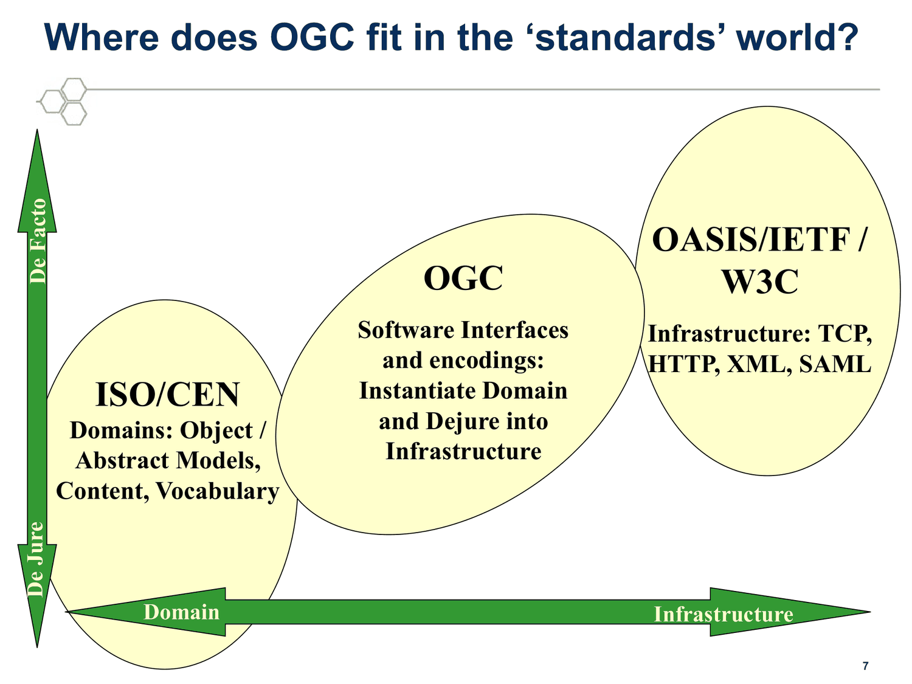

<!-- Source slide 7: "Where does OGC fit in the 'standards' world?" Three overlapping domains, de jure on the
     left through de facto on the right: ISO/CEN owns domain object and abstract models, content and
     vocabulary; OASIS/IETF/W3C own infrastructure — TCP, HTTP, XML, SAML; OGC sits between them, defining the
     software interfaces and encodings that instantiate the domain models into that infrastructure. -->

---

# What is an OGC standard?

- A document, established by consensus, approved by the OGC membership (balance of interest, all members have an equal vote)
- Provides rules, guidelines, or characteristics
- Implementable (testable) in software
- Is **not** open source software — `http://wiki.osgeo.org/wiki/Open_Source_and_Open_Standards`
- OGC standards are ***open standards***
  - Freely and publicly available
  - No license fees
  - Vendor neutral

<!-- TODO(graphic): text-only slide — needs a figure. -->

<!-- The open-source / open-standards distinction is the one students most often collapse. A standard is a document anyone may implement; open source is an implementation anyone may read. GeoServer is open source software implementing open standards; ArcGIS Server is proprietary software implementing the same open standards. -->

---

# Why open standards?

- Prevents a single, self-interested party from controlling a standard
- Lower systems and life cycle costs
- Encourage market competition
  - Choose based on functionality desired
  - Avoid "lock in" to a proprietary architecture
- Stimulates innovation beyond the standard by companies that seek to differentiate themselves

Source: <em>Open Standards, Open Source, and Open Innovation: Harnessing the Benefits of Openness</em>, April 2006. Committee For Economic Development. www.ced.org

<!-- Source speaker note: "Standards are like parachutes: they work best when they're open." — Mary McRae, OASIS. -->

---

# Example worldwide standard: KML

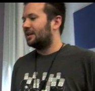

> "What OGC brings to the table is… everyone has confidence we won't take advantage of the format or change it in a way that will harm anyone… Governments like to say they can publish to OGC KML instead of Google KML."

**Michael Weiss-Malik**, Google KML product manager

<!-- KML started inside Keyhole, then Google, and was handed to OGC in 2008. This is the argument for handing a successful proprietary format to a standards body: it stops being a vendor's asset and starts being infrastructure. The Google wordmark on the source slide was not carried over. -->

---

# OGC specifications

`http://www.opengeospatial.org/standards`

- **Implementation Specifications — Standards**
  - Basis for working software; detail the interface structure between software components
- **Abstract Specifications**
  - Conceptual foundation / reference model for spec development
- **Best Practices**
  - Describe use of specifications
- **Engineering Reports**
  - Results from OGC Interoperability Program
- **Discussion Papers**
  - Forum for public review of concepts

<!-- TODO(graphic): text-only slide — needs a figure. -->

<!-- Only the first category is normative and testable. Everything below it is documentation of practice. When someone says "we are OGC compliant," ask which implementation specification, and which version. -->

---

# Approved OGC® standards

**Web Services**
- Web Map Service (WMS) {ISO}
- Web Feature Service (WFS) {ISO}
- Web Coverage Service (WCS)
- Catalog Services for the Web (CS/W)
- Coordinate Transformation

**Encodings**
- Geography Markup Language (GML) {ISO}
- KML
- Web Map Context
- NetCDF

**Sensor Web Enablement**
- SensorML
- TransducerML
- Sensor Observation Service (SOS)
- Sensor Planning Service (SPS)
- Sensor Alert Service (SAS)
- PUCK

**Open Location Services (OpenLS) {ISO}**

**Tightly coupled**
- Simple Feature Access — OLE, SQL, CORBA {ISO}
- Grid Coverages

Others (33 total as of January 2011, plus profiles, best practices, discussion papers, white papers, etc.). Available free of charge at <code>http://opengeospatial.org/standards</code>

<!-- TODO(instructor): this is the January 2011 standards baseline and was deliberately not updated. The OGC API
     family (Features, Tiles, Maps, Records), WMTS 1.0 as a separate line item, and later SWE revisions are all
     absent because they are later than the source. -->

<!-- Source speaker note: "I won't spend a great deal of time today going through the intricacies of each of our specifications, but I do want you to visit our site and review the OpenGIS Implementation Specifications that have been formally approved for adoption by our membership. These specifications represent a solid reference architecture for geoprocessing interoperability, focused heavily on Web Services, and experiencing substantial implementation in the market. But first, let me summarize how some of these specifications empower the processes of geospatial discovery, access, integration and application." -->

---

# OGC architecture

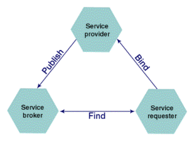

OGC standards can be integrated into a web services architecture / platform so that:

- Resource providers can advertise their resources (**publish**)
- End users can discover resources that they need at run-time (**find**)
- End users and their applications can access and exercise resources at run-time (**bind**)

<!-- Publish / find / bind is the whole architecture in three words: a service provider publishes to a broker (a catalog), a requester finds it there, then binds directly to the provider. Every OGC service below is one of those three roles. -->

---

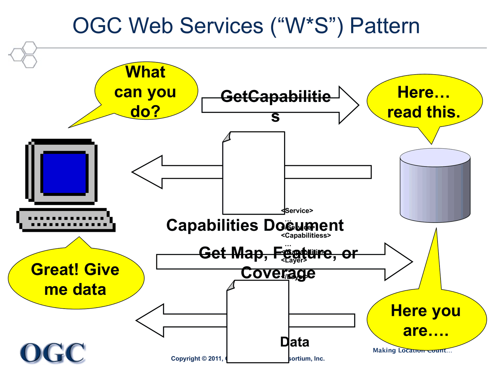

<!-- Source slide 14: the OGC Web Services ("W*S") pattern. Client asks "what can you do?" with GetCapabilities;
     server answers "here… read this" with a Capabilities document listing <Service>, <Capabilities> and
     <Layer> elements. Client then asks "give me data" with GetMap, GetFeature, or GetCoverage, and the server
     returns it. Every OGC web service in this deck is that same two-step handshake. The source diagram
     contains a typo in the XML, "<Capabilitiess>"; it is left as drawn. -->

---

<!-- _class: lead -->

# Catalog Services for the Web

<!-- First of the service families: how you find a service at all. -->

---

# Publishing and discovery

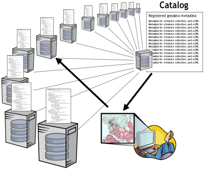

**OGC Catalog Service**

- Catalog Service for the Web (CSW)
- ISO 19119 Metadata Profile
- Z39.50 Profile
- OASIS ebRIM Profile
- OpenSearch

Support publishing and discovery of distributed geospatial data and associated services

<!-- A catalog is a service whose data is metadata about other services. The profiles are alternative query languages over the same registry. -->

---

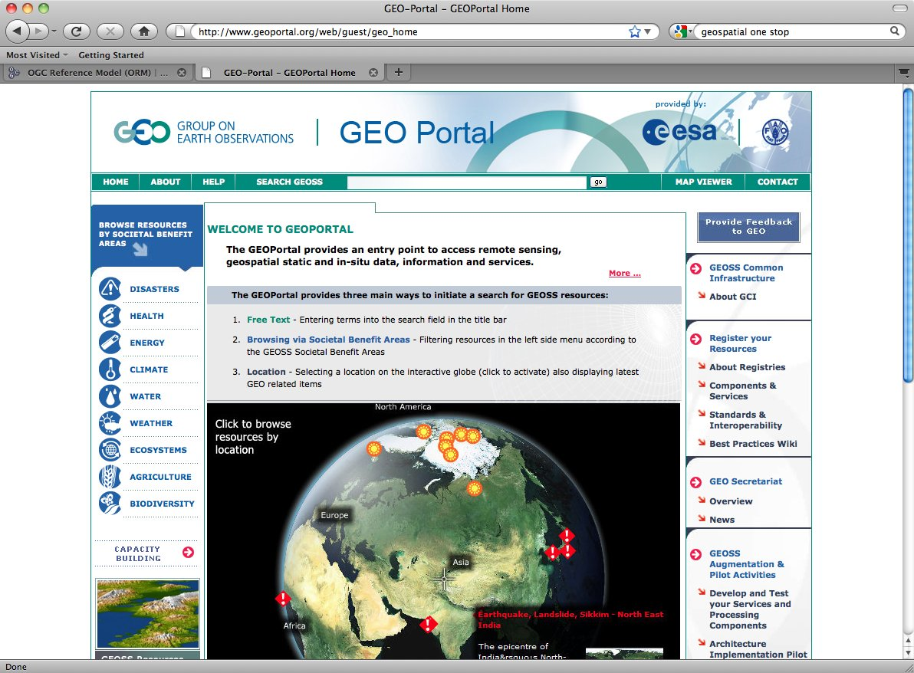

<!-- Source slide 17: an untitled full-slide screenshot of the GEO Portal (geoportal.org), the Group on Earth
     Observations entry point for browsing GEOSS resources by societal benefit area — disasters, health,
     energy, climate, water, weather, ecosystems, agriculture, biodiversity. 2011 screenshot; the portal has
     changed since. -->

---

# GEOSS Registry

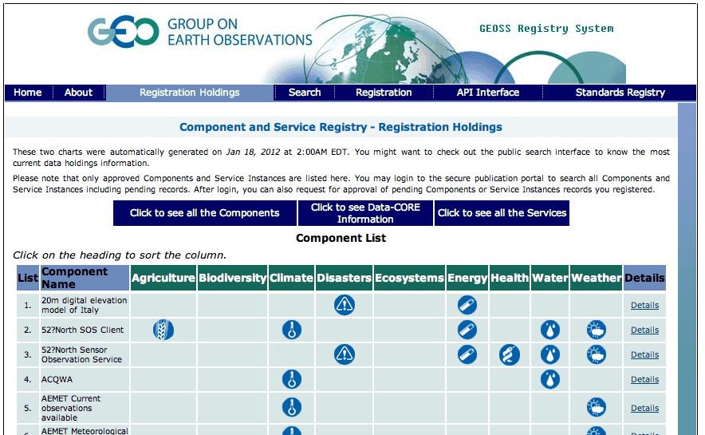

**396 entries**

<code>http://geossregistries.info/holdings.htm</code>

<!-- TODO(instructor): the source titled this "GEOOS Registry"; corrected to GEOSS (Global Earth Observation
     System of Systems), which is what the screenshot and the URL both show. The count (396) and the screenshot
     are dated January 2012 in the source and are certainly stale. -->

<!-- The registry is the concrete example of a catalog: every row is a component or service instance someone published, with the societal benefit areas it serves. -->

---

<!-- _class: lead -->

# Web Map Service

<!-- WMS: the server does the drawing and sends you a picture. -->

---

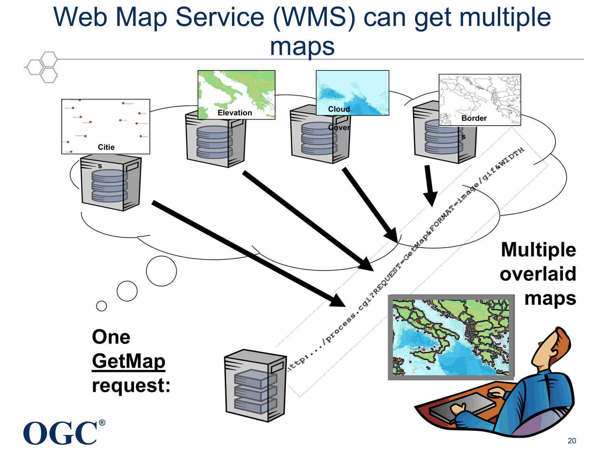

<!-- Source slide 20: one GetMap request, multiple overlaid maps. Four independent servers hold Cities,
     Elevation, Cloud Cover and Borders; a single GetMap URL of the form
     http://.../process.cgi?REQUEST=GetMap&FORMAT=image/gif&WIDTH=... returns one composited image.
     Source speaker note: "WMS essentially converts any supported data encoding into a symbolized image (JPEG,
     TIFF, PNG, etc.) and sends it to the client. A server might host multiple services such as WFS and WMS for
     the same datasets, where WMS returns a picture of a dataset, and WFS returns the vector content of that
     dataset as GML." -->

---

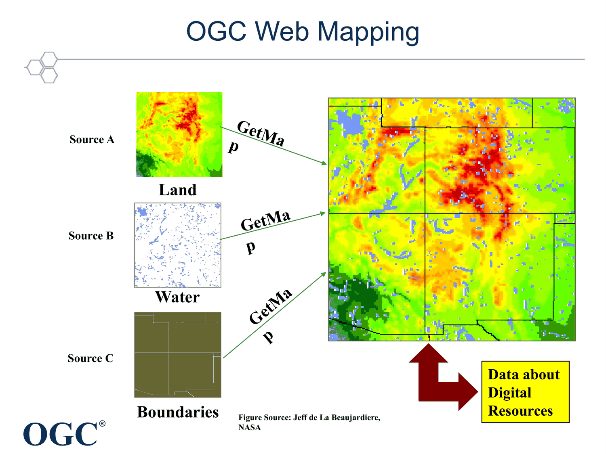

<!-- Source slide 21: OGC web mapping. Three sources — Land, Water, Boundaries — each answering a GetMap
     request, composited into one map by the client. The client also holds "data about digital resources",
     the metadata that told it where to ask. Figure source: Jeff de La Beaujardiere, NASA. -->

---

# OGC Web Map Service

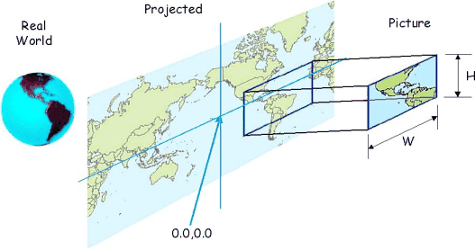

**Spatial context**
- Spatial Reference System (EPSG)
- Corners of map (geographic extent)
- Image width and height

**List of "layers"**
- Layer name
- Symbolization style

**Return format**
- GIF | JPEG | WebCGM | SVG, etc.
- Background info (color, transparency)
- Exception Type = InImage | Encoded/Parseable

<!-- This is the parameter list of a GetMap request, and it is worth reading as one: a coordinate system, a bounding box, a pixel size, a layer list, and a format. That is all a map server needs to draw. Note that the client, not the server, chooses the projection — the EPSG code is a request parameter. -->

---

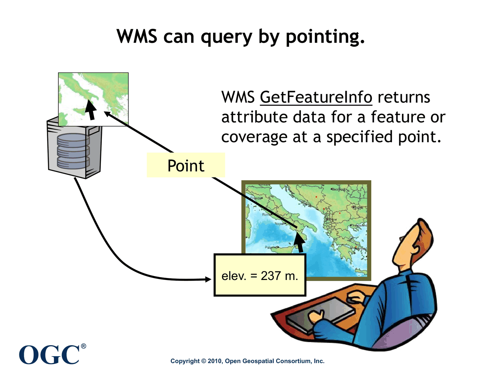

<!-- Source slide 23: WMS can query by pointing. GetFeatureInfo returns attribute data for a feature or
     coverage at a specified point — here, elevation 237 m. Source speaker note: "The Web Map Server
     specification enables WMS applications to optionally provide one other useful capability. Pixel location
     on a returned image corresponds to a point in the data on the server, and thus the server can be asked to
     return information about the feature represented at that point." -->

---

# WMS tiling (WMTS) builds on WMS

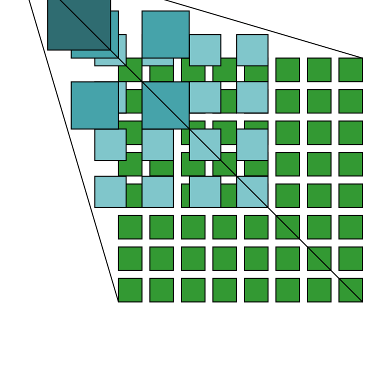

- WMTS designed for high performance: anticipates high volume of **identical** requests
  - Pre-render data as tiles
  - Supports caching
- WMS request by bbox and h/w **vs.** WMTS request by tiles
  - TileMatrixSet (CRS)
  - TileCol
  - TileRow
- Bindings: KVP, SOAP/WSDL, RESTful

<!-- The trade is generality for speed. WMS will draw any bounding box you ask for, which means no two requests are alike and nothing can be cached. WMTS answers only from a fixed pyramid of tiles, so every request is a cache hit. This is why every web basemap you have ever used is tiled. -->

---

# WMS Global Mosaic

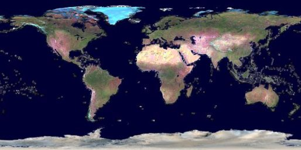

- Mosaic of Landsat 7
  - 8600 georectified scenes
  - 30 and 15 m resolution
- OpenGIS WMS — Web Map Service
  - `Onearth.jpl.nasa.gov`
  - On-the-fly pan-sharpening
  - Client selected false-color rendering from 9 bands
  - Server development managed and funded by NASA GIO
  - Accessed by many different WMS clients
- ~200,000 Landsat images daily average served as WMS layers

<!-- TODO(instructor): 2011 figures and a 2011 URL, both left as written. -->

<!-- The scale argument for WMS: nobody downloads 8600 Landsat scenes. The server holds the archive and ships pictures of whatever window you asked for, rendered from whichever bands you chose. -->

---

<!-- _class: lead -->

# Web Feature Service

<!-- WFS: the server sends you the data, not a picture of it. -->

---

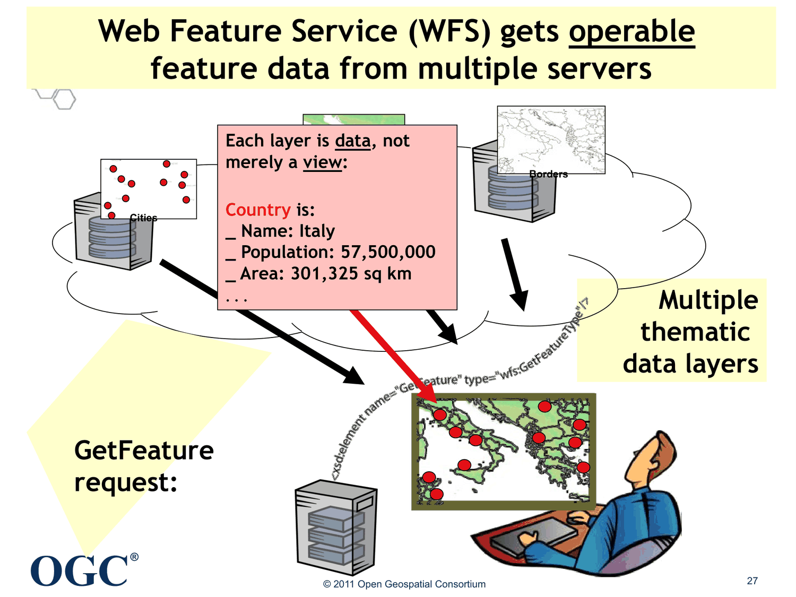

<!-- Source slide 27: WFS gets operable feature data from multiple servers. One GetFeature request pulls
     multiple thematic data layers — Cities, Borders, Elevation. Each layer is data, not merely a view:
     Country is { Name: Italy, Population: 57,500,000, Area: 301,325 sq km, ... }. Contrast directly with the
     WMS slide: same picture on screen, but here the client holds the attributes and can query them. -->

---

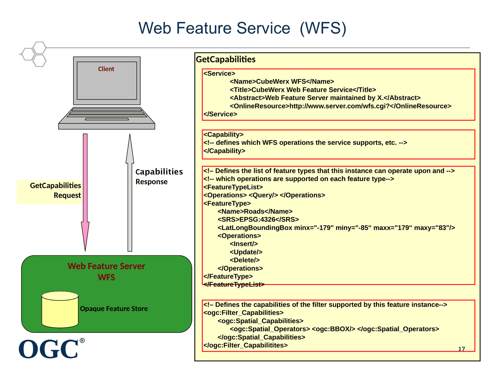

<!-- Source slide 28: WFS GetCapabilities. The client asks; the Web Feature Server, sitting over an opaque
     feature store, returns a Capabilities document: a <Service> block (name, title, abstract, online
     resource), a <Capability> block, a <FeatureTypeList> naming each feature type with its SRS
     (EPSG:4326), its LatLongBoundingBox, and the operations allowed on it (Query, Insert, Update, Delete),
     and an <ogc:Filter_Capabilities> block declaring which spatial operators the server supports.
     Source speaker note (Spanish, from an earlier version of this deck): "El estándar Web Feature Service
     (WFS) permite el acceso a datos vectoriales en formato GML." -->

---

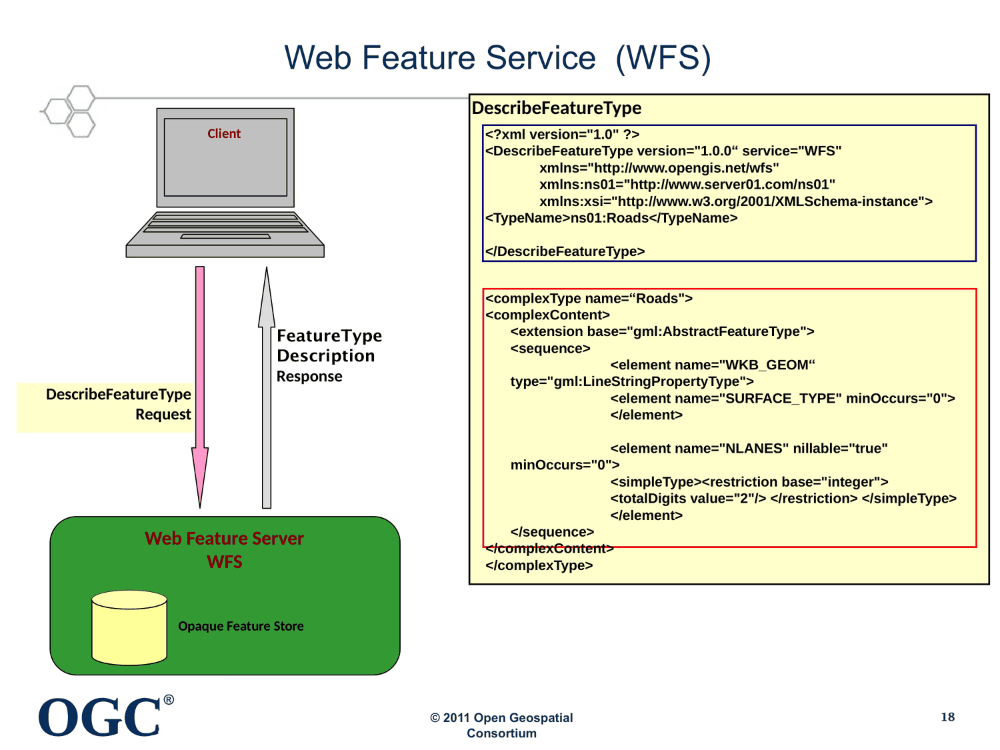

<!-- Source slide 29: WFS DescribeFeatureType. The client names a type — ns01:Roads — and the server returns
     its XML Schema: a complexType extending gml:AbstractFeatureType, with a geometry element
     (WKB_GEOM, gml:LineStringPropertyType) and attribute elements (SURFACE_TYPE, NLANES restricted to a
     2-digit integer). This is the step that has no equivalent in WMS: the client learns the schema before
     asking for data. -->

---

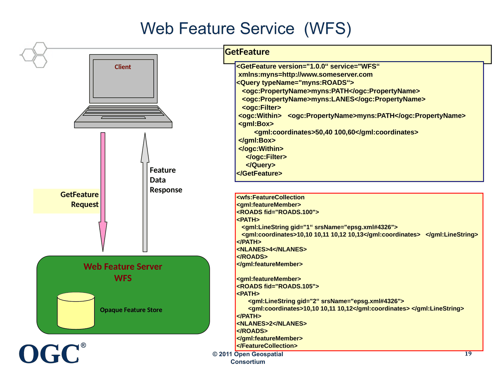

<!-- Source slide 30: WFS GetFeature. The request names a typeName (myns:ROADS), the properties wanted
     (PATH, LANES), and an <ogc:Filter> — here ogc:Within a gml:Box of 50,40 to 100,60. The response is a
     wfs:FeatureCollection of gml:featureMember elements, each a ROADS feature with an fid, a
     gml:LineString of coordinates in EPSG:4326, and its NLANES value. Point out that the filter is the
     spatial query: this is a SELECT ... WHERE over the web. -->

---

<!-- _class: lead -->

# Geography Markup Language

<!-- From services to encodings: what the data looks like on the wire. -->

---

# OGC Geography Markup Language (GML)

- GML is an application of e**X**tensible **M**arkup **L**anguage (XML)
  - XML specified by World Wide Web Consortium (W3C)
- GML specifies XML Schemas that specify XML encoding of geographic features, their geometry, and their attributes
- GML encodes digital feature data
  - Encodes features, attributes, geometries, collections, etc.
  - Basis for specifying Application Schemas
- GML v3 supports 2½ and 3D geometry as well as complex geometry and topology
- GML 3 is also ISO 19136

<!-- TODO(graphic): text-only slide — needs a figure. -->

<!-- Source speaker note: "Historically, the task of moving geographic data from one format to another has been difficult. As a result, many users with large data stores have been locked into a single vendor's format and have been restricted to using one vendor's analysis and decision support tools. The Geography Markup Language (GML) attempts to alleviate these difficulties by increasing organizations' ability to share geographic information. GML, which is based on the eXtensible Markup Language (XML), is an open and non-proprietary specification used for the transport and storage of geographic information. As with the OpenGIS Simple Feature Specification, GML utilizes the OpenGIS Abstract Specification geometry model. However, unlike the Simple Features Specification, the GML Specification includes the ability to handle complex properties." -->

---

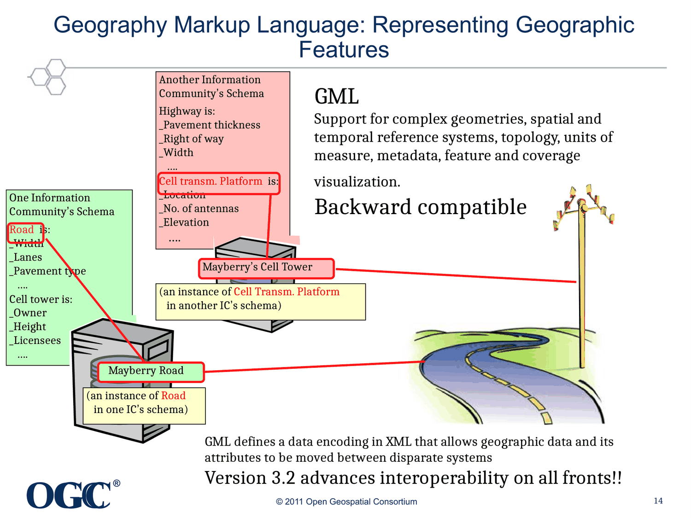

<!-- Source slide 33: GML representing geographic features. Two information communities describe the same
     world with different schemas — one calls it a Road (width, lanes, pavement type) and a Cell tower
     (owner, height, licensees); the other calls it a Highway (pavement thickness, right of way, width) and a
     Cell transmission platform (location, number of antennas, elevation). Mayberry Road is an instance of
     Road in one community's schema; Mayberry's Cell Tower is an instance of Cell Transmission Platform in
     the other. GML defines a data encoding in XML that lets geographic data and its attributes move between
     those disparate systems: complex geometries, spatial and temporal reference systems, topology, units of
     measure, metadata, feature and coverage visualization, and it is backward compatible. The slide asserts
     "Version 3.2 advances interoperability on all fronts."
     Source speaker note adds: "GML is more than just a mechanism for encoding spatial data. It also provides
     the ability to define application schemas that are specific to a given domain, such as transportation or
     cadastral, and capture both the geometry and topology relationships but also the semantics of the
     specific domain being modeled." The remainder of that note is in Spanish, carried over from an earlier
     version of the deck. -->

---

# GML application activities

**Profiles**
- GML Point Profile
- GML Simple Features Profile
- GML GeoShape for use in IETF
- GML in JPEG2000
- GeoRSS: GML Serialization

US NSDI GML Schemas for Framework Datasets

European INSPIRE Data Specifications

**Community application schemas**
- Aeronautical Information Exchange Model (AIXM)
- Climate Science Modeling Language (CSML)
- CityGML
- CleanSeaNet
- NcML/GML (NetCDF and GML)
- TDWG Biodiversity GML
- GeoSciML — Geological Sciences ML
- MarineXML
- Ground Water Modeling Language
- WaterML
- Weather Information Exchange Model (WXXM)

Further information on OGC Network: <code>http://www.ogcnetwork.net/node/210</code>

<!-- This is the payoff of "basis for specifying Application Schemas" on the previous slide. Each of these is a domain community agreeing on names and structures inside GML, so that aviation, hydrology, and geology can each be specific without inventing a new encoding. WaterML is the one this course touches most directly. -->

---

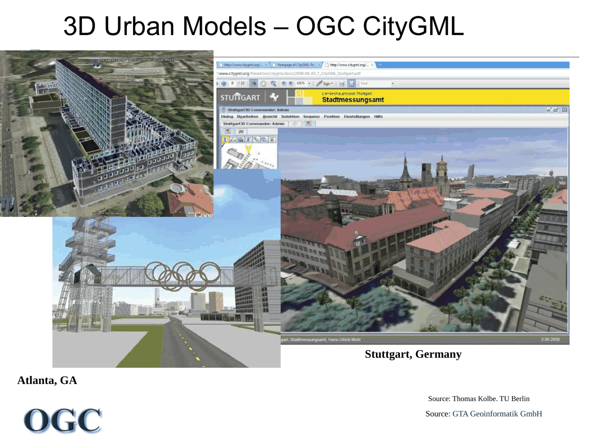

<!-- Source slide 35: 3D urban models with OGC CityGML — a Stuttgart, Germany city model in a municipal
     3D viewer (source: GTA Geoinformatik GmbH) and Atlanta, GA (source: Thomas Kolbe, TU Berlin).
     CityGML is a GML application schema, so the buildings carry semantics — a wall is a wall, a roof is a
     roof, at a declared level of detail — not just triangles. -->

---

<!-- _class: lead -->

# Feature Portrayal

<!-- If the client holds the data, who decides what it looks like? -->

---

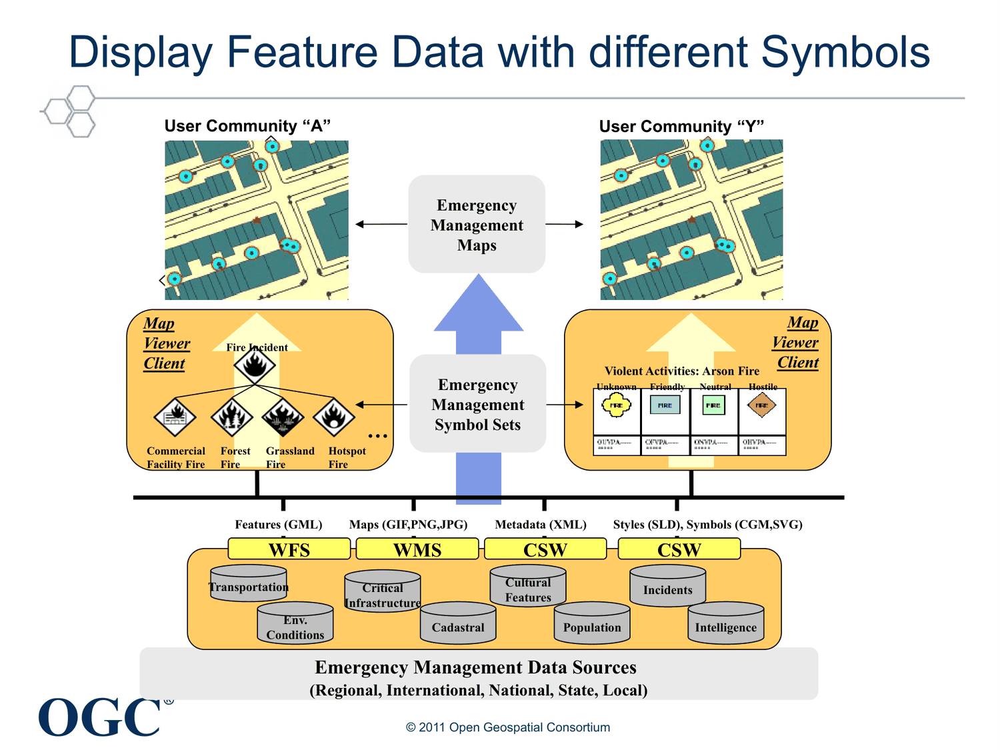

<!-- Source slide 37: displaying the same feature data with different symbols. Emergency management data
     sources (regional, international, national, state, local) — transportation, cadastral, incidents,
     critical infrastructure, population, cultural features, environmental conditions, intelligence — are
     served through WFS (features as GML), WMS (maps as GIF/PNG/JPG), and CSW (metadata as XML), with styles
     as SLD and symbols as CGM or SVG. Two user communities, A and Y, apply different emergency management
     symbol sets to the same incidents: one draws a fire incident taxonomy (commercial facility fire, forest
     fire, grassland fire, hotspot, unknown), the other a friendly/neutral/hostile violent-activities set
     (arson fire). Same data, different portrayal. -->

---

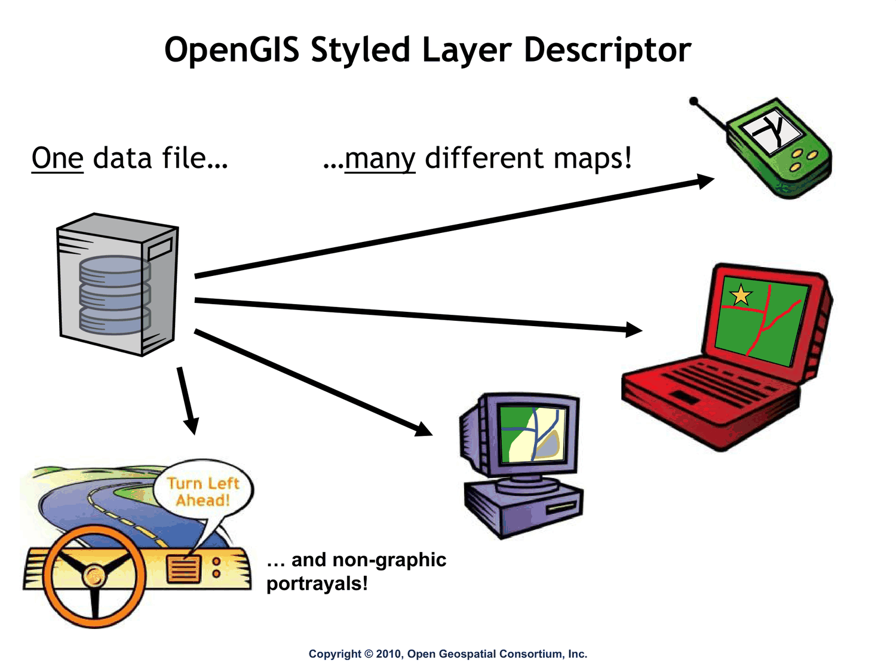

<!-- Source slide 38: OpenGIS Styled Layer Descriptor — one data file, many different maps, and non-graphic
     portrayals too. Source speaker note: "The image on the handheld might be a Web Map Service JPEG map
     created by the server to portrayal specifications encoded in a Styled Layer Description file provided by
     the application running on the handheld. The image on the laptop might be a simple portrayal of GML
     encoded roads data provided by the server. The portrayal, guided by the Styled Layer Description file,
     might have taken place entirely on the laptop. The image on the desktop system might be a similar
     portrayal of GML encoded roads, but here it is overlaid on raster data obtained by a Web Coverage Server
     query. The visual coloring of the raster image was specified by a Style Layer Description file referenced
     in the query to the server. The Web-based in-car navigation system is not graphically portraying the
     roads data. It is using it instead to provide synthesized speech driving instructions." -->

---

<!-- _class: lead -->

# OGC KML

<!-- The format everyone already has, brought into the standards process. -->

---

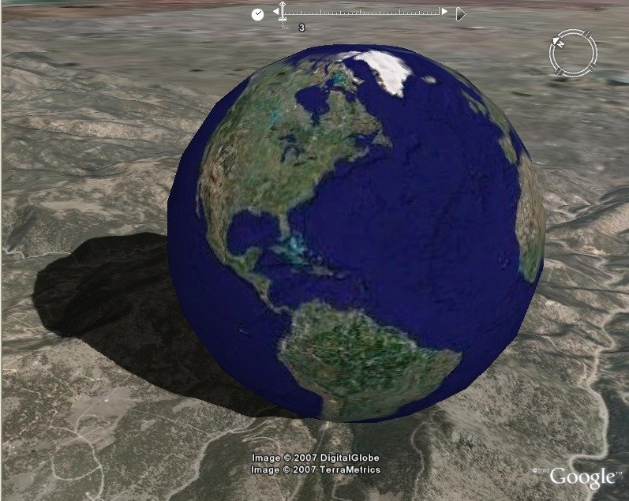

<!-- Source slide 40: an untitled globe rendered in a KML viewer (Google Earth, imagery © 2007 DigitalGlobe /
     © 2009 TerraMetrics per the source image). -->

<!-- TODO(instructor): source slides 40 and 41 both carry the GML speaker note verbatim, apparently pasted by
     mistake when the KML section was added. The note is not reproduced on these slides. -->

---

# OGC KML

- Annotate the Earth
- Specify icons and labels to identify locations on the surface of the planet
- Create different camera positions to define unique views for KML features
- Define image overlays to attach to the ground or screen
- Define styles to specify KML feature appearance
- Write HTML descriptions of KML features, including hyperlinks and embedded images
- Organize KML features into hierarchies
- Locate and update retrieved KML documents from local or remote network locations
- Define the location and orientation of textured 3D objects

<!-- TODO(graphic): text-only slide — needs a figure. -->

<!-- Read this list against the GML list two sections back. GML describes what a feature *is*; KML describes what a viewer should *show* and where the camera should stand. That is why KML carries styles and camera positions and GML does not. -->

---

<!-- _class: lead -->

# Web Coverage Service

<!-- Third data type: not a picture, not a feature — a field. -->

---

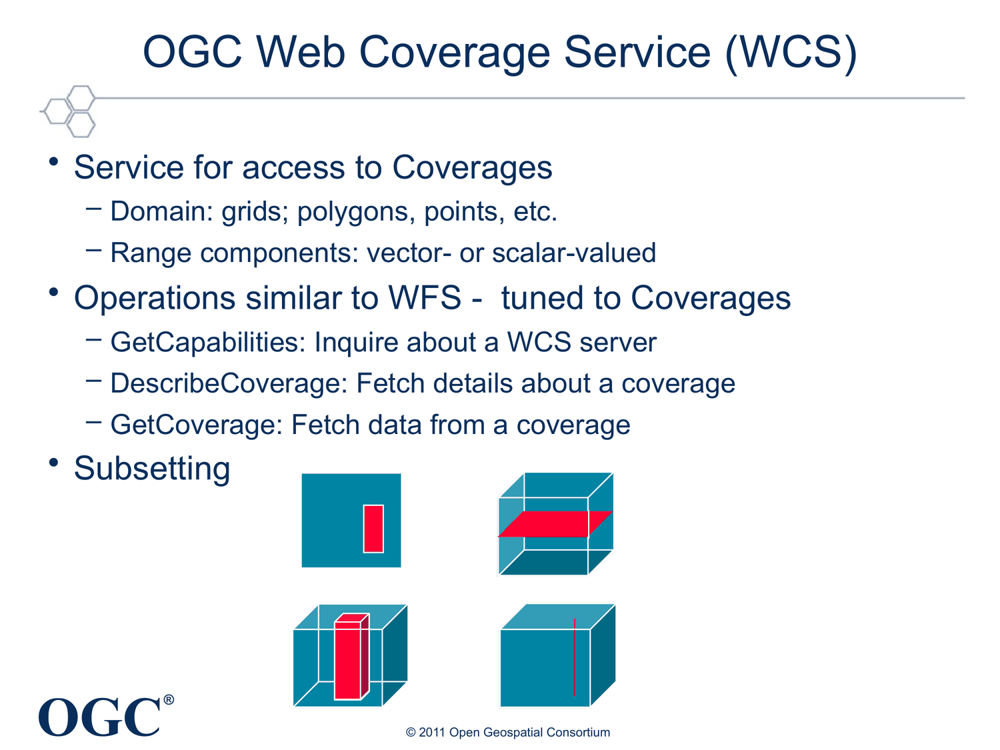

<!-- Source slide 43: OGC Web Coverage Service (WCS) — a service for access to coverages. Domain: grids,
     polygons, points, etc. Range components: vector- or scalar-valued. Operations similar to WFS but tuned
     to coverages: GetCapabilities (inquire about a WCS server), DescribeCoverage (fetch details about a
     coverage), GetCoverage (fetch data from a coverage). The cube figures illustrate subsetting — taking a
     slice, a slab, or a trim out of a multidimensional coverage. -->

---

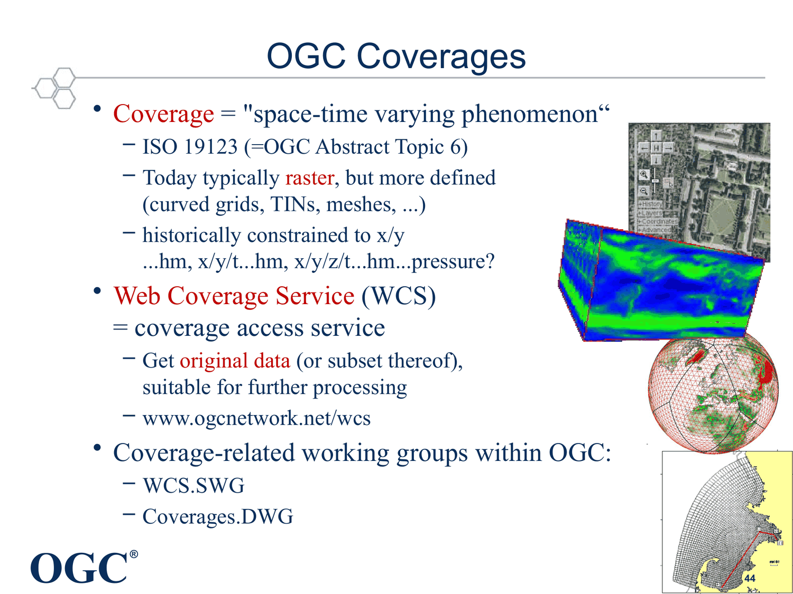

<!-- Source slide 44: OGC coverages. A coverage is a "space-time varying phenomenon", ISO 19123 (= OGC
     Abstract Topic 6). Today typically raster, but more is defined — curved grids, TINs, meshes. Historically
     constrained to x/y, then x/y/t, then x/y/z/t... then what about pressure? WCS is the coverage access
     service: get the original data, or a subset of it, suitable for further processing (www.ogcnetwork.net/wcs).
     Coverage-related working groups within OGC: WCS.SWG and Coverages.DWG. -->

---

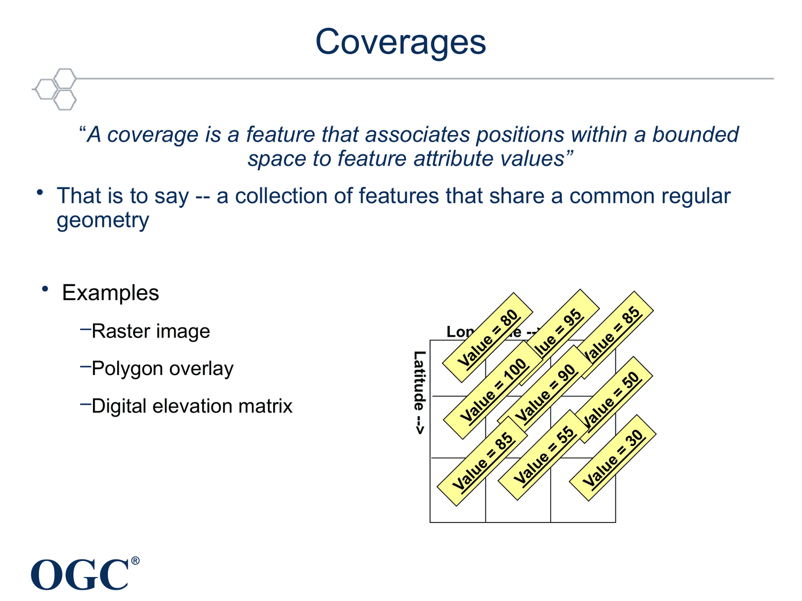

<!-- Source slide 45: "A coverage is a feature that associates positions within a bounded space to feature
     attribute values" — that is to say, a collection of features that share a common regular geometry.
     Examples: raster image, polygon overlay, digital elevation matrix. The figure is a latitude/longitude
     grid of cells carrying values 80, 95, 100, 85, 50, 30, 55, 90, 85. -->

---

# Coverages represent space-varying phenomena

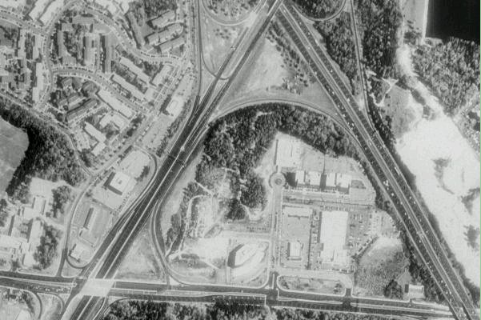

Grid (e.g., visible brightness)

Copyright 2003 Global Science &amp; Technology, Inc.

<!-- Four examples follow, one per slide: brightness, land cover, multi-spectral, and TIN. The point of the series is that "coverage" is not a synonym for "image" — it is any function from position to value. -->

---

# Coverages represent space-varying phenomena

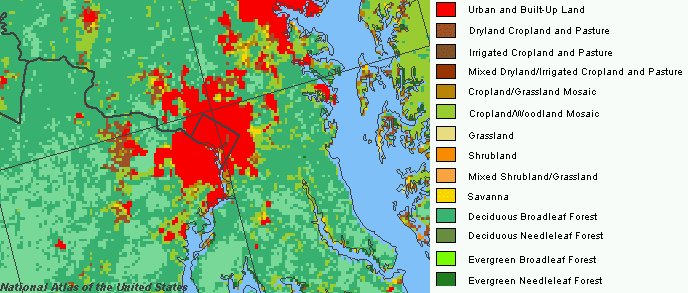

Grid (land use / land cover)

Copyright 2003 Global Science &amp; Technology, Inc.

<!-- Same structure as the brightness grid, but the values are categories rather than magnitudes. The coverage does not care which. -->

---

# Coverages represent space-varying phenomena

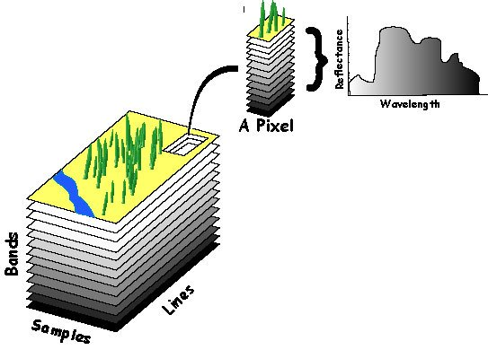

Grid (multi-spectral imagery)

Graphic copyright © UCSC Remote Sensing Group. Used by permission. http://www.es.ucsc.edu/~hyperwww/chevron

<!-- Here the value at each position is a vector, not a scalar — a whole reflectance spectrum per pixel. This is what "range components: vector- or scalar-valued" meant on the WCS slide. -->

---

# Coverages represent space-varying phenomena

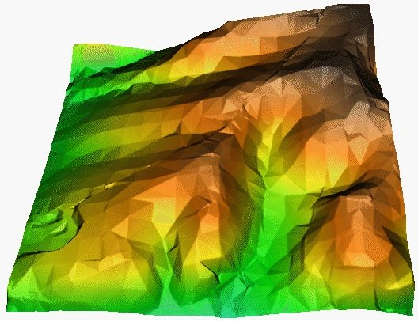

Triangulated irregular network (TIN)

Copyright 2003 Global Science &amp; Technology, Inc.

<!-- And here the geometry is irregular. Still a coverage: every position inside the triangulation has a value. -->

---

# Coverage encodings

**OGC specifications**
- GeoJPG
- GML
- GML in JPEG2000 (GMLJP2)
- SWE Common
- Network Common Data Form (NetCDF)

**Other specifications**
- GeoTIFF
- National Imagery Transfer Format / BIIF
- HDF and HDF-EOS

<!-- TODO(graphic): text-only slide — needs a figure. -->

<!-- The service and the encoding are separate choices: WCS is how you ask, these are what comes back. The source slide wrote "Network Common Data Format"; NetCDF is Network Common Data *Form*, as source slide 63 has it, and it is corrected here. -->

---

# WCS operations

| Operation | Returns |
|---|---|
| **GetCapabilities** | What service extensions? What coverages? |
| **DescribeCoverage** | Coverage metadata |
| **GetCoverage** | Coverage, or subset thereof |

<!-- TODO(graphic): text-only slide — needs a figure. -->

<!-- Three operations, and they line up one-for-one with WFS: capabilities, schema, data. Once students see that all of these services are the same three questions, the acronym count stops mattering. -->

---

# Operational OWS implementations for imagery

- **ESA Heterogeneous Missions Accessibility (HMA)**
  - WCS Application Profile for Earth Observation
- **Spot Image** — WMS, WCS
  - WCS for the International Charter on Space and Major Disasters
  - Catalogue and multisatellite in data portal projects
- **GeoEye Geofuse** — KML, WMS, WFS and WCS
  - Imagery holdings with less than 20% cloud cover
- **Intermap NEXTMap** — WMS, WCS
  - 1-meter vertically accurate digital elevation models and geometric images

<!-- TODO(graphic): text-only slide — needs a figure. -->

<!-- TODO(instructor): a January 2011 list of operational deployments. Several of these organizations have since
     been acquired or renamed; the list was deliberately not updated. -->

---

<!-- _class: lead -->

# Web Processing Service

<!-- Not data this time — analysis, delivered as a service. -->

---

# Geo-processing

- Hundreds of types of algorithms for geodata
- How can we scale to interoperable geo-processing?
- **OGC Web Processing Service (WPS)**
  - Interface that facilitates the publishing of geospatial processes, and the discovery of and binding to those processes by clients
  - Processes include any algorithm, calculation or model that operates on spatially referenced data
  - WPS may offer calculations as simple as subtracting one set of spatially referenced numbers from another, or as complicated as a global climate change model

<!-- TODO(graphic): text-only slide — needs a figure. -->

<!-- Note the publish / find / bind language returning: WPS applies the same architecture to a verb instead of a noun. This is the ancestor of what students now meet as ArcGIS geoprocessing services. -->

---

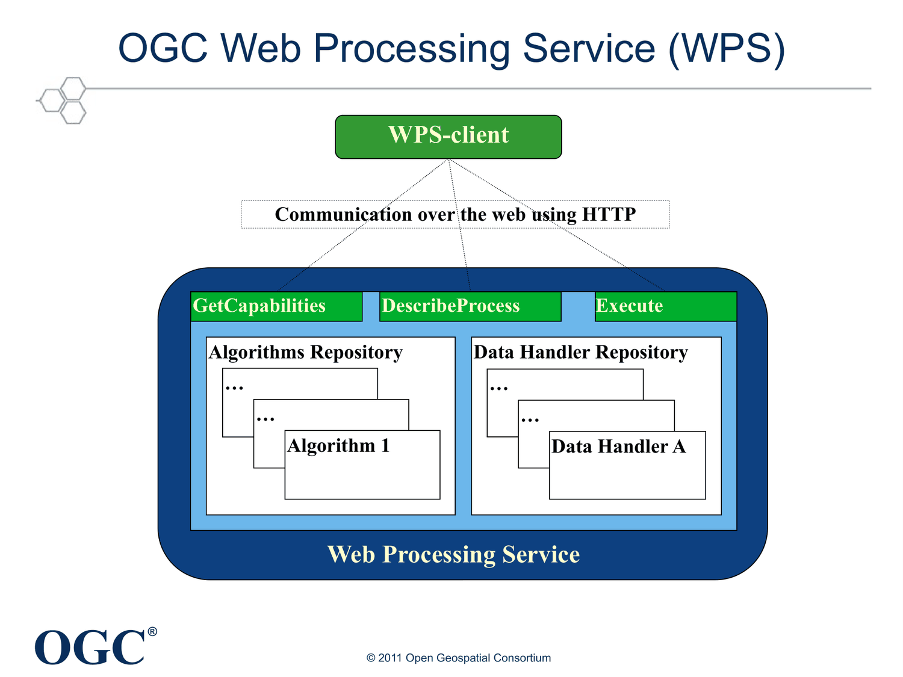

<!-- Source slide 55: OGC Web Processing Service architecture. A WPS client communicates over the web using
     HTTP with a Web Processing Service exposing three operations — GetCapabilities, DescribeProcess, Execute
     — backed by an algorithms repository and a data handler repository. Same three-question shape as WFS and
     WCS: what have you got, what does it need, run it. -->

---

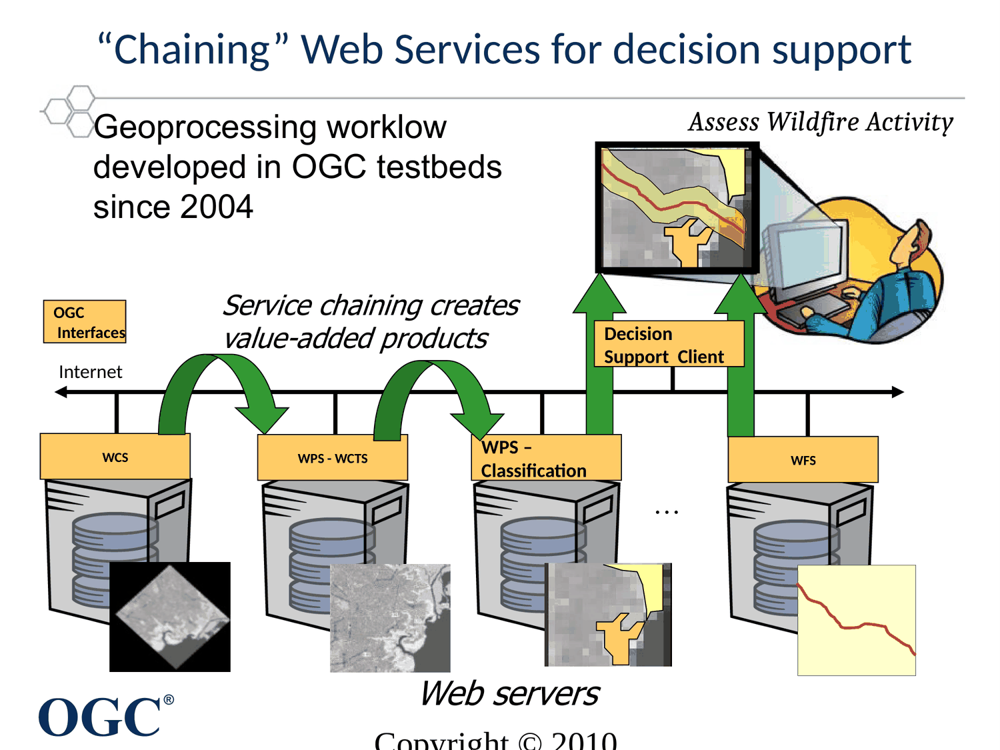

<!-- Source slide 56: chaining web services for decision support — assessing wildfire activity. A WCS supplies
     imagery, a WPS performs coordinate transformation (WCTS), a second WPS performs classification, and a WFS
     supplies vector context; the products flow left to right over the internet through OGC interfaces into a
     decision support client. Geoprocessing workflow developed in OGC testbeds since 2004.
     Source speaker note: "How do we reliably and repeatedly combine results from several distributed services
     on the web to produce a result for a user? Service chaining is the term commonly used for the process of
     organizing disparate web based services into an orderly process. For instance, a raw image is sent to a
     service that performs a coordinate transformation. This service sends the transformed image to a
     classifier service that processes the image to highlight areas of active fire. The result of this service
     is sent to a user's client along with other geospatial data such as vegetation overlays, transportation."
     The source slide spells "workflow" as "worklow"; corrected in this conversion. -->

---

<!-- _class: lead -->

# Sensor Web Enablement

<!-- Data that has not been collected yet. -->

---

# OGC Sensor Web Enablement (SWE)

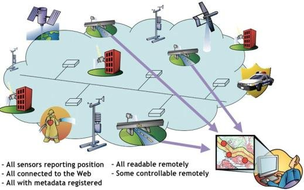

Discovery and tasking of sensors. Access, fusion and application of sensor observations for enhanced situational awareness.

- Sensor Model Language (SensorML)
- Observations & Measurements (O&M)
- Sensor Planning Service (SPS)
- Sensor Observation Service (SOS)
- Catalogue Service
- Sensor Alert Service (SAS)
- Web Notification Service (WNS)

<!-- Source speaker note, condensed: quickly discover sensors (secure or public) that meet a need and learn what they can do — location, observables, quality, ability to task; obtain sensor information in a standard encoding understandable by user and software; readily access observations in a common manner; task sensors where possible; request and receive alerts when a sensor measures a particular phenomenon or completes a task. SensorML models the observation process — sensor components, georegistration, response models, post-measurement processing. O&M models the observations themselves. TransducerML adds system integration and real-time streaming clusters of observations. -->

---

# Basic requirements for a sensor web

- Quickly **discover** sensors and sensor data (secure or public) that can meet my needs — location, observables, quality, ability to task
- **Obtain sensor information** in a standard encoding that is understandable by me and my software
- Readily **access sensor observations** in a common manner, and in a form specific to my needs
- **Task sensors**, when possible, to meet my specific needs
- Subscribe to and **receive alerts** when a sensor measures a particular phenomenon

<!-- TODO(graphic): text-only slide — needs a figure. -->

<!-- Five verbs: discover, obtain, access, task, subscribe. The next slide gives each one a service. -->

---

# Sensor Web Enablement technologies

**Information models and schema**
- Sensor Model Language (SensorML)
- Observations and Measurements (O&M)
- SweCommon

**Web services**
- Sensor Observation Service (SOS)
- Sensor Alert Service (SAS)
- Sensor Planning Service (SPS)

<!-- TODO(graphic): text-only slide — needs a figure. -->

<!-- Encodings on the left, services on the right — the same division this deck has been making since GML. -->

---

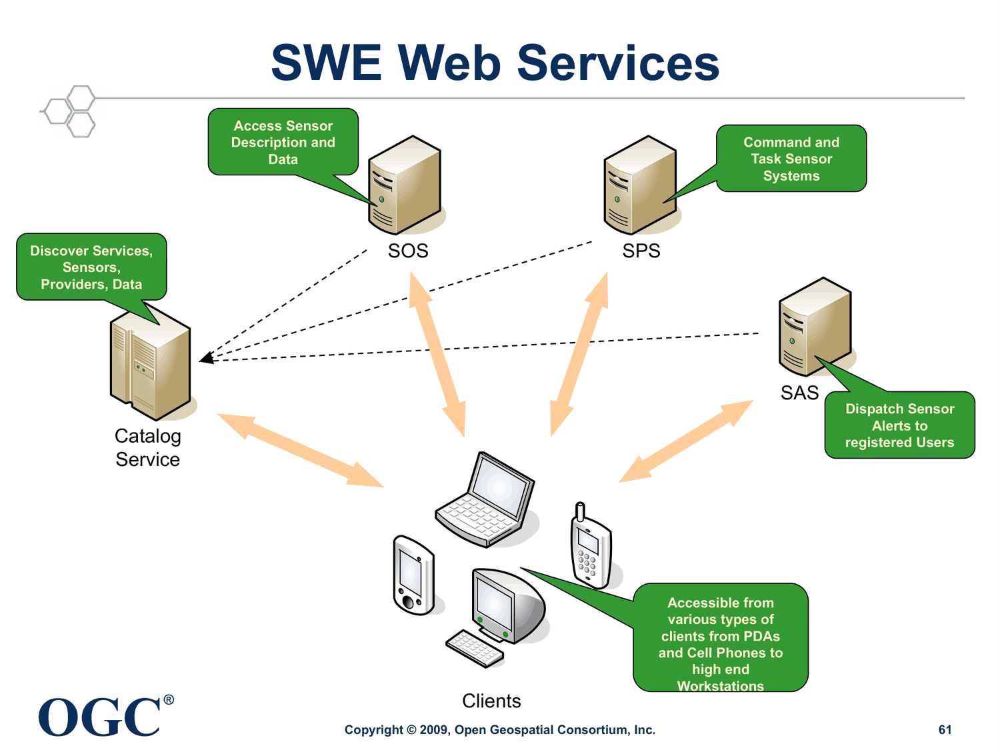

<!-- Source slide 61: SWE web services. A catalog service lets clients discover services, sensors, providers
     and data; SOS gives access to sensor description and data; SPS commands and tasks sensor systems; SAS
     dispatches sensor alerts to registered users. Accessible from various client types, from PDAs and cell
     phones to high-end workstations. Steps: services register in one or more catalogs; the client discovers
     services, providers, sensors and datasets through the catalog; the client then accesses data from SOS,
     controls sensors through SPS, and receives alerts from SAS. -->

---

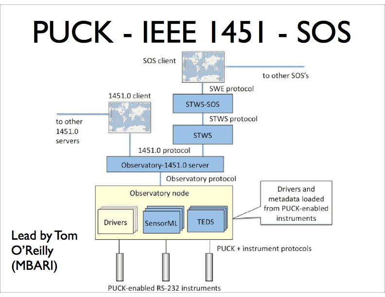

<!-- Source slide 62: IEEE 1451 — Smart Transducer Interface Standard, and PUCK — plug-and-work standard for
     ocean systems (a candidate OGC standard at the time). The stack runs from PUCK-enabled RS-232
     instruments through an observatory node holding drivers, SensorML and TEDS, up through a 1451.0 server
     and STWS to an SOS client speaking the SWE protocol. Lead by Tom O'Reilly (MBARI). This is the bottom of
     the sensor web: how an instrument on the sea floor announces what it is. -->

---

# NetCDF

Network Common Data Form (NetCDF) Core Encoding Standard defines an encoding for geospatial data, specifically digital geospatial information representing space and time-varying phenomena.

NetCDF is a data model for array-oriented scientific data.

The CF-netCDF Core and Extensions Primer provides an overview of the OGC CF-netCDF standards suite by describing the CF-netCDF core and extensions.

<!-- TODO(graphic): text-only slide — needs a figure. -->

<!-- NetCDF is where the hydrology and atmospheric science students will actually meet OGC standards: nearly every climate and weather dataset they download is CF-netCDF. -->

---

# Current status of SWE standards

- SensorML — 1.0.1 approved in 2007 (V2.0 anticipated by September 2011)
- SWE Common Data — V2.0 approved
- SWE Common Services — V2.0 approved
- Observations & Measurement — V2.0 approved
- SOS — V2.0 in final stages
- SPS — V2.0 approved
- SAS — being folded into Pub Sub (based on OASIS WS-N)
- PUCK — V1.0 approved

Approved SWE standards can be downloaded:
- Specification documents: `http://www.opengeospatial.org/standards`
- Specification schema: `http://schemas.opengis.net/`
- `http://www.ogcnetwork.net/standardtracker`

<!-- TODO(instructor): this is a January 2011 status snapshot — "V2.0 anticipated by September 2011" and "in
     final stages" are fifteen years stale. Left as written per the conversion brief; this slide is the
     clearest single argument for replacing the deck. -->

---

<!-- _class: lead -->

# Geosynchronization

<!-- What happens when the client wants to write back. -->

---

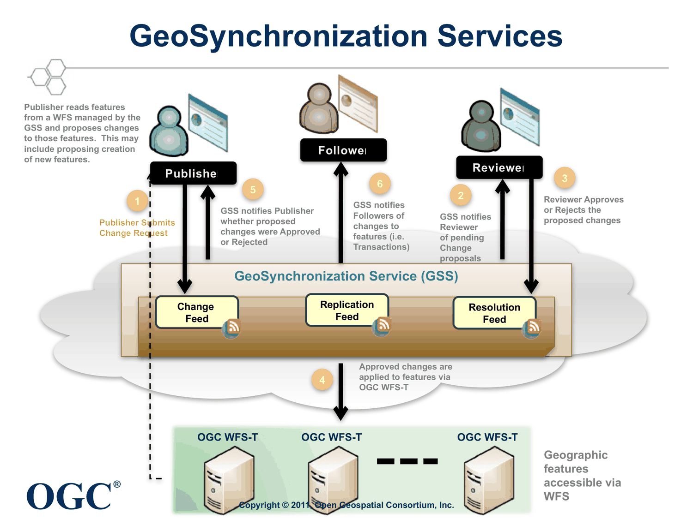

<!-- Source slide 66: GeoSynchronization Services (GSS), three roles and six numbered steps. (1) A Publisher
     reads features from a WFS managed by the GSS and proposes changes to those features, which may include
     proposing creation of new features. (2) The Publisher submits the change request; the proposals enter the
     Change Feed. (3) The GSS notifies a Reviewer, perhaps in a separate location, of pending change
     proposals. (4) The Reviewer approves or rejects; approved changes are applied to features via OGC WFS-T.
     (5) The Resolution Feed notifies the Publisher whether the proposed changes were approved or rejected.
     (6) The Replication Feed notifies Followers of changes to features. Geographic features throughout are
     accessible via WFS. -->

---

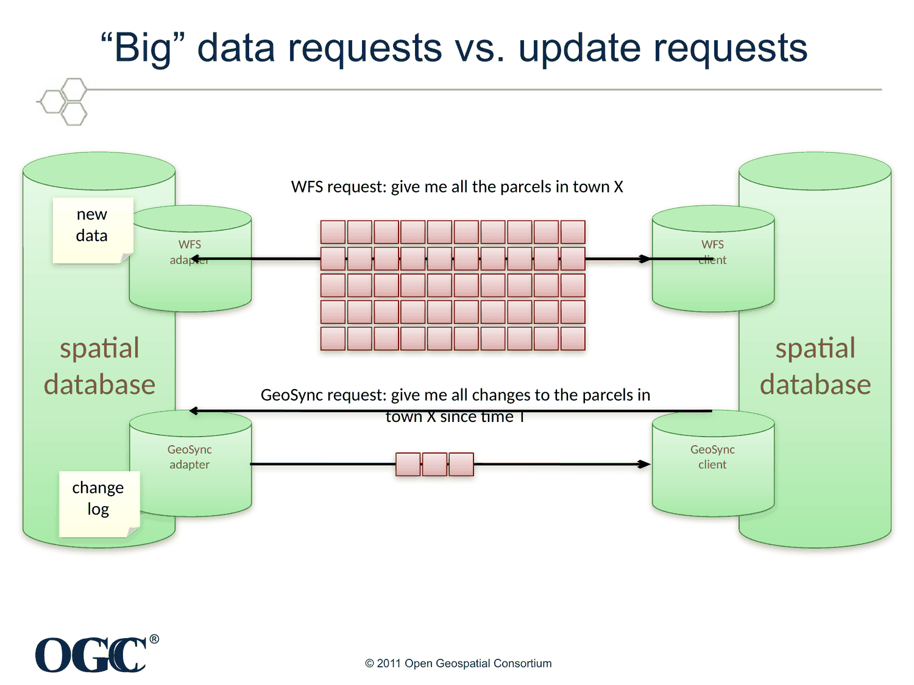

<!-- Source slide 67: "Big" data requests vs. update requests. A WFS client asks a WFS adapter over a spatial
     database: "give me all the parcels in town X" — and gets the whole grid back. A GeoSync client asks a
     GeoSync adapter over the same database: "give me all changes to the parcels in town X since time T" — and
     gets only the change log. The difference between re-downloading a dataset and subscribing to it. -->

---

<!-- _class: lead -->

# GeoSMS

<!-- Location on the lowest-bandwidth channel there is. -->

---

# Location-enabling SMS messaging: GeoSMS

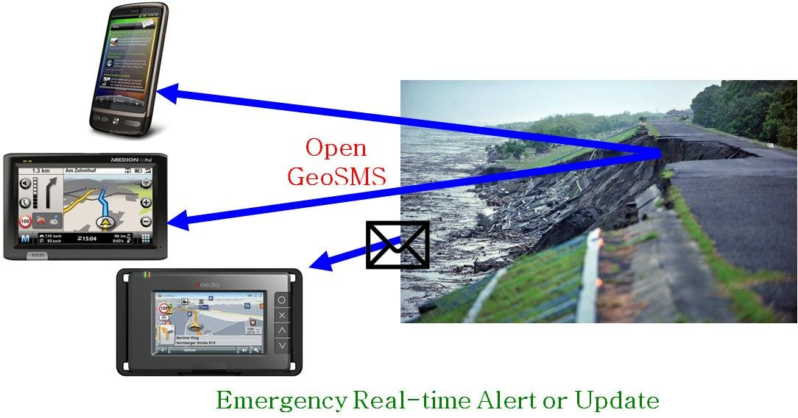

Significant potential for many applications

**Characteristics**
- Multilingual
- Multi-device
- Harmonized with many existing applications
- Incorporates relevant ISO standards
- OGC adoption expected in 2011

<!-- Source speaker note: "Open GeoSMS is an open-coordinate short message service (SMS) standard to allow transmission of map information and communications among different platforms of digital maps. The goal is to share location information across operating systems and applications." The figure shows an emergency real-time alert or update pushed to a phone, a car navigation unit and a handheld. -->

---

# OGC Open GeoSMS

- Defines a short messaging service (SMS) encoding to exchange lightweight location information between different mobile devices or applications
- Open GeoSMS encoding for location is compatible with other OGC standards, such as those for sensor webs and earth imaging
- It is also compatible with standards such as the OASIS Common Alerting Protocol (CAP) standard and the IETF RFC Presence Information Data Format Location Object (PIDF-LO)

<!-- TODO(graphic): text-only slide — needs a figure. -->

<!-- Source speaker note: a candidate OGC standard at the time. The argument was reach — more than 6.1 trillion SMS messages were sent in 2010, and SMS works indoors where GPS does not. Open GeoSMS was brought into OGC by ITRI of Taiwan, where it was already widely used. -->

---

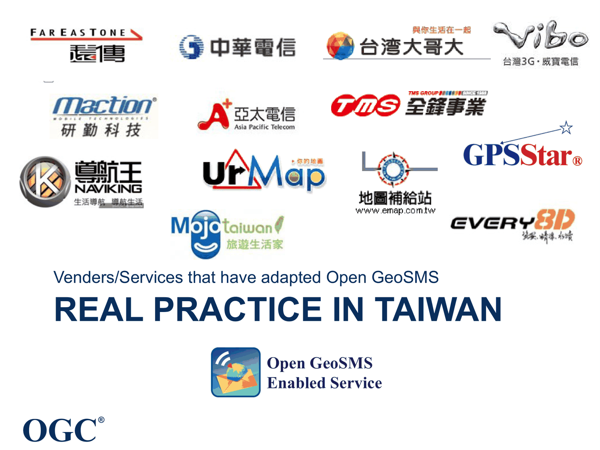

<!-- Source slide 71: "Real practice in Taiwan" — the carriers, handset makers and navigation vendors that had
     adopted Open GeoSMS as an enabled service. Kept because it is the evidence for the previous slide's
     claim: the standard was in production use before OGC adopted it. -->

---

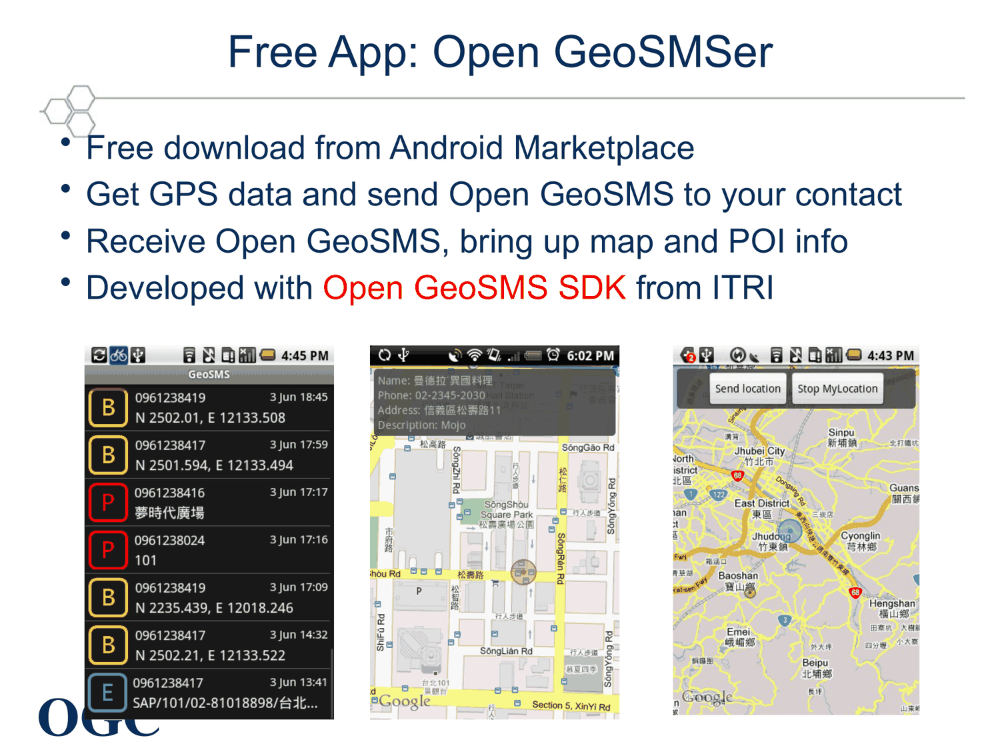

<!-- Source slide 72: Open GeoSMSer, a free app from the Android Marketplace. Get GPS data and send an Open
     GeoSMS to a contact; receive an Open GeoSMS and bring up the map and POI info. Developed with the Open
     GeoSMS SDK from ITRI. The three screenshots show the message list with coordinates, a received location
     on a map with a POI card, and the send-location control. 2011 app; not expected to still exist. -->

---

<!-- _class: lead -->

# Security

<!-- Who is allowed to ask? -->

---

# OGC and security

- The OGC does **not** develop authentication, authorization and security standards
- We define best practices and extensions to existing standards from other standards organizations, such as OASIS
  - **XACML** (OASIS): access control policy language in XML and a processing model to interpret the policies
  - **GeoXACML** (OGC): geographic access control rules for distributed geographic content

<!-- TODO(graphic): text-only slide — needs a figure. -->

<!-- This is the same "does not exist in isolation" argument as slide 6, made concrete. OGC extends OASIS's XACML with geometry rather than inventing a competing access-control language. XACML = eXtensible Access Control Markup Language. -->

---

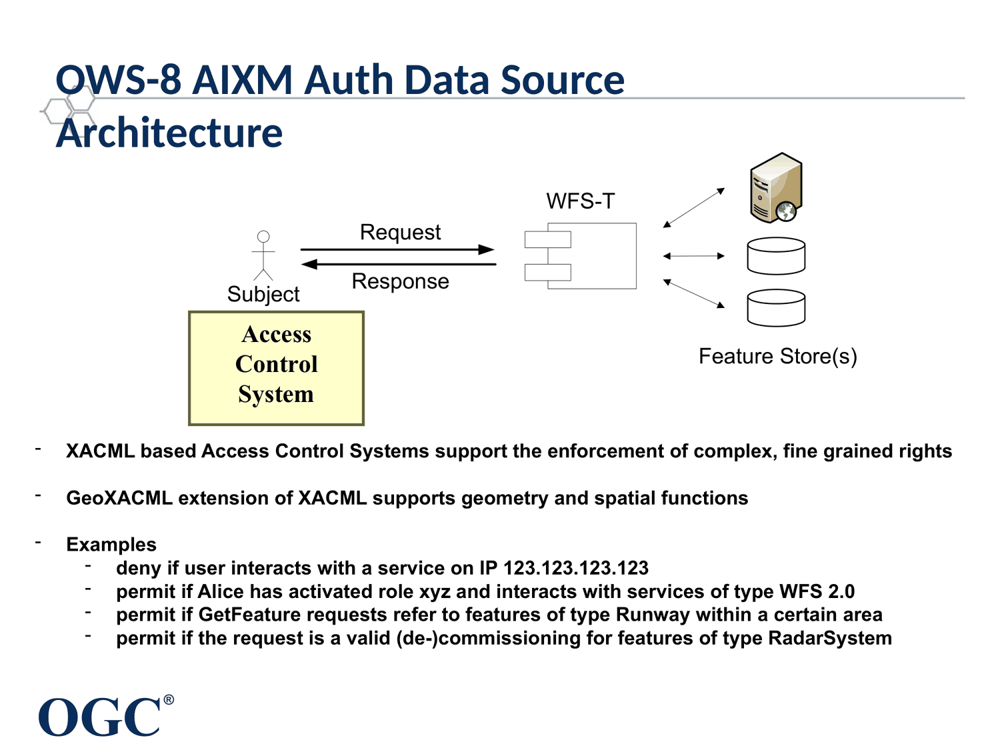

<!-- Source slide 75: OWS-8 AIXM authoritative data source architecture. A subject issues a request through an
     Access Control System to a WFS-T sitting over several feature stores. XACML-based access control systems
     support the enforcement of complex, fine-grained rights; the GeoXACML extension of XACML supports
     geometry and spatial functions. Examples from the slide: deny if the user interacts with a service on IP
     123.123.123.123; permit if Alice has activated role xyz and interacts with services of type WFS 2.0;
     permit if GetFeature requests refer to features of type Runway within a certain area; permit if the
     request is a valid (de-)commissioning for features of type RadarSystem. The third example is the one
     worth pausing on — the permission itself is a polygon. -->

---

# Geospatial Digital Rights Management

OGC members are leveraging broader standards-based Digital Rights Management (DRM) approaches with OGC standards:

- **Authentication**
- **Licensing**

- **Pricing**
- **Copyright**

GeoDRM Reference Model: `http://portal.opengeospatial.org/files/?artifact_id=14085`

<!-- TODO(graphic): the source slide drew these four terms in cloud shapes whose text overflowed the shapes
     ("Authenticati / on", "Pricin / g", "Licensin / g", "Copyrig / ht"). The broken graphic was replaced with
     the plain list above rather than reproduced. -->

<!-- Source speaker note, condensed: as geodata and services become widely available over ubiquitous networks, data becomes easier to distribute, share, copy and alter. Producers want to specify, manage, control and track distribution within secure, open and trusted environments, which needs both operating agreements and interoperable technologies. Direct monetary reward is often secondary to control of intellectual property assets; the note cites Harlan Onsrud of the GeoData Alliance arguing that library systems are the better model, balancing public access and equity against the rights of authors and publishers. -->

---

<!-- _class: lead -->

# How do you make sense of all of this?

<!-- The deck's own answer to the acronym problem. -->

---

# Understanding OGC standards — the ORM*

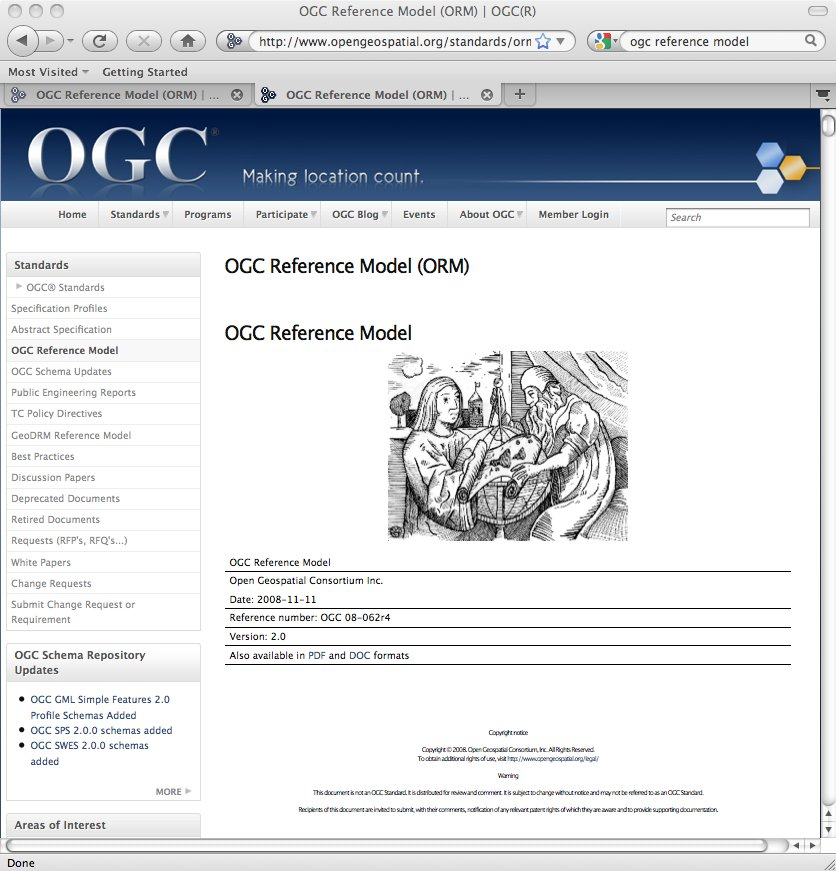

**OGC Reference Model** — `www.opengeospatial.org/standards/orm`

What is the purpose of the ORM?

- Overview of OGC Standards Baseline
- Insight into the current state of the work of the OGC
- Basis for coordination and understanding of the OGC documents
- Resource for defining architectures for specific applications

* Do not confuse with the ORM in Walter Moers's <em>The City of Dreaming Books</em>.

<!-- The ORM is the one document to hand someone who asks "where do I start with OGC?" — it is the map of the standards baseline rather than any single standard. -->

---

# Interoperability Program — emphasis on testing and validation

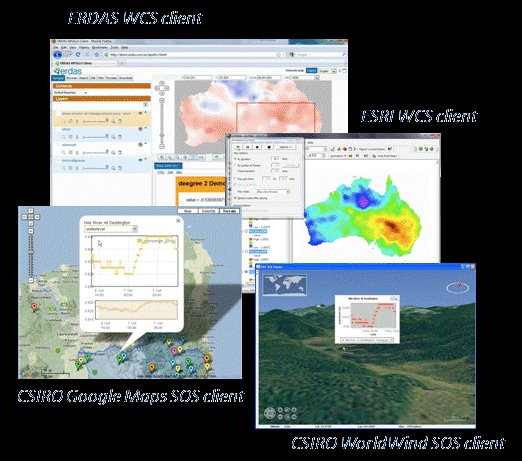

- OGC testbeds, pilots, experiments and plugfests
- Join technology providers and users
- Driven by user community scenarios
- Produce:
  - Tested and validated draft standards
  - Architectural recommendations
  - Industry technology implementations
  - Live demonstrations to validate utility of standards in user context

Climate Challenge Integration Plugfest, 2009 — CCIP experimented with ways to share the world's meteorological and weather forecast data through open standards for geospatial information sharing.

<!-- The source title ran two lines together as "Interoperability ProgramEmphasis On Testing and Validation"; split here. This is how a draft standard earns approval: several vendors implement it against each other in a testbed before it becomes a standard, which is why OGC standards tend to actually interoperate. -->

---

# OGC Interoperability Program

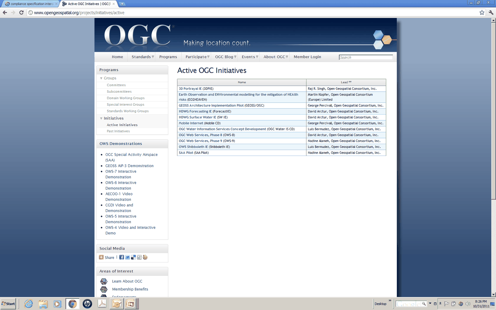

Active OGC initiatives at the time of the source deck included 3D Portrayal (3DPIE), EO2HEAVEN, the GEOSS Architecture Implementation Pilot, hydrology domain working group forecasting and surface-water interoperability experiments, Mobile Internet, OGC Water Information Services Concept Development, OGC Web Services Phases 8 and 9, OWS Shibboleth IE, and the SAA Pilot.

Past initiatives:
<code>http://www.opengeospatial.org/projects/initiatives/past</code>

<!-- TODO(instructor): names of the individual initiative leads were on the source slide and are not reproduced
     here, per the no-contact-details rule for this conversion. -->

---

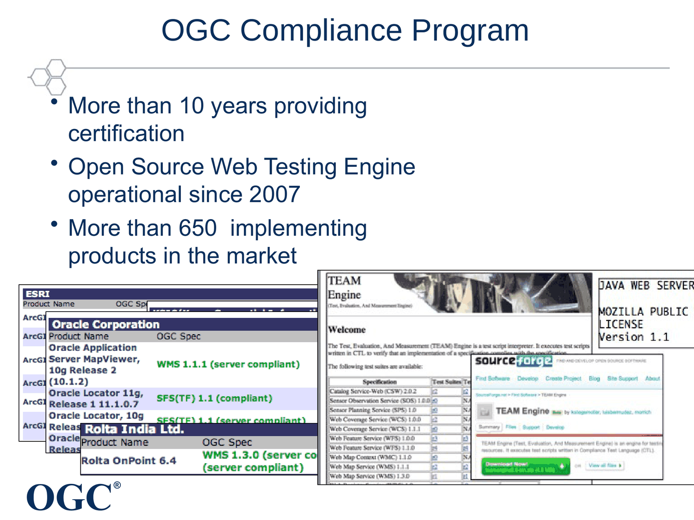

<!-- Source slide 81: the OGC Compliance Program. More than 10 years providing certification; open source web
     testing engine operational since 2007; more than 650 implementing products in the market. The screenshots
     show the implementing-products database (ESRI, Oracle, Rolta and others, with the specification and
     compliance status of each), the TEAM Engine test harness on SourceForge, and its license page.
     Source speaker note adds that about one third of the 650 registered products had actually followed the
     certification procedure and were compliant. -->

<!-- TODO(instructor): the products table in this screenshot lists ArcGIS Server 9.2-era and ArcIMS products.
     It is a 2011 historical artifact, not current ArcGIS Pro guidance, and was left as-is. -->

---

# OGC public resources

- Adopted standards — `http://www.opengeospatial.org/standards`
- OGC Reference Model — `http://www.opengeospatial.org/standards/orm`
- OGC demonstrations — `http://www.opengeospatial.org/resource/demos`
- Compliance testing and certification — `http://www.opengeospatial.org/compliance`
- List of registered products using OGC standards — `http://www.opengeospatial.org/resource`
- OGC Network, the member-contributed OGC "encyclopedia" — `http://www.ogcnetwork.net`
- OGC User, case studies of OGC implementations in the global community — `http://www.opengeospatial.org`, click on "Press Room"

<!-- TODO(instructor): every URL on this slide is a January 2011 path. They are shown as plain text rather than
     as links because most have moved (OGC's site is now ogc.org) and none were re-verified for this
     conversion — do not present them as live without checking. -->

<!-- TODO(graphic): text-only slide — needs a figure. -->

---

# Before Next Class

- **Lab 7 — Big Southern Butte**: [assignments/lab-07](https://byu-hydroinformatics.github.io/ce414-gis-applications/assignments/lab-07/)
- Read the assigned chapter <!-- TODO(instructor): reading chapter -->
- Take the open-book quiz on Learning Suite
- Questions? Office hours: [calendly.com/dan-ames/office-hours](https://calendly.com/dan-ames/office-hours)

<!-- VERIFY: schedule reconstructed — the pairing of this deck with Lab 7 (Big Southern Butte) was assigned
     during conversion and has not been checked against the semester schedule. -->

<!-- TODO(graphic): text-only slide — needs a figure. -->

<!-- Fill in the reading and the quiz due date before class. -->

<!-- Conversion notes (2026-09-03):

SOURCE: "CE 414 Week 9 - Review - Overview_of_OGC_Web_Services.pptx" (Lectures/2026/) — 83 slides, 146
embedded images, no hidden slides. The file is an adapted January 2011 Open Geospatial Consortium conference
presentation (Luis Bermudez, Washington DC).

THE BIG ONE: the course plan calls for this deck to be RETIRED and replaced with a 12–18 slide modern lesson
covering WMS/WFS alongside OGC API Features / Tiles / Maps / Records, ArcGIS REST, JSON and OpenAPI, STAC,
COG, and a live service-inspection activity. That rebuild is an instructor decision and was explicitly out of
scope here. What follows is a faithful conversion of the 2011 material so that nothing is lost when the
rebuild happens.

DELIBERATELY NOT UPDATED: every version number, status list, membership count, product list and URL is as it
stood in January 2011. Nothing was "modernized" and no newer standard was added. The most conspicuously stale
slides are "Current status of SWE standards" (source slide 64), "Approved OGC® standards" (12), "GEOSS
Registry — 396 entries" (18), "Operational OWS implementations for imagery" (52), "Location-enabling SMS
messaging" (69, "OGC adoption expected in 2011"), and "OGC public resources" (82, whose links all predate the
move to ogc.org).

SLIDES DROPPED OR MERGED (2 of 83):
- Source slide 4 ("OGC At A Glance", second copy) — merged into the converted "OGC at a Glance" slide. Its
  text was character-for-character identical to slide 3; the two differed only in the pie chart, and both
  charts are shown on the merged slide.
- Source slide 83 ("The End", "OGC standards are there waiting for you!!" over a stock photograph) —
  conference closing slide, replaced by the Before Next Class slide.
Also dropped, without dropping a slide: the presenter's email address and the event date and location from
the face of source slide 1 (moved to a speaker note and an attribution line), the Google wordmark on source
slide 10, and the individual initiative-lead names on source slide 80.

MISSING EMBEDDED OBJECTS: the two pie charts on source slides 3 and 4 are PowerPoint chart objects linked to
an external workbook named "Book1" that did not travel with the file (ppt/charts/_rels/chart{1,2}.xml.rels
point at Target="Book1" TargetMode="External"). They still render from cached values, so the figures in this
deck are page renders of those cached charts — but the numbers cannot be edited or refreshed until the
workbook is found or the charts are rebuilt. Flagged on the slide as TODO(graphic).

TYPOS AND OBJECTIVE ERRORS FIXED (nothing else was rewritten):
- "GEOOS Registry" → "GEOSS Registry" (source 18; the screenshot and the URL both say GEOSS)
- "Geoprocessing worklow" → "workflow" (source 56)
- "Geoeye Geofuse" → "GeoEye Geofuse" (source 52)
- "Provides, rules, guidelines or characteristics" → "Provides rules, guidelines, or characteristics" (8)
- "SDO's" → "SDOs" (3/4)
- "Network Common Data Format (NetCDF)" → "Network Common Data Form" (50), matching source slide 63
- "On-fly pan-sharpening" → "On-the-fly pan-sharpening" (25)
- Titles unrun: "OGC Specificationshttp://..." → title + URL (11); "Interoperability ProgramEmphasis On
  Testing and Validation" → title with a dash (79); source slide 22's template banner text replaced with its
  real subject, "OGC Web Map Service"
- Left uncorrected on purpose: the "<Capabilitiess>" typo inside the W*S diagram (source 14) is part of a page
  render and was not repainted.

ARCGIS WORDING: this deck contains no ArcGIS instructions, so no ArcGIS 9 / ArcMap → ArcGIS Pro substitutions
were needed. The one ArcGIS appearance is inside the compliance-program screenshot (source 81), which lists
ArcGIS Server 9.2-era and ArcIMS products; it is a 2011 historical artifact and is flagged on the slide.

IMAGES: 50 files in images/, about 5.6 MB. Twenty-six slides are diagrams built from PowerPoint shapes
(architecture diagrams, request/response walkthroughs, logo walls); per the conversion guide those were not
rebuilt — the PDF page was rendered at 200 dpi and used whole as a `bg contain` figure, which is why those
slides carry the original 4:3 layout and no Marp heading, and why their content is written out in full in the
speaker notes. Twenty-one images were copied from the source media and three are crops of page renders (the
two pie charts and the WMTS tile pyramid). Renders were downscaled to 1500 px and palette-quantized; photos
were converted to JPEG. Of the 146 source images, 85 are tiny icons and logos, and those were skipped —
the logo-wall slides (6, 71) use one page render each instead of 20+ fragments.

SPEAKER NOTES: every source note was carried over. Two are worth knowing about — source slides 28 and 33 carry
notes partly in Spanish, left over from an earlier Spanish-language version of the presentation, and source
slides 40 and 41 (both KML) carry the GML note verbatim, which is clearly a paste error; that note is not
reproduced on the KML slides and the error is flagged there.

STILL OPEN — the full list of markers in this file: one TODO(instructor) at the top of the file (retire and
rebuild); TODO(graphic) for the missing Book1 workbook; TODO(instructor) on the 35-vs-33 standards-count
inconsistency between source slides 3 and 12; TODO(instructor) on the 2011 standards baseline, the stale
GEOSS Registry count, the 2011 imagery-deployment list, the 2011 SWE status list, the 2011 URL set, the
ArcGIS-9-era compliance screenshot, the dropped initiative-lead names, and the KML/GML note paste error;
TODO(graphic) on the GeoDRM cloud graphic whose text overflowed its shapes and was replaced with a plain
list; TODO(graphic) on sixteen text-only slides that want a figure (image generation was off for this pass);
TODO(instructor) for the reading chapter; and VERIFY on the Lab 7 pairing in Before Next Class.
-->
