<!-- _class: lead -->
<!-- _paginate: skip -->

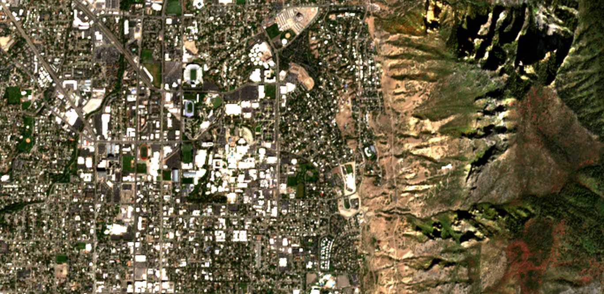


# OGC Web Services

## Data you ask for instead of download

CE 414 Engineering Applications of GIS
Civil & Construction Engineering
Brigham Young University
Dr. Dan Ames

<!-- Thursday of Week 9. This deck replaces the 2011 OGC conference deck (archived beside it as ogc-web-services-2011.md). Every request in it was run live on October 5, 2026, and the URL is in the speaker notes. The title image is one of those requests: a STAC search found a Sentinel-2 scene from September 20, 2026, and GDAL read only the BYU window out of a 349 MB cloud-optimized GeoTIFF on Amazon S3: 2.6 MB came over the network. Figures: tools/week09_web_services_figures.py (run with the ArcGIS Pro Python; it re-fetches everything and prints the numbers quoted here). -->

<!-- Slides marked OPTIONAL in their notes can be skipped if the activity runs long. The core path is: why services, what a standard is, the four classic answers, OGC API, ArcGIS REST, COG + STAC, ArcGIS Pro, the activity. -->

<!-- stamp:begin -->
<!-- _footer: '<span>CE 414 · Week 9 — OGC Web Services<span class="updated">Last Updated: 2026-10-05</span></span><span>© 2026 Daniel P. Ames · <a href="https://creativecommons.org/licenses/by/4.0/">CC BY 4.0</a></span>' -->
<!-- stamp:end -->

---

# Today's Goals

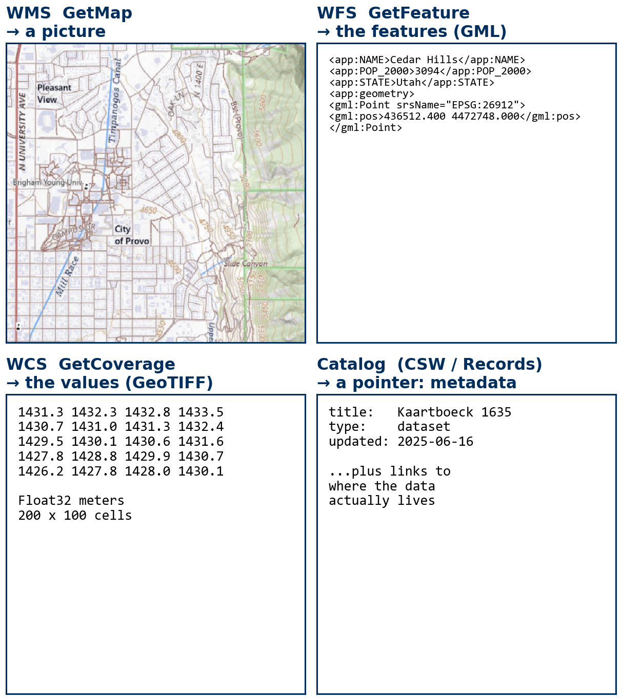

By the end of class you should be able to:

- Say what a web service hands you: **a picture, the features, the values, or a pointer**
- Explain why an OGC **standard is a document**, not a piece of software
- Read a service from its URL: **GetCapabilities**, **/collections**, **?f=pjson**
- Run a **/query** on an ArcGIS feature service and say what came back
- Explain why a **COG** listed in a **STAC** catalog never has to be downloaded whole

<!-- The four panels are four real answers from October 5, 2026, one per kind of service; the rest of the hour fills them in. -->

---

<!-- _class: lead -->

# Part 1 — Why Services

---

# You Have Already Used Web Services

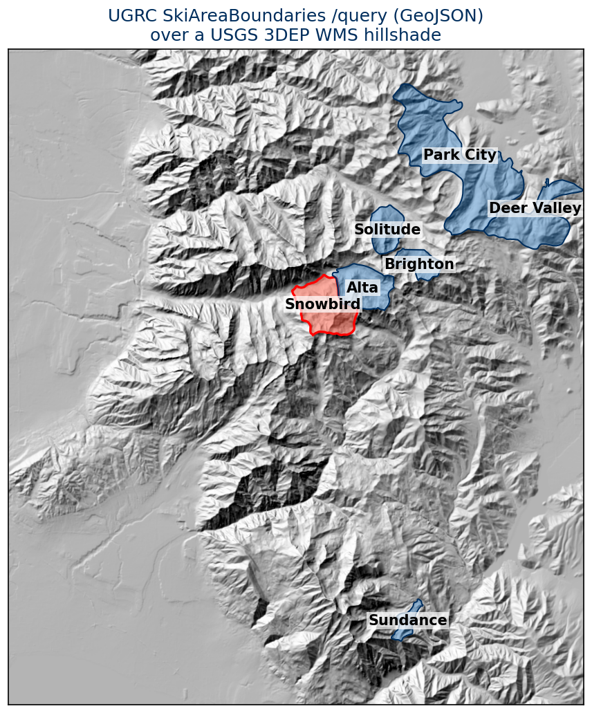

- **Lab 5** — UGRC's **Utah Streams NHD**: **541,604** stream lines, added by URL, never downloaded
- **Lab 8** — UGRC's **ski area boundaries**: **14** polygons, added by URL with **Add Data ▸ From Path**
- **Labs 4 and 8** — USGS **3DEP** elevation tiles, which you *did* download whole

Today: what was happening behind those URLs, and why the third one did not have to be a download either.

<!-- The map is one of today's requests: the UGRC ski-area feature service from Lab 8, queried as GeoJSON, drawn over a hillshade that a USGS WMS rendered on request. Two services, two standards, one map, nothing downloaded. (7 of the 14 resorts fall in this window.) -->
<!-- Counts measured October 5, 2026 with returnCountOnly queries: UtahStreamsNHD/FeatureServer/0/query?where=1=1&returnCountOnly=true&f=json returned {"count":541604}; the same query on SkiAreaBoundaries returned {"count":14}. Lab 8's DEM was cut from USGS_13_n41w112.tif (lab-08 migration notes); Lab 4 used four USGS_1_n4Xw11X.tif tiles. Both kinds of tile are cloud-optimized GeoTIFFs (checked by reading their headers: GDAL reports LAYOUT=COG), which is Part 5 of today. -->

---

# Download vs. Request

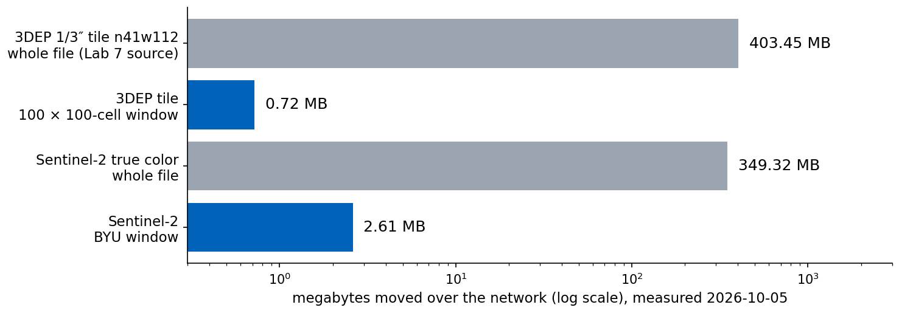

- A download moves **the whole file** before you can see any of it
- A service moves **what you asked for** — a window, a layer, the rows that match — and the data stays where its owner keeps it current

<!-- All four bars measured on October 5, 2026 by tools/week09_web_services_figures.py with GDAL's network statistics. 3DEP tile USGS_13_n41w112.tif: 403,454,436 bytes; reading a 100 x 100-cell window at BYU moved 720,896 bytes in 2 GET requests (0.18 %). Sentinel-2 true-color TCI.tif for September 20, 2026: 349,318,194 bytes; the BYU window moved 2,605,056 bytes. -->
<!-- The second bullet is the reason agencies publish services: UGRC updates the stream layer once, and every map that points at the URL is current. Ask: what is the downside? (The server can be down, slow, or changed under you; a downloaded copy is frozen but yours.) -->

---

# A Service Is a URL That Answers Questions

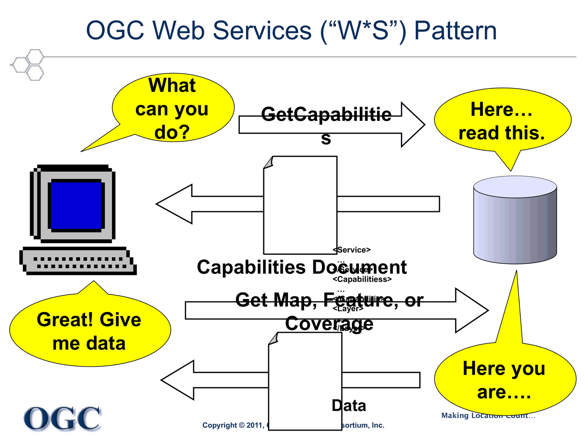

```text
https://basemap.nationalmap.gov/arcgis/services/USGSTopo/MapServer/WMSServer
  ?SERVICE=WMS
  &VERSION=1.3.0
  &REQUEST=GetMap
  &LAYERS=0
  &CRS=CRS:84
  &BBOX=-111.68,40.235,-111.60,40.2655
  &WIDTH=1000&HEIGHT=500
  &FORMAT=image/png
```

- **Base URL** = which server; after the **?** come **key=value** pairs = the question
- Every service starts with the same first question: **"what can you do?"**

<!-- This is a real request (run October 5, 2026); its answer is the topo map two slides from now. Read it as a sentence: "WMS server, version 1.3.0, draw me a map of layer 0, in longitude/latitude, of this box, 1000 by 500 pixels, as a PNG." The client chooses the coordinate system and the size; the server only draws. The diagram (from the 2011 OGC deck) is the pattern every OGC service follows: ask for the capabilities document, read it, then ask for data. -->

---

# What a Standard Is

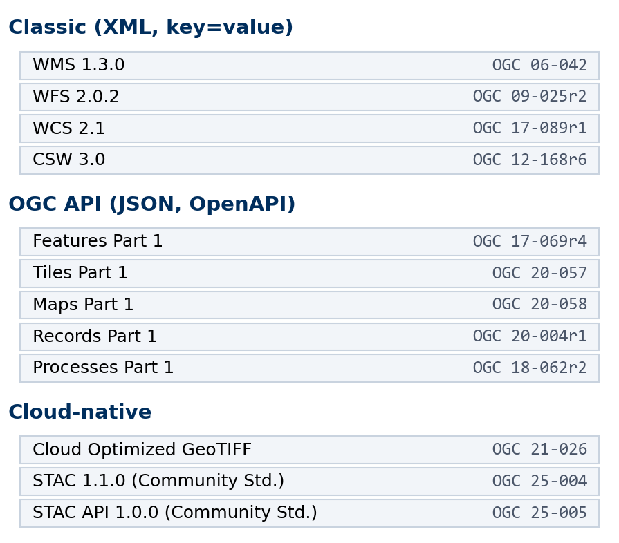

- An OGC standard is a **document**: a free, consensus specification of the requests and responses
- It is **not software**. Anyone can implement it — open source or proprietary — and the two interoperate
- Today's servers: **ArcGIS Server** (USGS, UGRC), **deegree** and **pygeoapi** (open source), **STAC API** on Amazon S3 data

<!-- The document numbers on the right are from the Open Geospatial Consortium's standards pages, checked October 5, 2026 (ogc.org/standards/wms, /wfs, /wcs, /cat, /ogcapi-features, /ogcapi-tiles, /ogcapi-maps, /ogcapi-records, /ogcapi-processes, /stac, /ogc-cloud-optimized-geotiff). STAC is an OGC Community Standard (adopted from an outside community), the others are OGC Implementation Standards. -->
<!-- This is the first quiz item: closed-source software can be fully compliant, because compliance is about following the document. The ArcGIS Server that runs USGSTopo answers WMS requests, and the open-source deegree server we will query next answers WFS requests the same way. -->

---

<!-- _class: lead -->

# Part 2 — The Classic OGC Services

## WMS · WFS · WCS · CSW

---

# Four Services, Four Different Answers

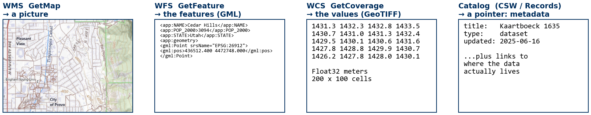

| | **WMS** | **WFS** | **WCS** | **CSW** |
|---|---|---|---|---|
| Ask with | GetMap | GetFeature | GetCoverage | GetRecords |
| You get | a **picture** | the **features** | the **values** | a **pointer** |

<!-- All four panels are real responses from October 5, 2026: WMS = USGSTopo GetMap of BYU; WFS = the deegree Utah demo WFS 2.0 GetFeature for Cedar Hills (GML, UTM zone 12 coordinates); WCS = the USGS 3DEPElevation WCS GetCoverage for the same box (Float32 meters, the 5 x 5 cells around the center); catalog = a metadata record ("Kaartboeck 1635", a Dutch historical dataset) from the pygeoapi demo's OGC API - Records collection, which plays the role CSW plays in the classic family. -->
<!-- The whole lesson is this table. Every later slide is one column of it. -->

---

# Ask First: GetCapabilities

```xml
<WMS_Capabilities version="1.3.0" xmlns="http://www.opengis.net/wms" ...>
  <Service> <MaxWidth>4096</MaxWidth> <MaxHeight>4096</MaxHeight> </Service>
  <Capability>
    <Request>
      <GetMap>
        <Format>image/jpeg</Format> <Format>image/png</Format>
        <Format>image/tiff</Format> <Format>image/svg+xml</Format> ...
      </GetMap>
      <GetFeatureInfo> ... </GetFeatureInfo>
    </Request>
    <Layer> <Name>0</Name>
      <CRS>CRS:84</CRS> <CRS>EPSG:4326</CRS> <CRS>EPSG:3857</CRS> ...
```

- The capabilities document lists the **layers**, **coordinate systems**, **formats** and **size limits** — everything you need to write the GetMap

<!-- Trimmed from the real response, October 5, 2026: https://basemap.nationalmap.gov/arcgis/services/USGSTopo/MapServer/WMSServer?request=GetCapabilities&service=WMS (HTTP 200, text/xml, 6,410 bytes). Its one layer is named "0". This is the document ArcGIS Pro reads when you make a WMS server connection; it is how ArcGIS Pro knows what to list in the Catalog pane. -->

---

# WMS GetMap → a Picture

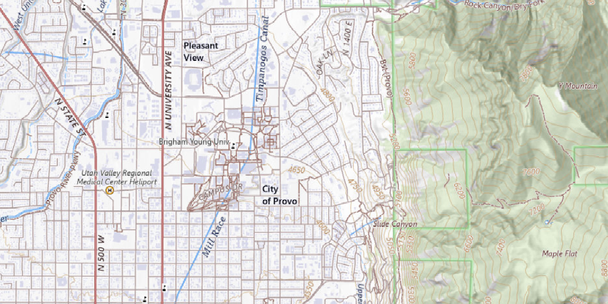

- The request from three slides back: **1000 × 500 pixels**, PNG, BYU and Y Mountain
- Every pixel is a **display color**. There is no stream, road or contour line *in* it to select

<!-- The unmodified response to https://basemap.nationalmap.gov/arcgis/services/USGSTopo/MapServer/WMSServer?SERVICE=WMS&VERSION=1.3.0&REQUEST=GetMap&LAYERS=0&STYLES=&CRS=CRS:84&BBOX=-111.68,40.235,-111.60,40.2655&WIDTH=1000&HEIGHT=500&FORMAT=image/png (October 5, 2026, HTTP 200, image/png). The latitude span is chosen so the image is not stretched at 40 degrees north. -->

---

# Pointing at a WMS Picture

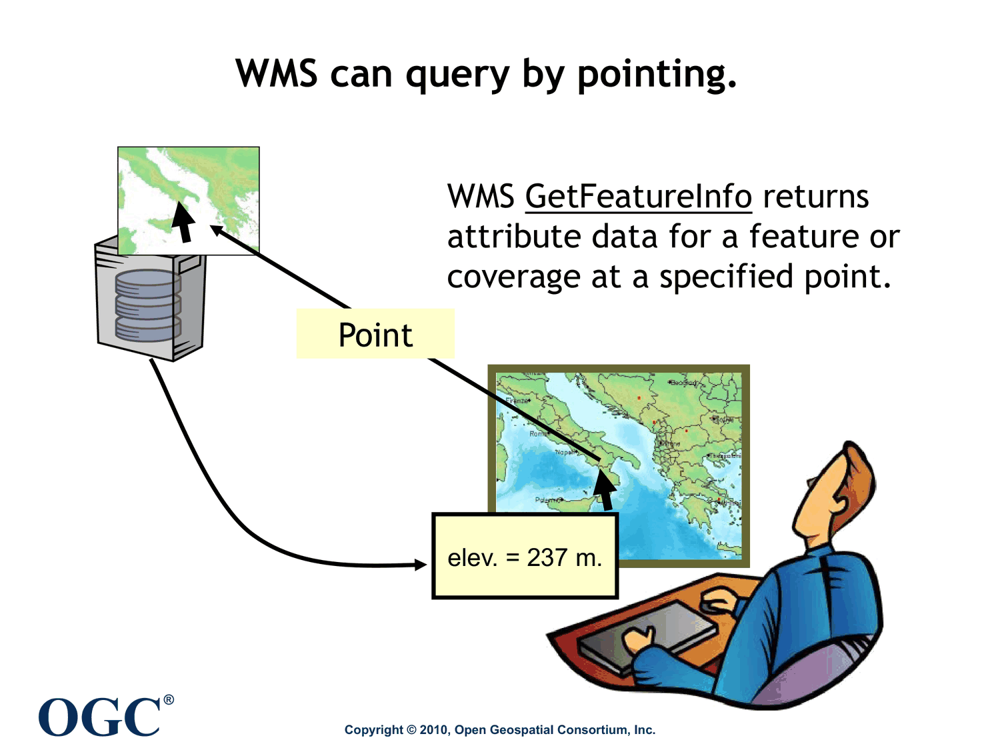

- **GetFeatureInfo** asks the server, "what is at this pixel?"
- What comes back is **whatever that server decides**. The USGS topo server, asked about the center of our map:

```text
@USGSTopoRGB.Red;RGB.Green;RGB.Blue;RGB.Alpha;247;247;247;255;
```

- A **color**, not an elevation — this map was drawn from cached tiles, and the colors are all it has

<!-- Real response, October 5, 2026: GetFeatureInfo with I=500, J=250 on the GetMap request above, INFO_FORMAT=text/plain. The diagram (from the 2011 OGC deck) shows the ideal case, where the server has the data behind the map and answers with an elevation of 237 m; the self-check quiz uses that example. -->
<!-- For the curious: the 3DEP elevation WMS answers GetFeatureInfo with the footprint record of the source tile (OBJECTID 137162, a 150 m overview), not the elevation either. The general lesson holds: a map service gives you a picture; for the numbers, ask a coverage service. -->

---

# WCS GetCoverage → the Values

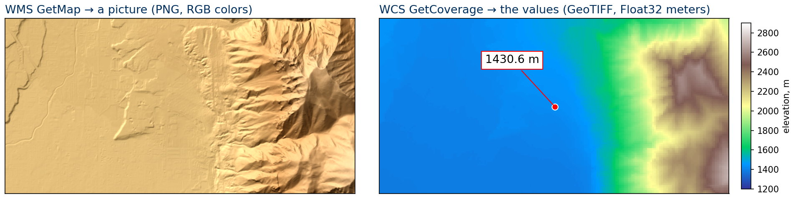

- Same USGS 3DEP data, same box. The **WMS** sends colors; the **WCS** sends a **GeoTIFF of Float32 meters**: 200 × 100 cells, **1,383 to 2,708 m**
- At the center: **1,430.6 m** — a number you can do map algebra on

<!-- Left: https://elevation.nationalmap.gov/arcgis/services/3DEPElevation/ImageServer/WMSServer?SERVICE=WMS&VERSION=1.3.0&REQUEST=GetMap&LAYERS=3DEPElevation:Hillshade Elevation Tinted&STYLES=&CRS=CRS:84&BBOX=-111.68,40.235,-111.60,40.2655&WIDTH=1000&HEIGHT=500&FORMAT=image/png. Right: https://elevation.nationalmap.gov/arcgis/services/3DEPElevation/ImageServer/WCSServer?SERVICE=WCS&VERSION=1.0.0&REQUEST=GetCoverage&COVERAGE=DEP3Elevation&CRS=EPSG:4326&BBOX=-111.68,40.235,-111.60,40.2655&WIDTH=200&HEIGHT=100&FORMAT=GeoTIFF. Both October 5, 2026, HTTP 200. The WCS GetCapabilities lists versions 2.0.1, 1.1.2, 1.1.1, 1.1.0 and 1.0.0; 1.0.0 is used because its GetCoverage is the easiest to read. -->
<!-- Cross-check: the ArcGIS REST identify on the same image service at -111.64, 40.25 returned 1429.99 m, and reading the 1/3 arc-second COG at the same point returned 1430.04 m. Three interfaces, one ground surface, agreement within a meter (they resample differently). -->

---

# Coverages Are Not Just Images

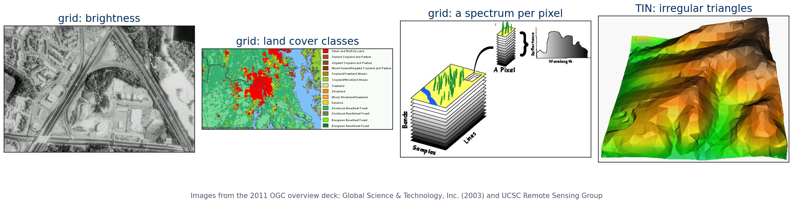

A **coverage** gives a value at every position in a space: brightness, land-cover classes, a whole spectrum per pixel, or a **TIN**. The geometry does not have to be square cells.

<!-- OPTIONAL. Four examples from the 2011 OGC deck (copyright 2003 Global Science & Technology, Inc., and the UCSC Remote Sensing Group; used there by permission): visible brightness, land use/land cover, multi-spectral imagery, and a TIN. The quiz asks whether a TIN counts: it does, because every position inside the triangulation has a value. -->

---

# WFS GetFeature → the Features

```xml
<wfs:FeatureCollection ... numberMatched="unknown" numberReturned="0">
  <wfs:member>
    <app:SGID93_LOCATION_UDOTMap_CityLocations gml:id="SGID93_LOCATION_UDOTMAP_CITYLOCATIONS_0">
      <app:NAME>Cedar Hills</app:NAME>
      <app:CO_SEAT>no</app:CO_SEAT>
      <app:POP_2000>3094</app:POP_2000>
      <app:STATE>Utah</app:STATE>
      <app:geometry>
        <gml:Point srsName="EPSG:26912">
          <gml:pos>436512.400 4472748.000</gml:pos>
        </gml:Point> ...
```

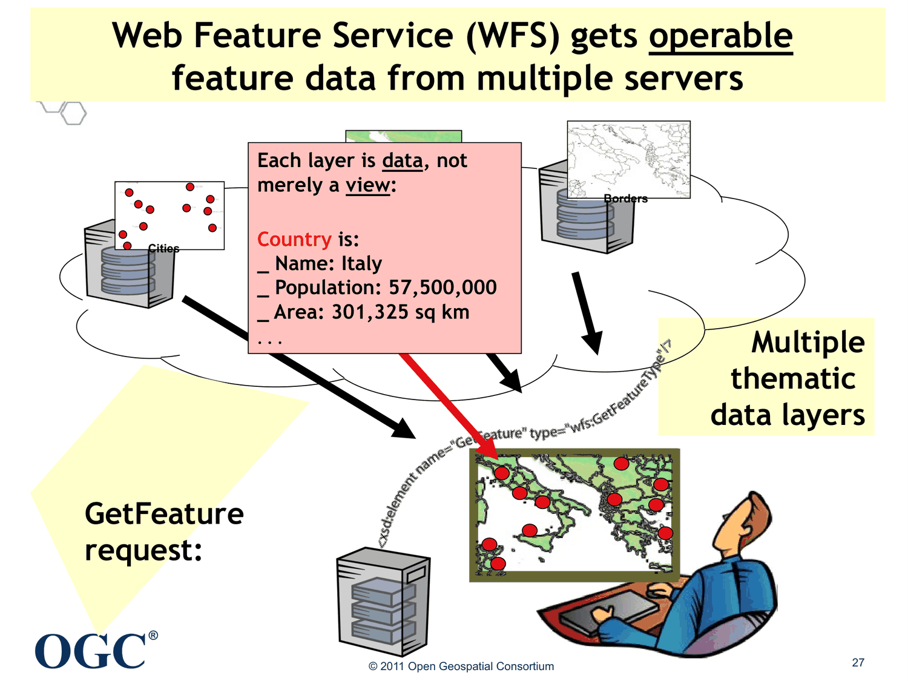

- **Geometry plus attributes**, in **GML** (XML) — you can query, select, re-symbolize
- Coordinates in the server's default CRS: here **UTM zone 12N** (EPSG:26912)

<!-- Trimmed from the real response, October 5, 2026: https://demo.deegree.org/utah-workspace/services/wfs?SERVICE=WFS&VERSION=2.0.0&REQUEST=GetFeature&TYPENAMES=app:SGID93_LOCATION_UDOTMap_CityLocations&COUNT=1 (HTTP 200). Lines dropped: POP_1999, POP_SYM_99, POP_SYM_00 and the gml:id of the point. The layer is an old copy of a Utah SGID layer (city locations from the UDOT map) on the open-source deegree demo server; a RESULTTYPE=hits request reports numberMatched="31". The numberReturned="0" quirk is the server's own, documented in a comment in its response (a WFS 2.0 schema issue). The diagram is from the 2011 OGC deck: a WFS client can pull features from several servers and hold them all as data. -->

---

# Catalogs: a Pointer, Not the Data

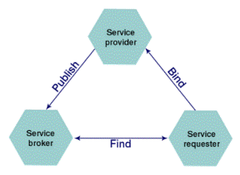

- A catalog's data is **metadata about other data**: titles, extents, dates, and the **URL** of the service that holds it
- **Publish** (a provider registers) → **find** (you search) → **bind** (you connect straight to the provider)
- Classic: **CSW**. Now: **OGC API – Records**, and **STAC** for imagery (Part 5)

<!-- The quiz's last item. The 2011 deck's example was the GEOSS registry; today's examples are the pygeoapi demo's dutch-metadata Records collection (309 records, October 5, 2026) and the Earth Search STAC API at the end of class. In ArcGIS Pro, ArcGIS Online and the Living Atlas are themselves a catalog: searching there is the "find" step. -->

---

<!-- _class: lead -->

# Part 3 — The OGC API Generation

## JSON, plain URLs, and an API that describes itself

---

# What Changed

- Classic: one URL, many **?REQUEST=** verbs, **XML** answers. OGC API: every thing has **its own URL**, answers in **JSON** (HTML in a browser), and the server publishes an **OpenAPI** description of itself
- Five approved parts: **Features, Tiles, Maps, Records, Processes** — all on one demo server:

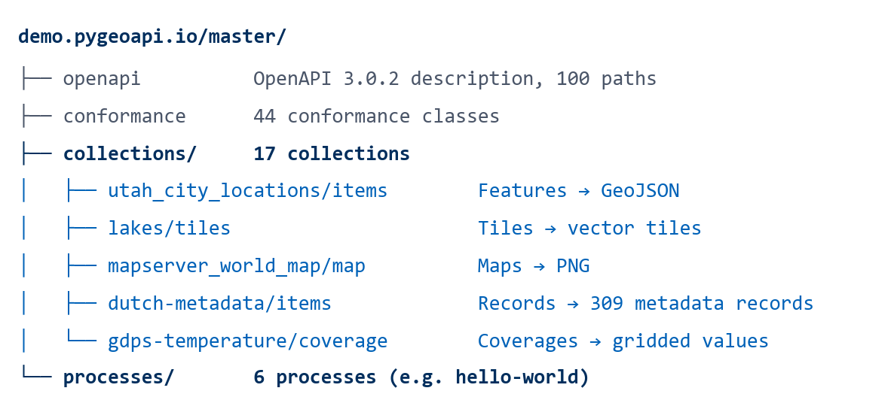

<!-- The tree is the real pygeoapi demo server (https://demo.pygeoapi.io/master), read on October 5, 2026 from its own landing page, /collections, /conformance, /openapi and /processes: 17 collections, 44 conformance classes, an OpenAPI 3.0.2 document with 100 paths, 6 processes. Its /conformance list includes the core class of all five parts named on the slide (plus Coverages and EDR, which are newer). -->
<!-- Approved: OGC API - Features Part 1 (17-069r4), Tiles Part 1 (20-057), Maps Part 1 (20-058), Records Part 1 (20-004r1), Processes Part 1 (18-062r2), all "IS" (Implementation Standard) on ogc.org, checked October 5, 2026. -->

---

# OGC API – Features, Live

```text
GET https://demo.pygeoapi.io/master/collections/utah_city_locations/items?f=json&limit=2
```

```json
{ "type": "FeatureCollection",
  "features": [
    { "type": "Feature", "id": "Cedar Hills",
      "geometry": { "type": "Point",
                    "coordinates": [-111.74817810768609, 40.402923255649355] },
      "properties": { "CO_SEAT": "no", "POP_2000": 3094.0, "STATE": "Utah", ... } },
    { "type": "Feature", "id": "Cedar Fort", ... } ],
  "links": [ { "rel": "next", "type": "application/geo+json", ... }, ... ] }
```

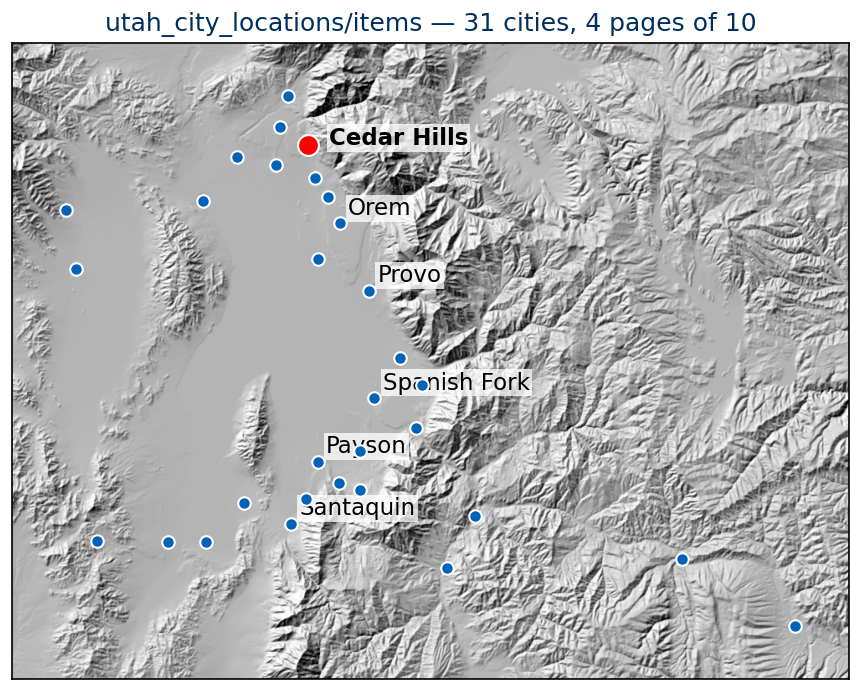

- **GeoJSON** — a browser, Python or ArcGIS Pro can read it
- The server hands out **10 at a time** and a **next** link: all 31 cities took 4 pages

<!-- Trimmed from the real response, October 5, 2026 (HTTP 200): properties POP_1999, POP_SYM_99, POP_SYM_00 and gml_id dropped; the links list also offers JSON-LD, HTML and CSV versions. Open the same URL without ?f=json in a browser and pygeoapi answers with an HTML page: one URL, a format per audience. Paging measured October 5, 2026: asking for limit=100 still returned 10 features per page, and following the next links gave 31 features in 4 pages (the demo's configured limit). The map plots all 31 (they are Utah County towns) over a USGS 3DEP WMS hillshade, Cedar Hills in red. -->
<!-- Code font: the pre blocks here are about 0.56 em; if they are hard to read from the back, zoom the browser or open the URL live. -->

---

# Same City, Two Generations

<div class="columns">
<div>

**WFS 2.0** (deegree)

```xml
<app:NAME>Cedar Hills</app:NAME>
<app:POP_2000>3094</app:POP_2000>
<gml:Point srsName="EPSG:26912">
  <gml:pos>436512.400 4472748.000</gml:pos>
</gml:Point>
```

XML · UTM zone 12N meters · asked with **GetFeature**

</div>
<div>

**OGC API – Features** (pygeoapi)

```json
"id": "Cedar Hills",
"properties": { "POP_2000": 3094.0 },
"geometry": { "type": "Point",
  "coordinates": [-111.748178, 40.402923] }
```

GeoJSON · longitude, latitude · asked with **/collections/…/items**

</div>
</div>

<!-- OPTIONAL. Not a coincidence: the pygeoapi collection is titled "Cities in Utah via OGR WFS", and its description says the backend is the deegree WFS. So this is one feature, served once by a 2.0 WFS and re-served by an OGC API server sitting in front of it. Both responses fetched October 5, 2026; coordinates trimmed to six decimals on the right. The two positions are the same point: UTM 12N 436512.4 E, 4472748.0 N is the WFS's native CRS, and pygeoapi reprojects to CRS84 longitude/latitude, the OGC API default. -->

---

# Tiles, Maps, Records, Processes

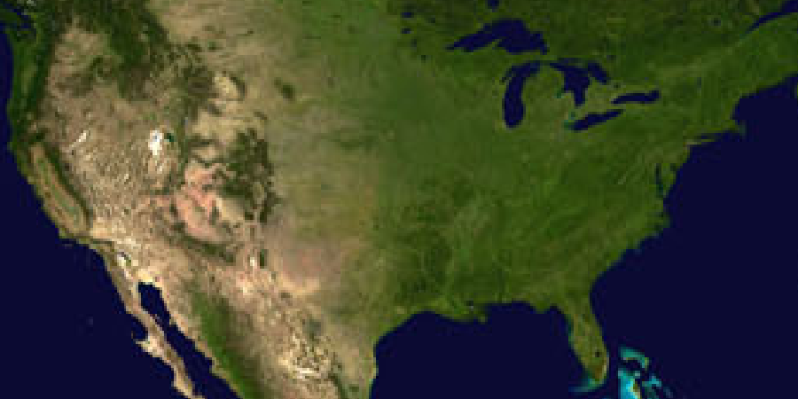

- **Tiles** — pre-cut pieces at fixed zoom levels: `/collections/lakes/tiles`
- **Maps** — the WMS idea with a plain URL: `/collections/mapserver_world_map/map?bbox=-125,24,-66,50`
- **Records** — catalog entries: `/collections/dutch-metadata/items`
- **Processes** — run a tool on the server: `/processes`

<!-- OPTIONAL. All four on the same pygeoapi demo server, October 5, 2026. The picture is the real OGC API - Maps response to https://demo.pygeoapi.io/master/collections/mapserver_world_map/map?f=png&bbox=-125,24,-66,50&width=900&height=450 (the demo backs it with a low-resolution world image served by MapServer's WMS, hence the blur). Processes is the modern WPS: the demo's six processes include hello-world and five pygeometa metadata tools. -->

---

<!-- _class: lead -->

# Part 4 — The ArcGIS REST API

## What UGRC's feature services actually are

---

# ArcGIS REST: FeatureServer, MapServer, ImageServer

- **Not an OGC standard** — Esri's own published API, used by ArcGIS Online and ArcGIS Server
- **FeatureServer** → features (UGRC ski areas, NHD) · **MapServer** → map images (USGSTopo) · **ImageServer** → raster values (3DEP)
- But an ImageServer can draw before it sends: added to ArcGIS Pro, 3DEP arrives as an **8-bit hillshade** — you will meet it in Lab 10, Step 1
- One ArcGIS Server can also speak **WMS, WFS, WCS** for the same data:

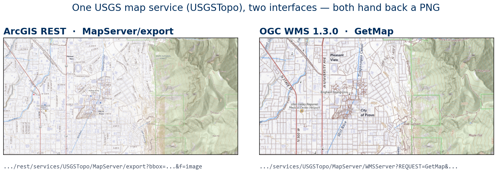

<!-- The figure: the same USGSTopo map service asked through REST (MapServer/export, f=image) and through WMS (WMSServer, GetMap), October 5, 2026. The two renders differ in label density because the REST export adjusts the extent to the image shape in Web Mercator and draws at a different scale; both are pictures. The 3DEP ImageServer likewise answers ArcGIS REST, WMS and WCS (we used all three). -->
<!-- The Lab 10 tie-in, observed in the Lab 10 GUI build (ArcGIS Pro 3.7.1, October 2026): Add Data From Path with the 3DEP ImageServer URL gave a layer drawn as a hillshade, Pixel Type unsigned char, 8 bit, Web Mercator (WKID 3857), 1 m cells, and the Explore pop-up at Y Mountain's summit read 154 where the DEM reads about 2,897 m. The service itself is Float32 (its ?f=pjson says pixelType F32, -60.3 to 3,922.5 m) and lists twelve raster functions, Hillshade Gray first; the layer in ArcGIS Pro is that function's output, not the elevations. When Lab 10 comes, students will see 154 at Y Mountain's summit; ask now how they would get the meters (the WCS on the previous slides, or the layer's raster function set to None in its properties - VERIFY that last menu path in the GUI before saying it). -->
<!-- REST endpoints used today: https://services1.arcgis.com/99lidPhWCzftIe9K/arcgis/rest/services/SkiAreaBoundaries/FeatureServer/0 and .../UtahStreamsNHD/FeatureServer/0 (ArcGIS Online, current version 12); https://basemap.nationalmap.gov/arcgis/rest/services/USGSTopo/MapServer; https://elevation.nationalmap.gov/arcgis/rest/services/3DEPElevation/ImageServer (ArcGIS Server 11.3, Float32, values -60.3 to 3,922.5 m). Esri's reference: https://developers.arcgis.com/rest/services-reference/enterprise/query-feature-service-layer/ -->

---

# Reading a Layer: ?f=pjson

```text
.../rest/services/SkiAreaBoundaries/FeatureServer/0?f=pjson
```

```json
{ "name" : "SkiAreaBoundaries",
  "type" : "Feature Layer",
  "geometryType" : "esriGeometryPolygon",
  "maxRecordCount" : 2000,
  "supportedQueryFormats" : "JSON, geoJSON, PBF",
  "capabilities" : "Query,Extract",
  "fields" : [ { "name" : "OBJECTID", "type" : "esriFieldTypeOID" },
               { "name" : "NAME", "type" : "esriFieldTypeString", "length" : 50 },
               { "name" : "COLOR4", ... }, { "name" : "Shape__Area", ... },
               { "name" : "Shape__Length", ... } ], ... }
```

- **pjson** = "pretty JSON". Leave `?f=pjson` off and the same URL gives an HTML page

<!-- Trimmed from the real response, October 5, 2026 (HTTP 200, 11,152 bytes). Fields shown with only name, type and length; the full entry adds alias, sqlType, nullable, editable, domain and defaultValue. Watch for the trap in the activity: the word "name" also appears under uniqueIdField and under indexes (a primary-key index and a spatial index), which are not fields. The HTML page lists the same five fields under "Fields:". This is the layer's capabilities document: the ArcGIS equivalent of GetCapabilities. -->

---

# The /query Endpoint

```text
.../FeatureServer/0/query?where=1=1&returnCountOnly=true&f=pjson
→ {"count":14}

.../FeatureServer/0/query?where=NAME='Snowbird Ski and Summer Resort'
                          &outFields=NAME&outSR=4326&f=geojson
→ {"type":"FeatureCollection", "features":[{"type":"Feature",
     "geometry":{"type":"Polygon","coordinates":[[[-111.6564,40.5834], ...
     "properties":{"NAME":"Snowbird Ski and Summer Resort"} } ] }
```


- **where** = an SQL expression, **outFields** = which attributes, **f** = the format
- Back comes **features**: a polygon of 238 coordinate pairs and its attribute — not a picture

<!-- Both run October 5, 2026 (HTTP 200). The second also had geometryPrecision=4 (4 decimals, about 10 m) to keep it short: 4,931 bytes, one polygon ring of 238 coordinate pairs. Note the full name: where=NAME='Snowbird' returns an empty FeatureCollection, because the stored value is "Snowbird Ski and Summer Resort". That is the Lab 1 lesson again: read the values from the data before you write the expression. The 14 names, sorted: Alta Ski Area, Beaver Mountain Resort, Brian Head Resort, Brighton Ski Resort, Cherry Peak Resort, Deer Valley Resort, Eagle Point, Nordic Valley, Park City, Powder Mountain, Snowbasin, Snowbird Ski and Summer Resort, Solitude Mountain Resort, Sundance Resort. -->

---

# A Query Returns at Most 2,000

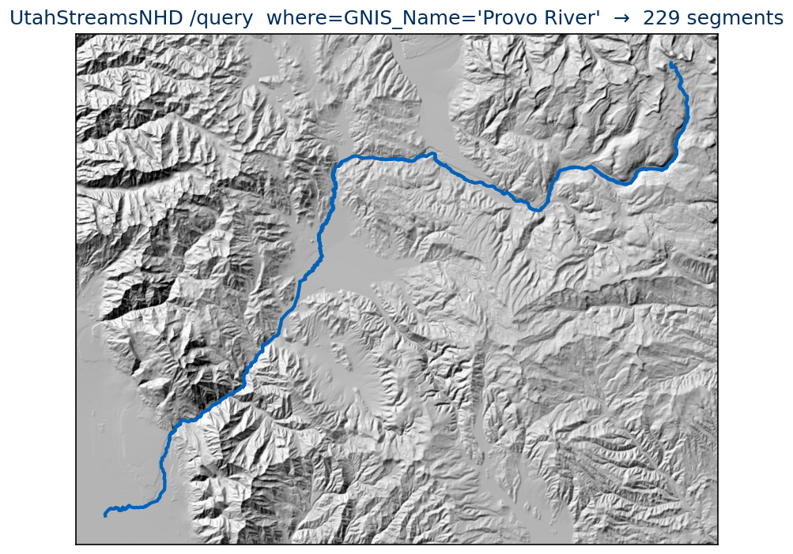

- **maxRecordCount = 2000** on both UGRC layers
- Ask **UtahStreamsNHD** for everything: **2,000** lines back and `"exceededTransferLimit": true` — of **541,604**
- A client has to **page** (`resultOffset`) or, better, **ask a narrower question**: `where=GNIS_Name='Provo River'` → **229** segments

<!-- OPTIONAL. Measured October 5, 2026: UtahStreamsNHD/FeatureServer/0/query?where=1=1&outFields=OBJECTID&returnGeometry=false&f=json returned 2,000 features with exceededTransferLimit true; returnCountOnly with where=GNIS_Name='Provo River' returned {"count":229}. 541,604 / 2,000 = 271 requests to page through the whole layer. -->
<!-- VERIFY before saying it as fact: ArcGIS Pro requests features from a feature service by display extent and pages for you, which is why Lab 5's NHD layer drew without hitting the limit. This matches how feature layers are documented to behave, but it was not observed (for example with Fiddler) for this deck. -->

---

<!-- _class: lead -->

# Part 5 — Cloud-Native: COG and STAC

## Files that behave like services

---

# Cloud-Optimized GeoTIFF (COG)

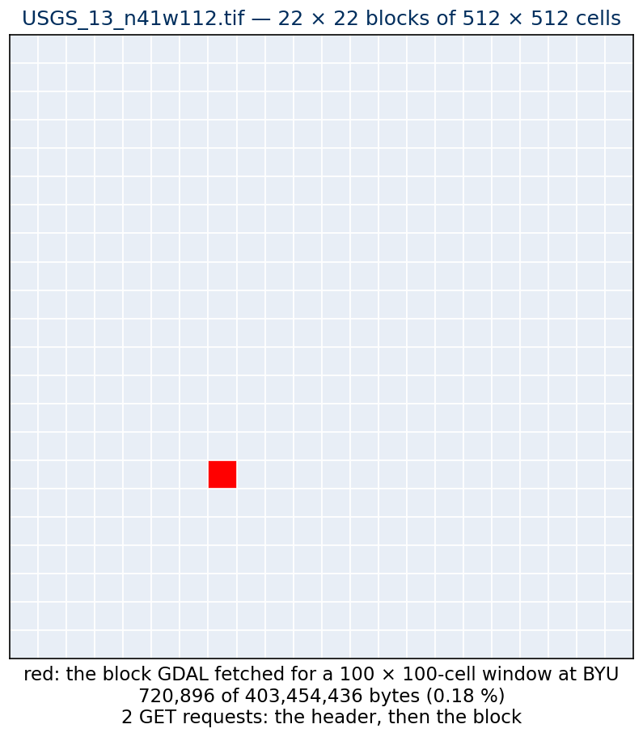

- An ordinary GeoTIFF, **arranged** for the web: internal **tiles**, **overviews**, and the index **at the front**
- A client reads the index, then asks for **only the bytes** of the tiles it needs (HTTP range requests)
- The **3DEP tile behind Lab 8**: 10,812² cells in 512 × 512 tiles, 5 overviews — a window at BYU moved **0.72 MB of 403 MB**

<!-- Measured October 5, 2026 with GDAL in the ArcGIS Pro Python: https://prd-tnm.s3.amazonaws.com/StagedProducts/Elevation/13/TIFF/current/n41w112/USGS_13_n41w112.tif, 403,454,436 bytes, LAYOUT=COG, LZW, 512 x 512 blocks, overviews 5406, 2703, 1351, 675, 337 columns wide. A 100 x 100-cell read at -111.64, 40.25 took 1 HEAD and 2 GETs (the first 16 KB header, then one block) = 720,896 bytes; the center value was 1430.04 m. The server answers Accept-Ranges: bytes. The 1 arc-second tiles of Lab 4 (USGS_1_n40w112.tif checked) carry the same COG header. -->
<!-- arcpy.Raster() opened the plain https:// URL of this tile directly in ArcGIS Pro 3.7.1's Python (10812 x 10812 cells). VERIFY in the GUI: that Map ▸ Add Data ▸ From Path accepts the same https://...tif URL and draws it. -->
<!-- OGC Cloud Optimized GeoTIFF Standard 1.0, OGC 21-026 (ogc.org, checked October 5, 2026). -->

---

# STAC: a Catalog of Files

```text
GET https://earth-search.aws.element84.com/v1/search
      ?collections=sentinel-2-l2a&bbox=-111.70,40.22,-111.60,40.28
      &datetime=2026-09-01T00:00:00Z/2026-10-04T23:59:59Z&limit=2
```

```json
{ "context": { "limit": 2, "matched": 17, "returned": 2 },
  "features": [ { "id": "S2A_12TVK_20261003_1_L2A",
      "properties": { "datetime": "2026-10-03T18:33:15.655000Z", "eo:cloud_cover": 32.6 },
      "assets": { "visual": {
          "href": "https://sentinel-cogs.s3.us-west-2.amazonaws.com/.../TCI.tif",
          "type": "image/tiff; application=geotiff; profile=cloud-optimized" }, ... } }, ... ] }
```

- **S**patio**T**emporal **A**sset **C**atalog: search by place and time; each item's **assets** are links to **COGs**

<!-- Real request and response, October 5, 2026 (HTTP 200), heavily trimmed: each item also carries its bbox, geometry, 43 properties and 38 assets (every band as a COG and as JPEG 2000, plus metadata and a thumbnail). 17 Sentinel-2 L2A scenes over BYU between September 1 and October 4, 2026. The full href is https://sentinel-cogs.s3.us-west-2.amazonaws.com/sentinel-s2-l2a-cogs/12/T/VK/2026/10/S2A_12TVK_20261003_1_L2A/TCI.tif. The same search also works against Microsoft's Planetary Computer STAC API (https://planetarycomputer.microsoft.com/api/stac/v1, HTTP 200 October 5, 2026). STAC 1.1.0 and STAC API 1.0.0 are OGC Community Standards 25-004 and 25-005. -->

---

# Search → COG → Picture


- The clearest of the 17 (**September 20, 2026**, 0.68 % cloud): **only the BYU window** came over — **2.6 MB of a 349 MB file**
- Swap the true-color asset for the **red** and **near-infrared** bands (also COGs) and the same read gives **NDVI**

<!-- Item S2A_12TVK_20260920_0_L2A, eo:cloud_cover 0.676915, asset "visual" = https://sentinel-cogs.s3.us-west-2.amazonaws.com/sentinel-s2-l2a-cogs/12/T/VK/2026/9/S2A_12TVK_20260920_0_L2A/TCI.tif (10,980 x 10,980 cells of 10 m, DEFLATE, LAYOUT=COG, 349,318,194 bytes). gdal.Translate with a projWin for the BYU box moved 2,605,056 bytes; the window is 684 x 334 cells, shown here at 2x. TCI itself is the 8-bit true-color product, already scaled for display, so it is a picture-like product even though it arrives as a COG; for NDVI read the red (B04.tif) and nir (B08.tif) assets of the same item, which are COGs of surface reflectance; Week 3's NDVI lesson applies directly. -->
<!-- If time is short, this slide and the STAC slide can be shown as one: the picture is the answer to the search. -->

---

<!-- _class: lead -->

# Part 6 — In ArcGIS Pro

---

# How ArcGIS Pro Consumes Each

| You have | In ArcGIS Pro |
|---|---|
| ArcGIS REST URL (FeatureServer, MapServer, ImageServer) | **Map** tab ▸ arrow under **Add Data** ▸ **From Path** — paste, **Add** |
| WMS | **Insert** ▸ **Connections** ▸ **Server** ▸ **New WMS Server** |
| WFS | **Insert** ▸ **Connections** ▸ **Server** ▸ **New WFS Server** |
| OGC API (Features, Tiles) | **Insert** ▸ **Connections** ▸ **Server** ▸ **New OGC API Server** |
| STAC API | **Insert** ▸ **Connections** ▸ **STAC Connection** ▸ **New STAC Connection** |

Server connections then appear in the **Catalog** pane under **Servers**; drag a layer onto the map.

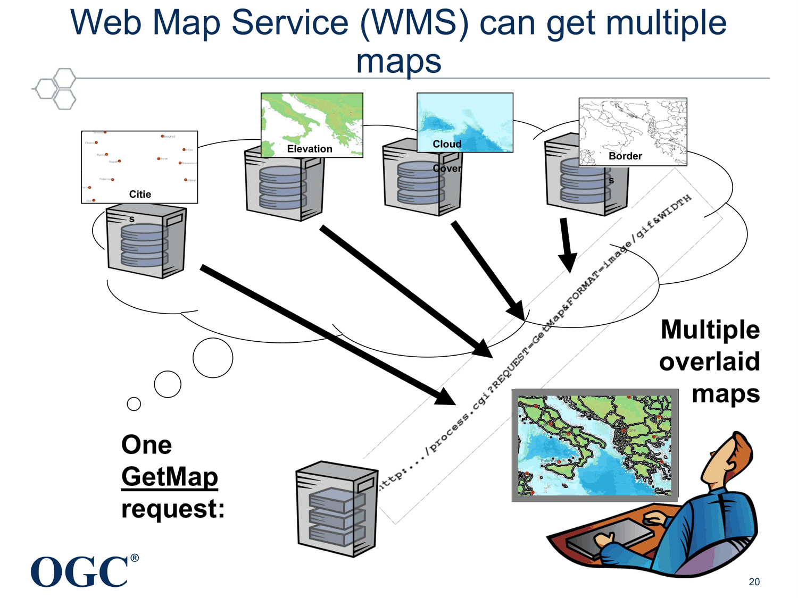

<!-- From Path was used in the Lab 5 and Lab 8 GUI builds (ArcGIS Pro 3.7.1, September 30 and October 5, 2026), worded exactly as in those labs. The four Insert ▸ Connections paths are quoted from Esri's ArcGIS Pro documentation ("latest"), read October 5, 2026: help/data/services/add-wms-services.htm, add-wfs-services.htm, add-ogc-api-services.htm, and help/data/imagery/create-a-stac-connection.htm. Esri's OGC API page says ArcGIS Pro supports OGC API - Features and OGC API - Tiles (map tiles) through that connection; Maps, Records and Processes are not listed. -->
<!-- VERIFY in ArcGIS Pro 3.7.1 before class: the four Insert ▸ Connections menu paths have been checked in the documentation only, not seen in the GUI. TODO(capture): a real ArcGIS Pro capture of the Insert ▸ Connections ▸ Server menu would replace the side figure (the 2011 OGC diagram of one client overlaying maps from several servers, which is what ArcGIS Pro does with these connections); no capture exists yet. Good demo order if there is time: New WMS Server with https://basemap.nationalmap.gov/arcgis/services/USGSTopo/MapServer/WMSServer, then New OGC API Server with https://demo.pygeoapi.io/master and add utah_city_locations. Neither has been tried in the GUI for this deck. -->

---

<!-- _class: activity -->

# In Class Activity — Inspect a Live Service

<div class="columns">
<div>

Open the **UGRC ski-area layer** on your phone or laptop (scan the code):

1. On the page: **geometry type**? which **fields**? **max record count**?
2. Add the first ending below — **how many** ski areas?
3. Try the second — **what came back**: a picture or features? Which resort is first?

```text
/query?where=1=1&returnCountOnly=true&f=pjson
/query?where=1=1&outFields=NAME&f=geojson
```

<span style="font-size: 0.5em; color: #4a5568;">services1.arcgis.com/99lidPhWCzftIe9K/arcgis/rest/services/SkiAreaBoundaries/FeatureServer/0</span>

</div>
<div>


</div>
</div>

<!-- Answers, measured October 5, 2026: (1) Geometry Type esriGeometryPolygon; five fields: OBJECTID, NAME, COLOR4, Shape__Area, Shape__Length; Max Record Count 2000. The HTML page lists them under "Fields:"; with ?f=pjson, students must look under "fields", not "indexes" or "uniqueIdField". (2) {"count":14}. (3) a GeoJSON FeatureCollection of 14 Polygon features, each with only its NAME property; the first is Brighton Ski Resort (server order, not alphabetical); about 88.6 KB with outFields=* instead. In a phone browser the GeoJSON shows as text; that is the point: coordinates and attributes, not pixels. Fast finishers: add &outSR=4326 and read off a longitude near -111.6, or change the where to NAME LIKE '%Snow%' (typed as is in the browser; run October 5, 2026: count 2, Snowbasin and Snowbird Ski and Summer Resort). The QR code (37 modules) encodes the layer URL and was made with the local qrcode package. -->
<!-- TODO(instructor): this activity has no Learning Suite item. If it is to be graded, add a matching activity on Learning Suite (e.g. upload a screenshot of the count and the GeoJSON) and a row in the DUE table for Week 9. -->

---

# The Whole Lesson on One Slide


- **WMS / OGC API – Maps / MapServer** → a **picture** · **WFS / OGC API – Features / FeatureServer** → the **features**
- **WCS / ImageServer / COG** → the **values** · **CSW / OGC API – Records / STAC** → a **pointer** to the data
- Before you use a service, ask the same question as the quiz: **what comes back?**

<!-- The wrap-up maps every interface met today onto the four answers. The OGC API - Tiles row is left off on purpose: tiles can be map images or vector data, so "what comes back" depends on the tileset. -->

---

# Before Next Class


- **Lab 7 — Flood Mapping with HAND** is due **Saturday 11:59 pm**: [Lab 7](https://byu-hydroinformatics.github.io/ce414-gis-applications/assignments/lab-07/)
- **Reading** — Chapter 14 of *GIS Fundamentals* (Data Standards and Data Quality); **Quiz 8** on Learning Suite, open book, due **Saturday 11:59 pm**
- **Lab 8 — Avalanche Hazard** comes next, due **Saturday of next week**: [Lab 8](https://byu-hydroinformatics.github.io/ce414-gis-applications/assignments/lab-08/)
- Next week: **raster-based spatial analysis**
- Questions? Office hours: [calendly.com/dan-ames/office-hours](https://calendly.com/dan-ames/office-hours)

<!-- Week 9 due items from the DUE table in tools/build_schedule.py (Lab 9, Quiz 8, Chapter 14); Week 10 lists the Raster-Based Spatial Analysis deck, Chapter 9, and Lab 10, which is introduced on Tuesday of Week 9 (interpolation-explorer.md). -->

---

<!-- _class: activity -->

# One Last Thing — What Comes Back?

<div class="columns">
<div>

Five questions: **what does the service actually hand you** — a picture, the features, the values, or a pointer to somebody else's server?

**Scan the code**, or open the link below.

- Not graded, nothing recorded — it is a check that today landed
- Every answer explains itself; read the explanation before you move on
- The WMS-picture question is the one that bites in practice

<span style="font-size: 0.5em; color: #4a5568; white-space: nowrap;">byu-hydroinformatics.github.io/ce414-gis-applications/quizzes/web-services/</span>

</div>
<div>


</div>
</div>

<!-- Five minutes, in pairs, then a show of hands on the one that splits the room: what you can do with a returned WMS map image. Today's GetFeatureInfo answer from the USGS topo server (a color, 247/247/247) is the best argument against running map algebra on the pixels. The open-standard item is the other reliable split: closed-source software can be fully compliant, because the standard is the document, not the implementation. If the room has no signal, put the URL on the board. -->

<!-- Rebuild notes (2026-10-05): replaces the faithful conversion of the January 2011 OGC conference deck, now archived unlinked as slides/week-09/ogc-web-services-2011.md. Same filename, so the Learning Suite and schedule links still work; the schedule title in tools/build_schedule.py still reads "Overview of OGC Web Services" with the 2011 description and should be updated by the maintainer (that file has another session's uncommitted edits, so it was not touched). Every request in the deck was run with curl and/or tools/week09_web_services_figures.py on October 5, 2026; URLs are in each slide's notes. Reused from the 2011 deck: ogc-ws-pattern, ogc-wms-getfeatureinfo, ogc-wfs-multiple-servers, ogc-publish-find-bind, and the four ogc-coverage-* images. No ArcGIS Pro screenshots appear (none were taken for this deck); the ArcGIS Pro menu paths are from the Lab 5/7 GUI builds (From Path) and Esri's documentation (the Insert ▸ Connections paths, marked VERIFY). The quiz still says "the deck's example comes back with an elevation of 237 meters"; that example survives as the diagram on the GetFeatureInfo slide, but the live server in the deck returns a color, which is a stronger version of the quiz's point. -->
