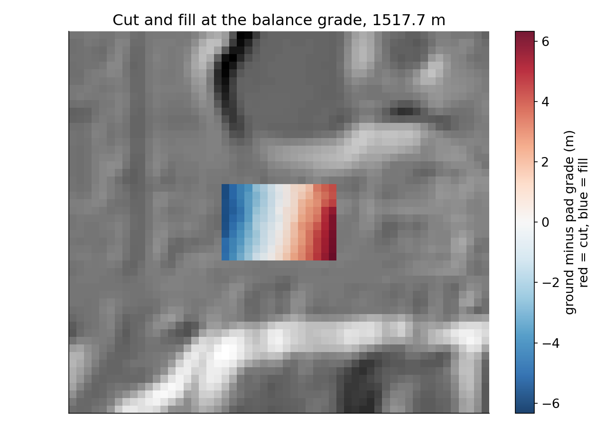
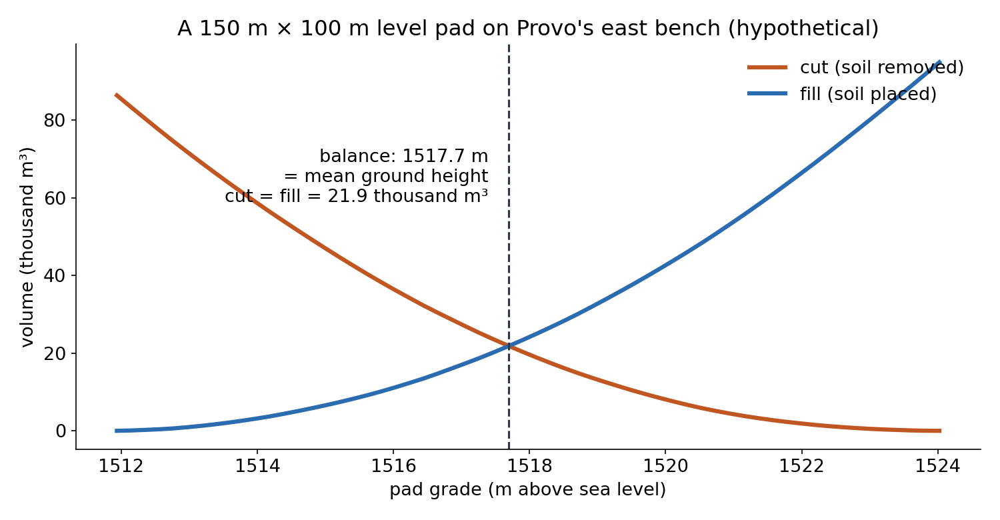
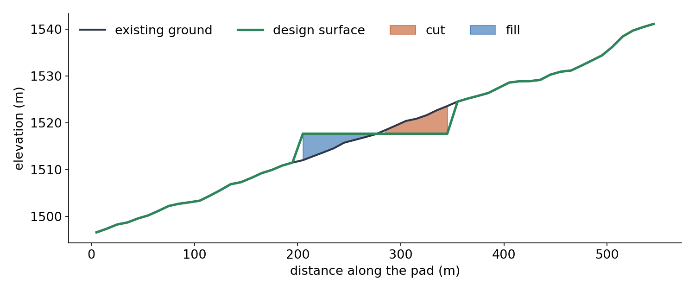
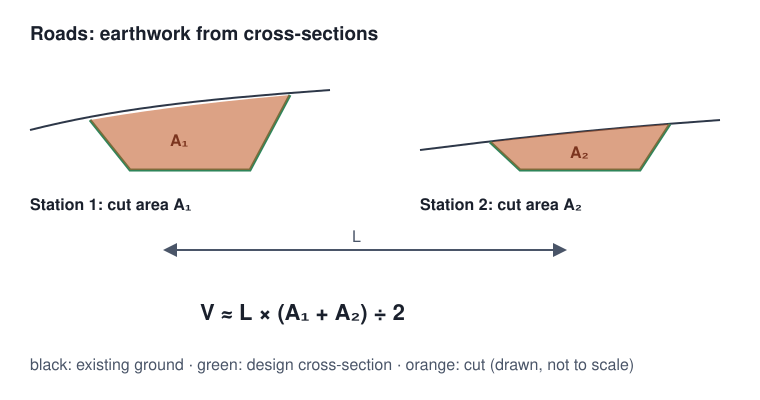
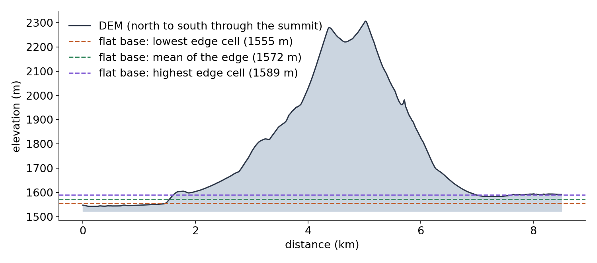

<!-- _class: lead -->
<!-- _paginate: skip -->

# Cut and Fill

## Earthwork Volumes from Two Surfaces

CE 414 Engineering Applications of GIS
Civil & Construction Engineering
Brigham Young University
Dr. Dan Ames

<!-- Tuesday of Week 10. Thursday is volumes with rasters and Lab 9 (Big Southern Butte); today is the same idea in the form every civil engineer meets first: how much soil a design moves. The title image is a hypothetical 150 m x 100 m level pad placed on the real Lab 5 DEM of Provo's east bench, colored by how far the ground must come down (red, cut) or go up (blue, fill). -->

<!-- stamp:begin -->
<!-- _footer: 'CE 414 · Week 10 — Cut and FillLast Updated: 2026-10-09© 2026 Daniel P. Ames · <a href="https://creativecommons.org/licenses/by/4.0/">CC BY 4.0</a>' -->
<!-- stamp:end -->

---

# Today's Goals

By the end of class you should be able to:

- Compute **cut** and **fill** from an existing and a design surface, cell by cell
- Find the **balance grade** of a level pad
- Run **Cut Fill** in ArcGIS Pro and read its **VOLUME** sign
- Say what a grid volume **leaves out**: side slopes, swell and shrink, DEM error

---

<!-- _class: lead -->

# Part 1 — Earthwork Is a Volume

---

# Two Surfaces

- **Existing ground**: the DEM
- **Design surface**: the pad, the road, the channel, as built
- **Cut**: ground **above** the design, dug out
- **Fill**: ground **below** the design, built up

<!-- A long section through the pad, along its middle row of cells. The design surface equals the ground outside the pad. The pad's ends are vertical here because the design has no side slopes; a real grading plan ties the pad back to the ground with slopes (for example 2:1 or 3:1), which adds earthwork the simple grid misses. -->

---

# The Grid Method

- Every cell: **Δz = ground − design**
- Cell volume = **Δz × cell area** (100 m² for a 10 m cell)
- **Cut** = sum of the positive cells; **fill** = sum of the negative ones
- Units: project first, so the **cell size and z are both meters**

<!-- The same arithmetic as Week 7's lake volumes and Lab 9's butte: a difference of two surfaces, multiplied by the cell area, summed. The map is the pad at its balance grade: red cells are cut, blue are fill; the bench slopes about 8 % down to the west. -->

---

<!-- _class: activity -->

# Your Turn — Balance a Tiny Pad

Nine 10 m cells of existing ground (m):

| | | |
| --- | --- | --- |
| 102 | 103 | 105 |
| 101 | 102 | 104 |
| 100 | 101 | 103 |

1. Level the pad at **102 m**. Cut? Fill? (m³)
2. At what grade do cut and fill **balance**?

<!-- A made-up grid for hand practice. Answers: at 102 m the differences are 0, 1, 3 / -1, 0, 2 / -2, -1, 1, so cut = (1 + 3 + 2 + 1) x 100 = 700 m³, fill = (1 + 2 + 1) x 100 = 400 m³, and 300 m³ must leave the site. Balance is the mean of the nine cells, 921 / 9 = 102.3 m: at any grade, cut minus fill is the sum of (ground minus grade) times the area, which is zero exactly at the mean. -->

---

# The Balance Grade

- Raise the pad: **less cut, more fill**
- **Balance**: cut = fill, nothing trucked on or off
- For a level pad on a grid, balance is the **mean ground height** under it
- Our pad: **1,517.7 m**, **21.9 thousand m³** each way

<!-- Computed for the hypothetical pad on the Lab 5 DEM (tools/week10_volume_figures.py; 150 cells, ground 1,511.9 to 1,524.0 m, mean slope 8.1 %). Real balance is never exactly here: swell and shrink factors, side slopes and unusable material (topsoil, rock) all move it. Hauling is what costs money, which is why designers chase balance. -->

---

# Cut Fill in ArcGIS Pro

- Inputs: the **before** and **after** surfaces, same cells
- Output raster: one region per change, with **VOLUME** and **AREA**
- **VOLUME > 0**: material **removed** (cut) · **< 0**: material **added** (fill)
- Our pad at balance: **+21,852.5** and **−21,852.5 m³**, 7,500 m² each

<!-- Spatial Analyst Cut Fill (arcpy.sa.CutFill), run in ArcGIS Pro 3.7.1 on the pad. The sign was checked with an off-balance run (grade raised 2 m): the tool's positive total, 9,487 m³, matched the cut computed cell by cell, and its negative total, -39,487 m³, matched the fill. VERIFY in the GUI before class: the Geoprocessing pane path (Spatial Analyst Tools > Surface > Cut Fill); it was not opened in the GUI for this deck. -->

---

# Roads: Average End Area

- Highway earthwork is computed from **cross-sections** at stations
- Between two sections: **V ≈ L × (A₁ + A₂) ÷ 2**

<!-- The average-end-area method is the standard road earthwork estimate; the grid method is its raster cousin. Corridor design software computes sections from a DEM and a design profile, then sums them with this formula. Diagram drawn for this deck. -->

---

<!-- _class: lead -->

# Part 2 — What the Volume Leaves Out

---

# A Grid Volume Is a First Estimate

- **Side slopes**: a pad needs cut and fill slopes at its edges
- **Swell and shrink**: dug soil takes more room loose, less when compacted
- **Unusable material**: topsoil and rock do not go back as fill
- **The DEM itself**: a 10 m cell averages the ground; buildings and roads are in it

<!-- Earthwork contractors quote bank (in place), loose and compacted volumes, related by factors measured for the soil; the grid gives bank volume. No numbers for those factors are given here on purpose: they come from geotechnical tests for a site. The pad sits in a developed part of Provo's east bench, so the DEM's ground includes roads and lots; it is a hypothetical design for illustration. -->

---

# Thursday: A Volume You Cannot Dig

- Same arithmetic, bigger question: **how much rock is in a mountain?**
- The "design surface" is the **ground under the mountain**, which nobody can see
- That is **Lab 9 — Big Southern Butte**

<!-- A north-south profile through Big Southern Butte's summit from the Lab 9 DEM, with three flat bases taken from the outline's edge. Thursday shows that the choice of base moves the answer by about a fifth. -->

---

# Before Next Class

- **Reading** — Chapter 9 of *GIS Fundamentals*; **Quiz 9** due **Saturday 11:59 pm**
- **Lab 9 — Big Southern Butte** — due **Saturday 11:59 pm** — [Lab 9](https://byu-hydroinformatics.github.io/ce414-gis-applications/assignments/lab-09/)
- Office hours: [calendly.com/dan-ames/office-hours](https://calendly.com/dan-ames/office-hours)

<!-- Week 10 due items from tools/build_schedule.py: Quiz 9 (Chapter 9) and Lab 9. Deck written October 9, 2026; figures from tools/week10_volume_figures.py, numbers in tools/week10_volume_numbers.json. -->

---

<!-- _class: activity -->

# One Last Thing — Cut or Fill?

Five questions on cut, fill, balance, and the Cut Fill tool. **Scan the code**, or open the link below.

- Not graded, nothing recorded — it is a check that today landed
- Every answer explains itself; read the explanation before you move on
- The sign question is the one that trips up a report

byu-hydroinformatics.github.io/ce414-gis-applications/quizzes/earthwork/

<!-- Four minutes, in pairs. If the room has no signal, put the URL on the board. -->
