<!-- _class: lead -->
<!-- _paginate: skip -->

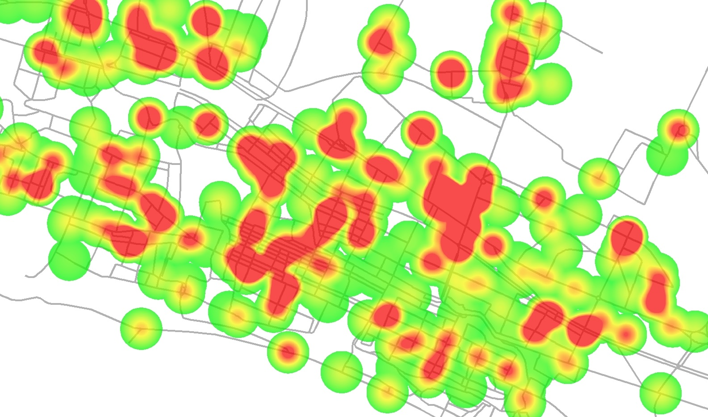

# Raster-Based Spatial Analysis

CE 414 Engineering Applications of GIS
Dr. Dan Ames
Civil & Construction Engineering
Brigham Young University

<!-- Week 10 concepts lecture. The whole hour builds one workflow: criteria, data, convert to raster, reclassify, overlay, heat map. The lab that applies it is the wind farm site selection lab. -->

---

# Today's Goals

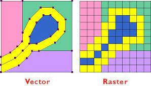

By the end of class you should be able to:

- Lay out the **general workflow** for a raster suitability analysis
- Explain what you gain and what you lose when you convert vector data to raster
- **Reclassify** a raster to meaningful values, and say why the classes were chosen
- **Overlay** several rasters with map algebra to combine criteria
- Read a **heat map** as a value/color range rather than as a yes/no answer

<!-- Set the frame: this is the raster version of the vector suitability analysis we have already done. Same question, different arithmetic. -->

---

# General Workflow

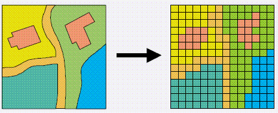

1. Determine the **spatial criteria**
2. Determine and collect the **spatial data**
3. **Edit, re-project, and clip** as needed to get the data ready for use
4. **Convert all data to raster**
5. **Reclassify** raster data to usable values
6. **Combine** the rasters to
   - eliminate areas that fall outside the suitable range
   - de-emphasize areas that are less optimal
   - emphasize areas that are more optimal
7. Create a **heat map** showing suitability as a value/color range

<!-- Walk the list once, quickly. Every remaining slide in the deck is one of these steps. Point out that steps 1 to 3 are identical to the vector workflow; the raster part starts at step 4. -->

---

<!-- _class: activity -->

# Step 1: Determine Spatial Criteria

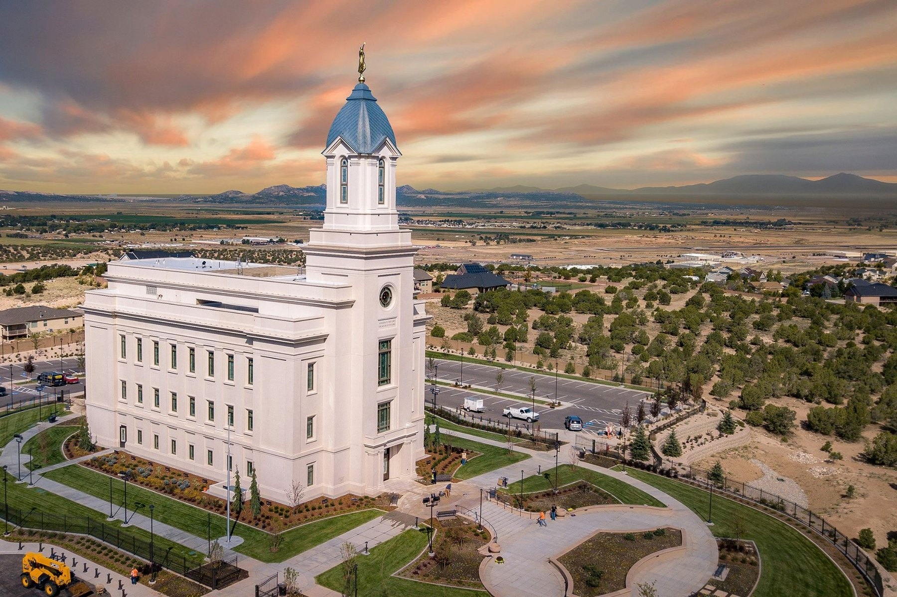

Just like with vector-based analysis...

- What are the constraints on **placing a temple in a new city**?
- Note that these are different constraints from the ones involved in
  *selecting a city* for a new temple.

<!-- Discussion slide. Let students call out constraints and write them on the board: parcel size, road access, slope, zoning, distance from the freeway, visibility, utilities. Keep pushing on the distinction the slide makes. Choosing which city gets a temple is a regional, demographic question. Choosing where in the city it goes is a site question, and the site question is the one raster analysis is good at. The photo is a completed temple on the edge of a valley, with construction equipment still on site. -->

---

# Step 2: Determine and Collect Needed Spatial Data

As with vector spatial analysis, the data for a raster problem can be a
combination of

- Downloaded **raster** data
- Downloaded **vector** data
- **Remote sensing** data
- **Drone** data
- **GPS** or surveyed data
- **Digitized** data
- Or data collected by any other means

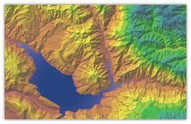

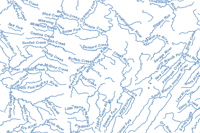

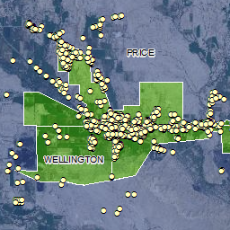

<!-- The point is that the source of the data does not decide the analysis. Anything can be rasterized. What matters is that every layer ends up on a common coordinate system, extent, and cell size before you do math on it. -->

---

# Step 4: Convert All Data to Raster

- Remember that you are **losing detail** by converting to raster...
- But that is okay. We are trading detail for the ability to **do math**
  on the layers and produce heat map outputs
- The cell size you pick *is* the resolution of your answer

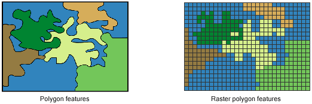

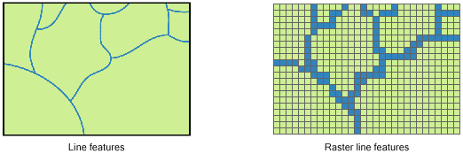

<!-- Look at the two panels: a polygon boundary becomes a stair-stepped block of cells, and a stream line becomes a chain of cells. Ask what happened to the smooth curve. Ask what cell size would have been small enough. This is also where the analysis environment matters: every input needs the same extent and cell size or the math will not line up. -->

---

# Step 5: Reclassify to Usable/Meaningful Values

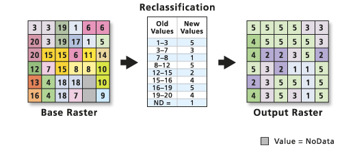

- "Meaningful" values can be as detailed or as simple as you want
  - `1 = good, 0 = bad`
  - `1 – 10`, good to bad
  - Etc.
- The reclassification table is where your **judgment** enters the model
- Two people with the same data and different tables get different maps

<!-- The diagram is the standard picture: a base raster of arbitrary values, a table of old-value ranges mapped to new values, and an output raster on a small, common scale. Emphasize that the ranges in the middle table are a choice, not a measurement. Reclassify lives in the Spatial Analyst toolbox in ArcGIS Pro. -->

<!-- VERIFY: tool name and toolbox location for Reclassify in the current ArcGIS Pro release. -->

---

# Reclassifying a Continuous Surface

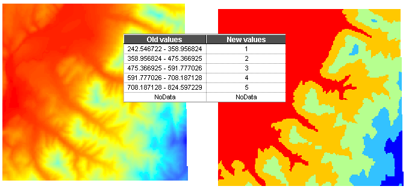

<!-- A worked example on real data: a continuous elevation surface on the left, split into five classes on the right using the old-value/new-value table in the middle. Note that the class breaks are stated to six decimal places because the software wrote them from the data range, not because that precision means anything. Ask what would change if the five classes were equal-interval versus quantile. -->

---

# Step 6: Overlay — Combine Data Layers

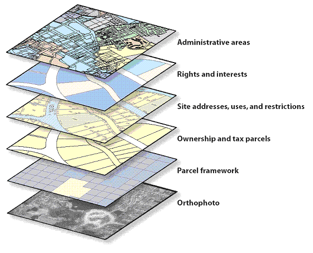

- Every criterion is one **layer** in a stack over the same ground
- Overlay is the operation that turns the stack into a **single value per location**
- The vector version cuts polygons against each other; the raster version does
  **arithmetic, cell by cell**

Reference: [UCGIS Body of Knowledge — raster overlay](https://gistbok.ucgis.org/topic-keywords/raster-overlay)

<!-- The layer-stack picture is the mental model students already have from the vector weeks. Keep it, then show on the next slide what the arithmetic actually looks like. -->

---

# Overlay Is Just Cell-by-Cell Arithmetic

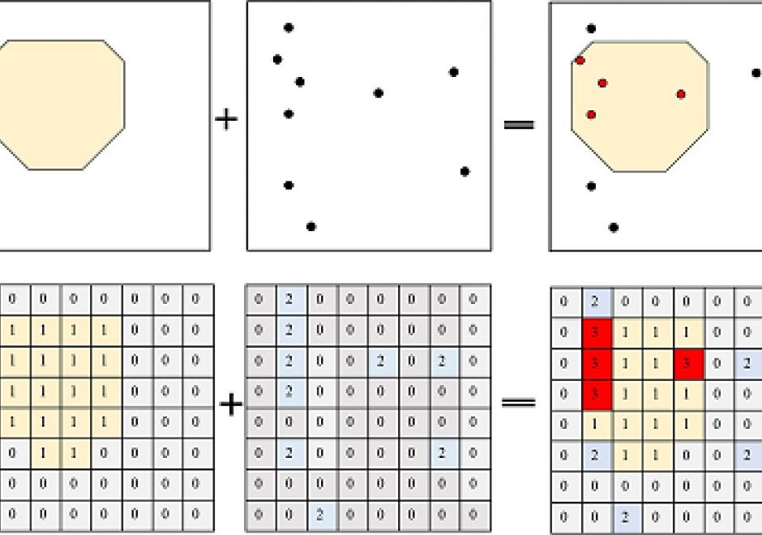

<!-- Top row is the vector idea: a polygon plus a point layer gives you the points inside the polygon. Bottom row is the same question done in raster: two grids added cell by cell, and the cells that come out as 3 are the ones that scored in both inputs. Walk one cell through by hand. This is what Raster Calculator does. -->

<!-- VERIFY: name Raster Calculator as the ArcGIS Pro tool for map algebra expressions. -->

---

# Step 7: Create a Heat Map

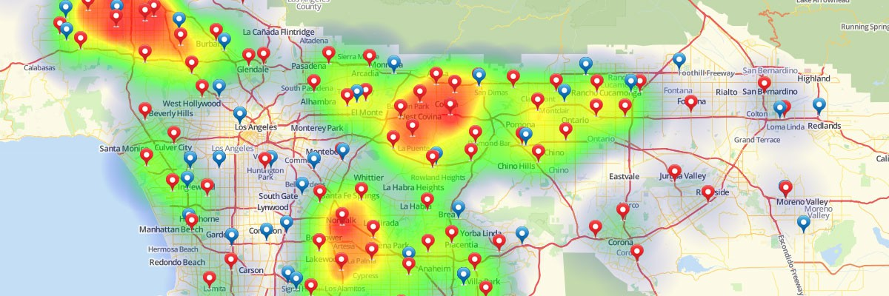

<!-- Incident points over a Los Angeles basemap with a density surface underneath. Ask what the warm areas mean: many nearby points, not a single important point. The colors are a stretch across a continuous range, so the legend, not the color, tells you the value. -->

---

# A Heat Map Is a Value Range, Not an Answer

- The output is a **continuous surface**: every cell has a score
- Where you draw the line between "suitable" and "not" is still a decision
- The color ramp can make a weak result look strong — check the legend and the
  underlying values

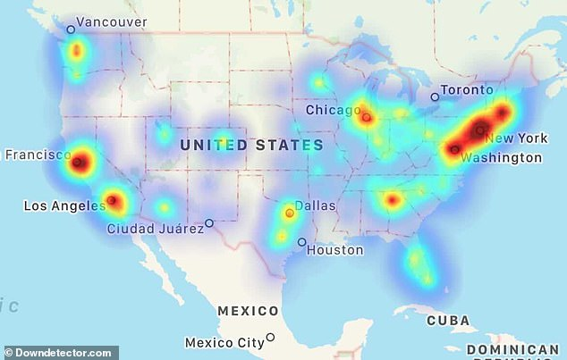

<!-- Downdetector's outage-report map: reported service outages smoothed into a density surface across the United States. Useful as a caution. The bright spots track where people live as much as where the outages are, because the input is reports, not incidents per capita. Same trap in a suitability map: a dense input layer can dominate the result. -->

---

# Next: Lab 9 — Wind Farm Site Selection

<!-- TODO(graphic): this slide needs a figure from the wind farm lab — a suitability
     surface or the finished site map — once those captures exist. No image was added
     rather than reusing one already shown earlier in the deck. -->

- The lab applies this workflow end to end:
  [Lab 9 — Wind Farm Site Selection](https://byu-hydroinformatics.github.io/ce414-gis-applications/assignments/lab-09/)
- Bring the vocabulary from today with you: **reclassify**, **overlay**, **cell size**,
  **suitability surface**

<!-- Short preview only. Read the lab handout before class so you can answer setup questions. -->

---

# Before Next Class

<!-- TODO(graphic): closing slide has no figure. Per this pass's rules no image was
     generated; add one when the deck's artwork is next revisited. -->

- Reading: <!-- TODO(instructor): reading chapter --> see Learning Suite
- Take the open-book quiz on **Learning Suite**
- Finish [Lab 8](https://byu-hydroinformatics.github.io/ce414-gis-applications/assignments/lab-08/), due this week
- Start [Lab 9 — Wind Farm Site Selection](https://byu-hydroinformatics.github.io/ce414-gis-applications/assignments/lab-09/)
- Questions? Office hours: [calendly.com/dan-ames/office-hours](https://calendly.com/dan-ames/office-hours)

<!-- VERIFY: schedule reconstructed. Confirm that Lab 8 is due in Week 10 and Lab 9 is the next assignment before showing this slide. -->

<!-- TODO(instructor): this deck is too short to carry the wind farm suitability lab on its own. It stops at "combine the layers" and never covers the decisions the lab requires. Missing, in the order a student needs them:
  1. Hard constraints versus soft preferences — which criteria are pass/fail masks and which are scored on a range.
  2. Normalization and reclassification choices — how to get criteria measured in different units onto a common scale, and how the choice of class breaks changes the map.
  3. Weights as assumptions — stating a weight is stating a value judgment; it belongs in the write-up, not buried in a tool dialog.
  4. Sensitivity analysis — re-run with different weights and breaks, and report how much the answer moved.
  5. Environment settings for a multicriteria model — extent, cell size, snap raster, mask, and coordinate system, set once so every layer lines up.
These are content decisions for the instructor, not conversion fixes, so nothing has been written for them here. -->

<!-- Conversion notes (2026-09-03): source is "CE 414 Week 10 - Raster Based Spatial Analysis.pptx", 8 slides, converted to 14. No slides were dropped and no hidden slides existed. The expansion is layout only: the source's Overlay slide carried two unrelated diagrams and was split into "stack the layers" and "cell-by-cell arithmetic"; the Reclassify slide's schematic and its DEM worked example were split; the Create Heat Map slide's three images were split across two slides. Title and Today's Goals slides were added per the conversion guide. Slide 3's discussion question is marked `_class: activity`. Two GIFs (the reclassification schematic and the layer stack) plus three more were converted to PNG; the 2048-px temple photo was resized to 1800 px JPEG. The source deck contains no ArcGIS UI screenshots at all, so nothing needed ArcMap-to-Pro replacement — but that also means nothing in this deck shows a student where these tools live. Two VERIFY comments name ArcGIS Pro tools (Reclassify, Raster Calculator) that were not checked against a running Pro session. Two TODO(graphic) markers (the Lab 9 preview slide and the closing slide have no figure; none was generated, per this pass's rules). The Before Next Class slide's schedule is reconstructed, not taken from the source. See the TODO(instructor) above for the content gaps between this deck and the wind farm lab. -->
