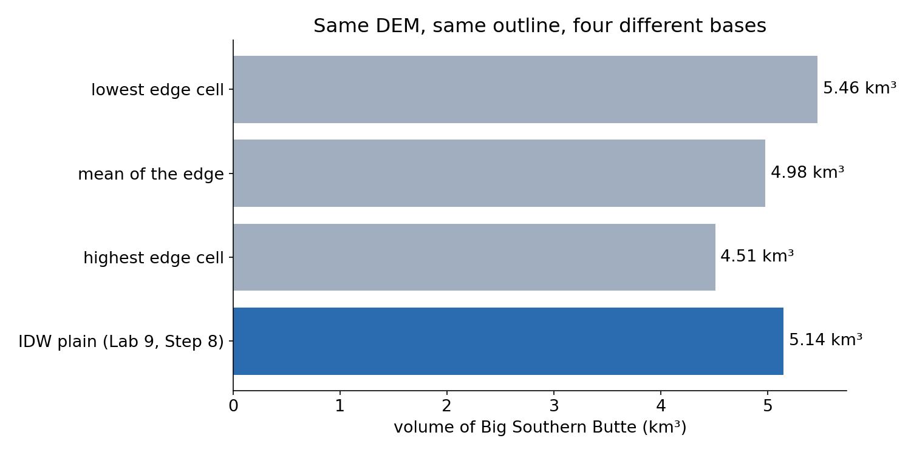
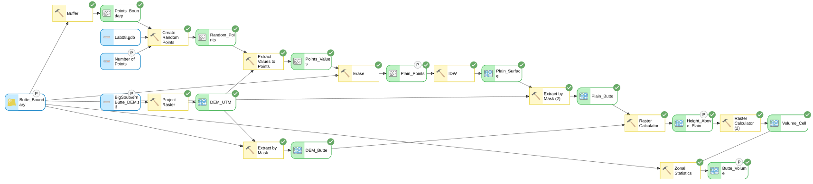
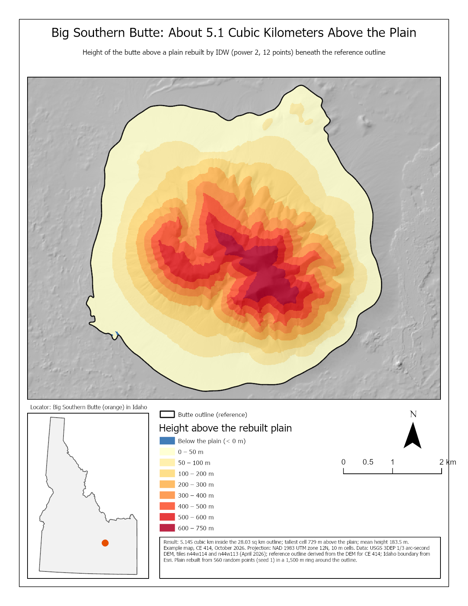

<!-- _class: lead -->
<!-- _paginate: skip -->

# Volumes with Rasters

## How Much Rock Is in a Mountain? — and Lab 9

CE 414 Engineering Applications of GIS
Civil & Construction Engineering
Brigham Young University
Dr. Dan Ames

<!-- Thursday of Week 10. Tuesday's cut and fill was a difference of two surfaces that both exist: the ground and a design. Today the bottom surface is one nobody can see: the plain under Big Southern Butte, which Lab 9 rebuilds by interpolation (Week 9's methods) before it measures the dome. The title image is a profile through the summit from the Lab 9 DEM. -->

<!-- stamp:begin -->
<!-- _footer: 'CE 414 · Week 10 — Volumes with RastersLast Updated: 2026-10-09© 2026 Daniel P. Ames · <a href="https://creativecommons.org/licenses/by/4.0/">CC BY 4.0</a>' -->
<!-- stamp:end -->

---

# Today's Goals

By the end of class you should be able to:

- Write any raster volume as **height × cell area, summed**
- Compute it in ArcGIS Pro two ways: **Raster Calculator + Zonal Statistics**, and **Surface Volume**
- Explain why the **base surface** is the biggest choice in the answer
- Say what **Lab 9** asks for, and how you will know you are right

---

<!-- _class: lead -->

# Part 1 — A Volume Is a Sum

---

# Height × Area, Summed

- Every cell: **height above the base × cell area**
- 10 m cells: each meter of height is **100 m³**
- Sum the cells: **m³**; ÷ 1,000³ for **km³**
- Lake (Week 7), pad (Tuesday), mountain (today): **the same sum**

<!-- The only things that change between Week 7's lake, Tuesday's pad and Lab 9's butte are the two surfaces: lid and bottom. For a lake the lid is the water level and the bottom the lake bed; for the pad, ground and design; for the butte, the DEM and a rebuilt plain. Units again: the DEM must be projected so the cell size is in meters; a geographic DEM's "cell size" is in degrees. -->

---

# In ArcGIS Pro, Two Ways

- **Raster Calculator** for height, × 100 ÷ 1,000³ per cell, then **Zonal Statistics**, statistic **Sum**: any base, even a curved one (Lab 9)
- **Surface Volume** (3D Analyst): volume **above or below a flat plane**, written to a text file
- Above **1,572.2 m**, the butte holds **4.99 km³** over **26.2 km²**

<!-- Surface Volume run in ArcGIS Pro 3.7.1's arcpy on the Lab 9 DEM (projected to UTM 12N, 10 m) clipped to the reference outline: plane 1,572.2 m (the mean of the outline's edge cells), ABOVE, 4.988 km³, 2-D area above the plane 26.17 km². The same number came from summing the cells directly. It only takes a flat plane, which is why Lab 9 uses the Raster Calculator route. The figure is the finished Lab 9 model. -->

---

<!-- _class: lead -->

# Part 2 — The Base Is the Answer

---

# Same DEM, Four Bases

- Three **flat** bases from the outline's edge: **5.46, 4.98, 4.51 km³**
- Lab 9's **interpolated plain**: **5.14 km³**
- The base alone moves the answer by about **a fifth**

<!-- Flat bases: the lowest edge cell (1,554.8 m), the mean of the edge (1,572.2 m) and the highest edge cell (1,588.9 m), each summed signed over the 280,311 cells of the outline (tools/week10_volume_figures.py). The interpolated value is Lab 9's published Step 8 check (5.145 km³); none of Lab 9's Step 9 sensitivity results are shown here. Ask which one is right before showing the next slide. -->

---

# Why a Flat Base Is Wrong Here

- The plain is **not level**: it falls toward the north by **tens of meters** across the butte
- A flat base buries the butte's low side and lifts its high side
- An **interpolated** base follows the plain, from points sampled **all around**

<!-- Read the profile: the plain at the north end sits well below the plain at the south end. A single elevation cannot fit both. Lab 9 samples random points on a ring of plain around the outline and interpolates across the gap, which is the Week 9 lesson put to work. -->

---

# Where Does the Butte End?

- The **outline** is a choice: Lab 9's was drawn by a rule from the DEM
- Lava flows of the plain may **lap against** the dome: that part is buried
- A volume **above an interpolated surface** is what the DEM can see

<!-- The example map is the Lab 9 page's baseline sheet (height above the rebuilt plain). The reference outline is every cell more than 10 m above a plane fitted to the plain (READ-ME-FIRST.txt in the Lab 9 package). Lab 9 Step 9 has each student digitize their own outline; the answers are theirs to find. -->

---

<!-- _class: lead -->

# Part 3 — Lab 9, Big Southern Butte

---

# Lab 9 at a Glance

- **The data**: a 10 m DEM of the butte and a reference outline, prepared for you
- **The model**: random points on the plain → **IDW** → height above the plain → **Zonal Statistics Sum**
- **Then**: four runs that change the points, the outline, and the method

[Lab 9 — Big Southern Butte](https://byu-hydroinformatics.github.io/ce414-gis-applications/assignments/lab-09/)

<!-- Lab 9 is due Saturday of this week. Remind them: the Random Number Generator seed in Step 0 is what makes their baseline match the page, and a run from the tool dialog deletes everything that is not a model parameter. -->

---

# How You Will Know You Are Right

- Volume: **5.145 km³**
- Tallest cell: **729.1 m** above the plain; mean **183.5 m**
- Sanity check: **28.03 km²** × **183.5 m** ≈ **5.14 km³**

<!-- All three are TIP check values on the Lab 9 page (Steps 7 and 8). The sanity check is the one to teach: area times mean height must equal the sum, or the units are wrong somewhere. -->

---

# Before Next Class

- **Lab 9 — Big Southern Butte** — due **Saturday 11:59 pm**
- **Quiz 9** (Chapter 9) — due **Saturday 11:59 pm**
- Next week: **coordinate systems and GPS** refreshers, and **Lab 10 — Avalanche Hazard**
- Office hours: [calendly.com/dan-ames/office-hours](https://calendly.com/dan-ames/office-hours)

<!-- Deck written October 9, 2026. Figures: tools/week10_volume_figures.py; the model diagram and example map are copied from the Lab 9 page. -->

---

<!-- _class: activity -->

# One Last Thing — The Base Is the Answer

Five questions on raster volumes, units, Surface Volume and choosing a base. **Scan the code**, or open the link below.

- Not graded, nothing recorded — it is a check that today landed
- Every answer explains itself; read the explanation before you move on
- The units question is the one Lab 9 punishes

byu-hydroinformatics.github.io/ce414-gis-applications/quizzes/volumes/

<!-- Four minutes, in pairs. If the room has no signal, put the URL on the board. -->
