<!-- TODO(instructor): the course plan moves the operational coordinate-system material (setting a
     project CRS, defining vs. projecting, choosing units) forward to Weeks 1-2, and rebuilds this
     session around the decisions a student actually faces in a lab: units, acceptable distortion,
     datum, raster cell size, and when a transformation is required. This conversion keeps the
     original 2026 order and content so nothing is lost; decide the restructure before the deck is
     assigned to students. -->

<!-- _class: lead -->
<!-- _paginate: skip -->

# Coordinate Systems and Projections

CE 414 · Engineering Applications of GIS
Dr. Dan Ames

<!-- Review session. The deck was inherited from the introductory Geomatics course, so the title slide originally read "CCE 114 Geomatics"; it now names CE 414. Everything after this is a review of the concepts the labs depend on. -->

---

# Today's Goals

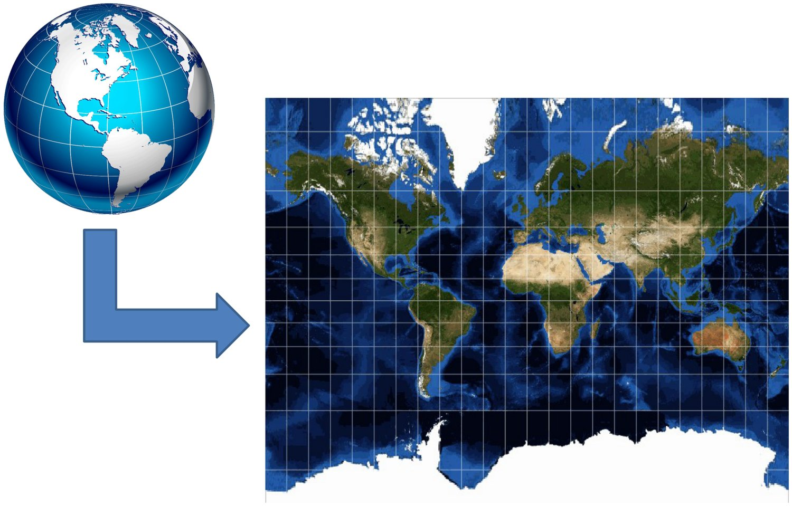

By the end of class you should be able to:

- Explain why the **distance between two points** depends on the coordinate system
- Name a projection's **surface** (cylindrical, conic) and its **case** (tangent or secant; normal, transverse, oblique)
- Say where a **UTM zone** and a **Lambert Conformal Conic** are each least distorted
- Tell a **geoid** from an **ellipsoid**, and a **datum** from a **projection**
- Say what a **datum transformation** does, and when a project needs one

<!-- This is a review, not new material. Set the frame: every choice on this list shows up as a dialog box in the lab. -->

---

<!-- _class: lead -->

# Part 1

## The shape of the Earth, and why a flat map cannot be right everywhere

---

# What is the distance from BYU to the University of Utah?

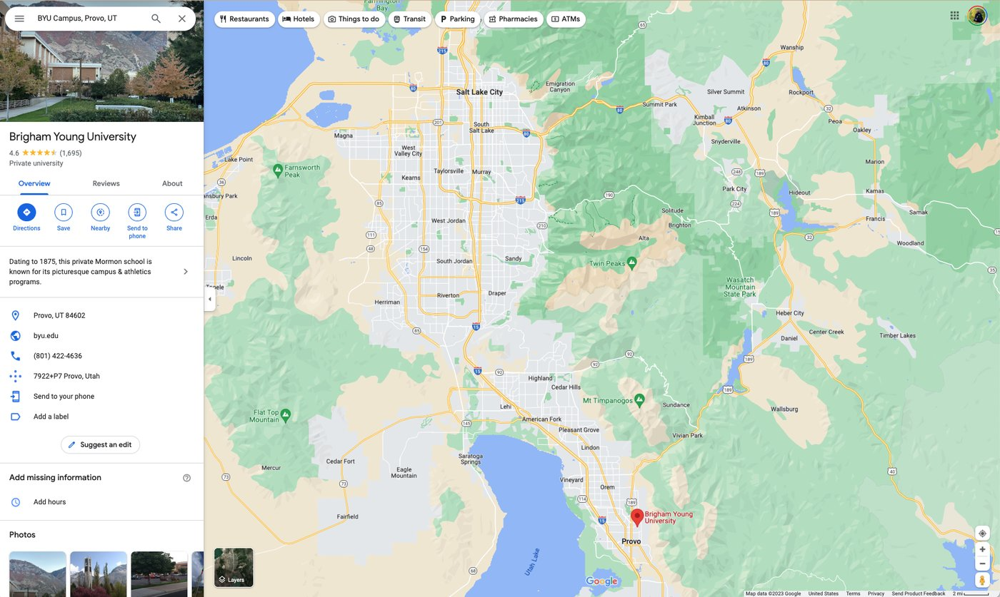

- BYU **40.2518° N, 111.6493° W**
- Utah **40.7649° N, 111.8421° W**

Subtract the coordinates. What are the units of the answer?

<!-- Degrees are angles, not lengths. Subtracting latitudes gives you a number in degrees, and a degree of longitude is not the same ground distance as a degree of latitude, and neither is constant. This is the whole reason we project. -->

---

# What is the distance from BYU to the University of Utah?

- BYU **444719 E, 4455708 N**
- Utah **428252 E, 4512351 N**

Now subtract. Same two points, and the answer comes out in **meters**.

<!-- Same pair of points expressed in UTM. Now the coordinates are linear, in meters, so the Pythagorean distance is meaningful. The source slide labeled both eastings "W"; UTM coordinates are eastings and northings, so that was corrected to "E". -->

<!-- VERIFY: these easting/northing values are consistent with UTM Zone 12N (NAD 83), but the source slide never named the zone or the datum. Confirm before using the numbers as a worked example. -->

---

# Let's Look at Some Projections

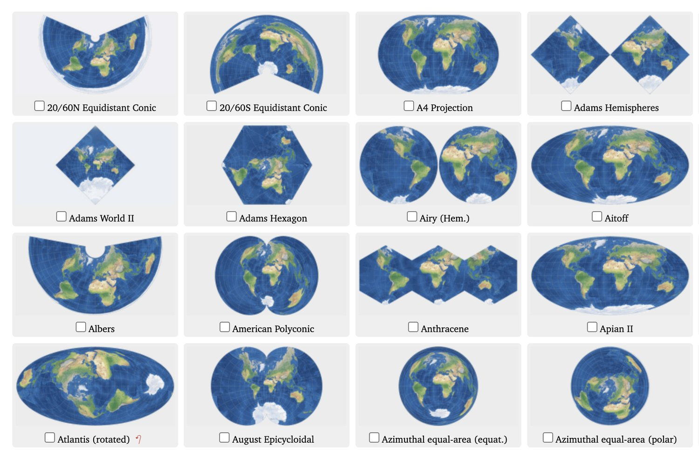

- [Map Projection Transitions](https://www.jasondavies.com/maps/transition/) — watch one projection morph into another
- [Interactive Album of Map Projections](https://projections.mgis.psu.edu/)
- [Compare Map Projections](https://map-projections.net/imglist.php)

<!-- Spend a few minutes in the transition tool. The point is that there are hundreds of projections and none of them is "the right one" - each one gives something up. -->

---

<!-- _class: activity -->

# Globe Activity: The Great Circle

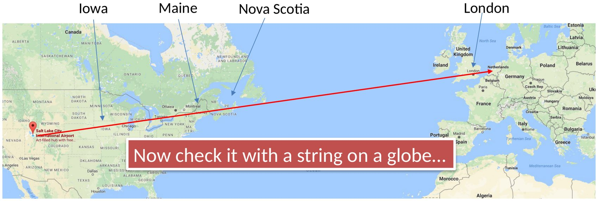

- Choose a country or city in Europe. You are flying there from Salt Lake City.
- Which states and countries will you pass over?

<!-- Do this first, before they look at the globes. Take answers from the flat map: most students will trace the straight line and say Iowa, Maine, Nova Scotia, then London. -->

---

<!-- _class: activity -->

# Globe Activity: The Great Circle

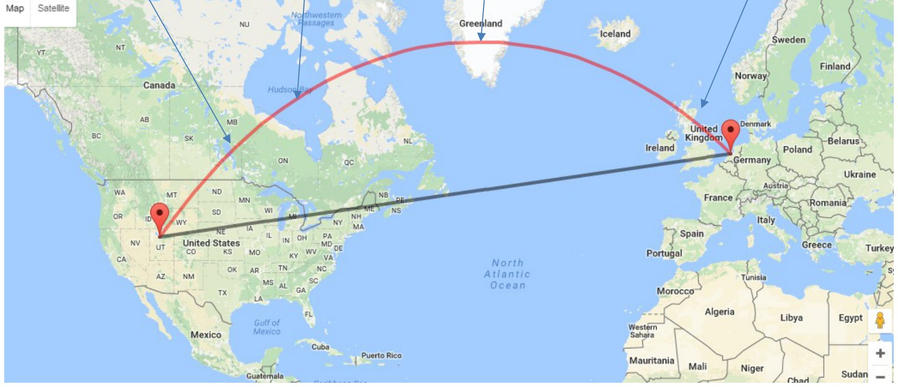

- Now check it with a string on a globe

<!-- Now look at the globes and use the string to find the shortest path. It turns out to run over Hudson Bay, Canada, and Greenland, not across the Atlantic the way the flat map suggests. Ask them to explain this. The shortest path on a sphere is a great circle, and the flat map has bent it. -->

---

<!-- _class: quiz -->

# What is Geodesy?

<ol type="A">
<li>The science of measuring the shape of the Earth</li>
<li>The science of studying rocks and minerals</li>
<li>The science of finding positions based on satellites</li>
<li>The science of the distributions of populations and resources on the Earth</li>
</ol>

<!-- Answer: A. Geodesy is the measurement of the Earth's shape, orientation, and gravity field. B is geology, C is roughly GNSS, D is geography. -->

<!-- TODO(graphic): this slide has no visual. A simple figure contrasting geodesy, geology, and geography would help; it must not be a fabricated screenshot. -->

---

# Problem 1: humans perceive the Earth's surface as flat

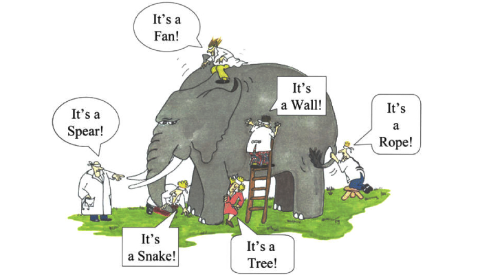

At our scale, we do not see the curve of the Earth.

<!-- The blind men and the elephant: each of them is reporting honestly about the piece they can reach. At human scale, flat is a perfectly good local model, and that is exactly why it is such a persistent error at continental scale. -->

---

# Flat Earth, 1893

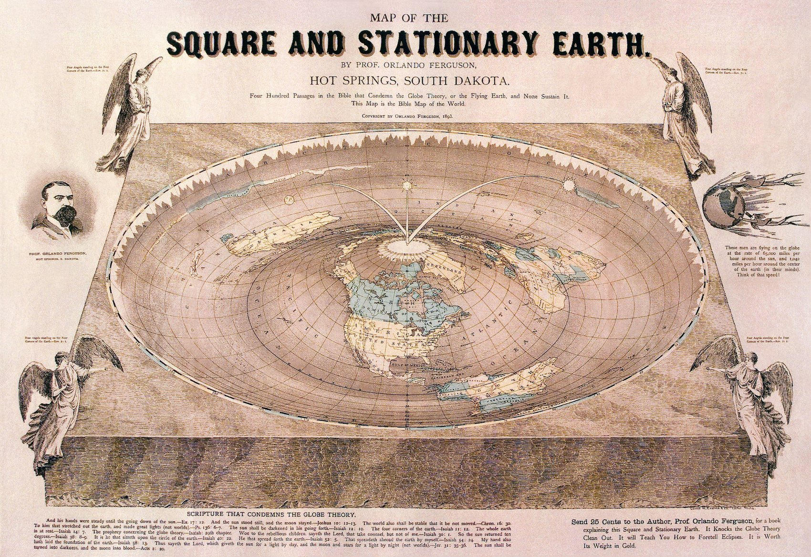

<!-- Orlando Ferguson's "Square and Stationary Earth," Hot Springs, South Dakota, 1893. Fun fact: some have argued the Earth is flat in order to validate scriptural statements, for example the "four corners of the earth." -->

---

# It is still a thing

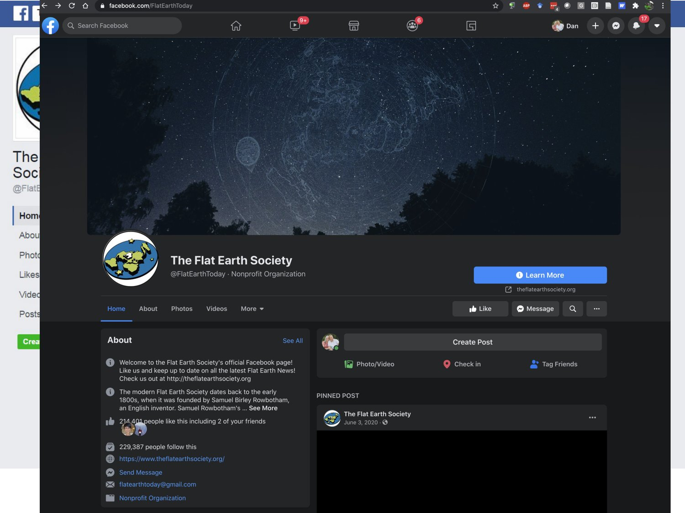

<!-- It's still a thing - see Facebook. Screenshot of the Flat Earth Society page, captured around 2020. Worth ten seconds, not more; the teaching point is that a locally-flat model feels right. -->

---

# From a curved surface to a flat sheet

<!-- It is difficult to represent the curved Earth on flat paper, so we get distortion. Everything in Part 2 is a strategy for deciding *which* distortion you are willing to accept. -->

---

# Projections

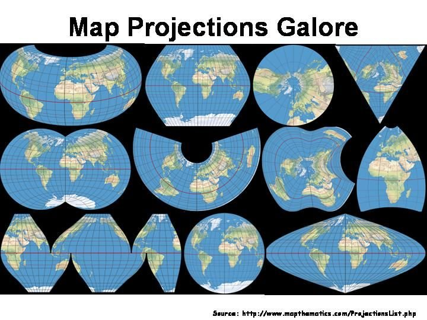

**How do you represent the curved Earth on a flat map?**

- There is no way to flatten a sphere without stretching, tearing, or shearing it
- Every projection preserves some properties and sacrifices others:
  - **Area** (equal-area)
  - **Shape / angles** (conformal)
  - **Distance** (equidistant)
  - **Direction** (azimuthal)
- No projection preserves all four

<!-- Source figure is a poster of projection outlines. The four properties are the vocabulary for the rest of the hour. -->

---

# A typical world map

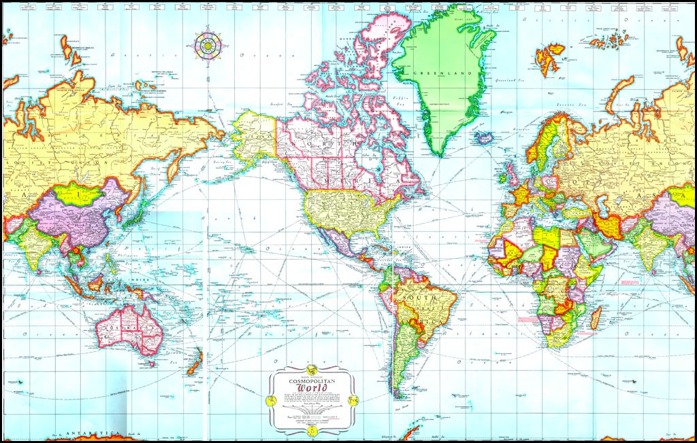

<!-- Here is a typical map of the Earth. What is the dominant feature? Why is Greenland so huge? Look at the globes: Greenland is closer in size to which country in the western hemisphere? Mexico. This map makes Russia, Canada, and Greenland look like the dominant countries in the world. -->

---

<!-- _class: quiz -->

# Greenland is approximately the same size as…

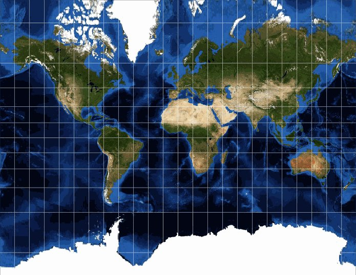

<ol type="A">
<li>Africa</li>
<li>Delaware</li>
<li>Russia</li>
<li>Mexico</li>
</ol>

Compare some places yourself: [thetruesize.com](https://www.thetruesize.com/)

<!-- Answer: D, Mexico. On a Mercator map Greenland looks like Africa; on the globe it is about the size of Mexico. Drag Greenland down to the equator in thetruesize.com and let them watch it shrink. -->

---

# The Peters world map

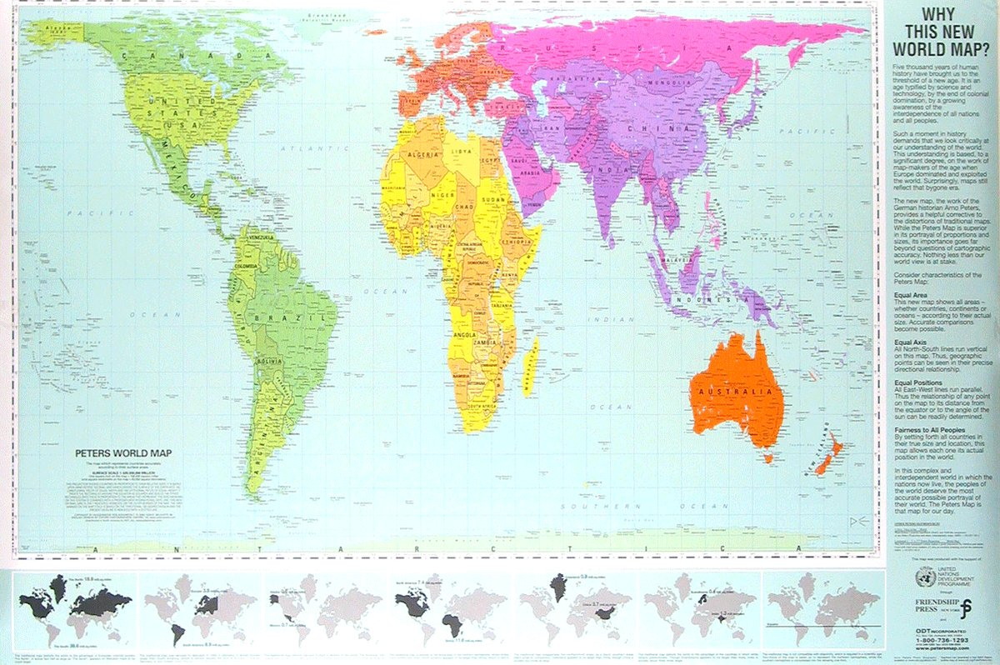

<!-- This is the Peters map. What kind of projection is it? It does not fit conic, and it is not Mercator. It is a cylindrical projection, but the north and south spacing of the parallels is compressed so that each country keeps its correct proportional area: a cylindrical equal-area map. North-south and east-west directions are maintained and area is maintained; shape is squashed, so it is not conformal. It was developed for political purposes, to communicate the relative importance of countries by their true size. -->

---

# The Mercator projection

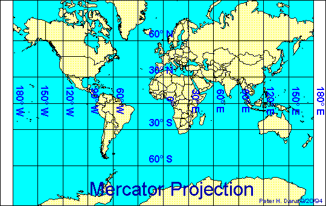

<!-- This is a Mercator projection - not a Transverse Mercator. How would it be made? By wrapping the projection surface as a cylinder around the Earth and projecting outward from a light source at the center of the Earth onto that surface. -->

---

# How do projections work?

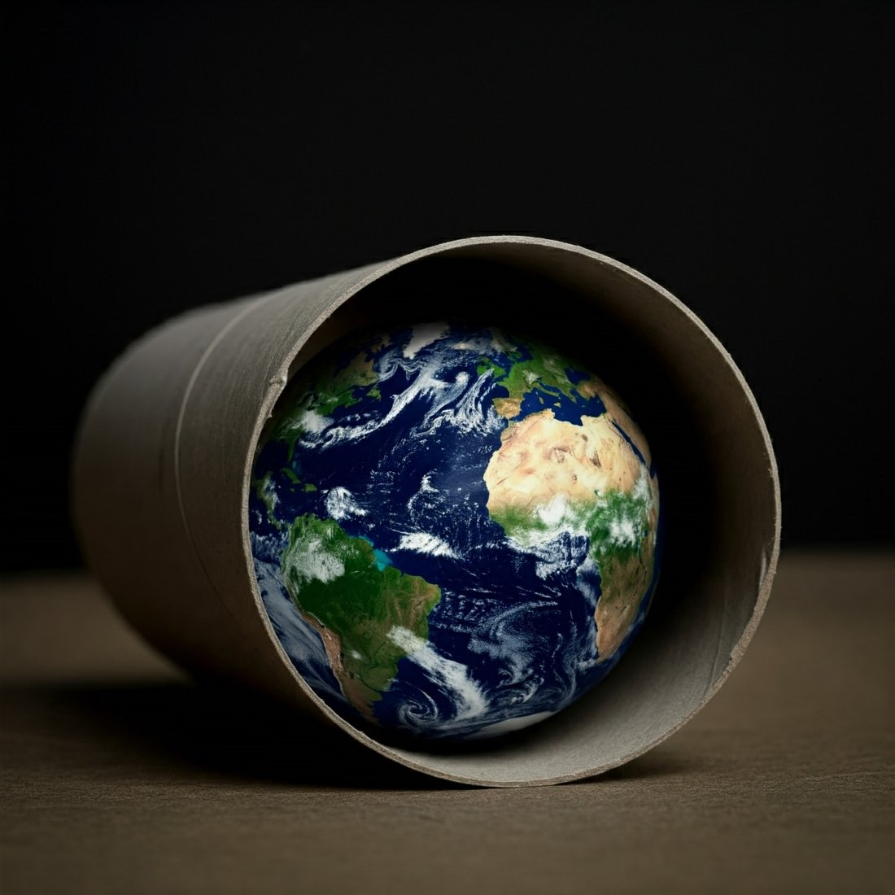

- Put a **developable surface** — a cylinder, a cone, or a plane — against the globe
- Project the features of the globe onto that surface
- Unroll it. That flat sheet is your map.

<!-- Developable means it can be unrolled flat without stretching: a cylinder, a cone, or a plane. A sphere is not developable, which is the whole problem. -->

---

# The projection surface

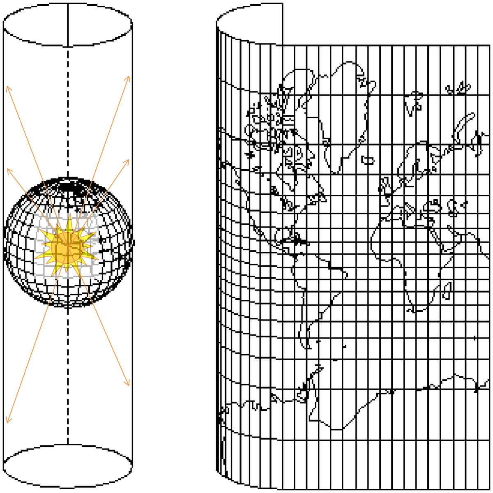

<!-- How do we get that kind of map? By creating a projection surface. Light source at the center, rays outward through the globe's graticule onto the cylinder, then the cylinder unrolls into the rectangular grid on the right. Note how the parallels spread apart toward the poles - that spreading is the Greenland problem. -->

---

<!-- _class: lead -->

# Part 2

## Projection surfaces, UTM, Lambert, and datums

---

# Tangent or secant?

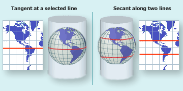

- **Tangent**: the surface touches the globe along one line. Scale is true on that line and degrades away from it.
- **Secant**: the surface cuts through the globe along two lines. Scale is true on both, slightly small between them, and large outside them.
- Secant spreads the error over a wider band, which is why most working projections are secant.

<!-- Source figure is low resolution; it is the original slide art. The takeaway is the line (or lines) of true scale. -->

---

# Transverse and oblique Mercator

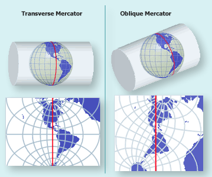

- Rotate the cylinder and the line of least distortion rotates with it
- **Transverse**: the cylinder is turned 90°, so the line of true scale runs along a **meridian**
- **Oblique**: the cylinder is tilted to any angle you like

<!-- Two other cases of the cylindrical, or Mercator, family are the transverse and the oblique Mercator. In each case there is a ring around the globe where distortion is minimized. What if you could recenter that line over an area of interest? For example, rotate the transverse Mercator surface around 360 degrees and line it up every 6 degrees. That is UTM, and it is the next slide. -->

---

# Universal Transverse Mercator zones

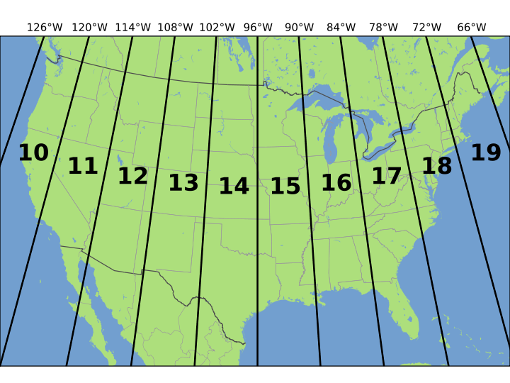

<!-- These are the UTM zones of the continental United States. Each zone is 6 degrees of longitude wide. How many are there around the globe? 60. Each zone is a separate Transverse Mercator projection with its own central meridian. -->

---

# Conic surfaces: tangent and secant

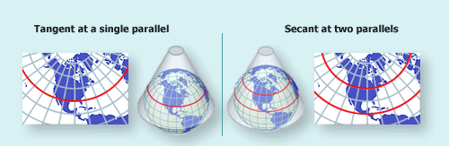

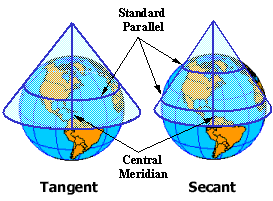

<!-- The same tangent/secant idea with a cone instead of a cylinder. Tangent at a single parallel, or secant at two. The line of contact is a parallel, so a conic projection is at its best across an east-west band. -->

---

# Lambert Conformal Conic (tangent)

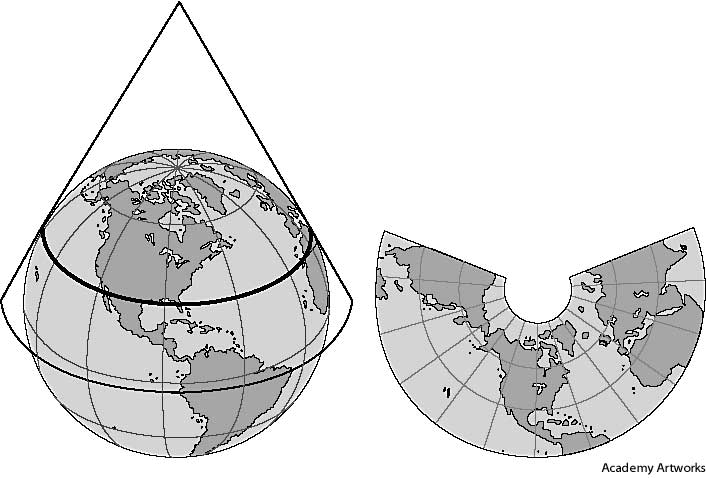

- A cone set on the globe, touching along one **standard parallel** (tangent) or cutting along two (secant)
- Conformal: shapes and angles are preserved locally
- Unrolls to a fan, with the parallels as arcs

<!-- Lambert Conformal Conic projections, tangent or secant, are another common category. Ask: which areas of the globe have distortion minimized here? -->

<!-- VERIFY: the source deck's Lambert terminology is uneven ("Lambert conic conformal", "Lambert conformal conic") and its distortion examples are asserted without a figure. Settle the wording and the examples before this is used as a graded reference. -->

---

<!-- _class: quiz -->

# What type of projection surface is this?

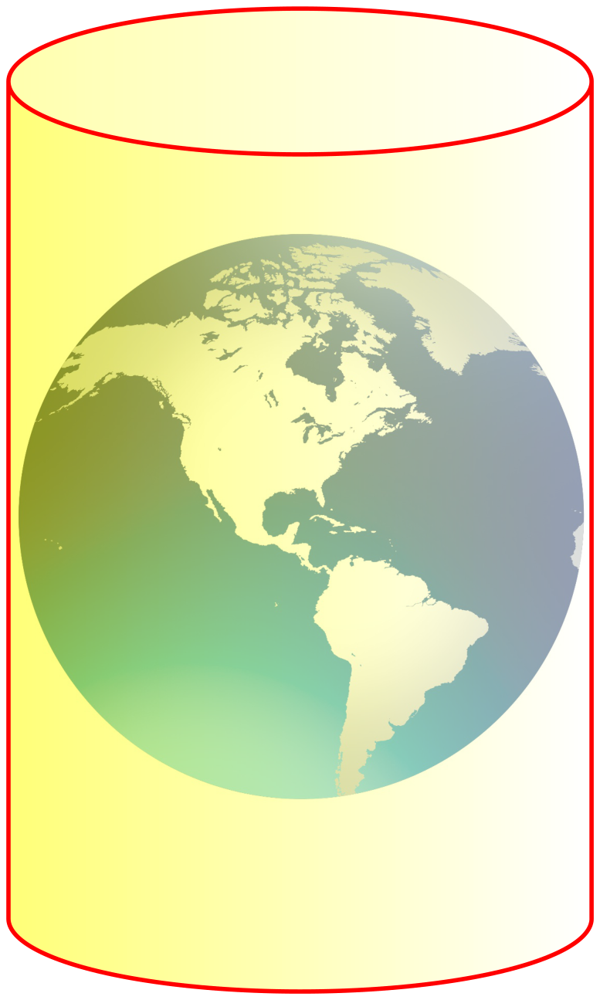

**Tangential, cylindrical**

<!-- Start of the rapid-fire drill. Cylinder, upright, touching along one line - the equator. -->

---

<!-- _class: quiz -->

# What type of projection surface is this?

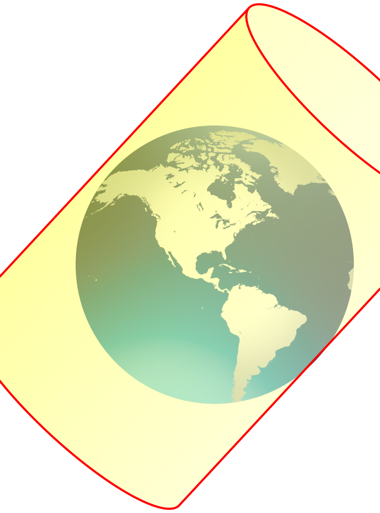

**Tangential, oblique, cylindrical**

<!-- Same cylinder, tilted, still touching along a single line. -->

---

<!-- _class: quiz -->

# What type of projection surface is this?

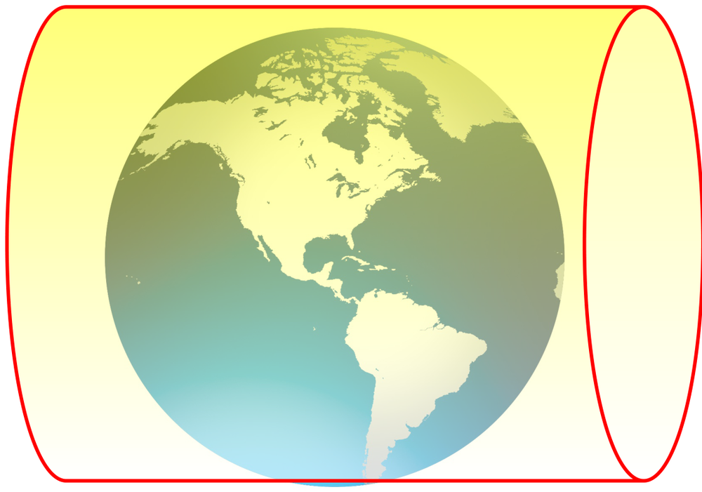

**Tangential, transverse, cylindrical — a Transverse Mercator**

<!-- The cylinder is turned 90 degrees, so it touches along a meridian instead of the equator. The source slide labeled this "aka Mercator", which is wrong: the plain Mercator is the normal (upright) case. Turned on its side it is a Transverse Mercator, and that is the family UTM comes from. -->

---

<!-- _class: quiz -->

# What type of projection surface is this?

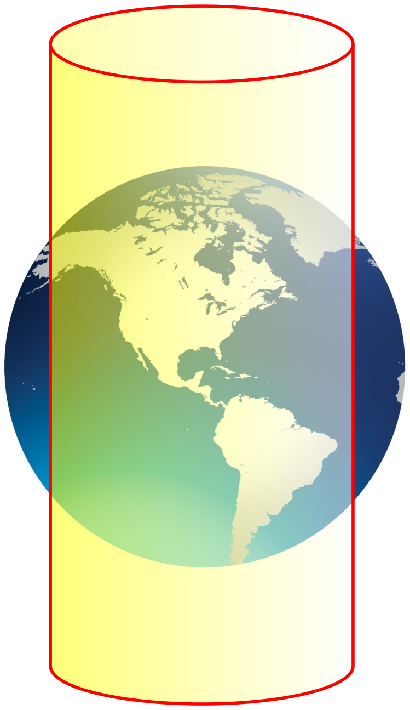

**Secant, cylindrical**

<!-- The cylinder is smaller than the globe now, so it cuts through: two lines of true scale instead of one. -->

---

<!-- _class: quiz -->

# What type of projection surface is this?

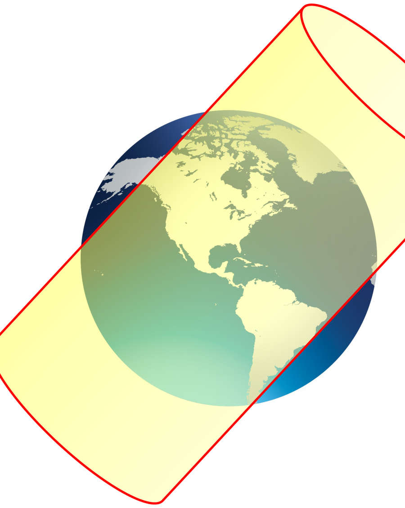

**Secant, oblique, cylindrical**

<!-- Tilted and cutting through. -->

---

<!-- _class: quiz -->

# What type of projection surface is this?

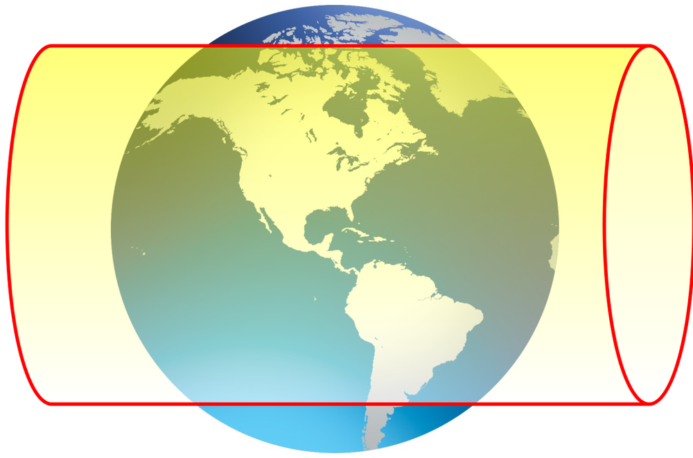

**Secant, transverse, cylindrical**

<!-- Turned 90 degrees and cutting through. This is the UTM case: each zone is a secant Transverse Mercator with a scale factor of 0.9996 on the central meridian. -->

---

<!-- _class: quiz -->

# What type of projection surface is this?

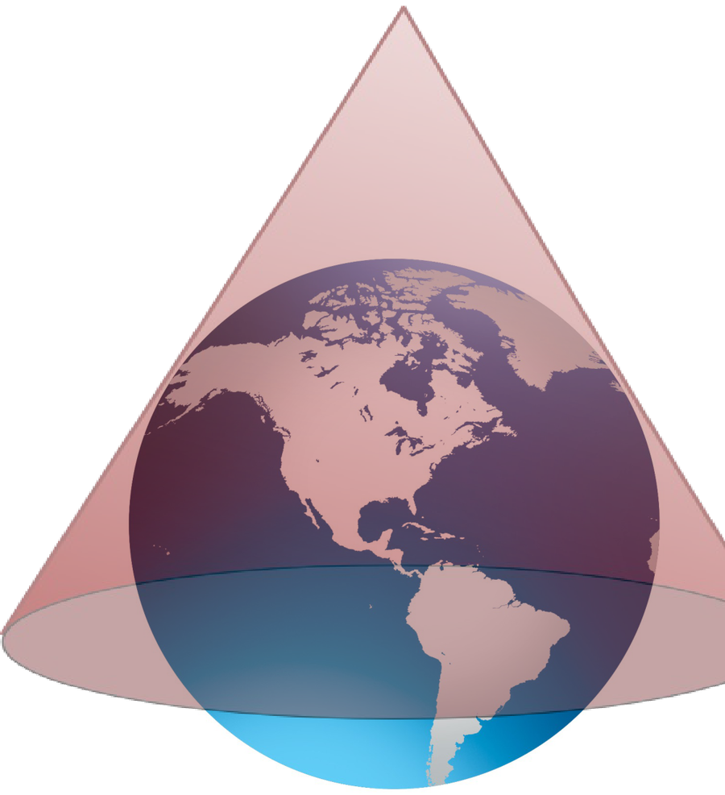

**Tangential, conic**

<!-- A cone resting on the globe, touching along one parallel. -->

---

<!-- _class: quiz -->

# What type of projection surface is this?

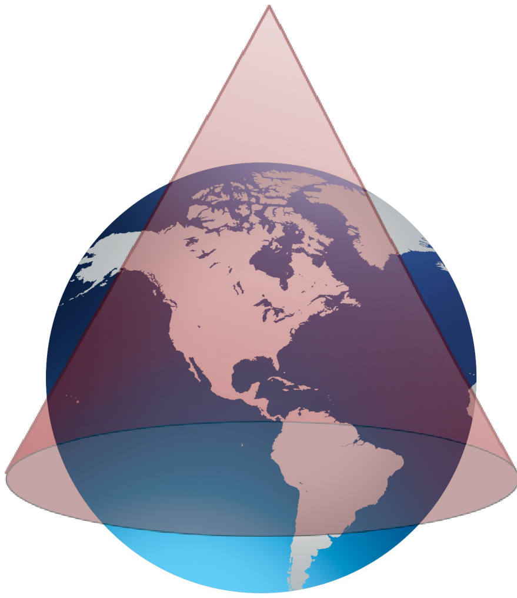

**Secant, oblique, conic — AKA Lambert conic conformal**

<!-- Source answer, kept verbatim. -->

<!-- VERIFY: two problems with the source label. The usual name is "Lambert Conformal Conic", not "Lambert conic conformal"; and the standard LCC used for State Plane and for national mapping is a *normal* secant conic (axis aligned with the Earth's axis), not an oblique one. Confirm the intended answer before this is reused on an exam. -->

---

<!-- _class: quiz -->

# Which statement is most accurate?

<ol type="A">
<li>Considering map distortion, this projection is equally suitable for every state in a straight line between Utah and Kentucky</li>
<li>Considering map distortion, this projection is equally suitable for southeastern Florida and northeastern Washington state</li>
<li>Considering map distortion, this projection is equally suitable for north, central, and south Texas</li>
</ol>

<!-- Ask first, take a vote, then show the distortion figure on the next slide. -->

<!-- TODO(graphic): the "ask" slide is deliberately bare so the evidence figure lands on the next slide; if a visual is wanted here, it must be the same distortion map, not a new one. -->

---

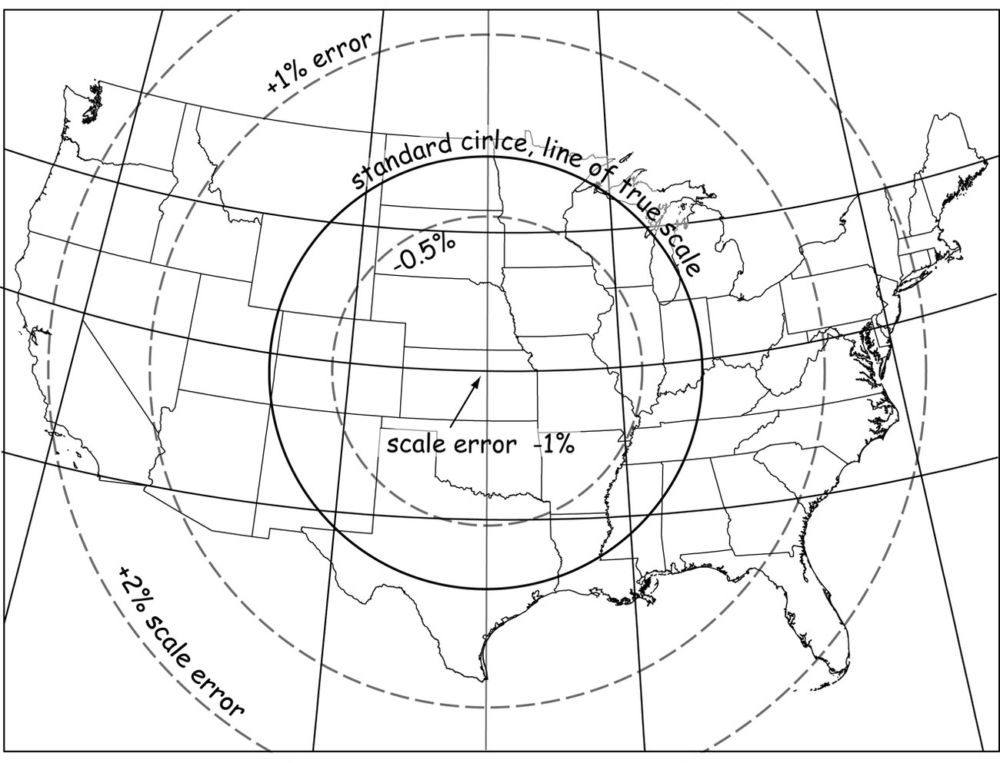

<!-- The evidence. Contours of scale error: a standard circle of true scale, then -0.5%, -1%, +1%, +2% arcs. Equal distortion follows the arcs, not the state lines. Give them a moment to find Florida and Washington on it. -->

---

<!-- _class: quiz -->

# Which statement is most accurate?

<ol type="A">
<li>…every state in a straight line between Utah and Kentucky</li>
<li><strong>…southeastern Florida and northeastern Washington state</strong></li>
<li>…north, central, and south Texas</li>
</ol>

<!-- Source answer: B. Both areas sit on roughly the same scale-error contour on this figure, even though they are nowhere near each other. -->

<!-- VERIFY: the source deck asserts B without stating which projection the figure shows or which contour the two areas fall on. Confirm the figure and the answer before this is used as a graded question. -->

---

<!-- _class: quiz -->

# Which statement is most accurate?

<ol type="A">
<li>UTM projections minimize distortion in distance, shape, and area equally well for all areas within a single UTM zone</li>
<li>UTM projections minimize distortion in distance, shape, and area along the equator</li>
<li>UTM projections minimize distortion in distance, shape, and area along a line of longitude at the middle of a particular UTM zone</li>
<li>UTM projections minimize distortion in distance, shape, and area in the northern hemisphere but not in the southern hemisphere</li>
</ol>

<!-- Ask first, then show the two UTM figures. -->

<!-- TODO(graphic): bare "ask" slide by design; the UTM zone figures follow on the next two slides. -->

---

# UTM zones

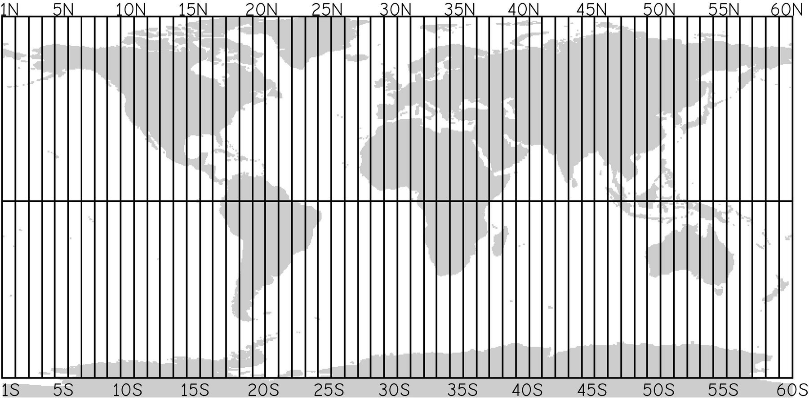

<!-- Sixty zones, each 6 degrees of longitude wide, numbered 1 to 60 eastward from the antimeridian, with separate north and south variants. Note that the zones are bounded by meridians, not by latitude. -->

---

# UTM zones

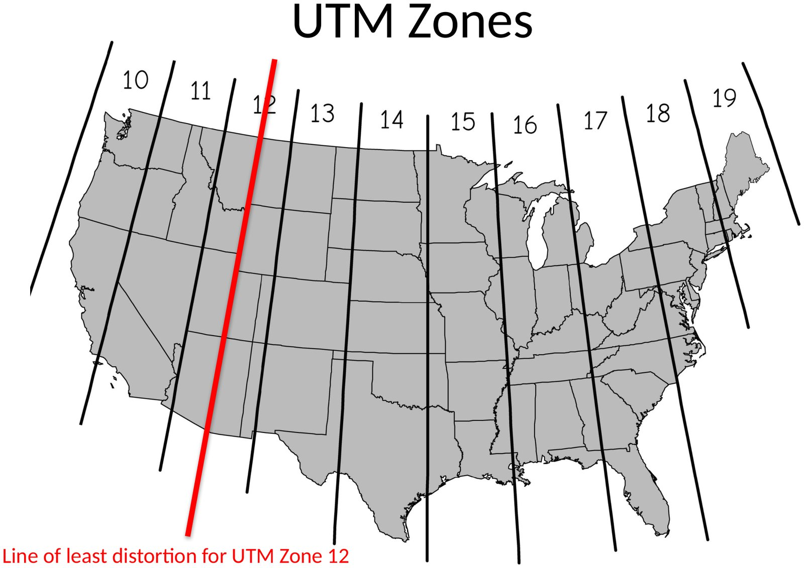

<!-- The red line is the central meridian of UTM Zone 12, the line of least distortion for that zone. Utah sits on it. Distortion grows east and west of it, not north and south. -->

---

<!-- _class: quiz -->

# Which statement is most accurate?

<ol type="A">
<li>…equally well for all areas within a single UTM zone</li>
<li>…along the equator</li>
<li><strong>…along a line of longitude at the middle of a particular UTM zone</strong></li>
<li>…in the northern hemisphere but not in the southern hemisphere</li>
</ol>

<!-- Answer: C. The central meridian of the zone. This is why a UTM zone suits a north-south study area and fights an east-west one. -->

---

<!-- _class: quiz -->

# Which projection best minimizes distortion in the state of Tennessee?

<ol type="A">
<li>Lambert Conformal Conic</li>
<li>Universal Transverse Mercator</li>
</ol>

<!-- Ask before showing the two maps. Prompt: what shape is Tennessee? Long east-west. -->

<!-- TODO(graphic): bare "ask" slide by design; the two distortion maps follow. -->

---

# Line of least distortion for UTM Zone 16

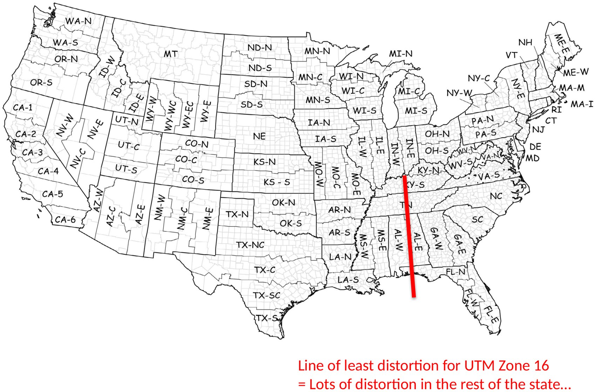

<!-- The red line is the central meridian of Zone 16, running north-south through the middle of Tennessee. It leaves most of the state, east and west, well off the line: lots of distortion in the rest of the state. -->

---

# Line of least distortion for a Lambert Conformal Conic

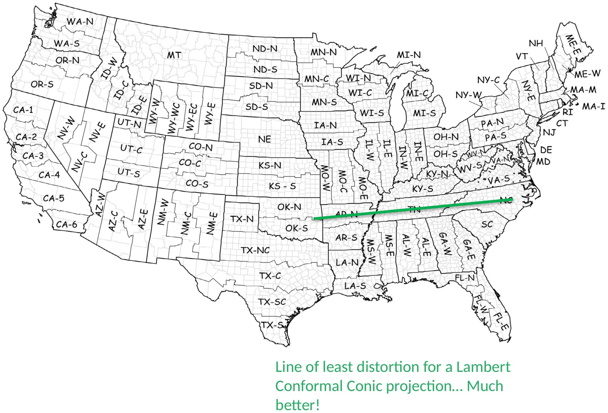

<!-- The green line runs east-west, along the long axis of the state. Much better. Base map is the State Plane zone layout, which is itself built on this logic: east-west states get Lambert Conformal Conic zones, north-south states get Transverse Mercator zones. -->

<!-- VERIFY: the source slide draws a single "line of least distortion" for the Lambert case. A secant LCC has two standard parallels, so there are two lines of true scale, with a band of slightly compressed scale between them. Confirm the intended simplification. -->

---

<!-- _class: quiz -->

# Which projection best minimizes distortion in the state of Tennessee?

<ol type="A">
<li><strong>Lambert Conformal Conic</strong></li>
<li>Universal Transverse Mercator</li>
</ol>

<!-- Answer: A. Match the shape of the zone to the shape of the study area: east-west extent wants a conic, north-south extent wants a transverse cylinder. -->

---

<!-- _class: quiz -->

# Why is coordinate transformation also referred to as registration?

<ol type="A">
<li>Because it is necessary to register your map online before it can be published</li>
<li>Because it registers the layers to a map coordinate system</li>
<li>Because one must register to obtain coordinate information</li>
</ol>

<!-- Answer: B. "Register" here is the printing-press sense: bringing separate layers into alignment on a common frame. -->

<!-- TODO(graphic): this slide has no visual. Two misregistered layers snapping into alignment would illustrate it; do not fabricate a screenshot. -->

---

# Problem: the Earth has an irregular shape

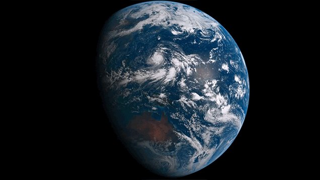

<!-- Second problem, after "humans think it is flat": the Earth is not a sphere either. It is an oblate, lumpy, changing solid. Every coordinate is reported against some agreed-on idealization of that shape. -->

---

<!-- _class: quiz -->

# Which is the closest mathematical approximation of the shape of the Earth?

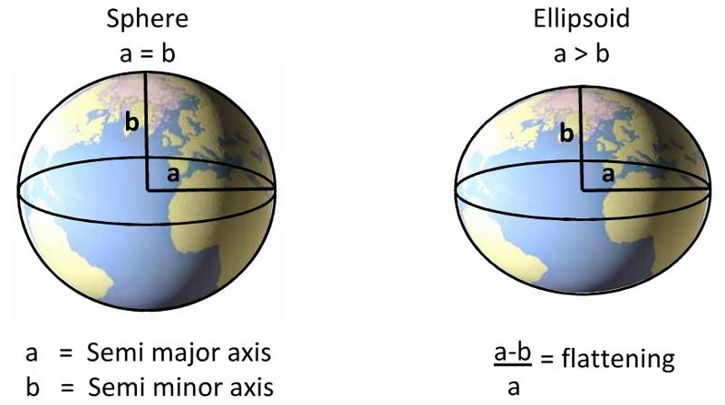

<ol type="A">
<li>Geoid</li>
<li>Ellipsoid</li>
<li>Spheroid</li>
<li>Tetraploid</li>
</ol>

<!-- Source answer: B, Ellipsoid. Figure contrasts a sphere (a = b) with an ellipsoid (a > b), and labels the semi-major axis a, the semi-minor axis b, and the flattening (a - b) / a. -->

<!-- VERIFY: "spheroid" and "ellipsoid" are used almost interchangeably in GIS software (Esri documentation says spheroid where PROJ says ellipsoid), so options B and C are hard to separate. Confirm the intended distinction before using this as a graded question. -->

---

# So then… what is the "geoid"?

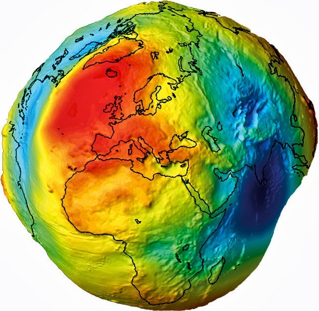

- An **equigravitational surface**
- The imaginary surface the sea would settle to, everywhere, if it could flow freely
- Sea surface level varies because **gravity** varies
- Gravity varies because **the density of the Earth** varies

<!-- The Earth is not really shaped like this - the figure is exaggerated to show the geoid. Keep the three surfaces straight: the topography is what you walk on, the geoid is the gravity-defined sea level, the ellipsoid is the smooth mathematical fit. Elevations are usually relative to the geoid; GNSS heights are relative to the ellipsoid. -->

---

# Problem: our ability to measure shape and position is… not great

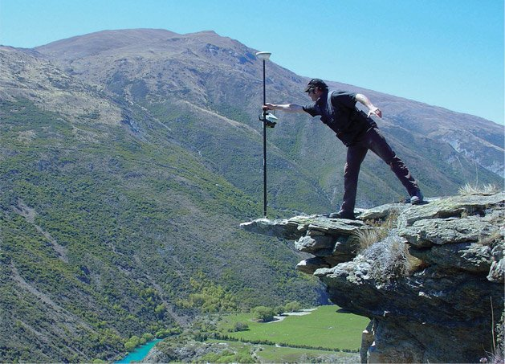

<!-- Third problem. Every ellipsoid and every datum is a best fit to the measurements available when it was defined, and the measurements keep getting better. That is why datums have version years. -->

---

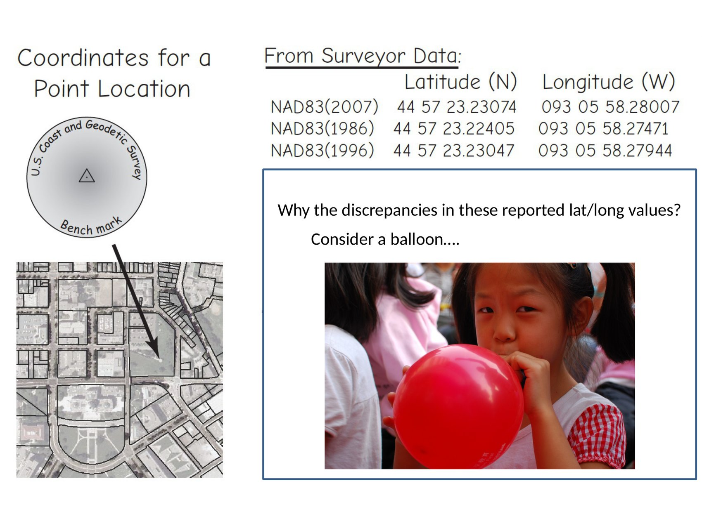

<!-- Why the discrepancies in these reported lat/long values? The same bench mark, published three times under three realizations of NAD 83, moves in the fourth and fifth decimal of a second. Nothing moved on the ground - the reference frame was re-solved. The balloon example works like this: as you reshape it into different ellipsoids, some points on the surface move closer together and some move further apart. -->

---

# NAD 83 (2007) versus NAD 83 (2011)

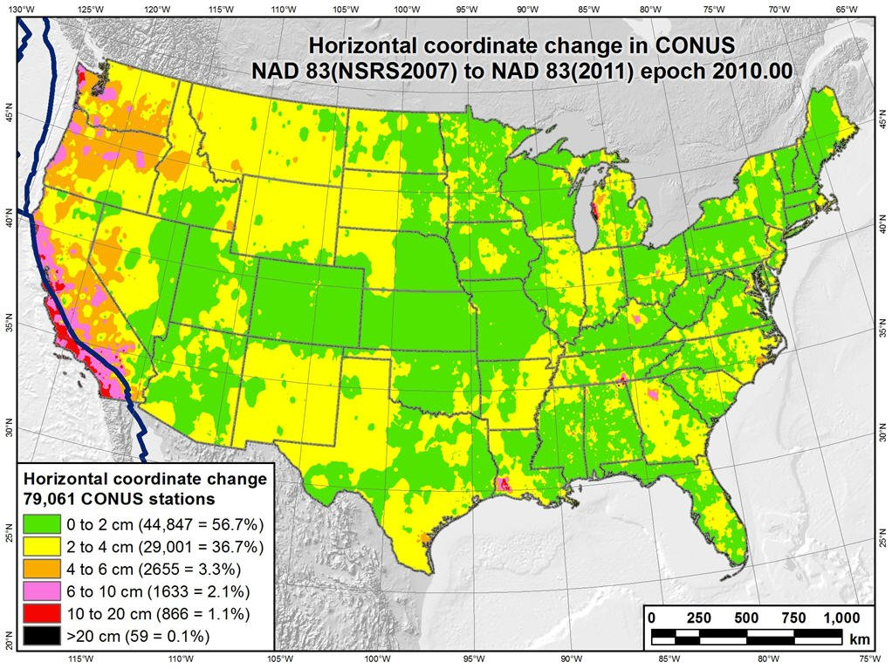

<!-- Horizontal coordinate change in the conterminous US between the NAD 83 (NSRS2007) and NAD 83 (2011) epoch 2010.00 realizations, over 79,061 CONUS stations. Most of the country moved 0 to 4 cm; the west coast moved much more. Same datum name, different realization. -->

---

# NAD 83 (2007) versus NAD 83 (2011)

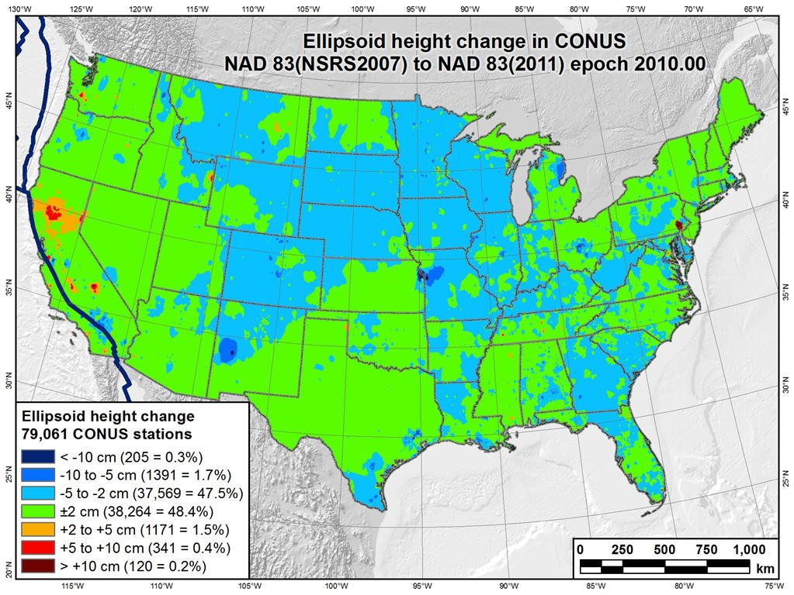

<!-- The vertical half of the same comparison: ellipsoid height change over the same 79,061 stations. Ask whether a few centimeters matters. For a watershed map, no. For a survey control point or a utility as-built, yes. -->

---

# How to deal with datum transformations?

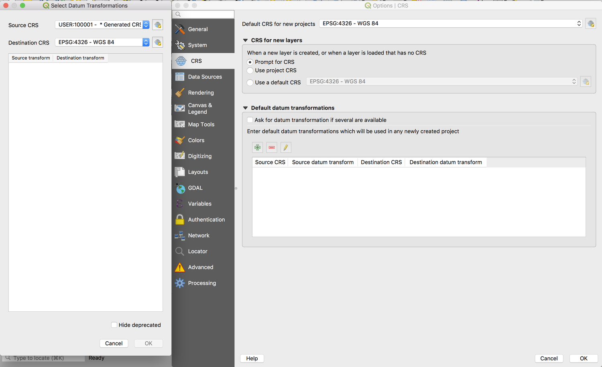

- Know **which datum** each dataset is in before you combine anything
- Let the GIS handle the transformation, but **choose the transformation deliberately** — the default is not always the right one
- Record the transformation you used, alongside the CRS, in your metadata

<!-- The source slide said "Let QGIS handle it," which is the wrong software for this course and the wrong habit besides: software will pick a default transformation silently, and defaults differ between products and versions. -->

<!-- TODO(instructor): replace with a defensible transformation-selection workflow. -->

<!-- TODO(graphic): the screenshot is the QGIS datum-transformation preferences dialog, carried over from the introductory course. It needs to be replaced with the equivalent ArcGIS Pro transformation dialog, captured in a real ArcGIS Pro session. The exact pane path is not asserted here because it was not verified in Pro. -->

---

# Public Land Survey System (PLSS)

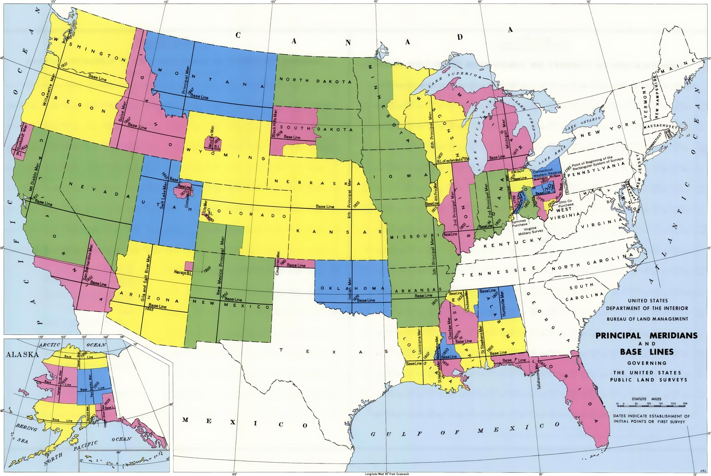

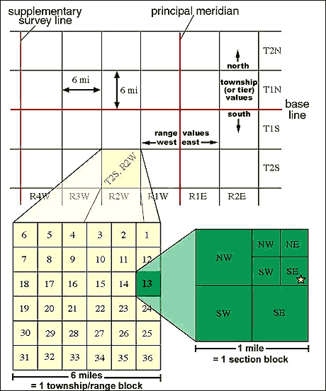

<!-- A lot of western US civil engineering happens at the local scale using the PLSS: township, range, and section off a principal meridian and base line. It is not a projected coordinate system in the sense of the rest of this lecture, but you will meet it in legal descriptions and in parcel data, and you will need to relate it to one. -->

---

# Before Next Class

- Read the assigned chapter <!-- TODO(instructor): reading chapter -->
- Take the open-book quiz on **Learning Suite**
- Current lab: [Lab 9](https://byu-hydroinformatics.github.io/ce414-gis-applications/assignments/lab-09/) — check the coordinate system of every layer before you combine them
- Questions? Office hours: [calendly.com/dan-ames/office-hours](https://calendly.com/dan-ames/office-hours)

<!-- VERIFY: schedule reconstructed. The pairing of this deck with Lab 9 was inferred from the week number, not read off a syllabus; confirm the current lab and the reading before class. -->

<!-- Conversion notes (2026-09-03): source "CE 414 Week 11 - Review - Coordinate Systems and Projections.pptx",
     56 slides (55 PDF pages; slide 14 is hidden). Converted to 57 slides: 55 source slides kept, plus a
     Today's Goals slide and a Before Next Class slide.

     DROPPED: source slide 14 (hidden), "Globe activity 1" - draw an equal-area map of the Americas from a
     globe, one globe per three students. It is a good activity and it is not reproduced here only because
     the guide drops hidden slides; re-add it after the Peters map slide if it is wanted.

     FIXED: (1) slide 30 labeled a transverse cylinder "aka Mercator" - corrected to "Transverse Mercator",
     since the plain Mercator is the normal (upright) case. (2) Slide 4 labeled both UTM eastings "W";
     corrected to "E". (3) "Earths surface" -> "Earth's surface". (4) Title slide read "CCE 114 Geomatics";
     it now names CE 414. (5) Slide 55's "Let QGIS handle it" is reworded software-neutral (see the
     TODO(instructor) on that slide).

     STALE / WRONG-SOFTWARE SCREENSHOT: images/crs-datum-transformation-dialog-qgis.png is the QGIS datum
     transformation dialog, inherited from the introductory course. It is kept, not fabricated, and flagged
     on its slide for an ArcGIS Pro re-capture. The Flat Earth Society screenshot is a c.2020 capture and
     will age; the 1893 flat-Earth map and the Peters map are historical and do not.

     NO ARCMAP-ERA UI: this deck contains no ArcGIS 9 / ArcMap / ArcCatalog / ArcToolbox screenshots or
     wording, so no version rewording was needed.

     VERIFY flags left in place: the UTM zone/datum behind the BYU-Utah easting/northing pair; the Lambert
     Conformal Conic naming and the "oblique conic" answer on the drill; the "southeastern Florida and
     northeastern Washington" distortion answer; the single "line of least distortion" drawn for a secant
     LCC; the ellipsoid-vs-spheroid quiz option; and the Lab 9 pairing on the last slide.

     TODO(graphic) left on five slides that have no visual and for which none exists in the source: the
     geodesy question, the three "ask" slides that precede their own evidence figures, and the registration
     question. Per this pass, no images were generated.

     STRUCTURE: the course plan wants the operational material moved to Weeks 1-2 and this session rebuilt
     around lab decisions (units, distortion, datum, cell size, transformations). That decision is flagged
     at the top of the file and has not been made here; the source order is preserved. -->
