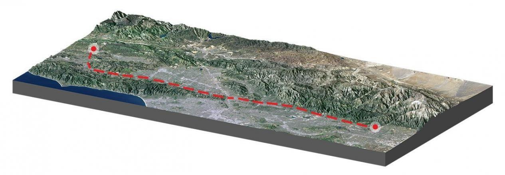
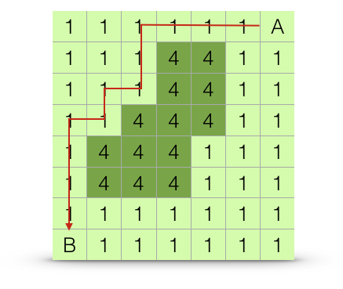
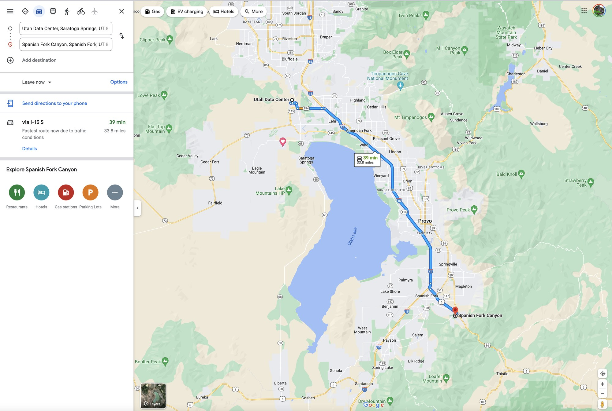
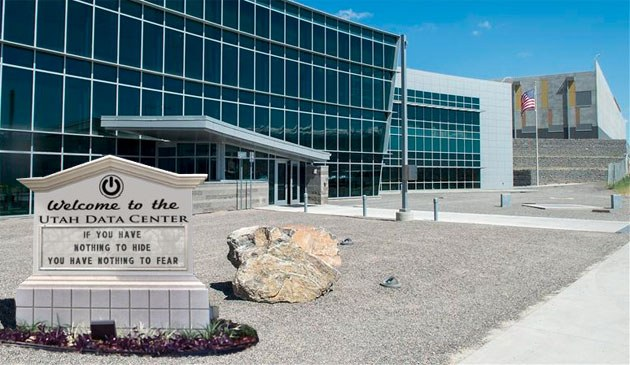
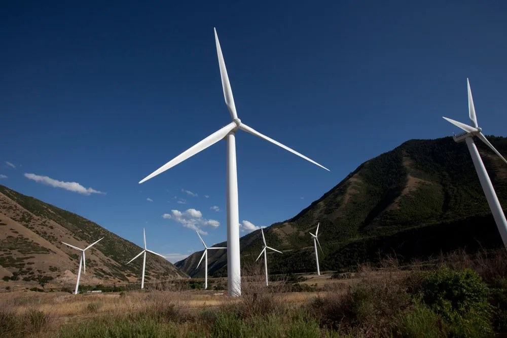
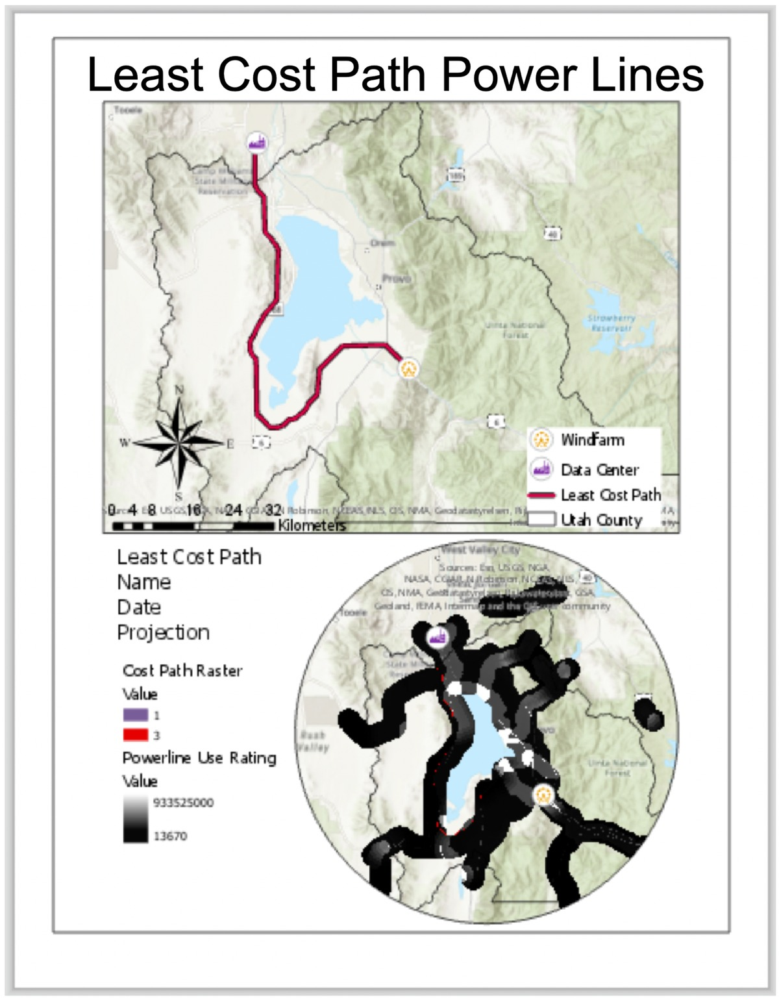
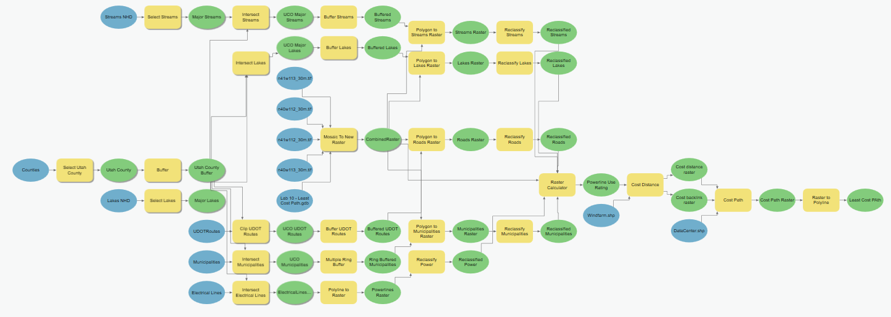
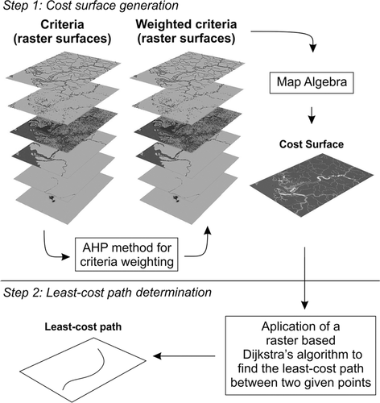
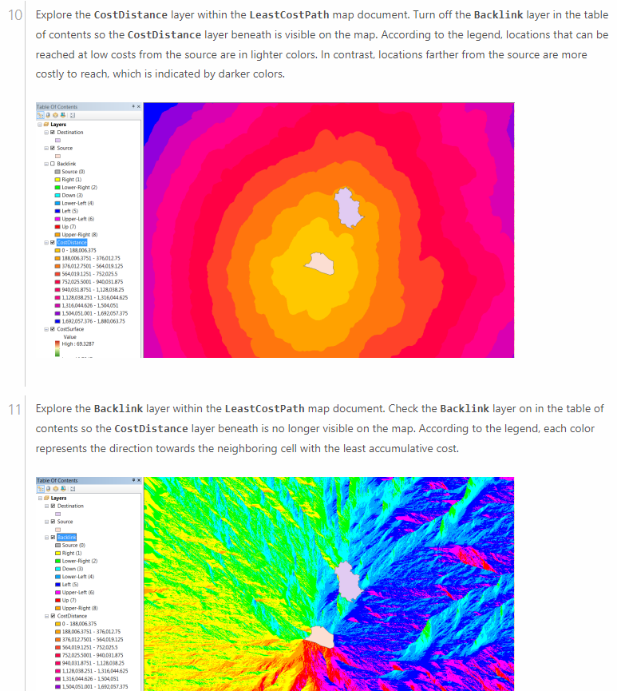

<!-- _class: lead -->
<!-- _paginate: skip -->

# Least Cost Path Analysis

CE 414 Engineering Applications of GIS
Dr. Dan Ames
Civil & Construction Engineering
Brigham Young University

<!-- Concepts lecture for Week 11. This deck sets up Lab 10, the power line routing model, so keep pointing forward to it: everything here is a piece of that model. -->

---

# Today's Goals

- By the end of class you should be able to:
  - Say what a **cost surface** is, and why it is not a map of distance
  - Build one by reclassifying and combining rasters with **map algebra**
  - Explain what the **accumulated cost** and **back link** rasters each store
  - Trace a least-cost path from a destination back to its source
  - Name the ArcGIS Pro tools that do each step, and their current replacements

<!-- Frame the hour. The whole lecture is one idea repeated at three scales: a cell has a cost, a path is the sum of cell costs, and the cheapest path is not usually the shortest one. -->

---

# What is the shortest path?

- What is the **"cost"** Google Maps is minimizing here? Distance? Travel time? Traffic?
- This route runs from the **NSA Utah Data Center** in Bluffdale south toward **Spanish Fork Canyon** — the two endpoints of Lab 10
- More on the [NSA Utah Data Center](https://nsa.gov1.info/utah-data-center/), code named "Bumblehive"

<!-- Open with the question, not the answer. Google Maps is already doing least-cost path analysis; it just hides the cost function. Ask what it is minimizing, and get students to notice that the fastest route and the shortest route are different lines. Then say that in Lab 10 they write the cost function themselves. The two photos are the endpoints of that lab: the data center in Bluffdale and the wind farm at the mouth of Spanish Fork Canyon. -->

---

# Why Least-Cost Path?

- From Esri's documentation (arcgis.com): the least-cost path is **"one cell wide"**, runs **from the destination back to the source**, and is **"guaranteed to be the cheapest route"** in the cost units of the input cost raster
- Three things to hold onto:
  - the answer is a **raster path**, one cell wide, until you convert it
  - it is computed **backward**, destination → source
  - "cheapest" only means anything **relative to the cost raster you built**

<!-- The quotation is condensed from the arcgis.com wording on the original slide. Emphasize the last bullet: the algorithm is exact, but it is exact about the cost surface you gave it. Garbage weights, confident wrong answer. The map on the right is a student example layout from a previous semester; its text block is still placeholder ("Name / Date / Projection"), which is a good chance to point out that the rubric wants those filled in. -->

---

# General Workflow

1. Combine your raster data sets into a **"virtual terrain"**, where **high values are undesirable** paths and **low values are desirable** paths
2. Identify a **start point** (source) and an **end point** (destination) for the path of interest
3. Run **Cost Distance** (or **Path Distance**) to create the **least-cost distance raster** and the **back link raster**
4. Run **Cost Path** with those two rasters and the destination to get the path
5. Convert the path raster to a **polyline** so you can symbolize and map it

<!-- These are the steps as Lab 10 runs them. Step 5, Raster to Polyline, is not on the original slide but is in the lab, and without it students end up trying to symbolize a one-cell-wide raster. The next slide shows the whole Lab 10 model, so students can see how much of it is step 1. -->

<!-- TODO(graphic): a clean five-step schematic of this workflow — input rasters, reclassify, Raster Calculator, cost surface, source/destination, accumulated cost + back link, path. Not generated here; needs a real figure. -->

---

# The whole model, end to end

Every green oval is a data set, every yellow box a tool. The routing happens in the last few boxes on the right.

<!-- Do not read this diagram. The point is scale: about forty tools, and only the last four are the least-cost path itself. Everything to the left is preparing the cost surface. Say plainly that this is what Lab 10 asks them to build, and that they build it left to right. -->

<!-- TODO(instructor): this ModelBuilder overview is a zoomed-out canvas capture and the node labels are illegible at any display size. It needs a re-export from ModelBuilder (right-click the model > Export > As Graphic at high resolution), not a re-screenshot. The same image is Figure 1 in Lab 10. -->

---

# Current tool names in ArcGIS Pro

- **Cost Distance**, **Cost Back Link**, and **Cost Path** still run in ArcGIS Pro, but Esri has **deprecated** them
- The current replacements are:
  - **Distance Accumulation** — produces the accumulative cost raster *and* the back direction raster in one run
  - **Optimal Path As Line** / **Optimal Path As Raster** — replaces Cost Path, and can hand you a polyline directly
- Lab 10's steps, screenshots, parameter names, and rubric all assume the **legacy** tools, so the lab and this deck have to change together
- Your instructor will confirm which set of tools to use before you start the lab

<!-- Say this out loud rather than leaving students to discover the deprecation warning in the tool's help. The concepts are identical: accumulated cost plus a back-direction raster, then walk the back-direction raster home. Only the tool names and a few parameter names moved. -->

<!-- TODO(instructor): replace Cost Distance/Cost Path with Distance Accumulation/Optimal Path; align with Lab 10 -->

<!-- TODO(graphic): a capture of the ArcGIS Pro Geoprocessing pane search results for "distance accumulation" and "optimal path", showing the deprecation notice on the legacy tools. Not fabricated here; needs a real Pro session. -->

---

<!-- _class: lead -->

# Step 1: building the cost surface

---

# Combine Rasters into a "Virtual Terrain"

- Every data set has to be **converted to raster** first
- **Reclassify** so that **high values represent the least desirable** cells to cross
- Combine them with **map algebra** in the **Raster Calculator** — add, multiply, or weight and add
- This "virtual terrain" is properly called a **cost surface**

<a href="https://ietresearch.onlinelibrary.wiley.com/doi/10.1049/iet-gtd.2016.1119">ietresearch.onlinelibrary.wiley.com/doi/10.1049/iet-gtd.2016.1119</a>

<!-- Two steps in the figure: cost surface generation on top, least-cost path determination below. The AHP box is one way to pick criteria weights; students are not required to use it in Lab 10, but it answers the question "where do the weights come from?" Stress that all the inputs must share a projected coordinate system, cell size, and extent before the Raster Calculator will give a sensible answer. -->

---

# Why "Virtual Terrain"?

- The simplest cost raster you could use is a **DEM**
- The result then follows the **lowest and flattest** route from start to end

<a href="https://gisgeography.com/least-cost-path-analysis/">gisgeography.com/least-cost-path-analysis/</a>

<!-- Start with the case where the metaphor is literal: the cost surface is real terrain, and the path is what water or a road would do. This is why the cost surface gets called a virtual terrain even when the values are not elevation. -->

---

# The values do not have to be elevation

- Any number that represents the **cost of crossing a cell** will do
- Here the dark cells cost **4** and the light cells cost **1**
- The straight line from **A** to **B** is short but expensive; the stepped red path is longer and **cheaper**
- That is the whole idea: **shortest ≠ cheapest**

dyerlab.github.io/applied_population_genetics

<!-- Walk one path by hand. Count the cells along the straight line and multiply by their costs, then count the cells along the red path. It is worth doing the arithmetic on the board once; after that the algorithm is obvious. Also point out that diagonal moves cost more than orthogonal ones, by a factor of about the square root of 2, which is why the red path is stepped. -->

---

<!-- _class: lead -->

# Step 2: accumulated cost, back link, and the path

---

# Cost Distance and Back Link rasters

- **Cost distance** (accumulated cost): for every cell, the **cheapest total cost of reaching it from the source**. Light = cheap to reach, dark = expensive
- **Back link** (back direction): for every cell, **which neighbor to step to next** on the way home to the source — coded 0–8
- **Cost Path** starts at the destination and follows the back link raster cell by cell until it reaches the source
- That is why the path is computed **backward**

<!-- The two rasters are the whole algorithm. The accumulated cost raster says how much; the back link raster says which way. Ask students what would happen if you only had the accumulated cost raster: you could still walk downhill through it, but the back link raster stores that answer once instead of recomputing it. Note the concentric shape of the accumulated cost raster around the source, and how it bulges where crossing is cheap. -->

<!-- TODO(instructor): this figure is a scanned page from an ArcMap-era tutorial. It shows the ArcMap Table Of Contents, the CostDistance and Backlink layers, and numbered steps 10-11. Needs a fresh ArcGIS Pro capture of the same two rasters in the Contents pane. Not fabricated; kept as-is so the content is not lost. -->

---

# Some real-world examples

- **Power lines** — [ScienceDirect, S0195925510001393](https://www.sciencedirect.com/science/article/pii/S0195925510001393)
- **Ecology**, wildlife corridors and connectivity — [ScienceDirect, S0301479719305912](https://www.sciencedirect.com/science/article/pii/S0301479719305912)
- **Roads** — [ScienceDirect, S0143622805000378](https://www.sciencedirect.com/science/article/pii/S0143622805000378)
- In every one of them, the hard part is **not the algorithm** — it is deciding what a cell should cost

<!-- Three published applications, all using the same two rasters. Use them to make the point that the engineering judgment lives entirely in the cost surface. Ask what a cell should cost near a school, a wetland, or a scenic corridor, and let the disagreement stand. -->

<!-- TODO(instructor): the source slide gives only bare DOIs/links for these three papers. Add author, year, and title so students can cite them, and confirm each link still resolves. -->

---

<!-- _class: activity -->

# Next: Lab 10, power line routing

- Route a high-voltage line from the **wind farm** at the mouth of Spanish Fork Canyon to the **data center** in Bluffdale
- You build the cost surface yourself from **roads, rivers and lakes, cities, existing power lines, and elevation** — reclassified and weighted
- Then the two-tool routing you just saw, and a **Raster to Polyline** at the end
- The whole thing lives in **one ModelBuilder model** so you can change a weight and re-run it

<!-- Preview the lab. The reason it is a model and not a sequence of clicks is that the weights are arguable, and a model lets them re-run the analysis after changing one. Encourage students to run at least one alternative weighting and look at how far the path moves. -->

---

# Before Next Class

- **Lab 9 — Wind Farm Site Selection** is due this week: [assignments/lab-09](https://byu-hydroinformatics.github.io/ce414-gis-applications/assignments/lab-09/)
- **Lab 10 — Least Cost Path Power Line Analysis** is next: [assignments/lab-10](https://byu-hydroinformatics.github.io/ce414-gis-applications/assignments/lab-10/)
- Read the assigned chapter before the lab session
- Take the open-book quiz on **Learning Suite**
- Questions? Office hours: [calendly.com/dan-ames/office-hours](https://calendly.com/dan-ames/office-hours)

<!-- Confirm the reading and the quiz due date before class. -->

<!-- VERIFY: schedule reconstructed. docs/schedule.md puts Lab 9 (Wind Farm Site Selection) in Week 11 and Lab 10 (Least Cost Path) in Week 12; this slide assumes Lab 9 is due during Week 11 and Lab 10 is assigned next. -->

<!-- TODO(instructor): reading chapter -->

<!-- Conversion notes (2026-09-03): source "CE 414 Week 11 - Least Cost Path Analysis.pptx", 9 slides, converted to 16.
No source slides were dropped; there were no hidden slides and no speaker notes in the original, so every
presenter note here is new. Added: a Today's Goals slide, two lead section dividers, a dedicated full-size
slide for the ModelBuilder overview, a "Current tool names in ArcGIS Pro" slide, a Lab 10 preview, and a
Before Next Class slide. The legacy Cost Distance / Cost Back Link / Cost Path workflow was deliberately NOT
rewritten: Lab 10's steps, screenshots and rubric use the same legacy tools, and the two have to change
together. The deprecation is stated on its own slide instead.
Stale imagery: images/lcp-cost-distance-backlink-arcmap.png is a scanned ArcMap-era tutorial page and needs a
Pro capture; images/lcp-full-model-overview.png is an illegible zoomed-out ModelBuilder canvas and needs a
re-export from ModelBuilder. Both are flagged inline.
The arcgis.com quotation on the "Why Least-Cost Path?" slide was condensed to short attributed fragments
rather than reproduced in full; the original slide did not cite which arcgis.com page it came from.
The student example map (images/lcp-example-map-power-lines.jpg) still carries its placeholder
"Name / Date / Projection" text block; kept, and used in the speaker notes as a rubric reminder.
Nothing outside slides/week-11/ was created or modified. -->
