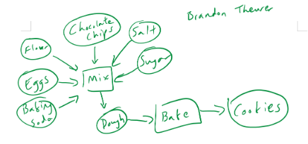
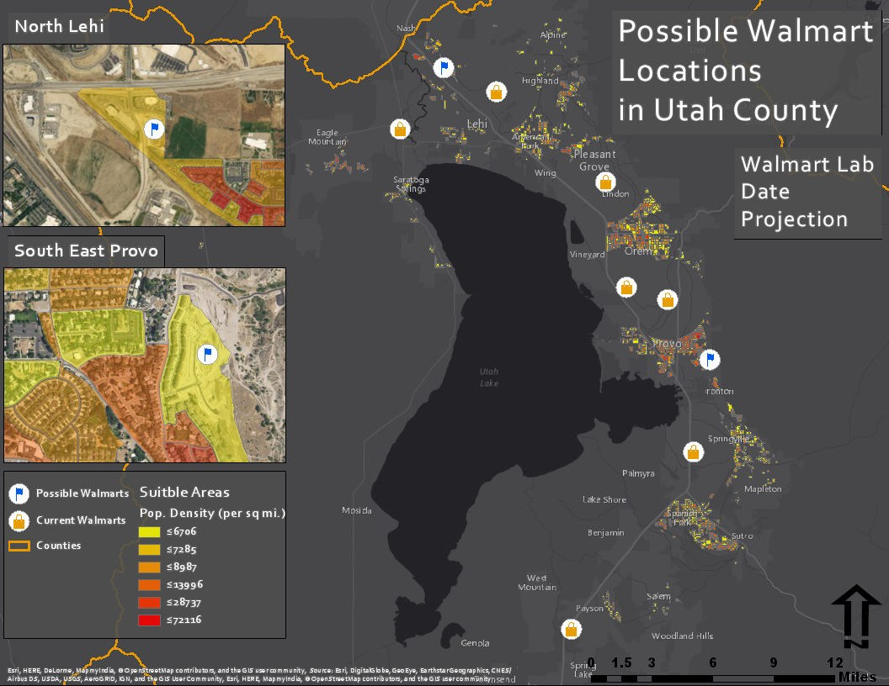
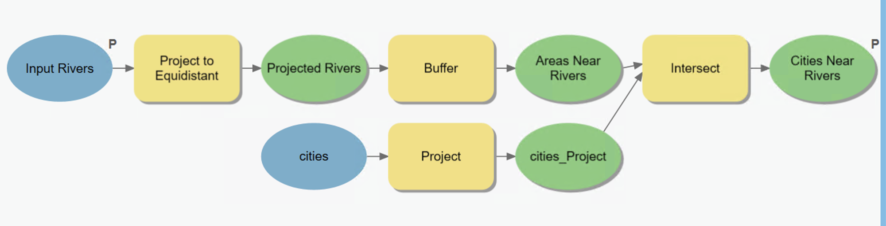
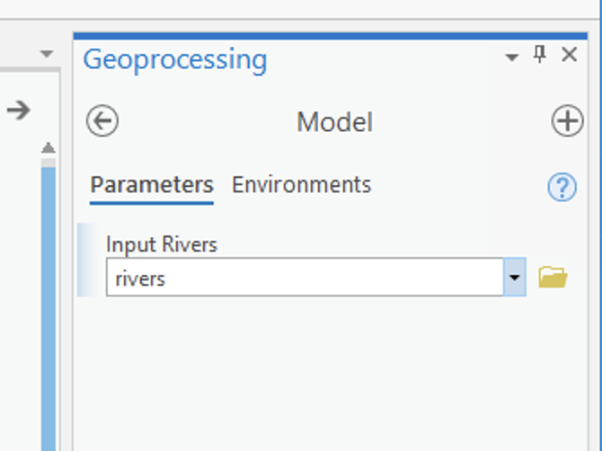
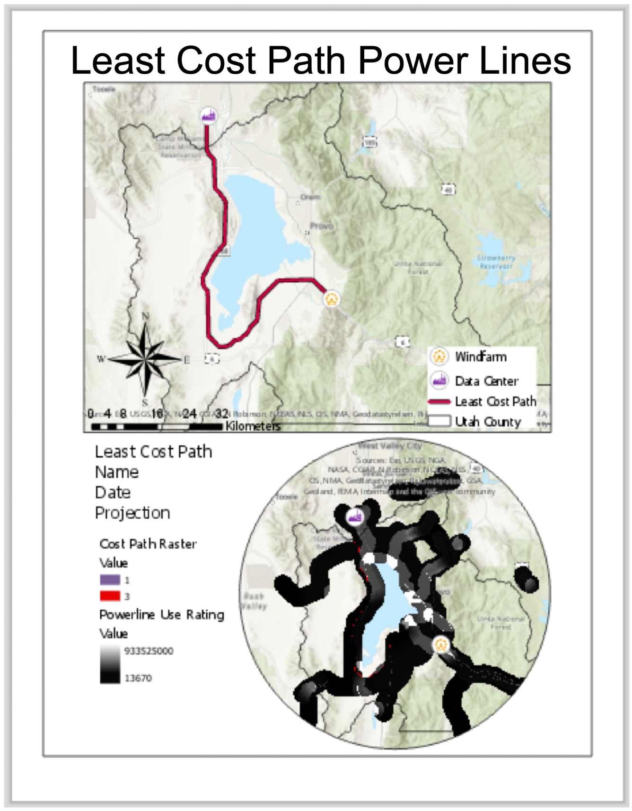

<!-- _class: lead -->
<!-- _paginate: false -->

# The Final Project

**CE 414 Engineering Applications of GIS**
Dr. Dan Ames

<!-- This deck replaces the one-page Learning Suite "Final Project" page. Everything on the
requirements, expectations, and deliverables slides comes from that page; the milestone calendar,
the "what a lab-sized project looks like" slide, the pitfalls, and the proposal checklist are
additions meant to make the expectations concrete. Adjust anything marked TODO before presenting. -->

---

# Today's Goals

- By the end of class you should be able to:
  - Say what the final project is for, and how it differs from a lab
  - Judge whether an idea is the right **scope** for four weeks
  - List the requirements every project must meet
  - Know exactly what to bring to your proposal meeting
  - Describe how the project is scored, including by your classmates

<!-- Frame it as the capstone: every lab so far handed students a question and a recipe. Now they
write the recipe. The cookie model from Week 2 is a deliberate callback. -->

---

# Why a final project?

Every lab this semester gave you a **question**, the **data**, and a **recipe**.

The project takes two of those away.

- **You** pick the question — something you actually want to know
- **You** find and vet the data
- The recipe is still ModelBuilder, and it still has to be reproducible

This is the closest thing in the course to what a client asks for: *here is a problem, show me
where, and show me why I should believe you.*

<!-- TODO(graphic): a simple three-column "question / data / recipe" figure with the first two
crossed out -->

---

# What past projects looked like

Titles from earlier years, to calibrate scope:

- Where should BYU-approved apartments go?
- Best fly-fishing access on Utah rivers
- Light-rail corridor siting
- A visitor center for a state park
- "Hipster hotspots" — coffee, bikes, and vintage
- Center-pivot irrigation from NDVI
- Volume of a Hawaiian volcano

Each was one clear question, one study area, one model.

<!-- Source: the course's Final Projects archive (2012 onward) and past presentation decks.
TODO(instructor): add two or three strong 2023-2025 projects here. -->

---

# Requirements — the team

1. Form a team of **one or two** people
2. Identify a problem together and **pitch it to the instructor**
3. Once the idea is approved, split the work: data collection, analysis, writing, presentation

> A team of two is not two half-projects. Both of you should be able to explain every step of
> the model.

<!-- TODO(instructor): the plan asks for explicit individual-accountability language for teams of
two — e.g. a short "who did what" statement in the report. Decide and add here. -->

---

# Requirements — the project

Every project must:

1. Tackle a **new** idea or problem using GIS and spatial analysis
2. Use **both raster and vector** data
3. Be built as a **ModelBuilder** geoprocessing model
4. Match the **scope and scale** of the ModelBuilder lab assignments
5. Introduce **at least two tools** we have not used in a lab this semester
6. Expose a **tool interface** — inputs, outputs, and parameters — so someone else can run it

And one house rule: the words **"utilize"** and **"in order to"** do not appear in your report.
*Use* and *to* work fine.

<!-- Item 7 on the original page ("same length and size as our previous labs") is folded into item 4
and made concrete on the next slide. TODO(instructor): the plan questions whether "two new tools"
encourages novelty for its own sake — keep, reword, or drop. -->

---

# What "lab-sized" actually means

A project the size of a lab has:

- **One** decision question, with explicit criteria and thresholds
- **One** study area, in a projected coordinate system you chose on purpose
- A model of roughly **6–15 tools** that reruns from raw inputs without hand repair
- **Documented data** — source, vintage, license, fitness for the question
- At least **one validation or sensitivity check**
- **One** professional map and a short report

<!-- Say it out loud: three study areas, a web app, or a month of data cleaning is a thesis, not a
project. The 6-15 tool range is a guideline drawn from the lab models, not a rule. -->

---

<!-- _class: quiz -->

# Is this project the right size?

For each idea, decide: **too small**, **about right**, or **too big**.

<ol type="A">
<li>Map every Walmart in Utah</li>
<li>Find the best three sites for an EV charging hub in Utah County, given traffic, grid access, and land use</li>
<li>Model wildfire risk for the entire western United States at 10 m resolution</li>
<li>Estimate how many people live within a 10-minute walk of a TRAX station, and which stations are underserved</li>
</ol>

<!-- A: too small — no analysis, just a display. B: about right. C: too big — data volume and
validation are out of reach in four weeks. D: about right, and a good example of a network question
that is still doable with buffers and raster density. -->

---

# Choosing a problem — three questions

**1. Can I say the question in one sentence?**
"Where in Utah County should a new fire station go so that the most homes are within 5 minutes?"

**2. Does the data exist, and can I get it this week?**
Check Utah SGID, USGS, Census, and Living Atlas *before* you pitch. If a layer would need to be
digitized by hand, that is your whole project.

**3. What would a wrong answer look like?**
If you cannot describe a way to check the result, the model is a picture, not an analysis.

<!-- TODO(graphic): a decision-tree figure for these three questions -->

---

# The data-feasibility check

Before your proposal meeting, fill this in for **every** layer you plan to use:

| Layer | Source and URL | Vintage | Format | CRS | Raster or vector | License |
| --- | --- | --- | --- | --- | --- | --- |
| e.g. Roads | Utah SGID | 2025 | Shapefile | UTM 12N | Vector | Public |

If any row is blank, you are not ready to pitch.

<!-- This table is the single most useful thing a team can bring to the meeting. Most failed
projects failed on a data row, not on the analysis. -->

---

# Deliverable 1 — the proposal meeting

Come ready to discuss, in this order:

1. **The problem**, in one sentence, and why it matters to someone
2. **Data needs** — the feasibility table from the previous slide
3. **Proposed analysis** — a sketch of the model on paper is ideal
4. **Division of labor**, if you are a team of two
5. **Proposed schedule** against the milestones on the next slide

Leave the meeting with a yes, a no, or a "yes if you change X."

<!-- TODO(instructor): confirm how meetings are booked — office hours link, sign-up sheet, or
in-class. -->

---

# Suggested milestones

| Week | Milestone |
| --- | --- |
| 12 | Project introduced; start scouting data |
| 13 | **Proposal meeting**, feasibility table complete, idea approved |
| 14 | Model runs end to end on real data; first map draft |
| 15 | Validation done; report written; **presentation** |

Data problems surface in Week 13, not Week 15. That is the point of the order.

<!-- TODO(instructor): verify against the Learning Suite calendar. The living plan recommends
introducing the project by Week 8 or 9 in future offerings so the milestones can spread out. -->

---

# Deliverable 2 — the presentation

- All teams present from **one shared Google Slides deck**; the link is posted on Learning Suite
- Aim for a few minutes: the question, the map, the model, what you learned
- Lead with the **map**. Show the **model**. Explain **one** decision you had to make.

Past decks, for calibration:
[2018](https://docs.google.com/presentation/d/186eEk6id3Yc58J9YTJWFDH6NePLCjJ8ecvAKh2EGCpw) ·
[2019](https://docs.google.com/presentation/d/1fzcs7eHolBGCwRPeRqWdLSj420-rjPFnD1WnDx3wYtk) ·
[2020](https://docs.google.com/presentation/d/11EMv0J_lutW4YcdxgzhxKtnUhK2Z0Rpzg_eeNNpGz2E) ·
[2021](https://docs.google.com/presentation/d/14FsmzOX8VPRn-17VNuEBk6xTO1rCqWlLJ8fdkeaL-6M) ·
[2022](https://docs.google.com/presentation/d/1lEwkMtb0CnLa9_GOO94AjqjVKL9NwHVRv)

<!-- TODO(instructor): confirm the presentation length and add the 2023-2025 deck links. The
2022 link on the Learning Suite page appears truncated — check it. -->

---

# The tool interface

Requirement 6: your model opens like any other geoprocessing tool.

- Inputs and outputs marked as **parameters** — the "P"
- Sensible **labels**, not `rivers_Project_Buffer_2`
- Key thresholds exposed as parameters: distance, density, class breaks
- **Metadata** filled in — what it does, needs, and makes

**The test:** a classmate can run it on a different county without opening the model.

<!-- Callback to ModelBuilder Part B (parameters, metadata, "Going forward: build a tool
interface"). -->

---

# How you are scored — by your classmates

Everyone in the room scores every other team, 1 to 5 in each category:

| Category | Points |
| --- | ---: |
| Problem description — clarity and completeness | 5 |
| Final map — quality and completeness | 5 |
| Explanation of the model and workflow | 5 |
| Meets the basic requirements: raster, vector, new tools, ModelBuilder | 5 |
| Presentation — interest, cleverness, fun factor | 5 |
| **Total** | **25** |

<!-- Source: the course's peer scoresheet. TODO(instructor): state how the peer score combines
with the instructor's grade of the report and model, and the project's weight in the course. -->

---

# What separates a good project from a great one

**Good**: the model runs, the map is clean, the criteria are stated.

**Great**:

- Criteria are **justified** — a source, a standard, or an argument
- A **sensitivity check**: change one threshold, show what moves
- The report says what the analysis **cannot** tell you
- The map answers the question in **five seconds**

That is the difference between a result and a recommendation.

---

# Common ways projects go wrong

- **The data was not there.** Pitched on a dataset that turned out to be a PDF, a paywall, or a 2009 snapshot
- **Geographic coordinates.** Buffers in degrees; areas in "square degrees"
- **The model only runs once.** Hard-coded paths, intermediate layers deleted by hand
- **Ten criteria, no weights.** Everything matters equally, so nothing does
- **The map is the last thing made.** Cartography at 2 a.m. looks like cartography at 2 a.m.

<!-- Every one of these has happened. Say so. -->

---

# Before Next Class

- **Read** the [Final Project page](https://byu-hydroinformatics.github.io/ce414-gis-applications/assignments/final-project/) on the course site
- **Finish** [Lab 10 — Least Cost Path](https://byu-hydroinformatics.github.io/ce414-gis-applications/assignments/lab-10/) <!-- VERIFY: schedule reconstructed -->
- **Start** your data-feasibility table — one row per layer
- **Book** a proposal meeting: [office hours](https://calendly.com/dan-ames/office-hours)
- Open-book quiz on Learning Suite

<!-- TODO(instructor): reading chapter, if any -->

<!-- Conversion notes (2026-09-03): built from the Learning Suite "Final Project" page (one page,
exported to PDF Sept 2, 2026) and the peer scoresheet in Final Projects/scoresheet.docx. No slide
deck existed before. Additions beyond the source, all marked TODO(instructor) where they need a
decision: the "lab-sized" criteria slide (replaces the vague "same length and size as previous
labs"), the size-judgment quiz, the three choosing questions, the data-feasibility table, the
milestone calendar (week numbers, unverified), the tool-interface slide, the good-vs-great slide,
and the pitfalls slide. Images reuse course example maps from Labs 1, 9 (student names redacted),
and 10, and the ModelBuilder B RiversDemo captures. Open items: 2023-2025 examples and deck links,
presentation length, how peer scores combine with the instructor grade, team accountability
wording, whether to keep the "two new tools" rule, meeting booking method. -->
