<!-- _class: lead -->
<!-- _paginate: skip -->

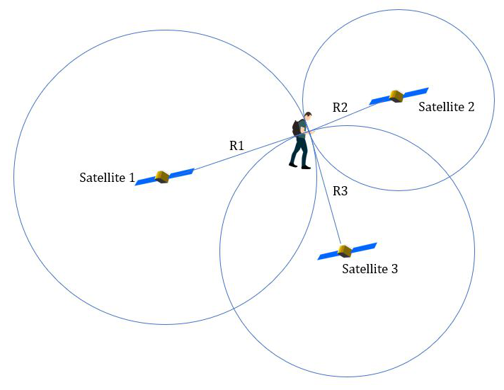

# GPS and Triangulation

## CCE 214 Geomatics

Dr. Dan Ames
Brigham Young University

<!-- TODO(instructor): retitle — the deck teaches trilateration, not triangulation. GPS solves for position from measured *distances* (ranges), not from measured angles. The title is kept as the source deck has it; suggested replacement is "GPS and Trilateration". Every body reference to the ranging concept has already been corrected. -->

<!-- TODO(instructor): the subtitle reads "CCE 214 Geomatics" in the source deck. That course number is out of date for this course and was NOT guessed at or replaced. Confirm the correct course line before class. -->

<!-- Week 12 concepts lecture. This hour is a review of how satellite positioning actually works, and why the position a receiver reports is never exactly where you are. It runs as a refresher: most students met GPS in the introductory geomatics course, so move quickly through the signal material and spend the time on error sources and differential correction. -->

---

# Today's Goals

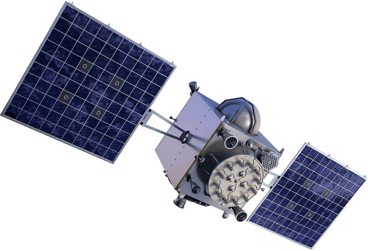

By the end of class you should be able to:

- Explain how a receiver measures **range** to a satellite from the **travel time** of a coded radio signal
- Show why three or four ranges fix a position by **trilateration** — distances, not angles
- Name the main **error sources** in a GPS fix and say roughly how large each one is
- Explain what **dilution of precision** is, and why satellite geometry matters as much as satellite count
- Describe how **differential GPS** removes the errors that a base station and a rover share

<!-- Read these out loud, then come back to them at the end. The last two are the ones students most often get wrong on the quiz: geometry is not the same as signal quality, and differential correction only removes *common* error. -->

<!-- TODO(graphic): a five-icon strip matching the five outcomes would work better here than the stock satellite render. -->

---

<!-- _class: activity -->

# Activity: Where Am I?

I visited Europe and got lost. I heard three radio stations announcing the time, but each was off from the actual time. The difference is the **travel time** of the signal:

| Station | Time difference |
| --- | --- |
| Amsterdam | 0.00237 s |
| Paris | 0.00295 s |
| London | 0.00345 s |

**Where am I?**

<!-- Answer: Prague. Multiply each time difference by the speed of light: about 711 km from Amsterdam, 885 km from Paris, and 1035 km from London. Three distances, three circles, one intersection. This is the whole lecture in one slide — do it before any of the theory. -->

<!-- Fix (2026-09-03): the source speaker note read "711 miles from Prague to Amsterdam" while giving the other two distances in kilometers. 2.37e-3 s x c = 711 km, so "miles" was a unit typo; corrected to kilometers here. -->

<!-- This slide and its companion Prague photo were HIDDEN in the source deck (slides 2 and 3). They are kept as a usable warm-up because they teach exactly the concept the deck is about. If the instructor prefers the Air Force One version that follows, delete this slide. -->

---

# Find Air Force One

<!-- Second version of the same warm-up, and the one that is not hidden in the source. Hide the object somewhere in the room beforehand. -->

---

<!-- _class: activity -->

# Find Air Force One

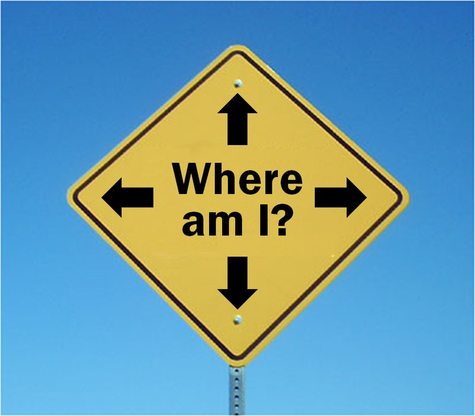

The plane is:

- **169 inches** from Satellite 1
- **216 inches** from Satellite 2
- **151 inches** from Satellite 3

Three distances. No angles. Find it.

<!-- Instructor note from the source deck, calibrated for room Clyde 254: Satellite 1 is the light on the zoom camera, Satellite 2 is the light above row 2 left, Satellite 3 is the BYU sticker on the front control panel. The source also lists an alternate set for the same room: 221 inches from the projector lens on the ceiling, 260 inches from the screw on the bottom of the front left speaker, 149 inches from the angled smoke detector on the ceiling. Re-measure if the class is in a different room. -->

<!-- VERIFY: the room measurements above are copied from the source deck's speaker notes and are specific to one classroom. Confirm the room and re-measure before running the activity. -->

---

# The 3 D's of Map Data

- **Download**
  - From where? What does the metadata say?
- **Digitize**
  - Clicking on the map to create data by "drawing"
  - How good can it be?
- **DGPS** — differential GPS field data collection
  - Why differential?
  - Modern surveying fits in here

<!-- Recall from the introductory course these three ways of acquiring vector data. Today is the third one. Ask which of the three the students used in their labs this semester — almost all of it has been downloaded, which is exactly why the metadata question matters. -->

<!-- TODO(graphic): a three-panel figure — a data portal, a digitizing session in ArcGIS Pro, and a field receiver — would carry this slide. The source slide had only a text callout box. -->

---

# Critical Concepts of DGPS

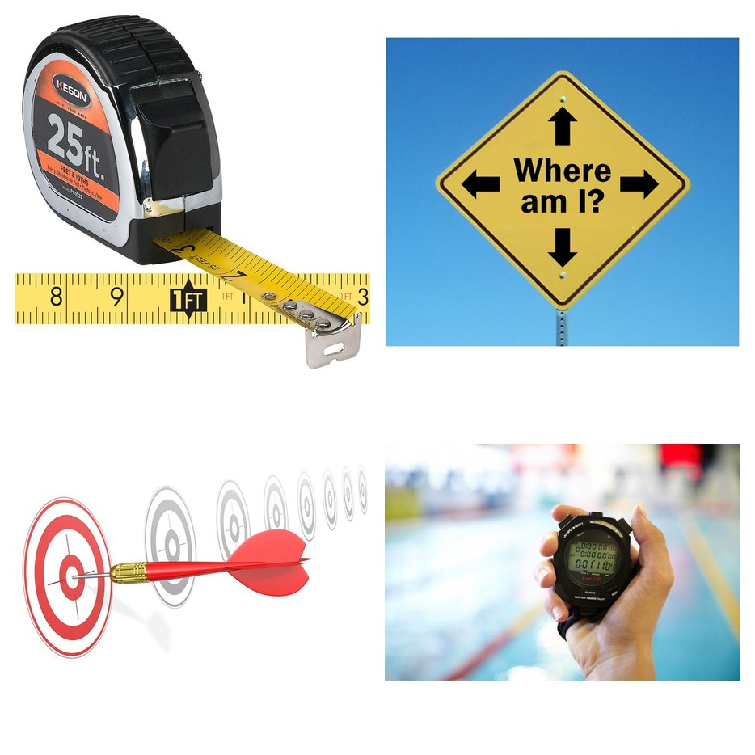

- **A. Pseudorandom noise** — *how long ago?*
- **B. Range** — *how far away?*
- **C. Trilateration** — *where am I?*
- **D. Differential GPS** — *no, really, where am I?*

<!-- The four-part structure of the rest of the hour. Each concept answers one question, and each question depends on the one before it: you cannot get a range without a travel time, and you cannot get a position without ranges. -->

<!-- Fix (2026-09-03): the source deck labeled item C "Triangulation". Changed to "Trilateration" — GPS solves for position from measured distances, not measured angles. -->

---

# A. Pseudorandom Noise (How Long Ago?)

You are the U.S. Government. You need to track military assets, so you put satellites in orbit — but that raises questions:

- How do you transmit the information? **AM? FM? PM?**
- What do you put in the radio message?
- How do you compute **distance** from a satellite that is only sending you a radio signal?

<!-- Frame the design problem before giving the answer. Students who see why the problem is hard remember the solution. The answer to the third question is the whole of parts A and B: you cannot measure distance directly, so you measure time and multiply. -->

---

# Radio Wave Transmission Methods

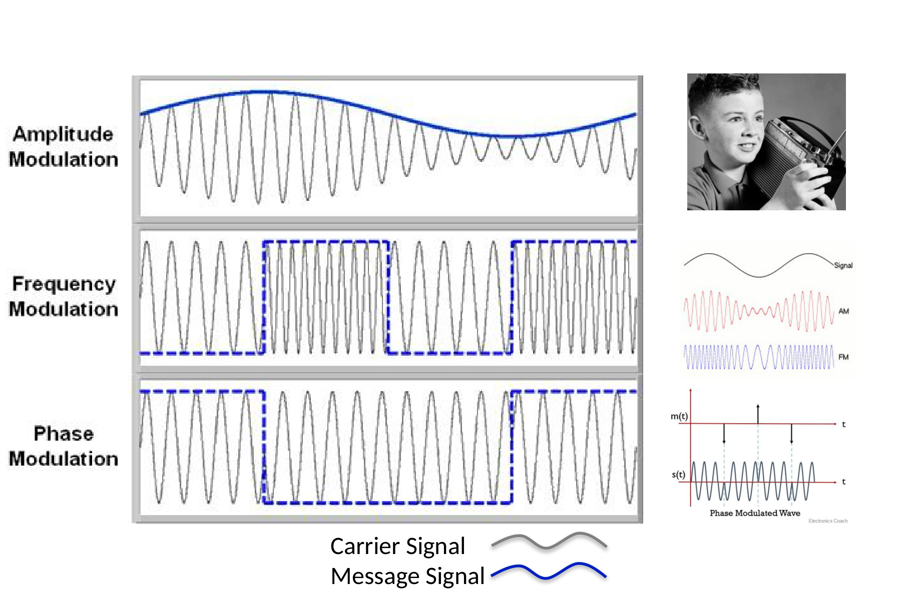

Video explanation: [youtu.be/Iyzpt3bKTTI?t=85](https://youtu.be/Iyzpt3bKTTI?t=85)

<!-- Amplitude, frequency, and phase modulation. A carrier signal at a fixed frequency is altered to carry a message signal. GPS uses phase modulation of the carrier by the code sequence, which is what makes the next slide's comparison possible. Play about a minute of the linked video if the class has not seen modulation before. -->

---

# Computing Radio Wave Travel Time

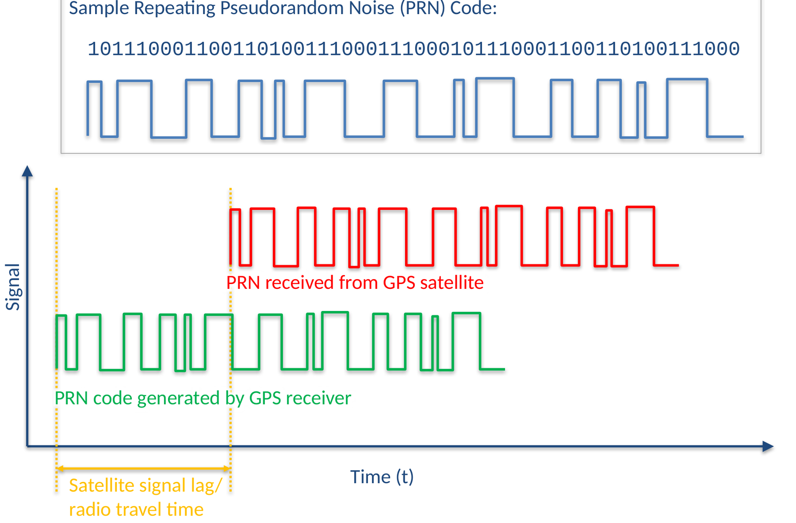

<!-- This is the key mechanism. The satellite and the receiver each generate the *same* pseudorandom code, started at the same time by synchronized clocks. The receiver slides its own copy of the code along in time until it lines up with the code it received. The amount of the shift is the travel time. That is what makes a pseudorandom sequence, rather than a plain tone, the right thing to transmit: it lines up in exactly one place. -->

---

# B. Range (How Far Is It?)

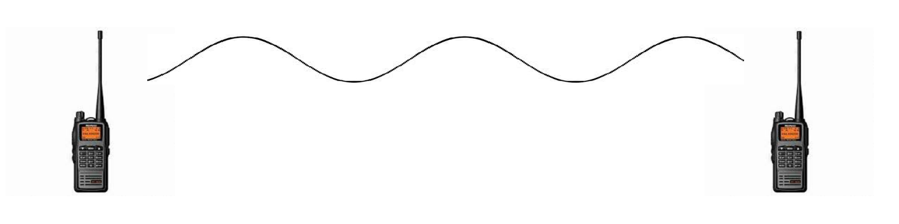

**D = R × T**

- **R** = speed of light
- **T** = time of message travel, from the signal delay measured on the last slide
- **D** = how far away the sender is

<!-- The whole of part B in one line. Note that this gives a *pseudorange*, not a true range, until the receiver clock error is solved for — which is why a fourth satellite is needed. That point is made on the trilateration slides. -->

---

# B. Range (How Far Away?)

Distance = signal travel time × speed of light

**For example:**

- Signal travel time = 0.674 seconds
- Speed of light = 299,792,458 m/s
- Distance = 202,060,116 m = **202,060.116 km**

<!-- Work the multiplication live. The arithmetic on this slide is self-consistent: 0.674 s x 299,792,458 m/s does equal 202,060,116 m. -->

<!-- VERIFY: the travel time on this slide is almost certainly off by one decimal place. GPS satellites orbit at roughly 20,200 km, which gives a travel time near 0.0674 s and a range near 20,200 km — the slide's 0.674 s puts the satellite about ten times too far away. The correction was NOT applied, because nothing on this slide fixes the intended value: the distance is derived *from* the time, so both numbers move together and the right answer depends on the orbital altitude, which the slide never states. Instructor: set the intended travel time and let the distance follow. -->

---

# C. Trilateration (Where Am I?)

- Each range puts you somewhere on a **sphere** centered on that satellite
- **Distances, not angles** — this is trilateration, not triangulation

<!-- Fix (2026-09-03): the source slide title read "3. Triangulation (Where am I?)". Retitled, and the distances-not-angles bullet added, because the mechanism the figure shows is trilateration. Triangulation — fixing a position from measured angles to known points — is the classical surveying method, and it is worth naming the difference out loud since students will meet both terms. -->

---

# C. Trilateration: Fixing Your Position

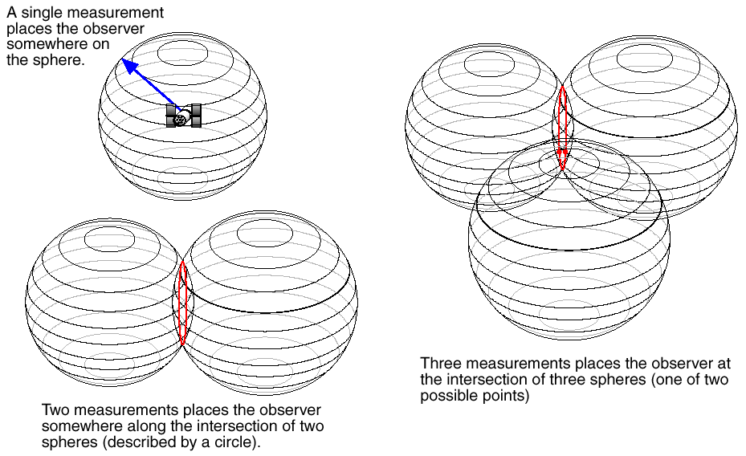

- One measurement puts you **on a sphere**
- Two measurements narrow it to a **circle**
- Three narrow it to **two points**
- Knowing you are on a fourth sphere — the earth — makes one of those two impossible, and your position is fixed
- A further measurement is needed to remove **clock error**, and more readings to remove errors from the atmosphere and elsewhere

<!-- Fix (2026-09-03): source title read "3. Triangulation (where am I?)". Retitled to trilateration. The body text is the source deck's own paragraph, broken into steps. -->

<!-- The last bullet is the reason a receiver needs four satellites in view rather than three: the fourth solves for the receiver's own clock error, which is far too large to ignore at the speed of light. A one-microsecond clock error is a 300-meter range error. -->

---

<!-- _class: lead -->

# D. Differential GPS

## No, really — where am I?

But first: why do we need differential correction?

**GPS measurements have errors in them.**

<!-- The pivot point of the lecture. Everything so far has assumed the ranges are exact. They are not, and the next block of slides is a catalog of why. -->

---

# Error Sources: Signal Interference

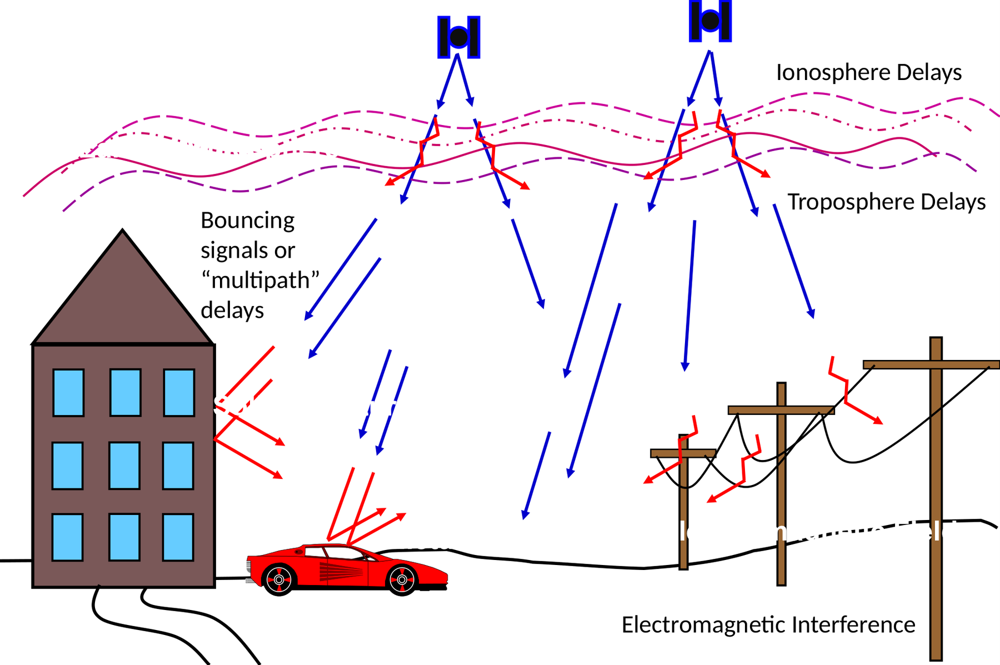

- The earth's atmosphere: **ionosphere** and **troposphere** delays
- Solid structures, metal, and electromagnetic fields
- Bouncing signals, or **multipath** delays

<!-- The signal does not travel through a vacuum for its whole path, and it does not always arrive by the direct route. Both effects make the measured travel time longer than the true one, so both make the computed range too long. -->

<!-- TODO(instructor): the plan calls for a decision on how much depth to give atmospheric delay here — dual-frequency ionospheric correction and modeled tropospheric delay are the modern answers, and neither is in this deck. Content not written. -->

---

# Error Sources: Multipath

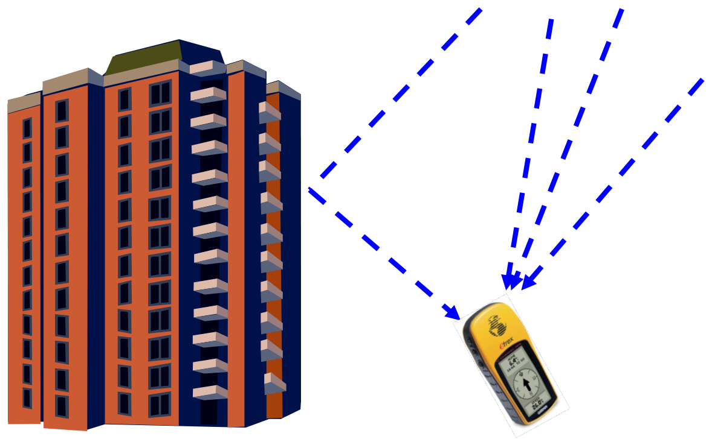

Try to stay away from buildings and other structures when using a GPS receiver.

<!-- A reflected signal takes a longer path than the direct one, so the receiver computes a range that is too long. This is why a fix taken against the side of a building is worse than one taken in the open, and why the same receiver can be accurate in a field and useless downtown. -->

<!-- TODO(instructor): the plan lists multipath mitigation as an instructor decision — choke-ring and multipath-resistant antennas, signal-quality masks, and simply re-occupying the point. Content not written. -->

---

# Error Sources: Bad Coverage

GPS has worldwide coverage — however:

- You can lose satellite coverage, or receive degraded signals, in areas of **dense foliage**, in **urban canyons**, and similar settings
- You can also lose coverage in **deep valleys** or gorges
- This introduces error

<!-- Coverage is about sky view, not about the receiver. The satellites are there; the terrain and the canopy are in the way. Tie this forward to dilution of precision: losing the satellites low on the horizon is worse than losing the same number overhead, because it collapses the geometry. -->

<!-- TODO(graphic): a photograph or diagram contrasting an open-sky fix with a fix under canopy or in an urban canyon. The source slide carried no visual at all. -->

---

# Error Sources: Selective Availability

- The Defense Department **dithered** the satellite time message, reducing position accuracy for some GPS users
- Intended to prevent adversaries from using GPS against the United States and its allies
- **May 2000:** the Pentagon reduced SA to zero
- SA could be reactivated at any time by the Pentagon

<!-- The chart is the actual transition, 2 May 2000, recorded at Colorado Springs: horizontal and vertical error collapse partway through the record. It is a nice piece of history and it makes the size of the effect concrete. -->

<!-- TODO(instructor): the plan flags this framing for revision. The last bullet is the source deck's, and how to characterize the current policy — including the newer satellites' capability, and regional denial as the modern approach — is an instructor call. Content not written. -->

---

# Error Sources: Summary

Standard Positioning Service (SPS), civilian users:

| Source | Amount of error |
| --- | --- |
| Satellite clocks | 1.5 to 3.6 meters |
| Orbital errors | < 1 meter |
| Ionosphere | 5.0 to 7.0 meters |
| Troposphere | 0.5 to 0.7 meters |
| Receiver noise | 0.3 to 1.5 meters |
| Multipath | 0.6 to 1.2 meters |
| Selective availability | see notes |
| User error | up to a kilometer or more |

**Errors are cumulative, and are increased by PDOP.**

<!-- Read down the column and note that the largest number by far is the last one. The system is better than its users. Selective availability is listed as "see notes" in the source deck because it has been off since May 2000. -->

<!-- VERIFY: these per-source error magnitudes are the source deck's own figures and were not independently checked against a current reference. They are the right order of magnitude for uncorrected single-frequency SPS, but the instructor may want to update the table. -->

<!-- TODO(graphic): an error-budget bar chart would read far better than the table, and would make the "user error dominates" point without narration. -->

---

# Receiver Errors Are Cumulative

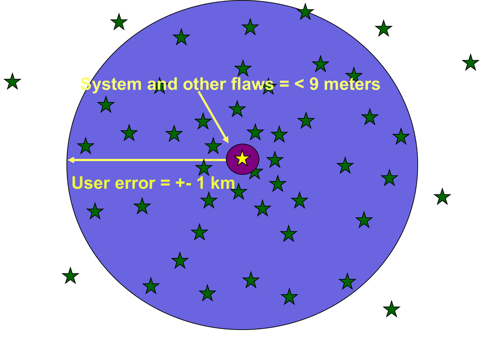

<!-- The small purple circle is everything the system does wrong — under about 9 meters. The large blue circle is user error, plus or minus a kilometer: standing in the wrong place, mistyping a point ID, recording the wrong feature. The visual point is the ratio between the two circles. -->

---

# Error Sources: Dilution of Precision

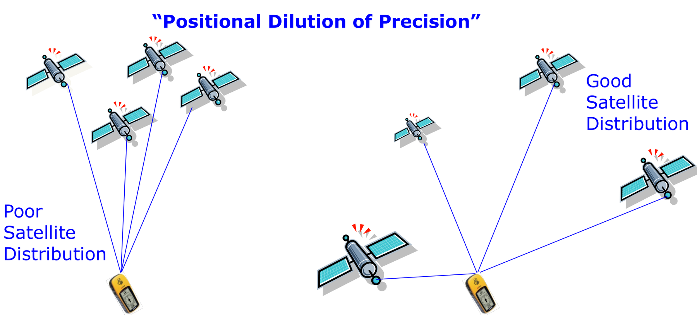

It is better for your receiver to get a fix on **well distributed** satellites than on poorly distributed ones.

<!-- "Positional dilution of precision" — PDOP. With the satellites bunched together, the range spheres cross at a shallow angle and a small range error becomes a large position error. Spread them out and the same range error produces a much tighter fix. Geometry, not signal strength. -->

<!-- TODO(instructor): the plan lists satellite geometry as an area to expand — the DOP family (PDOP, HDOP, VDOP, GDOP), and what a receiver's reported DOP value should tell a field crew about whether to keep collecting. Content not written. -->

---

# Every Range Carries Uncertainty

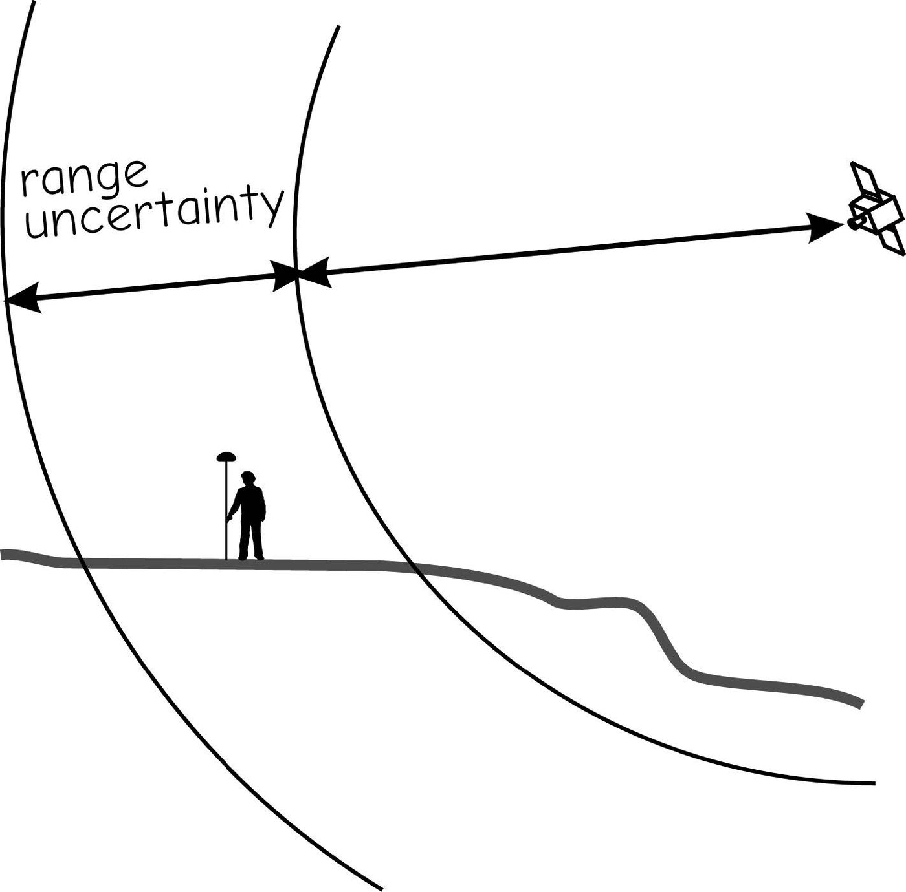

<!-- Start here before the two DOP figures that follow. A measured range is not a line, it is a band: the true position lies somewhere inside the range uncertainty. Everything about dilution of precision follows from how those bands cross. -->

---

# Dilution of Precision

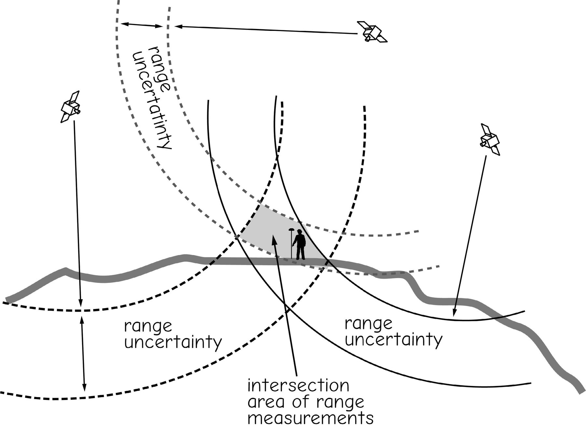

<!-- Three uncertainty bands crossing. The shaded lozenge in the middle is the area the receiver cannot distinguish between — that area is the position uncertainty, and its size depends entirely on the angles at which the bands cross. -->

---

# Dilution of Precision: High and Low PDOP

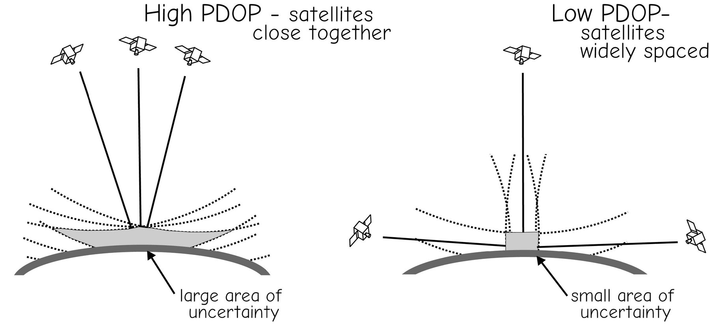

<!-- Side by side: satellites close together give a large area of uncertainty; satellites widely spaced give a small one. Same receiver, same signal, same ranges — only the geometry changed. Ask the class which of the two situations they would get under a canopy or in a canyon, which ties this back to the coverage slide. -->

---

<!-- _class: lead -->

# Differential GPS helps us deal with these errors

<!-- Section break into part D. The idea in one sentence: two receivers standing near each other see almost the same errors, so if one of them already knows where it is, it can tell the other one how far off the satellites are right now. -->

---

# D. Differential GPS: Post-Processing

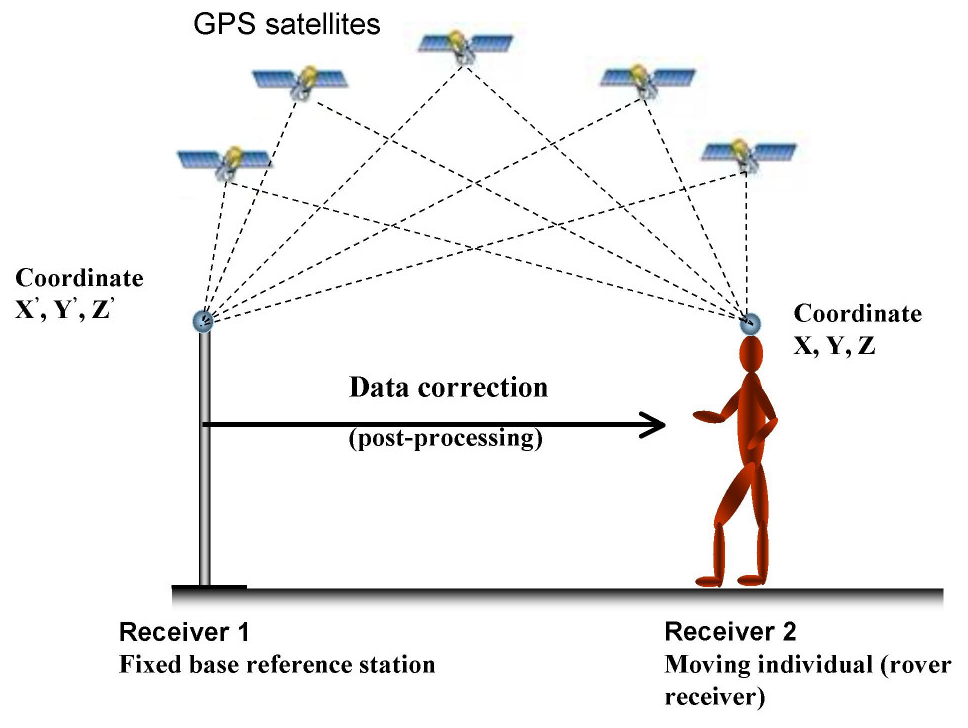

- **Receiver 1** is a fixed base reference station at a known coordinate
- **Receiver 2** is the moving rover, carried by the person collecting data
- The base's error is applied as a **data correction** to the rover's positions

<!-- The correction can be applied after the fact — post-processing, as drawn here — or streamed to the rover in real time. Post-processing is what a student with a mapping-grade receiver and a nearby CORS station will actually do. -->

---

# D. Differential GPS: How the Correction Works

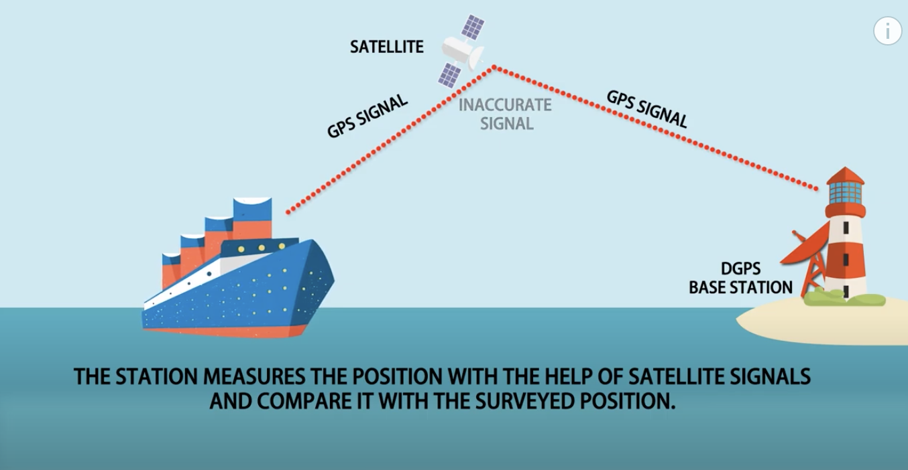

1. The **exact position is known** at the base station
2. Take x and y readings there and compute the **dx and dy errors** in the signal
3. Apply those corrections to the moving receiver's x and y measurements

[Watch: how DGPS correction works](https://www.youtube.com/watch?v=Xj3LBNBecnM)

<!-- The assumption that makes this work is that the base and the rover see the *same* errors — same satellites, same atmosphere. That holds while the two are close together, and degrades as the baseline grows. Errors that are not shared, like the rover's own multipath, are not removed by differential correction at all. -->

---

# DGPS Base Station: A Worked Example

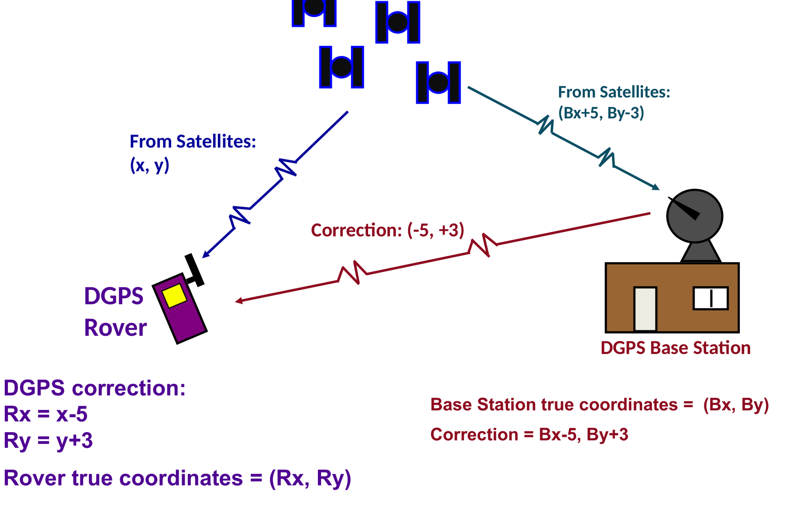

<!-- Walk the numbers. The base station's true coordinates are (Bx, By), but the satellites report it at (Bx+5, By-3). The measured position is therefore 5 too high in x and 3 too low in y, so the correction to apply is (-5, +3). Apply the same correction to the rover: Rx = x - 5, Ry = y + 3. -->

<!-- VERIFY: inside this figure the label reading "Correction = Bx-5, By+3" is written as a coordinate rather than as an offset; the offset is the (-5, +3) shown on the arrow. The wording is the source deck's and was left as drawn — flagged so it can be relabeled when the graphic is redrawn. -->

<!-- TODO(instructor): the plan lists real-time and network methods — SBAS/WAAS, RTK, network RTK, and PPP — as topics to add after this slide. Content not written. -->

<!-- TODO(instructor): the plan also lists coordinate reference frames — what datum a receiver reports in, and what that means for data collected against a project's own coordinate system. Content not written. -->

---

# Before Next Class

- Read the assigned chapter <!-- TODO(instructor): reading chapter -->
- Take the open-book quiz on **Learning Suite**
- Keep working on [Lab 10 — Least Cost Path Power Line Analysis](https://byu-hydroinformatics.github.io/ce414-gis-applications/assignments/lab-10/)
- Start on the [Final Project](https://byu-hydroinformatics.github.io/ce414-gis-applications/assignments/final-project/) — the proposal is the next thing due
- Questions? Office hours: [calendly.com/dan-ames/office-hours](https://calendly.com/dan-ames/office-hours)

<!-- VERIFY: schedule reconstructed. The source deck ends without a wrap-up slide, so the Week 12 pairing of Lab 10 and the Final Project was inferred from the repository's assignment order, not from the deck. Confirm what is actually due this week, and fill in the quiz due date. -->

<!-- TODO(graphic): a "what's due this week" visual, or a screenshot of the Final Project proposal template. -->

<!-- Conversion notes (2026-09-03): Source deck "CE 414 Week 12 - Review - GPS and Triangulation.pptx", 30 slides (3 hidden, so the PDF renders 27 pages), extracted 2026-09-03.

SLIDE COUNT: 30 source slides -> 30 slides in this deck. One source slide was dropped and two were merged into one, giving 28 source-derived slides; two slides were added (Today's Goals and Before Next Class), per the conversion guide. One previously untitled figure slide was given a title ("Every Range Carries Uncertainty").

DROPPED: source slide 13 (HIDDEN, "d1 / d2 / d3") — three stray shape labels with no figure and no media attached to them; genuinely empty. Nothing else was dropped.

RESTORED FROM HIDDEN: source slides 2 and 3 (the Prague "Where am I?" activity and its photo) were hidden in the source and are kept here as one activity slide. They teach the deck's central idea directly and work as an alternative to the Air Force One activity. Delete the slide if the instructor wants only one warm-up.

TRILATERATION CORRECTIONS (the deck's substantive fix). GPS solves for position from measured distances, not measured angles, so the ranging concept is trilateration. Four changes:
 1. Source slide 7, list item "C. Triangulation" -> "C. Trilateration".
 2. Source slide 14, title "3. Triangulation (Where am I?)" -> "C. Trilateration (Where Am I?)", plus one added bullet stating "distances, not angles".
 3. Source slide 15, title "3. Triangulation (where am I?)" -> "C. Trilateration: Fixing Your Position".
 4. Today's Goals uses "trilateration".
The DECK TITLE is unchanged — "GPS and Triangulation", as the source has it — with a TODO(instructor) on the title slide proposing the retitle. Note that the two rendered figures on the trilateration slides came from the source and carry no "triangulation" text, so no image needed changing.

TRAVEL-TIME DECIMAL: NOT changed. Source slide 12 gives travel time 0.674 s, c = 299,792,458 m/s, distance 202,060,116 m = 202,060.116 km. That arithmetic is internally correct (0.674 x 299,792,458 = 202,060,116.7). What is wrong is the physics: a GPS satellite at roughly 20,200 km gives about 0.0674 s, so the time appears to be off by one decimal place and the distance is about ten times too large. The correct value does NOT follow unambiguously from the numbers on the slide — the distance is derived from the time, so both move together, and the intended answer depends on an orbital altitude the slide never states. Left as written and flagged VERIFY in place.

OTHER FIXES: the source speaker note on the hidden Prague slide read "711 miles from Prague to Amsterdam" while giving the other two distances in kilometers; 2.37e-3 s x c = 711 km, so this was a unit typo and is corrected to kilometers. Ampersand-free plain-text punctuation, curly quotes, and the source's inconsistent "aka" subtitles were normalized. No ArcGIS 9 / ArcMap / ArcCatalog / ArcToolbox wording appears anywhere in this deck — it has no GIS software UI in it at all.

COURSE NUMBER: the title slide's subtitle reads "CCE 214 Geomatics" in the source. That number is out of date for this course. It was NOT guessed at or replaced; it is left visible with a TODO(instructor) beside it so the error is not silently hidden.

STALE / SOURCED IMAGES kept as-is and flagged: images/gps-selective-availability-2000.jpg is a 2 May 2000 SA-transition chart, historical by nature and fine as history, but it is the deck's only evidence slide and its provenance is not stated on the slide. images/gps-dgps-base-rover-diagram.png, gps-errors-cumulative.png, gps-prn-travel-time.png, gps-signal-interference.png, gps-multipath-building.png, gps-pdop-good-vs-poor.png, gps-radio-modulation-methods.png and gps-radio-range-illustration.png are 200 dpi renders of PowerPoint-shape slides from the source PDF rather than rebuilt figures — they carry the source deck's clip art and typography and would benefit from being redrawn. gps-dop-range-intersection.jpg, gps-pdop-high-vs-low.jpg and gps-range-uncertainty.jpg are scanned line drawings of unstated origin; check the source before publishing widely.

TODO(graphic) — no images were generated in this pass, per instruction. Content slides with no visual: Today's Goals (has a stock satellite, wants an outcomes strip), The 3 D's of Map Data, Error Sources: Bad Coverage, Error Sources: Summary, Before Next Class.

TODO(instructor) — topics the plan lists as instructor decisions, recorded in place and deliberately NOT written: selective-availability framing and current policy; current GNSS constellations (the deck is GPS-only and never mentions GLONASS, Galileo, BeiDou or QZSS); atmospheric-delay depth and dual-frequency correction; multipath mitigation; the DOP family and what a field crew should do with a reported DOP; SBAS/WAAS, RTK, network RTK and PPP; coordinate reference frames and datums. Also: the deck title retitle, the course number, and the reading chapter.

VERIFY items: the travel-time decimal (slide "B. Range (How Far Away?)"); the error-magnitude table, which is the source deck's own figures and was not independently checked; the classroom measurements in the Air Force One activity, which are specific to one room; the "Correction = Bx-5, By+3" label inside the DGPS worked-example figure, which is written as a coordinate rather than an offset; and the Before Next Class schedule, which was reconstructed from the repository's assignment order because the source deck has no wrap-up slide. -->
