<!-- _class: lead -->
<!-- _paginate: skip -->

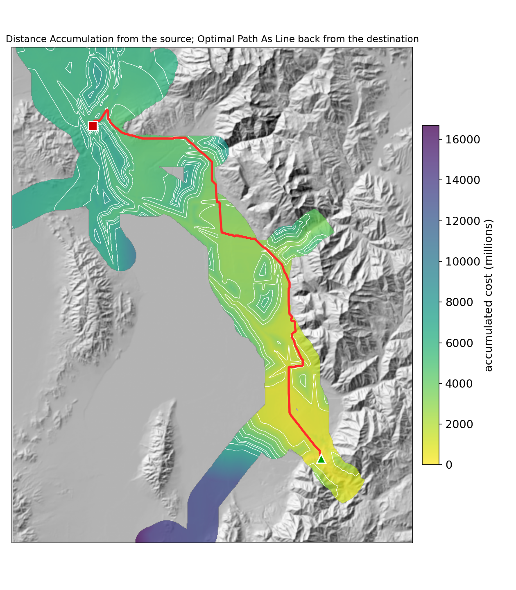

# Least Cost Path Analysis

## Part B — The Tools, the Route, and What Moved It

CE 414 Engineering Applications of GIS
Civil & Construction Engineering
Brigham Young University
Dr. Dan Ames

<!-- Thursday of Week 12. Tuesday built the idea from the original least cost path lecture: a cost surface, the accumulated cost and back link rasters, a path walked home from the destination. Today: the tools ArcGIS Pro wants you to use now, Lab 11's own route computed on real Utah data with the handout's own rules, and the question that matters to an engineer, which of those rules actually moved the line. Every map and number in this deck comes from tools/week12_lcp_figures.py (ArcGIS Pro 3.7.1, Spatial Analyst); the tool captures are from a live ArcGIS Pro session (C:\Ames\Week12\LCPDemo.aprx, which is set up for a live demo). -->

<!-- stamp:begin -->
<!-- _footer: 'CE 414 · Week 12 — Least Cost Path Analysis, Part BLast Updated: 2026-10-09© 2026 Daniel P. Ames · <a href="https://creativecommons.org/licenses/by/4.0/">CC BY 4.0</a>' -->
<!-- stamp:end -->

---

# Today's Goals

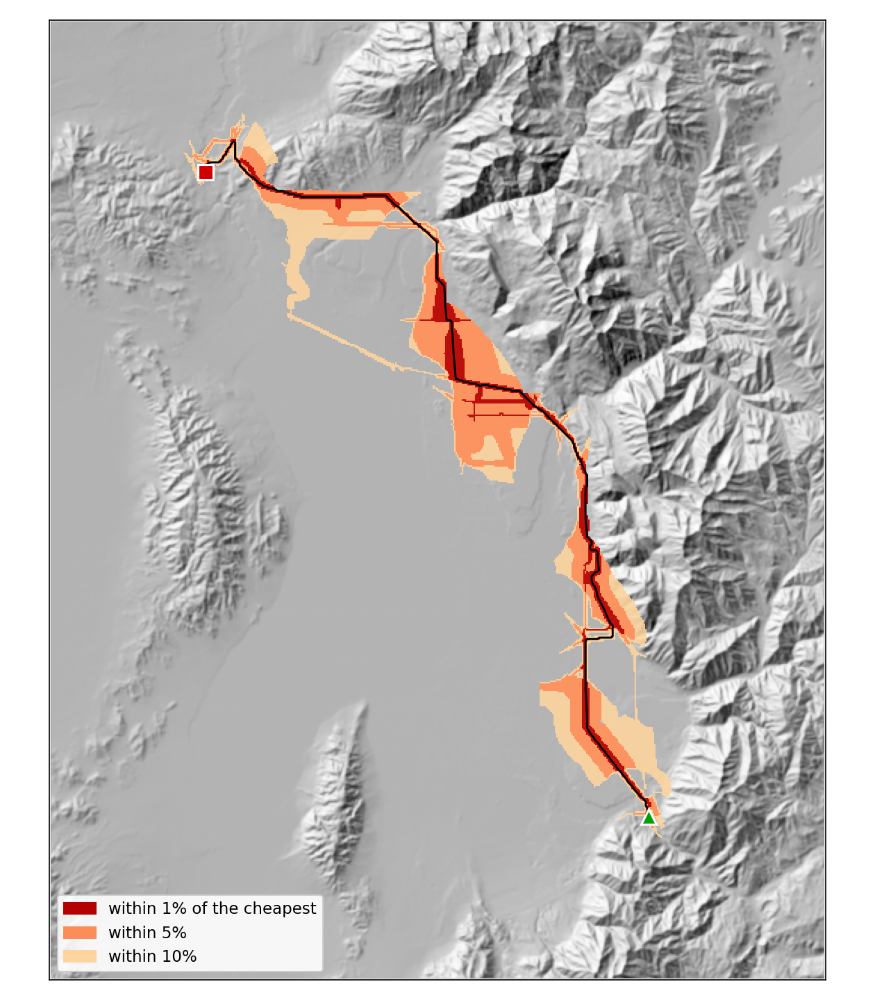

By the end of class you should be able to:

- Run a least cost path with ArcGIS Pro's current tools: **Distance Accumulation** and **Optimal Path As Line**
- Read a **back direction** raster as a compass angle
- Say which parts of a cost surface **move a route** and which only change its total
- Map a **corridor** of nearly-as-good routes, not just one line

<!-- The right-hand figure is where the hour ends: not one route but a corridor of nearly-as-good ones, between Lab 11's two endpoints. -->

---

# Tuesday in One Picture

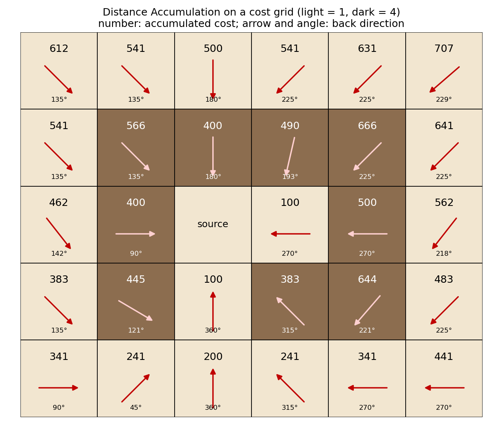

- A **cost surface** cell: the price of **crossing that one cell**
- An **accumulated cost** cell: the cheapest **total** to get there from the source
- A **back direction** cell: **which way to step** to get home
- The path is walked **backward**, from the destination to the source

<!-- A 6 x 5 grid of 100 m cells, cost 1 (light) and 4 (dark), run through Distance Accumulation in ArcGIS Pro. Each number is the accumulated cost; each arrow is the back direction raster's value, drawn as a compass bearing. Read one aloud: the cell left of the source holds 400 and points east (90 degrees), straight home. Note the arrows that are not at 45-degree steps: 193, 121, 229 degrees. That is new, and it is the next section. The distinction between the first two bullets is the one Tuesday's quiz showed half the room missing. -->

---

<!-- _class: lead -->

# Part 1 — The Tools in ArcGIS Pro Today

---

# Cost Distance Is Deprecated

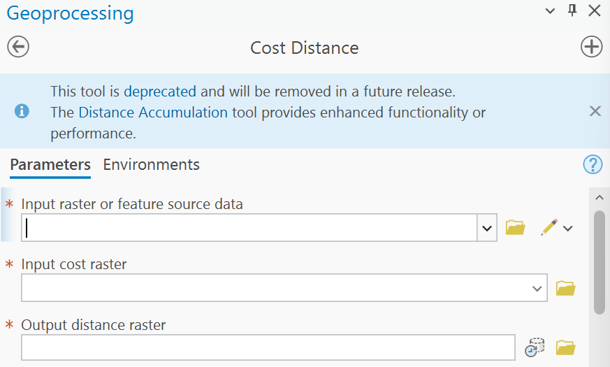

- Open **Cost Distance** in ArcGIS Pro 3.7 and it tells you so
- "Deprecated" means it **still runs**, but **will be removed**
- The replacement: **Distance Accumulation**
- The same goes for **Cost Back Link** and **Cost Path**

<!-- A capture of the Geoprocessing pane in ArcGIS Pro 3.7.1, October 9, 2026. The notice is the tool's own; it links to Esri's deprecation page. Tuesday's lecture and Lab 11's current handout were written with the legacy tools; the concepts carry over unchanged, and Part 2 shows the two sets give the same route on Lab 11's data. -->

---

# Distance Accumulation

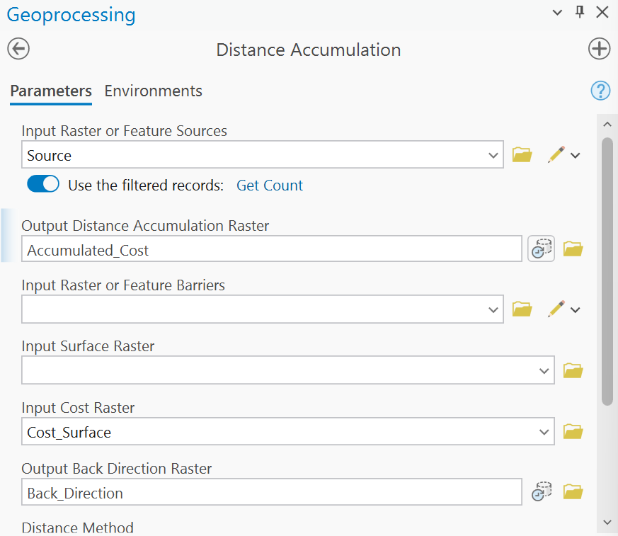

- **Sources**: the start point (here, the wind farm)
- **Input Cost Raster**: your cost surface
- **Output Distance Accumulation Raster**: the running total
- **Output Back Direction Raster**: the way home, in **degrees**
- One run replaces **Cost Distance** *and* **Cost Back Link**

<!-- Filled in on the Lab 11 setting: Source and Destination are two layers of one point feature class with definition queries, which is why "Use the filtered records" appears. The tool ran in 10 seconds on a 516 x 638 grid of 100 m cells. Leave Input Surface Raster empty: that is for measuring distance over the terrain's actual surface, a different question from cost. Barriers can be given here directly, as features, instead of as NoData in the cost raster. -->

---

# Optimal Path As Line

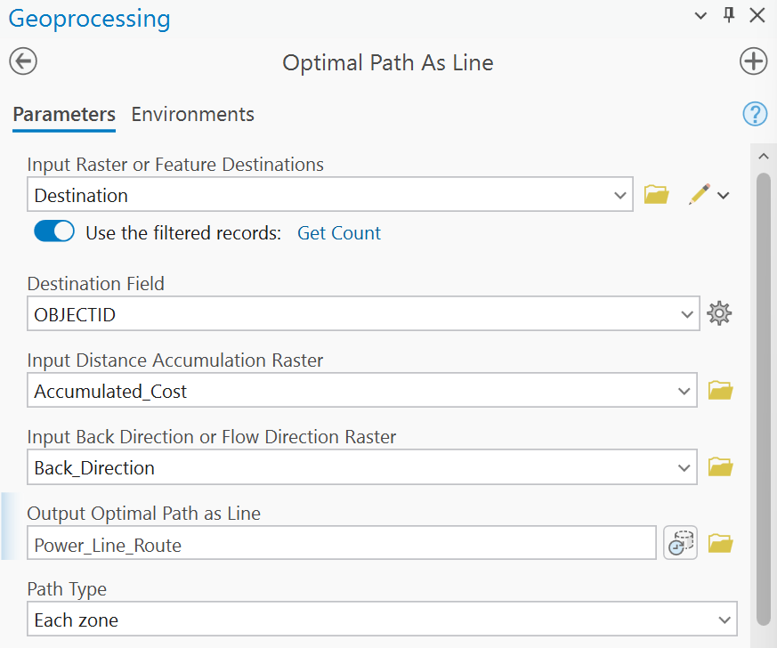

- **Destinations**: the end point (the data center)
- The **accumulation** and **back direction** rasters from the last tool
- The output is already a **line feature class**
- So **Raster to Polyline** is no longer a step
- Its sibling, **Optimal Path As Raster**, gives the one-cell-wide raster

<!-- Ran in 5 seconds. The line it drew, Power_Line_Route, is 68.86 km long, identical to the scripted run that made every map in this deck. Path Type "Each zone" gives one path per destination zone; with one destination it does not matter. Lab 11's handout ends with Raster to Polyline because Cost Path only made a raster. -->

---

# Same Row, Two Answers

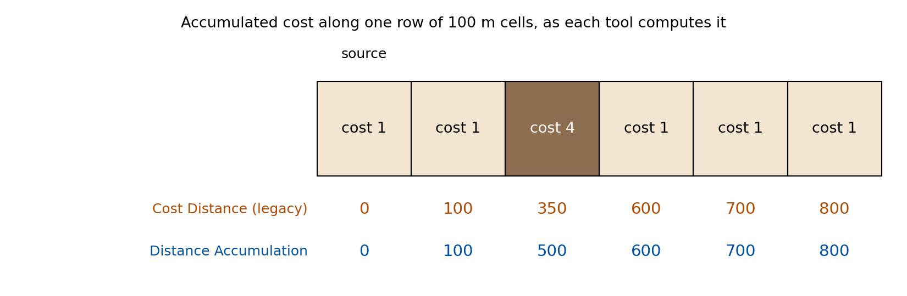

- **Cost Distance**: a step costs the **average of the two cells** it joins
- **Distance Accumulation**: a cell's total includes **its whole cost**; the source cell's own cost does not count
- Along a long route the totals **agree**; they differ by **half a cell's cost** at the ends

<!-- Both tools' real output on the same six 100 m cells, cost 1, 1, 4, 1, 1, 1, from the left. Legacy: 100 + (1+4)/2 x 100 = 350 at the dark cell; Distance Accumulation: 100 + 4 x 100 = 500. By the next cell both say 600. This is the rule Tuesday's grid slide described for the legacy tool; do not apply the "average of two cells" arithmetic to Distance Accumulation's numbers. Skip this slide if time is short. -->

---

# The Back Direction Is an Angle

- **0** marks the source; **90** = go east, **180** south, **270** west, **360** north
- Legacy **Cost Back Link** stored a code, **1 to 8**, one per neighbor
- Distance Accumulation can head off **between** the eight neighbors: 193°, 121°, 229°
- So its paths are **straighter** than a staircase of 45° steps

<!-- The angles are read straight off the back direction raster on the toy grid. The legacy route on Lab 11's data is 70.08 km against 68.86 km for Distance Accumulation, on the same cost surface: the extra 1.2 km is the staircase. -->

---

<!-- _class: lead -->

# Part 2 — Lab 11's Route, Computed

---

# The Recipe as Five Rasters

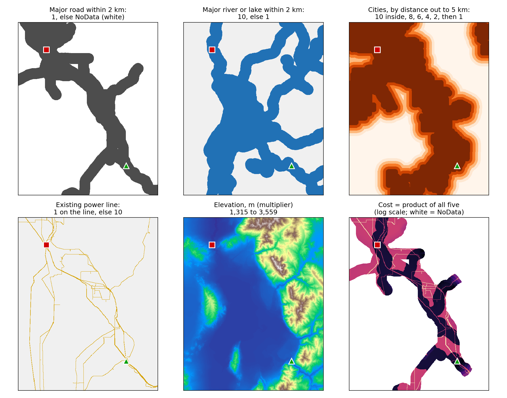

<!-- Lab 11's handout rules, applied to real data at its 100 m cell size, then multiplied. Data, fetched October 9, 2026: elevation from the USGS 3DEP image service; from UGRC, major roads (UtahRoads, DOT_FCLASS Interstate, Other Freeway or Principal Arterial: 1,380 segments in the box), lakes over 1 sq km (UtahLakesNHD, AreaSqKm > 1: Utah Lake, Deer Creek Reservoir and five unnamed), major streams (UtahStreamsNHD, IsMajor = 1), municipal boundaries, and transmission lines (TransmissionLines, the 46, 138 and 345 kV layers). The handout says "scale 1 to 10" for cities without numbers; this deck uses 10 inside a city or within 1 km, then 8, 6, 4, 2, then 1 beyond 5 km. Power lines are rasterized at 100 m: a cell the line crosses is 1, every other cell 10. Endpoints are the handout's coordinates. -->

---

# Accumulated Cost, and the Route Home

- The source: the mouth of **Spanish Fork Canyon** (green); the destination: **Bluffdale** (red)
- Straight line: **52.0 km**; cheapest route: **68.9 km**, **32%** longer
- It hugs the **east bench**, along **existing transmission lines**, out of the 2 km bands around Utah Lake and the Jordan River
- Gray beyond the road corridor is **NoData**: impassable

<!-- The colors are Distance Accumulation's raster, the white lines its contours; the red line is Optimal Path As Line. The accumulation fans out from the source only inside the 2 km road corridor, which is why the colored area has the shape of Utah County's highway network. Numbers: tools/week12_lcp_numbers.json. -->

---

# Reading the Back Direction Raster

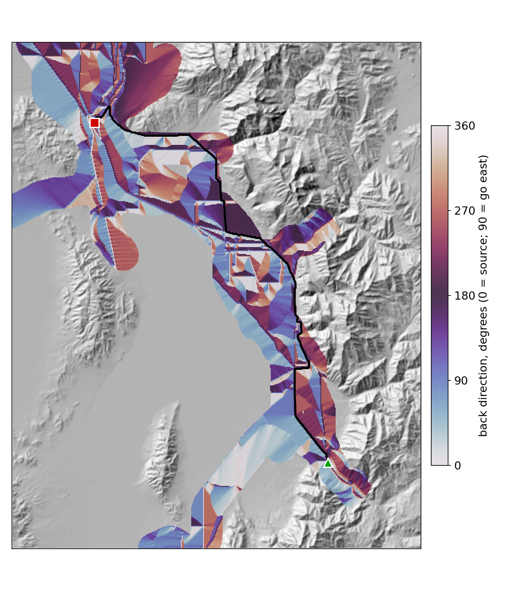

- Every cell knows **which way is home**
- The colors are **compass bearings**: 0 to 360
- Sharp seams are where two routes home **split**
- Optimal Path As Line just **follows the arrows** from Bluffdale

<!-- The twilight color ramp wraps around, so 0 and 360 (both "north") look alike. The seams are the boundaries between regions whose cheapest way home goes different ways around an obstacle; a destination on a seam has two nearly equal routes, which is the corridor slide's point. Skip if time is short. -->

---

<!-- _class: lead -->

# Part 3 — Which Decisions Moved the Line?

---

<!-- _class: quiz -->

# Predict First

Change **one** decision in Lab 11's recipe. Which one moves the route **farthest**?

<ol type="A">
<li>Let the line leave the road corridor, at ×10 instead of NoData</li>
<li>Drop the city factor</li>
<li>Drop the reward for following existing power lines</li>
<li>Drop the 2 km water penalty</li>
</ol>

<!-- Ninety seconds, a show of hands for each letter. Most of the room picks A or B: barriers and cities feel like the big constraints. The next two slides are the answer. -->

---

# Two Decisions That Did Nothing

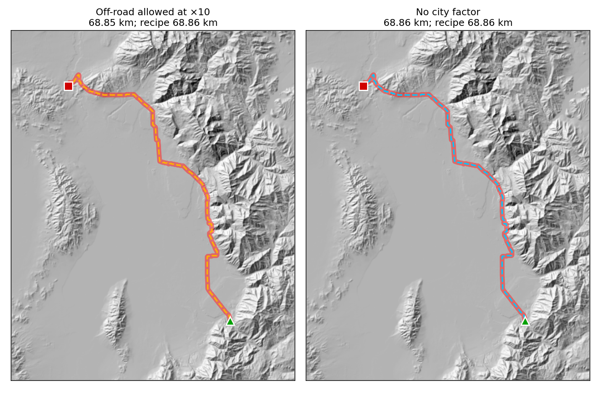

- **Roads as a soft cost** (×10 off-road) instead of a barrier: **same route**, **same cost**
- **No city factor**: **same route**; the total cost fell to **exactly a tenth**
- Every cell on the route is **in a city or within 1 km**: the factor is **10 everywhere** the route could go
- A factor that is **equal along every candidate route** cannot choose between them

<!-- Measured: 68.86 km and 5.757e9 for the recipe; 68.85 km and the same total with the soft road corridor; 68.86 km and 5.757e8 without cities. In Utah County's valley, "avoid cities" is not a constraint, it is a constant. The road barrier never bound, because the power-line and water factors already kept the route near the major roads. Both would matter in another place, or with other weights: that is the lesson, not that roads and cities never matter. -->

---

# Two That Did

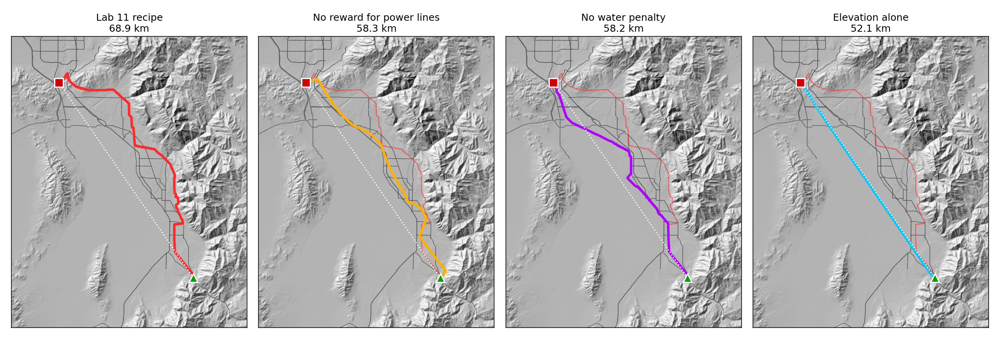

- **No power-line reward**: **58.3 km**, straight down the valley; **no water penalty**: **58.2 km**, across the valley floor; **elevation alone**: **52.1 km**, almost the straight line

<!-- The thin red line in each panel is the recipe's route, for comparison; the dotted white line is the straight line, 52.0 km. Elevation as a multiplier rewards low ground, not flat ground: it ranges 1,315 to 3,559 m in the box, a factor of 2.7 at most, against factors of 10 for water and power lines, and the valley floor between the endpoints is nearly flat, so on its own it barely bends the line. A slope raster would ask a different question. The rubric's question "what would you change to make the model more realistic?" starts here. -->

---

# A Corridor, Not a Line

- Run Distance Accumulation **from both ends** and **add** the two rasters
- Each cell gets the cost of the **best route forced through it**
- Within **1%** of the cheapest: **30.7 km²**; within **5%**: **108 km²**; within **10%**: **178 km²**
- Where the band is **wide**, the exact line is **arbitrary**; where it pinches, it is **not**

<!-- The sum was computed with Raster Calculator on the two accumulation rasters; ArcGIS Pro also has a Corridor tool in Spatial Analyst that does the same sum (seen in the Geoprocessing search on October 9, 2026; not run for this deck). The pinch points are near both endpoints and along parts of the east bench; the wide fans are on the valley floor, where several equally cheap routes exist. An engineer presents the corridor to a siting board, then picks a line inside it for reasons the cost surface never saw: land ownership, a tower foundation, a landowner's objection. -->

---

<!-- _class: activity -->

# Next: Lab 11, Power Line Routing

- The same **two endpoints** and the same **five rules**
- Build the cost surface in **one ModelBuilder model**, so you can change a rule and run it again
- Then **Distance Accumulation** and **Optimal Path As Line** (the handout's Cost Distance, Cost Path and Raster to Polyline give the same route: **70.1 km**, a staircase of it)
- Change **one decision** and report what moved

[Lab 11 — Least Cost Path Power Line Analysis](https://byu-hydroinformatics.github.io/ce414-gis-applications/assignments/lab-11/)

<!-- Legacy check on the same cost surface: Cost Distance + Cost Back Link + Cost Path (each cell) + Raster to Polyline gives 70.08 km and a total 0.8% higher; sampled every 100 m, half of it lies on the Distance Accumulation route, 95% within 132 m, all within 248 m. Lab 11's current page still describes the legacy tools; either set gives the same answer here. -->

---

# Before Next Class

- **Lab 11 — Least Cost Path Power Line Analysis** — due **Saturday 11:59 pm**: [assignments/lab-11](https://byu-hydroinformatics.github.io/ce414-gis-applications/assignments/lab-11/)
- Next week: the **final project** (Tuesday), and Thanksgiving
- Office hours: [calendly.com/dan-ames/office-hours](https://calendly.com/dan-ames/office-hours)

<!-- Deck written October 9, 2026, as the second least cost path lecture, building on Tuesday's deck (itself converted from "CE 414 Week 11 - Least Cost Path Analysis.pptx"). Figures and numbers: tools/week12_lcp_data.py (data), tools/week12_lcp_figures.py (computation, tools/week12_lcp_numbers.json); the three tool captures are from ArcGIS Pro 3.7.1 at 175 % (tools/week12_lcp_project.py builds the project). -->

---

<!-- _class: activity -->

# One Last Thing — What Moved the Line?

Five questions on the current tools, the back direction raster, which factors move a route, and corridors. **Scan the code**, or open the link below.

- Not graded, nothing recorded — it is a check that today landed
- Every answer explains itself; read the explanation before you move on
- The city-factor question is the one Lab 11's write-up turns on

byu-hydroinformatics.github.io/ce414-gis-applications/quizzes/cost-paths/

<!-- Four minutes, in pairs. If the room has no signal, put the URL on the board. -->
